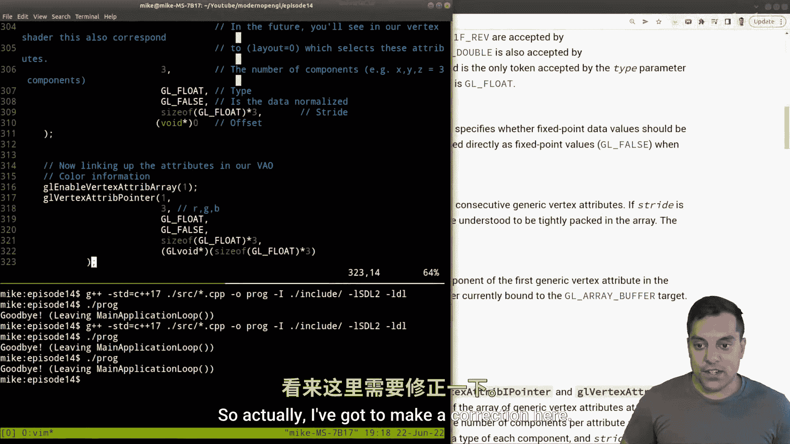

OpenGL导论：14：使用单一顶点缓冲对象绘制彩色三角形


在本节课中，我们将学习如何使用一个单一的顶点缓冲对象来存储多个顶点属性（如位置和颜色），并通过交错布局的方式将它们打包在一起。这种方法可以减少状态切换，并可能简化数据管理。

---

### 概述

上一节我们介绍了使用多个顶点缓冲对象来分别存储位置和颜色数据。本节中，我们将看看如何将这两种属性交错存储在**一个**顶点缓冲对象中。核心在于理解 `glVertexAttribPointer` 函数中 **步长** 和 **偏移量** 参数的正确设置。

### 顶点数据布局

首先，我们需要重新组织顶点数据。不再使用两个独立的数组，而是将每个顶点的位置和颜色数据连续存放。

以下是我们的新数据布局，每个顶点包含6个浮点数（X, Y, Z, R, G, B）：

```cpp
std::vector<GLfloat> vertexData = {
    // 顶点1
    -0.5f, -0.5f, 0.0f,  // 位置 (X, Y, Z)
    1.0f, 0.0f, 0.0f,    // 颜色 (R, G, B)
    // 顶点2
    0.5f, -0.5f, 0.0f,   // 位置
    0.0f, 1.0f, 0.0f,    // 颜色
    // 顶点3
    0.0f, 0.5f, 0.0f,    // 位置
    0.0f, 0.0f, 1.0f     // 颜色
};
```

### 配置顶点缓冲对象

接下来，我们只需要生成并绑定一个顶点缓冲对象，然后将 `vertexData` 的数据传入。

```cpp
GLuint VBO;
glGenBuffers(1, &VBO);
glBindBuffer(GL_ARRAY_BUFFER, VBO);
glBufferData(GL_ARRAY_BUFFER, vertexData.size() * sizeof(GLfloat), vertexData.data(), GL_STATIC_DRAW);
```


### 设置顶点属性指针

这是最关键的一步。我们需要告诉OpenGL如何从这一个缓冲中解析出位置和颜色两种属性。


**位置属性（属性索引0）**
*   **大小**：3（代表X, Y, Z三个分量）。
*   **步长**：到下一个顶点位置数据的字节数。我们需要跳过6个浮点数（位置3个 + 颜色3个），因此步长为 `6 * sizeof(GLfloat)`。
*   **偏移量**：位置数据从缓冲区的开头开始，所以偏移量为 `(void*)0`。

```cpp
glVertexAttribPointer(0, 3, GL_FLOAT, GL_FALSE, 6 * sizeof(GLfloat), (void*)0);
glEnableVertexAttribArray(0);
```

**颜色属性（属性索引1）**
*   **大小**：3（代表R, G, B三个分量）。
*   **步长**：与位置属性相同，为 `6 * sizeof(GLfloat)`。
*   **偏移量**：颜色数据在位置数据之后开始。我们需要跳过3个浮点数（X, Y, Z），因此偏移量为 `(void*)(3 * sizeof(GLfloat))`。

```cpp
glVertexAttribPointer(1, 3, GL_FLOAT, GL_FALSE, 6 * sizeof(GLfloat), (void*)(3 * sizeof(GLfloat)));
glEnableVertexAttribArray(1);
```

### 核心概念总结


理解 `glVertexAttribPointer` 的参数至关重要：
*   **`stride`**：从一个属性的**开始**到下一个属性的**开始**之间的字节数。在我们的例子中，一个完整的顶点数据块是6个浮点数，所以步长是 `6 * sizeof(GLfloat)`。
*   **`pointer`**：当前属性在**每个数据块内部**的起始偏移量。位置属性偏移0字节，颜色属性偏移 `3 * sizeof(GLfloat)` 字节。


### 注意事项




*   交错存储数据在某些情况下可能因数据局部性更好而提升缓存效率，但最佳实践需要通过性能测试来确定。
*   这种方法减少了需要管理的缓冲对象数量，使代码在某些场景下更简洁。
*   如果顶点属性结构发生变化（例如增加纹理坐标），需要同步更新所有相关属性的步长和偏移量。

---

### 总结


本节课中我们一起学习了如何使用单一顶点缓冲对象来存储交错的顶点属性。我们重新组织了数据布局，并重点掌握了如何正确计算和设置 `glVertexAttribPointer` 的**步长**和**偏移量**参数。这为我们管理顶点数据提供了另一种灵活的选择。