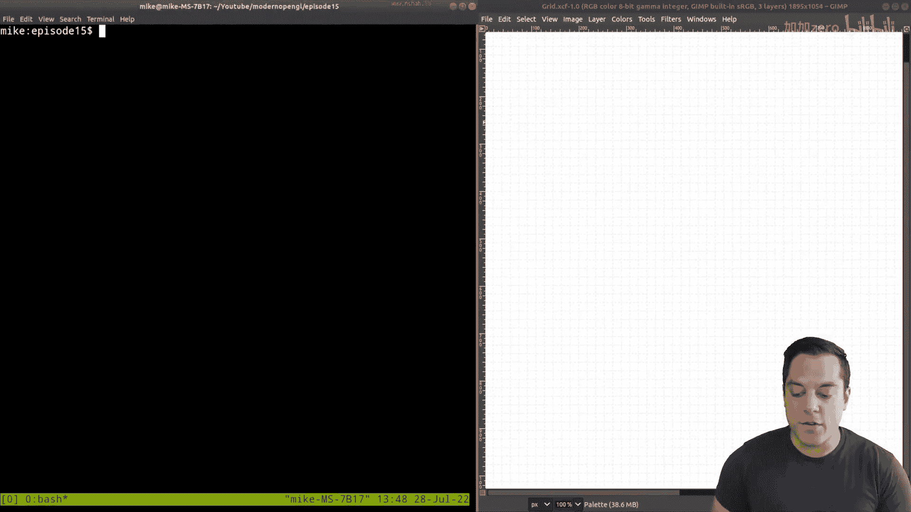
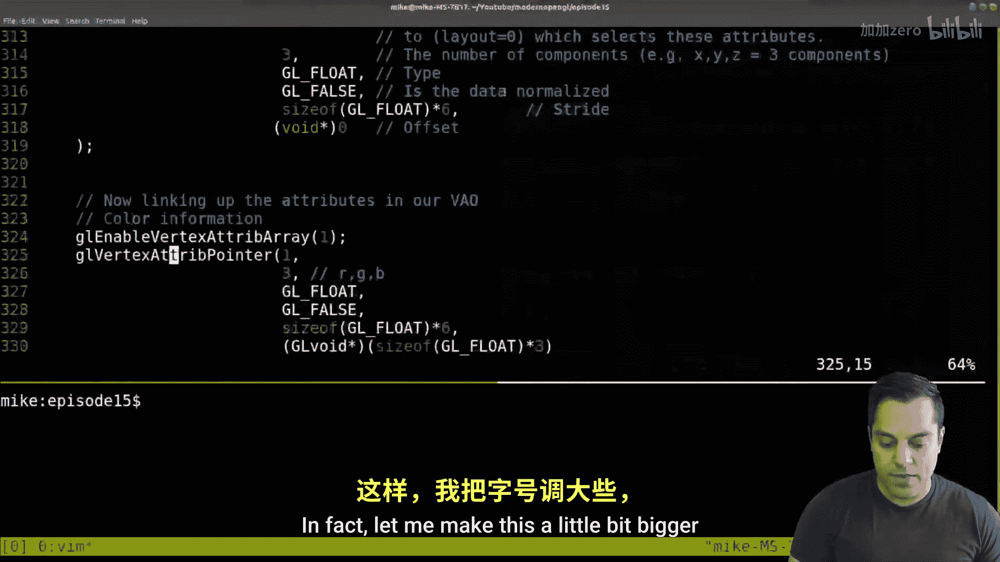
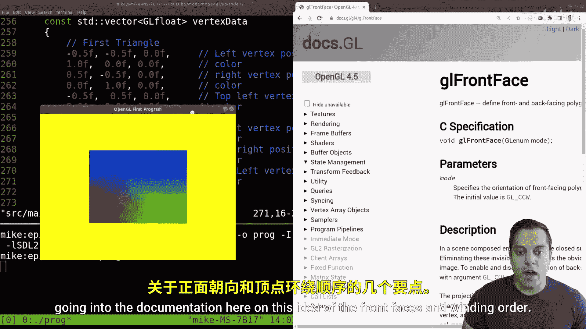
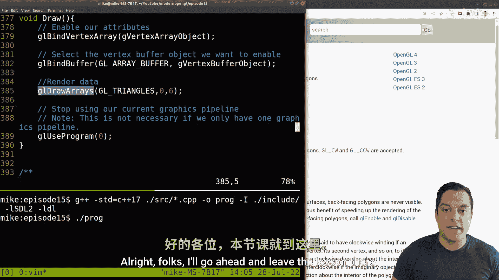

# 015：渲染四边形（理解环绕顺序） 🎨


在本节课中，我们将学习如何渲染一个四边形（即矩形或正方形），并理解一个关键概念：顶点环绕顺序。我们将从渲染单个三角形开始，逐步添加顶点数据来构建一个四边形，并解释为什么顶点的排列顺序如此重要。

---



## 概述

上一节我们介绍了如何渲染一个带颜色的三角形。本节中，我们来看看如何通过组合两个三角形来渲染一个四边形。为了实现这一点，我们需要理解几何图形的构成以及一个特定的渲染要求：顶点的环绕顺序。

## 从三角形到四边形

首先，让我们回顾一下当前的三角形渲染代码。为了给四边形腾出空间，我们先调整一下三角形的大小和位置。

以下是当前定义三角形顶点数据的代码片段：

```cpp
// 第一个三角形（左下、右下、顶部）
// 位置 (x, y, z)         // 颜色 (r, g, b)
-0.5f, -0.5f, 0.0f,      1.0f, 0.0f, 0.0f, // 左下顶点 (红色)
 0.5f, -0.5f, 0.0f,      0.0f, 1.0f, 0.0f, // 右下顶点 (绿色)
 0.0f,  0.5f, 0.0f,      0.0f, 0.0f, 1.0f  // 顶部顶点 (蓝色)
```

我们将顶点的Y坐标从0.8改为0.5，使三角形变小一些，并在X轴上调整顶部顶点的位置，为第二个三角形留出空间。

调整后，我们的三角形位于一个虚拟的笛卡尔坐标系中。我们可以这样想象：
*   X轴水平，右为正。
*   Y轴垂直，上为正。
*   我们的三角形占据了左下、右下和左上三个象限的部分区域。

## 理解环绕顺序

在添加第二个三角形之前，必须理解**环绕顺序**的概念。环绕顺序指的是定义三角形三个顶点的顺序。

观察我们当前的三角形顶点顺序：左下 -> 右下 -> 顶部。如果我们沿着这个顺序画线，方向是**逆时针**的。

在OpenGL中（默认情况下），逆时针环绕顺序表示三角形的**正面**（即面向观察者的一面）。这是一个重要的约定，因为它决定了哪一面是“可见”的。我们可以用右手定则来记忆：伸出右手，让手指沿着顶点顺序弯曲，拇指所指的方向就是三角形的正面（在默认的右手坐标系中，正Z轴方向指向屏幕外，即观察者）。

## 添加第二个三角形

为了形成一个四边形，我们需要添加第二个三角形。这个三角形将与第一个三角形共享一条边。关键在于，**第二个三角形的顶点也必须按照逆时针顺序排列**，以确保其正面也朝向观察者。

假设我们要绘制一个由两个三角形组成的正方形，其四个角分别为：左下(A)、右下(B)、右上(C)、左上(D)。
*   第一个三角形顺序是：A -> B -> D （逆时针）。
*   第二个三角形顺序是：B -> C -> D （逆时针）。

注意，两个三角形都共享了B和D这两个顶点。

现在，让我们在代码中添加第二个三角形的数据。我们需要在顶点数据数组中追加三个新的顶点（每个顶点包含位置和颜色）。

以下是添加第二个三角形后的顶点数据：

```cpp
// 第一个三角形
-0.5f, -0.5f, 0.0f,      1.0f, 0.0f, 0.0f, // 左下顶点 (A)
 0.5f, -0.5f, 0.0f,      0.0f, 1.0f, 0.0f, // 右下顶点 (B)
-0.5f,  0.5f, 0.0f,      0.0f, 0.0f, 1.0f, // 左上顶点 (D)

// 第二个三角形
 0.5f, -0.5f, 0.0f,      0.0f, 1.0f, 0.0f, // 右下顶点 (B) - 重复
 0.5f,  0.5f, 0.0f,      1.0f, 1.0f, 0.0f, // 右上顶点 (C) - 新顶点
-0.5f,  0.5f, 0.0f,      0.0f, 0.0f, 1.0f  // 左上顶点 (D) - 重复
```

注意，顶点B和D被重复使用了。目前我们的顶点总数是6个。

## 更新绘制调用

由于我们的顶点缓冲区现在包含了6个顶点的数据（两个三角形），我们需要更新绘制命令，告诉OpenGL绘制全部6个顶点。

找到绘制调用 `glDrawArrays`，将顶点数量参数从 `3` 改为 `6`：



```cpp
glDrawArrays(GL_TRIANGLES, 0, 6); // 绘制6个顶点，构成2个三角形
```

编译并运行程序，你现在应该能看到一个由两个三角形组成的四边形了！它可能看起来不是完美的正方形，这是因为窗口的宽高比（视口）问题，我们将在后续课程中解决。

## 关于环绕顺序的灵活性


OpenGL允许你自定义哪个环绕方向代表正面。你可以使用 `glFrontFace` 函数进行设置：

*   `GL_CCW`： 逆时针代表正面（默认值）。
*   `GL_CW`： 顺时针代表正面。

这在需要与其他图形API（如DirectX，其默认值可能不同）保持一致时非常有用。



## 总结


本节课中我们一起学习了如何渲染一个四边形。关键要点如下：

1.  **四边形由三角形构成**：在光栅化图形中，复杂形状通常分解为三角形进行渲染。
2.  **环绕顺序至关重要**：顶点的定义顺序（顺时针或逆时针）决定了三角形的哪一面是“正面”。默认情况下，OpenGL将逆时针顺序定义为正面。
3.  **数据与调用需匹配**：当向顶点缓冲区添加更多数据后，必须更新 `glDrawArrays` 等绘制调用中的顶点计数参数。
4.  **基础已就绪**：掌握了渲染四边形的方法，你实际上已经具备了制作2D图形应用（如2D游戏）的核心能力，因为2D图形对象大多可以基于四边形（或精灵）进行构建。



在接下来的课程中，我们将继续优化，并添加更多细节，例如纹理映射，让四边形显示图像。