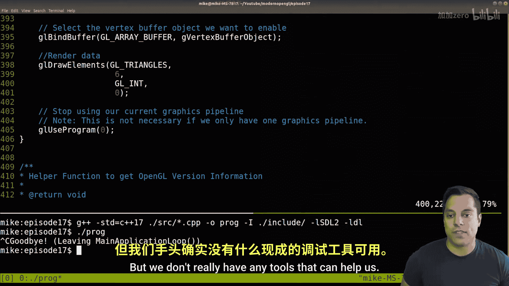
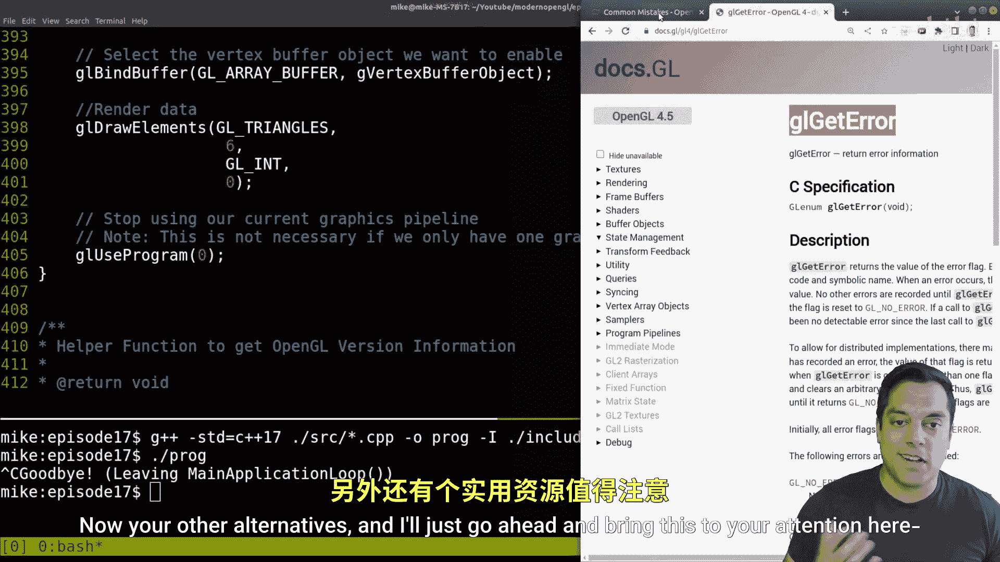
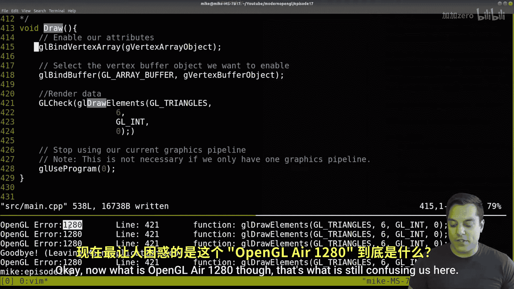
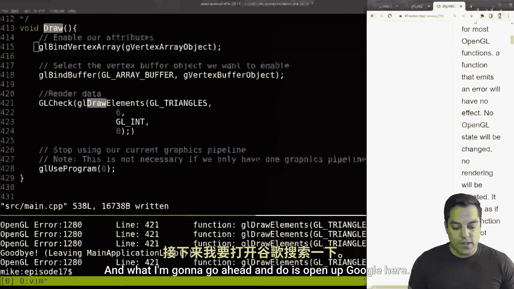
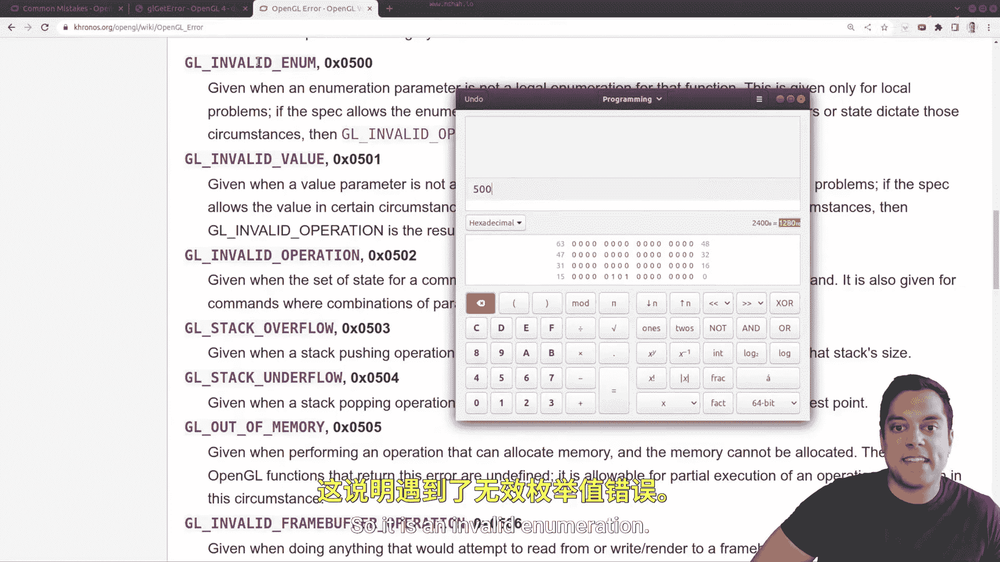

# 017：使用glError调试OpenGL状态机错误


在本节课中，我们将学习如何在OpenGL中检测和处理错误。由于图形编程不像CPU编程那样可以直接使用`printf`来输出信息，因此我们需要借助OpenGL内置的API工具来获取错误状态。本节课将介绍`glGetError`函数，并演示如何构建一个简单的错误检查工具来辅助调试。

## 发现问题





上一节我们介绍了OpenGL的基本绘制流程。本节中，我们来看看一个常见的开发场景：程序运行后，屏幕上没有出现预期的图形。


运行程序后，窗口背景色正常显示，但本应出现的四边形却没有渲染出来。面对这种情况，如果没有合适的调试工具，定位问题会非常困难。

## OpenGL的错误检查机制

OpenGL提供了一个内置函数来帮助我们获取错误信息：`glGetError`。这个函数可以返回错误代码，提示我们哪个函数调用出了问题以及错误的类型。

以下是OpenGL中一些常见的错误代码示例：
*   `GL_INVALID_ENUM`：传递了无效的枚举值。
*   `GL_INVALID_VALUE`：传递了无效的数值参数。
*   `GL_OUT_OF_MEMORY`：内存不足。

`glGetError`函数的工作原理是：当错误发生时，OpenGL状态机会设置一个错误标志。调用`glGetError`可以获取这个错误代码，**并且**在调用后，该错误标志会被清除，以便记录后续的错误。

这意味着，如果程序中有多个连续的错误，简单地调用一次`glGetError`可能无法获取全部信息。因此，我们需要编写一个例程来循环检查并清除所有错误状态。

## 构建错误检查函数

为了更方便地使用`glGetError`，我们将围绕它构建一个辅助函数。这个函数将循环调用`glGetError`，直到错误状态被清空（即返回`GL_NO_ERROR`）。

首先，我们编写一个函数来清除所有错误记录并检查是否有错误发生。

```cpp
static bool GLCheckErrorStatus(const char* function, int line) {
    while(GLenum error = glGetError()) {
        std::cout << "OpenGL Error: " << error
                  << " at " << function << ":" << line << std::endl;
        return true; // 发现错误
    }
    return false; // 没有错误
}
```

这个函数接受函数名和行号作为参数，以便在输出错误信息时能精确定位。它会循环调用`glGetError`，打印每一个错误代码及其发生的位置。

## 使用宏包装OpenGL调用

为了在每次OpenGL函数调用后自动执行错误检查，我们可以定义一个宏。这个宏会在调用目标函数前后，执行错误清除和检查操作。

```cpp
#define GL_CHECK(x) \
    GLClearAllErrors(); \
    x; \
    GLCheckErrorStatus(#x, __LINE__)
```

宏中的`#x`会将传入的函数名转换为字符串，`__LINE__`是预处理器宏，会被替换为当前行号。这样，当我们用`GL_CHECK(glDrawElements(...))`包装函数调用时，任何错误都能被捕获并报告具体位置。

现在，我们可以将这个宏应用到可能出错的OpenGL函数调用上，例如绘制命令`glDrawElements`。

## 调试并修复错误

应用宏并重新编译运行程序后，控制台输出了错误信息：“OpenGL Error: 1280 at glDrawElements:421”。错误代码1280本身没有直接意义，我们需要查找其对应的枚举常量。





通过查询OpenGL文档或在线资料，可以得知1280（十六进制0x500）对应`GL_INVALID_ENUM`错误。这表明我们在某个函数调用中传递了无效的枚举值。

错误发生在`glDrawElements`的第421行。检查该函数的参数：第一个是绘制模式（`GL_TRIANGLES`），第二个是索引数量，第三个是索引数据类型。对比文档，发现常见的索引类型是`GL_UNSIGNED_INT`或`GL_UNSIGNED_SHORT`。检查代码后发现，第三个参数误写为`GL_UNSIGNED`，这是一个无效的枚举值。

将`GL_UNSIGNED`修正为`GL_UNSIGNED_INT`后，重新运行程序。错误信息消失，四边形成功渲染在屏幕上。




## 总结


本节课中我们一起学习了OpenGL的基本错误调试方法。我们介绍了`glGetError`函数，它用于查询OpenGL状态机中的错误。为了高效利用它，我们构建了一个循环检查错误的函数`GLCheckErrorStatus`，并创建了一个宏`GL_CHECK`来自动包装OpenGL调用，从而在开发过程中快速定位错误源和类型。

这种方法是针对OpenGL 3.3等较旧版本的一种实用调试手段。现代OpenGL（4.3+）提供了更先进的调试回调机制，我们将在后续课程中探讨。


