# 018：GLM数学库入门 🧮


在本节课中，我们将学习一个名为GLM（OpenGL Mathematics）的数学库。这是一个免费的开源库，它允许我们进行计算机图形学中所需的许多数学运算，例如处理向量、矩阵和四元数。虽然你可以使用自己的数学库，但GLM是一个非常好用的选择，特别是因为它与GLSL（OpenGL着色语言）的函数命名和默认设置（如列优先矩阵）高度一致，这可以减少学习成本。

## 下载与设置

首先，我们需要获取并设置GLM库。

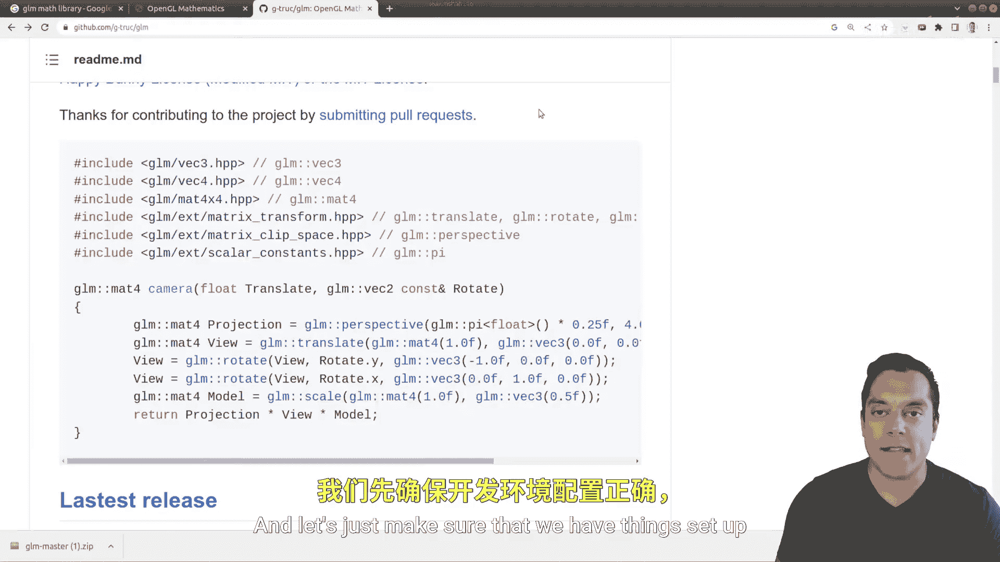

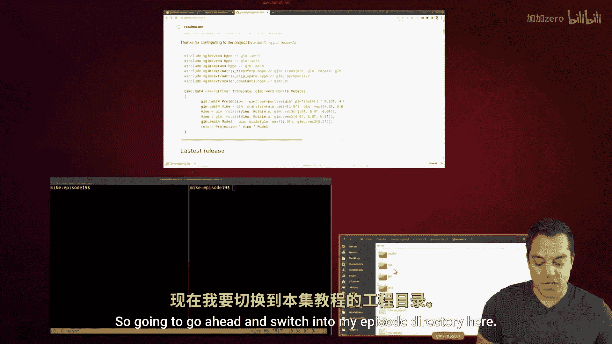

以下是获取和设置GLM库的步骤：
1.  访问GLM的GitHub页面。
2.  下载源代码的ZIP文件。
3.  将ZIP文件解压到你项目目录中合适的位置，例如一个名为`third_party`的文件夹内。

设置完成后，你的项目目录结构可能如下所示：
```
your_project/
├── main.cpp
└── third_party/
    └── glm-master/ (解压后的GLM库内容)
```

## 第一个GLM程序


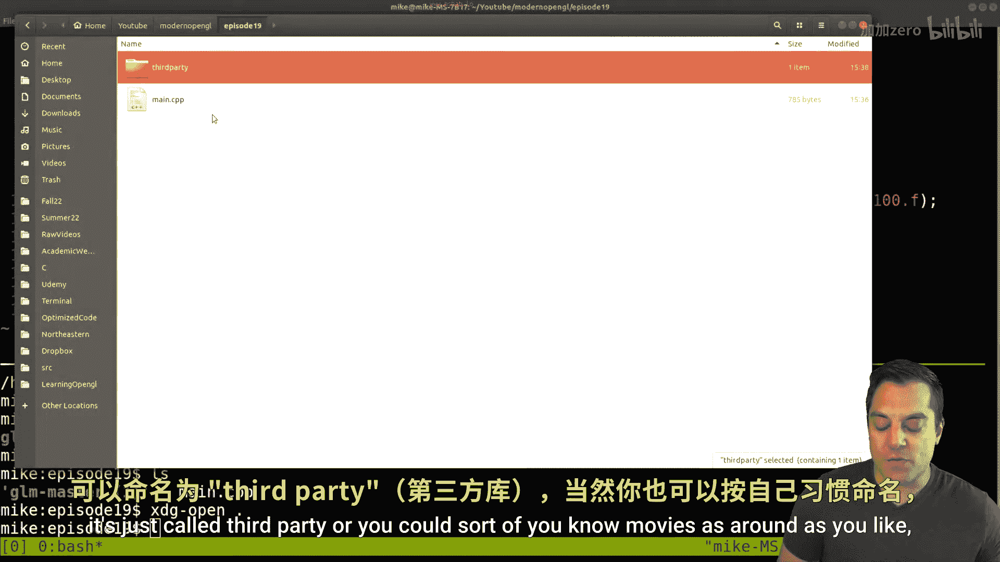

现在，让我们创建一个简单的程序来验证GLM库是否设置正确。

我们将从一个基本的示例开始，它创建了两个三维向量并计算它们的点积。


```cpp
#include <iostream>
#include <glm/glm.hpp>

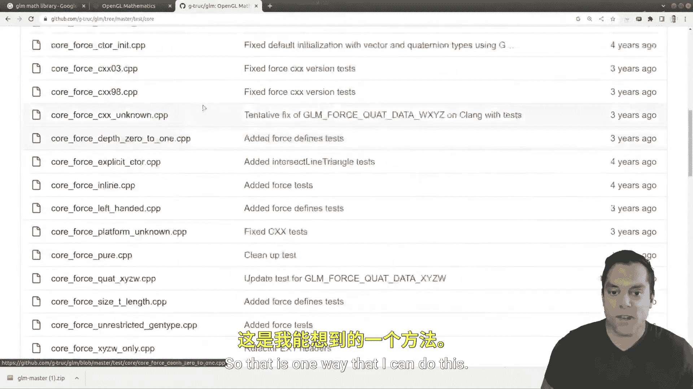

int main() {
    // 创建两个三维向量
    glm::vec3 a(1.0f, 1.0f, 1.0f);
    glm::vec3 b(0.5f, 0.5f, 0.5f);
    
    // 计算点积
    float dotProduct = glm::dot(a, b);
    std::cout << "Dot product of a and b is: " << dotProduct << std::endl;
    
    return 0;
}
```

使用以下命令编译（请根据你的目录结构调整 `-I` 参数）：
```bash
g++ -std=c++20 main.cpp -I./third_party/glm-master -o main
```
运行程序，如果输出点积结果（例如 `1.5`），则说明GLM库已成功集成。


## 探索GLM功能

上一节我们验证了GLM的基本设置，本节中我们来看看GLM库提供的一些核心功能。

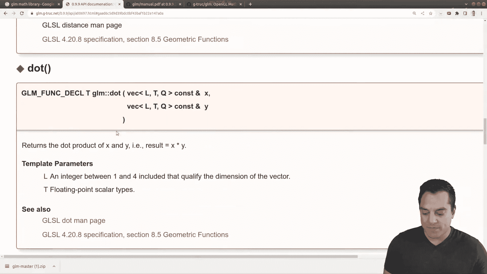

### 向量运算

GLM提供了丰富的向量运算。以下是一些常用操作：

```cpp
#include <iostream>
#include <glm/glm.hpp>
#include <glm/gtx/string_cast.hpp> // 用于 to_string

int main() {
    glm::vec3 vec(1.0f, 2.0f, 2.0f);
    
    // 1. 向量长度
    float length = glm::length(vec);
    
    // 2. 向量归一化 (单位化)
    glm::vec3 normalizedVec = glm::normalize(vec);
    
    // 3. 使用 to_string 打印向量
    std::cout << "Original vector: " << glm::to_string(vec) << std::endl;
    std::cout << "Normalized vector: " << glm::to_string(normalizedVec) << std::endl;
    
    return 0;
}
```

### 矩阵运算

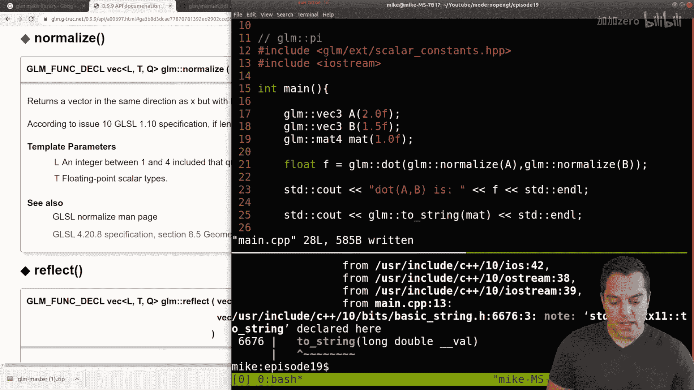


矩阵是图形变换的核心。GLM提供了多种矩阵类型和操作。

```cpp
#include <iostream>
#include <glm/glm.hpp>
#include <glm/gtc/matrix_transform.hpp> // 包含变换函数
#include <glm/gtx/string_cast.hpp>

int main() {
    // 创建一个4x4单位矩阵
    glm::mat4 identityMatrix = glm::mat4(1.0f);
    std::cout << "Identity Matrix:\n" << glm::to_string(identityMatrix) << std::endl;
    
    // 创建一个平移矩阵
    glm::vec3 translation(1.0f, 2.0f, 3.0f);
    glm::mat4 translateMatrix = glm::translate(glm::mat4(1.0f), translation);
    
    // 创建一个绕Z轴旋转45度的矩阵
    float angle = glm::radians(45.0f); // GLM使用弧度制
    glm::mat4 rotationMatrix = glm::rotate(glm::mat4(1.0f), angle, glm::vec3(0.0f, 0.0f, 1.0f));
    
    // 矩阵乘法：先旋转，后平移
    glm::mat4 modelMatrix = translateMatrix * rotationMatrix;
    
    return 0;
}
```

### 分量访问与Swizzling

GLM支持类似GLSL的分量访问和Swizzling操作，但这需要启用特定功能。

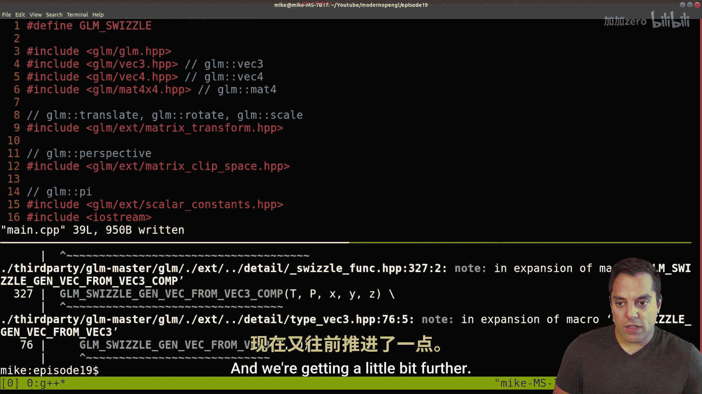

```cpp
#define GLM_ENABLE_EXPERIMENTAL // 启用实验性功能（如Swizzle）
#include <iostream>
#include <glm/glm.hpp>
#include <glm/gtx/string_cast.hpp>
#include <glm/gtx/swizzle.hpp> // Swizzle操作

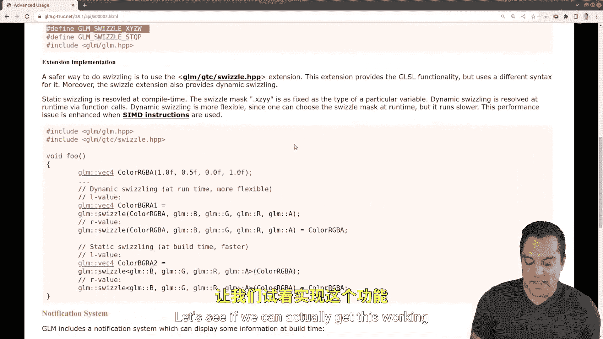

int main() {
    glm::vec4 color(0.2f, 0.4f, 0.8f, 1.0f);
    
    // 访问单个分量
    float red = color.r;
    float alpha = color.a;
    
    // Swizzling: 创建新的向量，调整分量顺序
    glm::vec3 rgb = color.rgb();       // 获取 (r, g, b)
    glm::vec3 bgr = color.bgr();       // 获取 (b, g, r)
    glm::vec2 texCoord = color.st();   // 获取 (s, t)，等同于 (r, g)
    
    std::cout << "RGB: " << glm::to_string(rgb) << std::endl;
    std::cout << "BGR: " << glm::to_string(bgr) << std::endl;
    
    return 0;
}
```
**注意**：Swizzling功能在较新版本的GLM中可能被视为实验性功能，需要定义 `GLM_ENABLE_EXPERIMENTAL` 宏并包含相应的头文件。

### 叉积运算

叉积用于计算垂直于两个向量的第三个向量，在计算法线或旋转时非常有用。


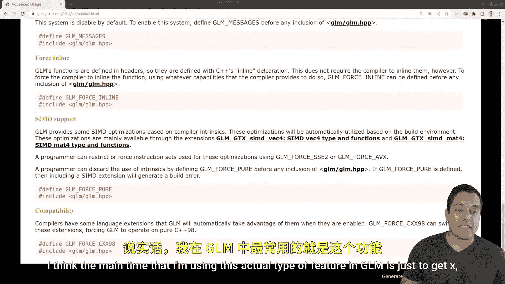

```cpp
#include <iostream>
#include <glm/glm.hpp>
#include <glm/gtx/string_cast.hpp>

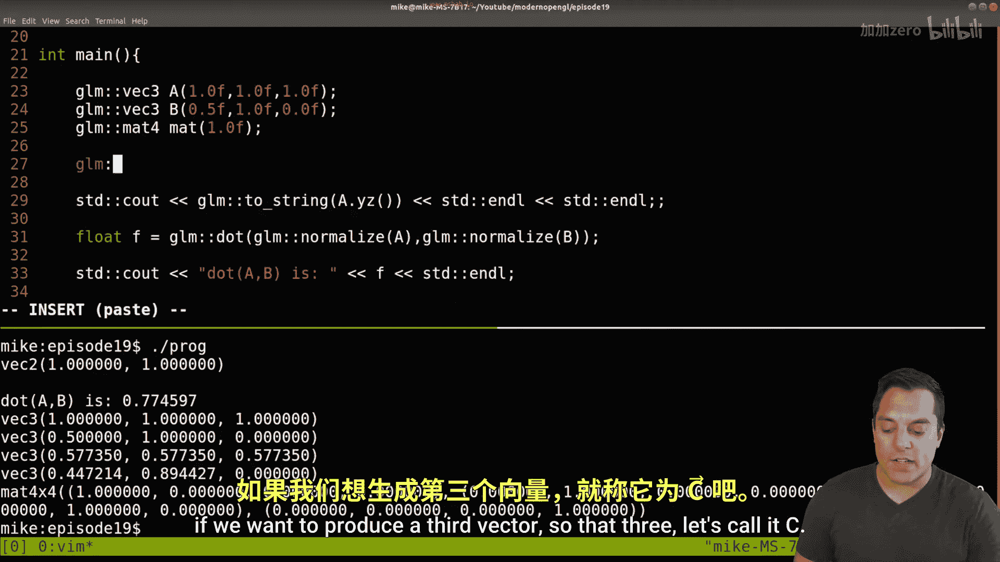

int main() {
    glm::vec3 a(1.0f, 0.0f, 0.0f); // X轴方向
    glm::vec3 b(0.0f, 1.0f, 0.0f); // Y轴方向
    
    // 计算叉积，结果应为Z轴方向 (0,0,1) 或 (0,0,-1)，取决于顺序
    glm::vec3 c = glm::cross(a, b);
    
    std::cout << "Cross product of a and b: " << glm::to_string(c) << std::endl;
    // 输出应为 (0, 0, 1)
    
    return 0;
}
```


## 总结

本节课中我们一起学习了GLM数学库的基础知识。我们首先完成了GLM库的下载和项目配置。然后，我们探索了它的核心功能，包括：
*   **向量**的创建、点积、归一化和长度计算。
*   **矩阵**的创建、基本变换（平移、旋转）以及矩阵乘法。
*   通过启用实验性功能使用**分量访问和Swizzling**操作。
*   计算两个向量的**叉积**。

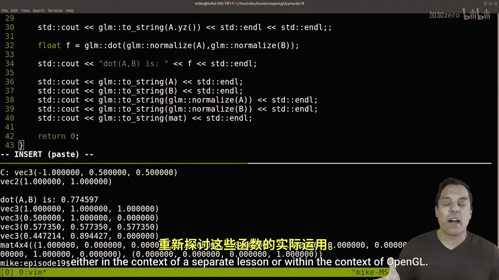

GLM库因其与GLSL的相似性而成为OpenGL编程中的得力助手。掌握如何查阅其官方文档和头文件，将帮助你在未来更有效地使用它的全部功能。在接下来的课程中，我们将把这些数学工具应用到实际的OpenGL图形变换中。