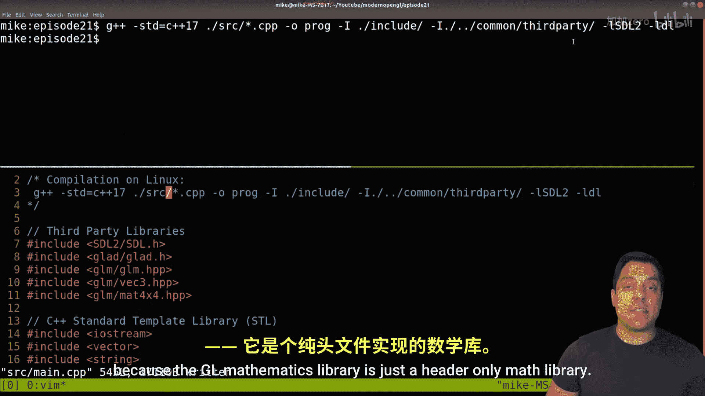
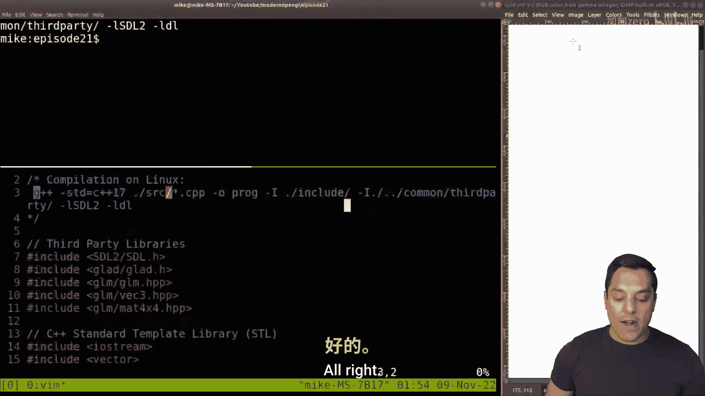
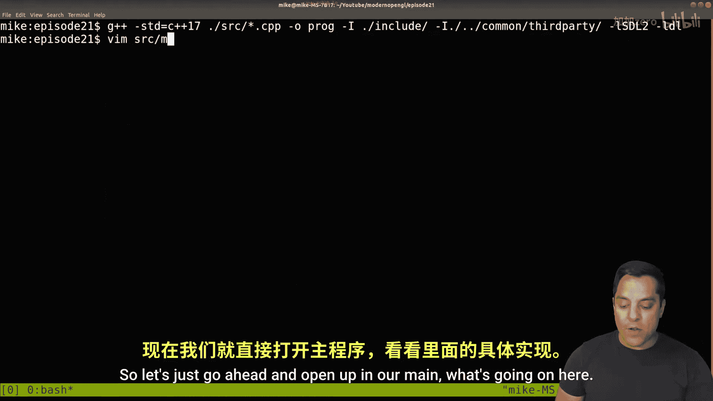

# 021：整合所有组件 (SDL2+glad+glm)


在本节课中，我们将学习如何将GLM数学库整合到现有的OpenGL应用程序中。我们将回顾项目结构，理解SDL2、glad和GLM这三个核心组件如何协同工作，并配置编译环境以包含GLM库。

## 项目结构回顾

上一节我们介绍了基本的OpenGL绘图流程。本节中，我们来看看当前项目的整体结构。

我们的项目主要包含以下文件和文件夹：
*   `shaders/`：存放构建图形管线的顶点和片段着色器代码。
*   `main.cpp`：应用程序的主要源代码文件。
*   `glad.c` 和 `glad.h`：用于加载OpenGL函数的辅助工具。
*   `SDL2` 相关的动态链接库（例如Windows上的`.dll`文件）。

为了整合GLM，我们需要将其头文件包含到项目中。一种常见的做法是创建一个`third_party`或`common`文件夹来集中管理这些第三方库。

## 配置GLM库

GLM是一个仅包含头文件的数学库，这意味着我们不需要编译额外的`.lib`或`.a`文件，只需确保编译器能找到其头文件路径即可。

以下是配置GLM库的步骤：
1.  **获取GLM**：从官方仓库下载GLM库。
2.  **组织目录**：将GLM库文件夹（例如`glm-master`）放置在一个方便引用的位置，例如项目根目录下的`third_party`文件夹内。
3.  **更新包含路径**：在编译命令中，添加指向GLM头文件所在目录的`-I`参数。







例如，在Linux/macOS的g++编译命令中，需要添加：
```bash
-I../third_party/glm
```
在`main.cpp`源文件中，则可以使用`#include <glm/glm.hpp>`来包含核心头文件。

## 核心组件协作解析

现在我们已经配置好了GLM，让我们深入理解SDL2、glad和GLM这三个组件在应用程序中扮演的角色及其协作方式。

*   **SDL2**：负责创建和管理应用程序窗口，并建立OpenGL渲染上下文。它是一个独立的共享库，在链接阶段需要与我们的应用程序绑定。
*   **glad**：作为一个头文件加载库，它根据我们指定的OpenGL版本（例如4.1），在运行时查找并加载显卡驱动中对应的函数指针。这使得我们可以调用现代OpenGL API。
*   **GLM**：提供图形编程所需的数学工具，如向量、矩阵（例如`glm::mat4`）、变换（平移、旋转、缩放）等计算功能。它是一个纯头文件库，代码在编译时直接嵌入到我们的程序中。

它们与我们的`main.cpp`应用程序的关系可以概括为：
*   **编译时**：通过`#include`指令，将GLM和glad的头文件代码、以及SDL2的头文件声明导入`main.cpp`。
*   **链接时**：将我们编译好的`main.cpp`目标文件与预编译好的SDL2共享库文件链接在一起，形成最终的可执行程序。

## 代码流程总览

为了更清晰地理解整个程序的执行脉络，我们来快速回顾一下`main.cpp`中的典型流程：

1.  **初始化**：调用`SDL_Init`和SDL窗口创建函数来设置SDL，然后使用glad加载OpenGL函数。
2.  **创建图形管线**：编译链接着色器，创建顶点缓冲对象(VBO)和顶点数组对象(VAO)，准备渲染数据。
3.  **主循环**：在`while`循环中处理事件（如退出事件），执行清除屏幕、绑定着色器程序、绑定VAO、发起绘制调用（如`glDrawArrays`）等渲染指令。
4.  **清理**：退出循环后，删除OpenGL对象（如VAO, VBO, 着色器程序），并关闭SDL。

## 总结


本节课中我们一起学习了如何将GLM数学库整合到我们的OpenGL项目中。我们回顾了由SDL2处理窗口、glad加载OpenGL函数、GLM提供数学计算的核心架构，并理解了它们从源代码到最终可执行文件的协作过程。现在，我们的项目已经具备了进行复杂图形变换和渲染的所有基础组件。在接下来的课程中，我们将利用这些工具，让图形变得更加生动和有趣。