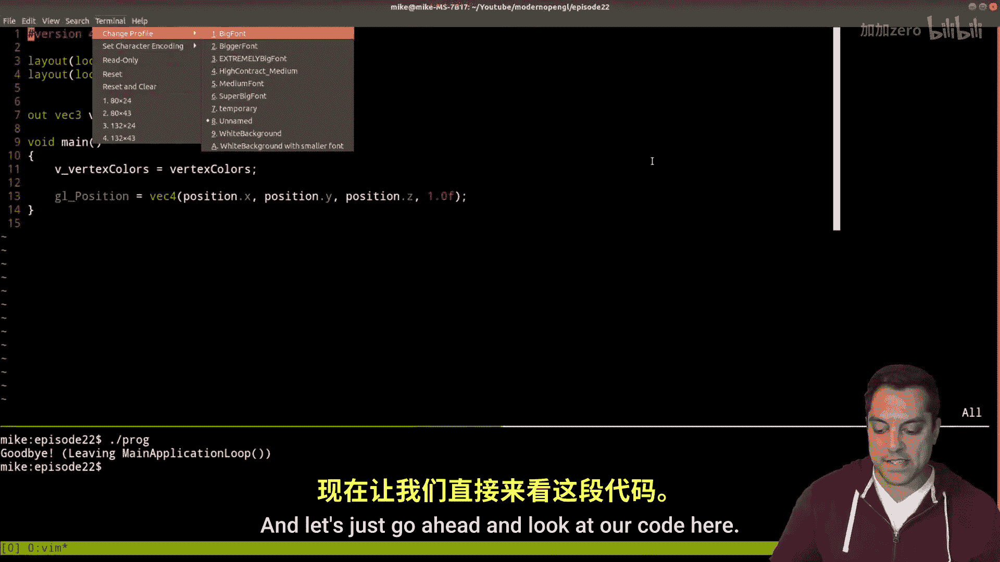
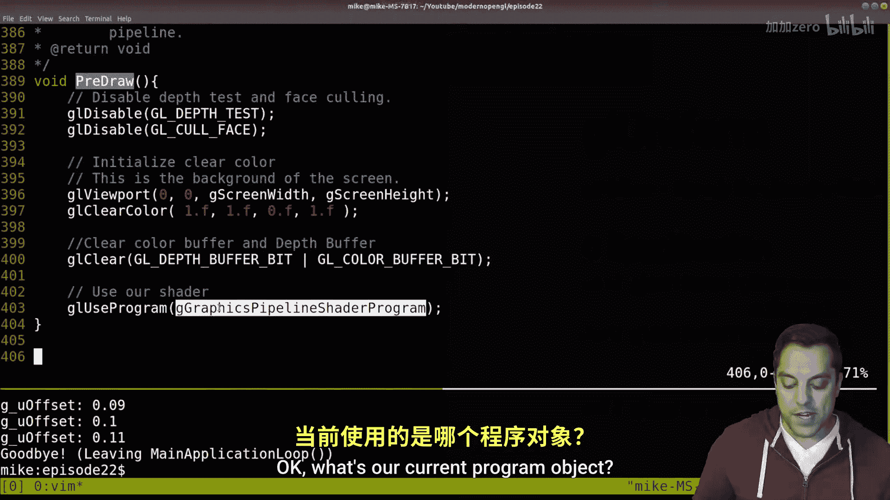
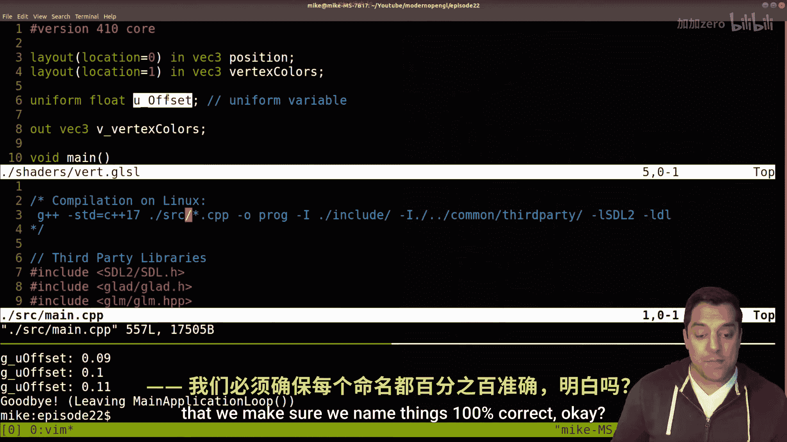
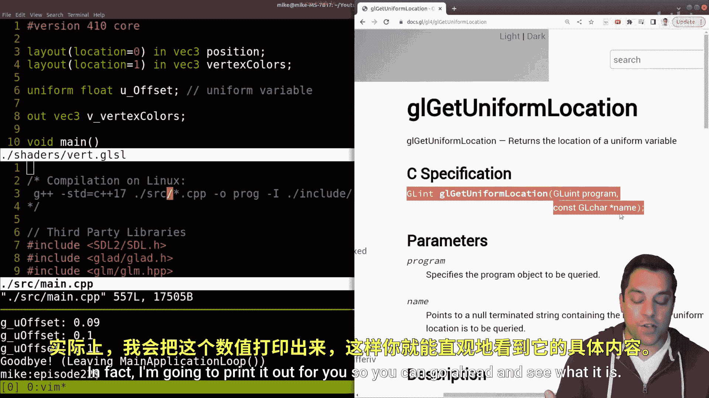
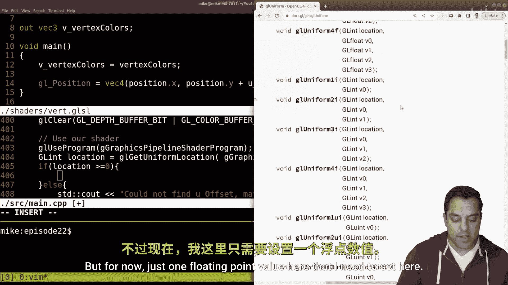
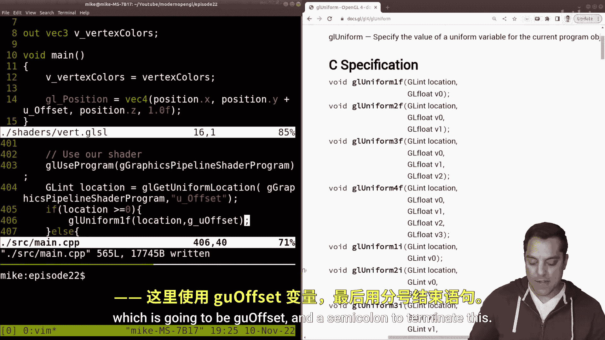

# 022：Uniform变量详解 🎮

在本节课中，我们将要学习OpenGL着色器编程中的一个核心概念：**Uniform变量**。Uniform是着色器中的一种全局变量，它允许我们将数据从CPU（我们的C++程序）传递到GPU（着色器程序）。这是继顶点缓冲对象之后，我们学习第二种向图形管线发送数据的重要机制。

上一节我们介绍了如何使用顶点缓冲对象来传递顶点属性数据。本节中，我们来看看如何通过Uniform变量传递那些不属于单个顶点、而是全局共享的数据。



## Uniform变量是什么？

Uniform变量本质上是着色器中的一个**全局变量**。它具有以下关键特性：
*   它是一个在GPU上的全局变量。
*   它在整个图形管线中**共享**，这意味着顶点着色器、片段着色器以及其他着色器（如几何着色器）都可以访问同一个Uniform变量。
*   它在着色器内部是**常量**，意味着着色器代码不能修改它的值。其值只能由我们的CPU程序来设置和更新。
*   它的核心作用是实现从**CPU到GPU**的数据传递。

简而言之，Uniform的机制是：我们**从CPU传递一个值到GPU**。

## 实践：在着色器中声明Uniform


让我们通过代码来理解。首先，我们需要在着色器代码中声明一个Uniform变量。

以下是具体步骤，我们将在顶点着色器中添加一个Uniform：

1.  打开顶点着色器文件。
2.  在代码中声明一个Uniform变量。我们将其类型设为 `float`，并命名为 `u_offset`。按照常见的命名风格，我们为Uniform变量添加 `u_` 前缀以便识别。
    ```glsl
    // 在顶点着色器中声明一个uniform变量
    uniform float u_offset;
    ```
3.  现在，我们可以使用这个变量。例如，用它来偏移顶点的Y坐标：
    ```glsl
    gl_Position = vec4(position.x, position.y + u_offset, position.z, 1.0);
    ```
4.  编译并运行程序。此时矩形可能没有移动，因为 `u_offset` 的默认值可能是0。接下来，我们需要从C++代码中设置它的值。




## 在C++程序中设置Uniform值


为了动态地更新Uniform变量，我们需要在C++程序中进行以下操作：

1.  **查询Uniform的位置**：在GPU的着色器程序中，每个Uniform变量都有一个特定的“位置”（一个整数句柄）。我们需要先找到它。
    ```cpp
    // 查询名为“u_offset”的uniform变量的位置
    GLint location = glGetUniformLocation(graphics_pipeline_shader_program, "u_offset");
    // 建议进行错误检查
    if(location >= 0) {
        std::cout << "找到 u_offset，位置是: " << location << std::endl;
    } else {
        std::cout << "错误：未找到 u_offset，请检查拼写！" << std::endl;
    }
    ```
    `glGetUniformLocation` 函数会在指定的着色器程序中查找Uniform变量，并返回其内存位置。这个位置是后续设置其值的依据。

2.  **设置Uniform的值**：一旦获得了位置，我们就可以使用 `glUniform*` 系列函数来设置它的值。对于我们的 `float` 类型变量，使用 `glUniform1f`。
    ```cpp
    // 假设我们有一个CPU端的变量来存储偏移值
    float g_u_offset = 0.0f;

    // 在渲染循环中（例如pre-draw阶段），将CPU的值传递给GPU的uniform
    glUseProgram(graphics_pipeline_shader_program); // 首先启用着色器程序
    glUniform1f(location, g_u_offset); // 设置uniform的值
    ```

3.  **实现交互**：为了让矩形动起来，我们可以通过键盘输入来改变 `g_u_offset` 的值，然后在每一帧将其传递给Uniform。
    ```cpp
    // 在输入处理函数中
    if(key_up_pressed) {
        g_u_offset += 0.01f;
    }
    if(key_down_pressed) {
        g_u_offset -= 0.01f;
    }
    // 之后在渲染循环中，glUniform1f会将最新的g_u_offset值传递给着色器
    ```





完成以上步骤后，运行程序，按下键盘的上下键，你应该能看到矩形随之上下移动。

## Uniform的共享特性

一个重要的概念是Uniform的共享性。我们也可以在片段着色器中声明并使用同一个 `u_offset` 变量。


以下是具体操作：
1.  在片段着色器中同样声明 `uniform float u_offset;`。
2.  在片段着色器代码中使用它，例如影响颜色输出：
    ```glsl
    // 用u_offset来影响红色通道
    colorOut = vec4(color.r - u_offset, color.g, color.b, 1.0);
    ```
3.  无需在C++端做任何额外工作。因为我们在C++中设置的 `u_offset` 值会自动同步到顶点和片段着色器中。




现在，当你再次用键盘改变偏移值时，不仅矩形的位置会变化，其颜色也会随之改变。这证明了Uniform变量在多个着色器阶段是真正全局共享的。




## 核心概念与最佳实践总结

本节课中我们一起学习了Uniform变量的完整使用流程。我们来总结一下核心要点和几个优化建议：

*   **核心机制**：Uniform实现了 **CPU → GPU** 的单向数据传递，用于设置着色器中的全局常量。
*   **工作流程**：
    1.  在着色器中声明 `uniform`。
    2.  在C++中用 `glGetUniformLocation` 查询其位置。
    3.  在C++中用 `glUniform*` 函数设置其值。
*   **性能提示**：`glGetUniformLocation` 调用涉及字符串查找，不应在每帧都进行。最佳实践是在初始化时查询一次位置并缓存它，然后在渲染循环中直接使用缓存的位置。
*   **调试技巧**：可以利用 `glGetUniformLocation` 的返回值进行错误检查（返回-1表示未找到），这有助于发现变量名拼写错误等问题。


Uniform变量是控制着色器行为（如变换、颜色、光照参数等）的强大工具。掌握它是迈向更复杂图形编程的关键一步。