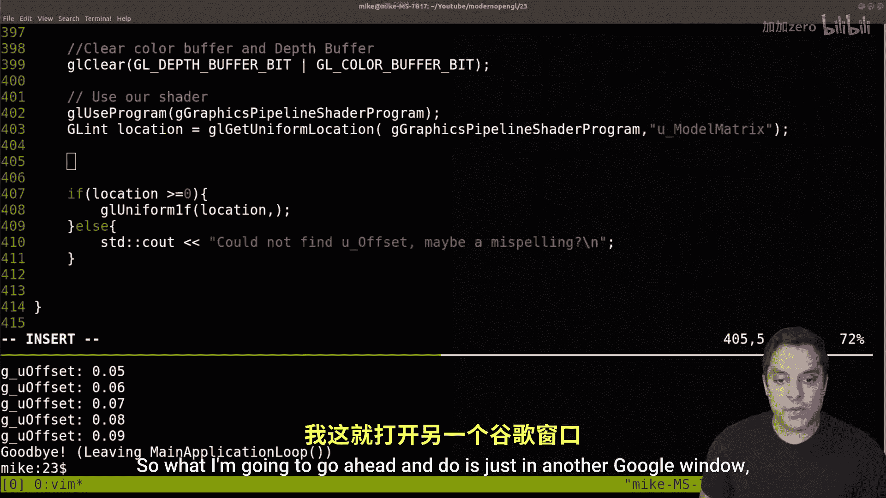
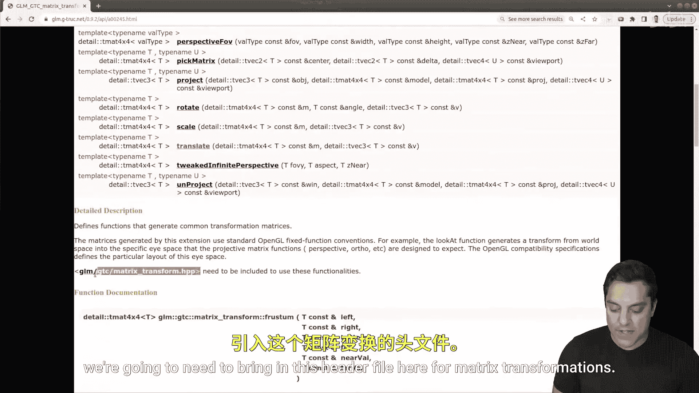
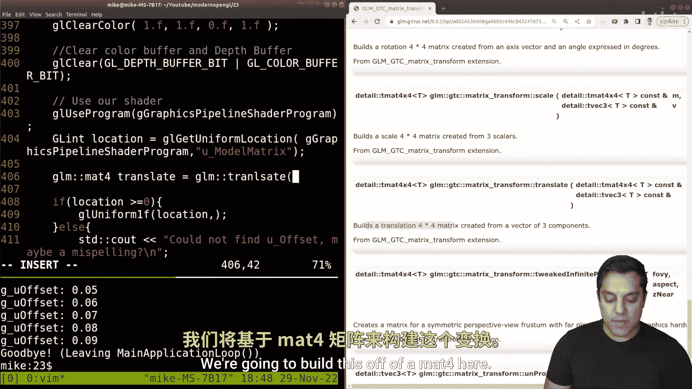
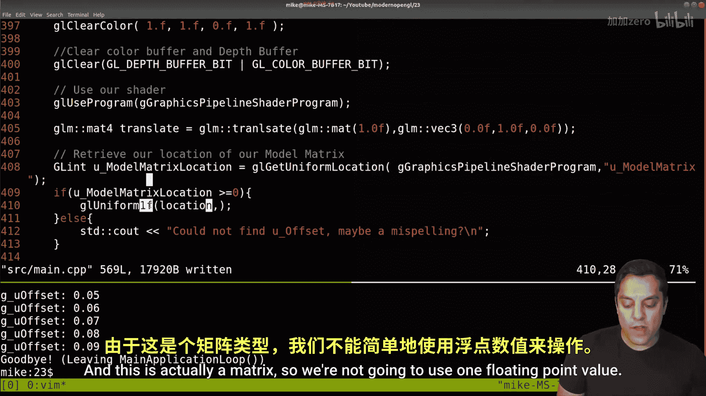
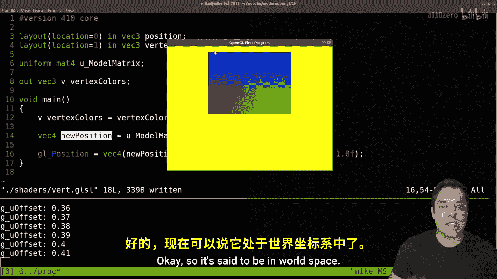
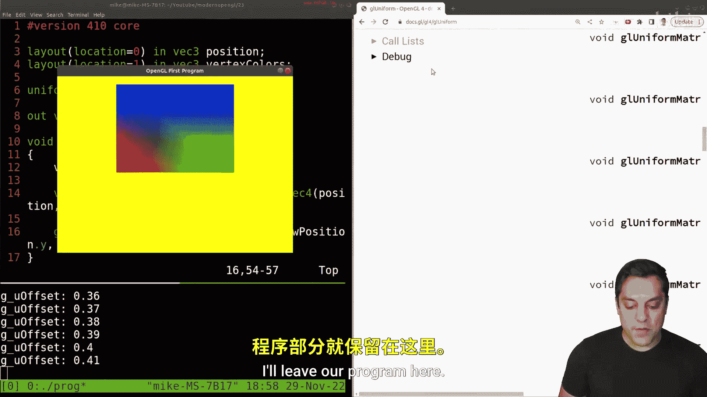

# 023：从局部空间到世界空间（模型矩阵变换）🚀


在本节课中，我们将学习如何使用模型变换矩阵，将物体从其局部坐标空间移动到世界坐标空间。我们将通过平移、旋转、缩放等操作来移动物体。

## 概述

上一节我们介绍了如何使用Uniform变量向着色器传递简单的偏移值。本节中，我们将探讨一个更强大、更通用的概念：模型矩阵。通过模型矩阵，我们可以对每个物体进行独立的变换，从而将它们放置在虚拟世界的不同位置。

## 回顾与起点

首先，让我们回顾一下上节课结束时的程序状态。我们有一个图形管线，负责初始化程序、指定顶点数据、创建包含顶点和片段着色器的管线，并运行主循环。主循环处理输入、执行绘制前的准备工作（如上节课学习的Uniform设置）以及清理工作。

在本课中，我们首先关注顶点数据的指定部分，即设置几何体或顶点数据的地方。编译并运行当前程序，会得到一个矩形（实际上是一个被拉伸的正方形，原因将在下节课讨论）。按上/下键，可以看到我们通过Uniform变量在着色器中偏移了所有顶点的Y坐标。

## 局部坐标与世界空间

让我们先定义一些术语。目前，我们的顶点数据定义在一个特定的坐标范围内。在OpenGL的标准化设备坐标中，X和Y轴的范围通常是从-1到1。我们绘制的正方形顶点大约在-0.5的位置，这被称为物体的**局部坐标空间**。

然而，我们通常希望能在更大的“世界”中移动这个物体。这就需要将每个局部坐标乘以一个4x4的变换矩阵，从而将其转换到**世界空间**。我们可以为每个物体设置一个特殊的矩阵，称为**模型矩阵**，通过它来操纵物体（如移动、旋转、缩放）。

## 实现模型变换

我们将不再使用简单的Y轴偏移Uniform，而是创建一个完整的变换矩阵传递给着色器。





### 1. 修改C++代码


首先，在C++代码中，我们需要包含GLM库的矩阵变换头文件，并创建一个平移矩阵。



```cpp
#include <glm/gtc/matrix_transform.hpp> // 引入矩阵变换

// 在绘制前例程中（例如第400行附近）
glm::mat4 modelMatrix = glm::translate(glm::mat4(1.0f), glm::vec3(0.0f, g_u_offset, 0.0f));
```




这里，`glm::mat4(1.0f)`创建了一个单位矩阵，`glm::vec3(0.0f, g_u_offset, 0.0f)`指定了沿Y轴的平移量（`g_u_offset`是我们保留的全局变量，用于按键控制）。

接着，我们需要获取着色器中模型矩阵Uniform的位置，并将这个4x4矩阵传递进去。

```cpp
GLint u_model_matrix_location = glGetUniformLocation(shader_program, “u_model_matrix”);
if (u_model_matrix_location >= 0) {
    glUniformMatrix4fv(u_model_matrix_location, 1, GL_FALSE, glm::value_ptr(modelMatrix));
} else {
    // 处理错误：未找到Uniform
    std::cerr << “Could not find u_model_matrix, did you spell it correctly?” << std::endl;
    exit(EXIT_FAILURE); // 学习阶段，遇到错误直接退出
}
```

### 2. 修改顶点着色器

在顶点着色器中，我们需要声明对应的Uniform，并使用它来变换顶点位置。

```glsl
#version 410 core
uniform mat4 u_model_matrix; // 声明模型矩阵Uniform
layout(location=0) in vec3 position; // 输入的顶点位置（vec3）

void main() {
    // 将vec3的位置转换为vec4（w分量设为1.0），然后乘以模型矩阵
    vec4 new_position = u_model_matrix * vec4(position, 1.0);
    gl_Position = new_position; // 输出最终位置
}
```

关键点在于：不能直接用4x4矩阵乘以vec3。需要先将vec3的顶点位置转换为齐次坐标vec4（即添加一个`w`分量，通常设为1.0），然后再进行矩阵乘法。

## 核心概念总结

让我们通过一个简单的图示和公式来总结这个过程：

1.  **局部坐标**：物体原始的顶点数据，定义在其自身的坐标系中。
    *   例如：`vec3 local_position = (-0.5, -0.5, 0.0);`
2.  **模型矩阵**：一个4x4变换矩阵（`mat4`），用于对物体进行平移、旋转、缩放。
    *   例如平移矩阵：`mat4 model_matrix = translate(identity_matrix, vec3(0.0, offset, 0.0));`
3.  **世界空间变换**：将局部坐标转换到世界空间的过程。
    *   公式：`vec4 world_position = model_matrix * vec4(local_position, 1.0);`
4.  **逆变换**：模型矩阵的逆矩阵（`inverse(model_matrix)`）可以将世界坐标转换回该物体的局部坐标，这在某些计算中非常有用。

## 注意事项与调试

*   **着色器优化**：如果声明了Uniform但在着色器代码中未实际使用，GLSL编译器可能会将其优化掉，导致`glGetUniformLocation`返回-1。确保你确实在计算中使用了该Uniform。
*   **矩阵乘法顺序**：在GLSL中，矩阵乘法是右乘，即 `matrix * vector`。确保顺序正确。
*   **错误处理**：在开发阶段，像上面代码那样，当找不到关键Uniform时使程序失败，可以帮助你快速定位拼写错误或逻辑错误。

## 展望

现在，我们已经成功将物体通过模型矩阵放置到了世界空间中。你可能会注意到屏幕上的“正方形”看起来有点被拉长成矩形。这是因为我们还没有进行视图和投影变换。在接下来的课程中，我们将引入相机（视图）矩阵和投影矩阵，来处理观察视角和3D到2D的投影，这将解决形状失真的问题，并让我们能够构建真正的3D场景。





## 总结

本节课中，我们一起学习了：
1.  **局部空间**与**世界空间**的概念区别。
2.  如何使用**模型矩阵**对物体进行变换（以平移为例）。
3.  如何在C++程序中利用GLM库创建变换矩阵，并通过`glUniformMatrix4fv`函数将其作为Uniform传递给着色器。
4.  如何在顶点着色器中正确地使用4x4矩阵来变换顶点坐标（需要将`vec3`转换为`vec4`）。

通过模型矩阵，我们获得了对物体位置、姿态和大小进行独立且灵活控制的能力，这是构建复杂3D场景的基石。希望你对OpenGL的学习感到越来越有趣！