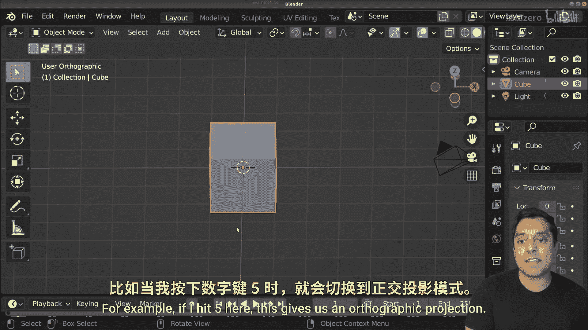
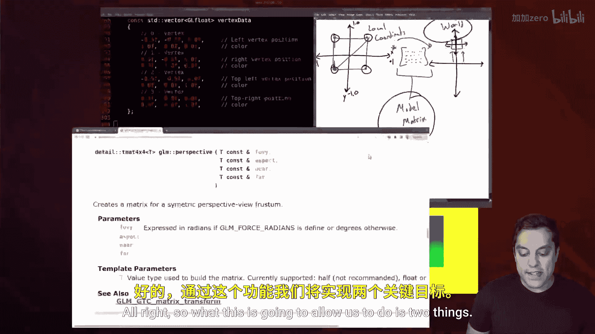
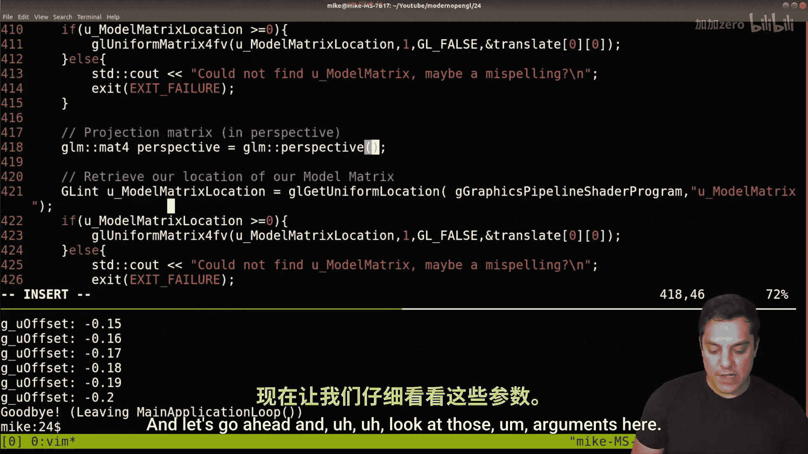
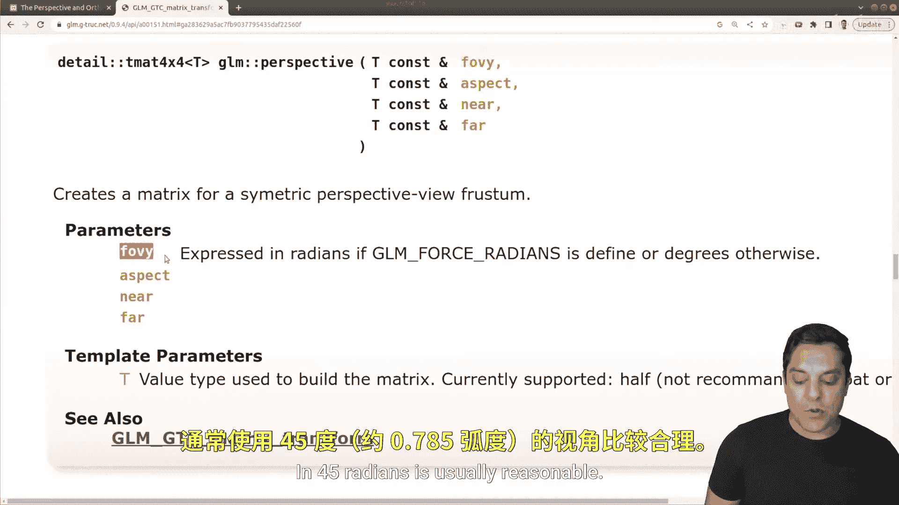
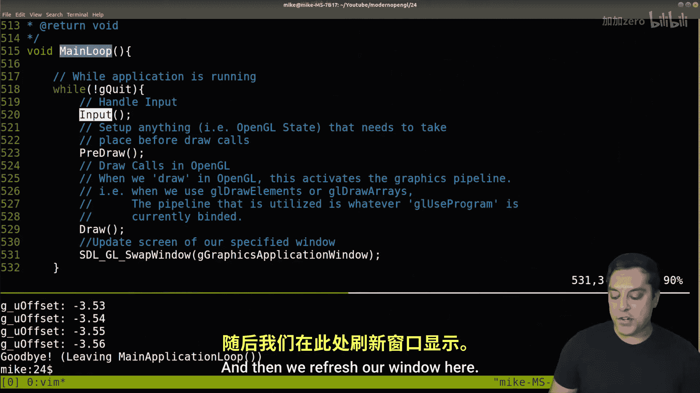

# 024：投影矩阵与glm::perspective


## 概述

在本节课中，我们将要学习投影矩阵，特别是透视投影。我们将探讨如何解决当前渲染中正方形显示为矩形的问题，并理解透视投影的基本原理及其在OpenGL中的实现。

---



## 问题分析：为何正方形显示为矩形？

上一节我们介绍了模型矩阵，本节中我们来看看当前渲染存在的问题。仔细观察我们之前课程中运行的程序，其渲染结果是一个矩形。然而，如果我们查看顶点数据规范，会发现我们设置的是一个正方形。

问题的根源在于我们尚未应用透视投影。透视投影模拟了人眼观察物体时“近大远小”的视觉效果。

## 理解投影类型：透视与正交

以下是两种常见的投影类型：



*   **透视投影**：模拟人眼或相机观察世界的方式。物体距离观察者越远，看起来越小，最终会汇聚到一个点。例如，观察铁轨时，两条轨道会在远处交汇。
*   **正交投影**：保持物体的实际尺寸比例，无论距离远近。这种投影常用于工程制图或建筑设计，需要精确测量尺寸的场景。

在本教程中，我们将重点学习在实时图形应用中最常用的**透视投影**。

## 透视投影矩阵原理

透视投影的核心数学直觉是进行“透视除法”。对于一个点的坐标 `(x, y, z, w)`，在裁剪空间之后，GPU会自动执行 `(x/w, y/w, z/w)` 的操作。

在透视投影矩阵中，一个关键作用是将原始的 `z` 值存储到变换后的 `w` 分量中。这样，在后续的透视除法步骤中，`x` 和 `y` 坐标就会被 `z` 值（即距离）所除，从而实现“近大远小”的效果。





透视投影矩阵 `P` 的结构大致如下（以列主序为例）：

```
P = [
    [scale_x, 0,       0,                       0],
    [0,       scale_y, 0,                       0],
    [0,       0,       -(far+near)/(far-near), -1],
    [0,       0,       -(2*far*near)/(far-near), 0]
]
```

其中，`scale_x` 和 `scale_y` 与视场角和宽高比相关。可以看到，该矩阵的最后一行的第三列是 `-1`，这确保了原始的 `z` 值被复制到了结果的 `w` 分量中。

## 实践：使用GLM库创建透视矩阵

好消息是，我们无需手动构建这个复杂的矩阵。GLM（OpenGL Mathematics）库提供了 `glm::perspective` 函数来帮助我们生成透视投影矩阵。

以下是创建透视投影矩阵的步骤：

1.  **在顶点着色器中添加投影矩阵uniform变量**：
    ```glsl
    uniform mat4 u_projection;
    void main() {
        gl_Position = u_projection * u_model * vec4(a_position, 1.0);
    }
    ```
    注意矩阵乘法的顺序：通常是 `投影矩阵 * 视图矩阵 * 模型矩阵 * 顶点位置`。目前我们暂时没有视图矩阵。

2.  **在C++代码中生成并传递投影矩阵**：
    ```cpp
    #include <glm/gtc/matrix_transform.hpp>

    // 定义投影参数
    float fieldOfView = glm::radians(45.0f); // 视场角，转换为弧度
    float aspectRatio = screenWidth / (float)screenHeight; // 宽高比
    float nearPlane = 0.1f; // 近裁剪平面
    float farPlane = 10.0f; // 远裁剪平面

    // 创建透视投影矩阵
    glm::mat4 projectionMatrix = glm::perspective(fieldOfView, aspectRatio, nearPlane, farPlane);

    // 获取着色器中uniform的位置并传递矩阵
    GLint projLocation = glGetUniformLocation(shaderProgram, "u_projection");
    glUniformMatrix4fv(projLocation, 1, GL_FALSE, glm::value_ptr(projectionMatrix));
    ```


**参数解释**：
*   `fieldOfView (fov)`：垂直视场角，单位是弧度。值越大，能看到更广的范围（类似鱼眼镜头），但边缘可能产生畸变；值越小，视角越窄（类似望远镜）。45度是一个常用值。
*   `aspectRatio`：渲染窗口的宽高比（宽度/高度）。这个值必须与窗口实际比例匹配，否则物体会被拉伸。
*   `nearPlane`：近裁剪平面距离。比这个距离更近的物体不会被渲染。
*   `farPlane`：远裁剪平面距离。比这个距离更远的物体不会被渲染。`near`和`far`的差值不宜过大，以免引起深度缓冲的精度问题（Z-fighting）。

## 坐标变换流程回顾

现在，让我们将透视投影整合到整个坐标变换流程中：

1.  **局部空间**：物体的原始顶点坐标。
2.  **世界空间**：通过**模型矩阵** (`u_model`) 将物体放置在世界中的特定位置、旋转和缩放。
3.  **观察空间**：通过**视图矩阵**（下一节将介绍）模拟相机的位置和朝向。目前我们的代码中暂时省略了这一步。
4.  **裁剪空间**：通过**投影矩阵** (`u_projection`) 将视锥体（一个平头截体）内的坐标变换到一个标准化立方体内。这个矩阵引入了透视效果。
5.  **屏幕空间**：由GPU进行透视除法和视口变换，最终得到屏幕上的像素坐标。

可以将**视图矩阵**理解为相机本身（位置和角度），而**投影矩阵**则理解为相机的镜头（焦距、视野范围）。

## 常见问题与调试

在实现过程中，你可能会遇到物体没有随深度变化而改变大小的问题。请检查以下两点：

1.  **矩阵乘法顺序**：确保在着色器中的乘法顺序是正确的。对于从局部坐标到裁剪空间的完整变换，典型顺序是：`投影矩阵 * 视图矩阵 * 模型矩阵 * 顶点位置`。
2.  **顶点着色器输出**：确保 `gl_Position` 是一个 `vec4`，并且其 `w` 分量不是固定的1.0。它应该来自前面矩阵变换的结果，因为 `w` 分量承载了深度信息用于透视除法。直接使用 `vec4(a_position, 1.0)` 会丢失透视效果。

## 总结

本节课中我们一起学习了：
1.  **透视投影的概念**：它模拟了现实世界中物体“近大远小”的视觉效果，是游戏和模拟应用中最常用的投影方式。
2.  **透视投影矩阵的作用**：其核心功能之一是将顶点深度信息（z值）传递到齐次坐标的 `w` 分量，为后续的透视除法做准备。
3.  **使用GLM库**：我们利用 `glm::perspective` 函数方便地生成了透视投影矩阵，并了解了其参数（视场角、宽高比、近/远裁剪面）的含义。
4.  **整合到渲染管线**：我们在顶点着色器中添加了投影矩阵uniform，并将其与模型矩阵一起作用于顶点，完成了从局部空间到裁剪空间的变换。



现在，你的程序应该能够正确显示深度变化带来的透视效果了。在下一节课中，我们将引入**视图矩阵**，学习如何控制“相机”在3D世界中的移动和观察。