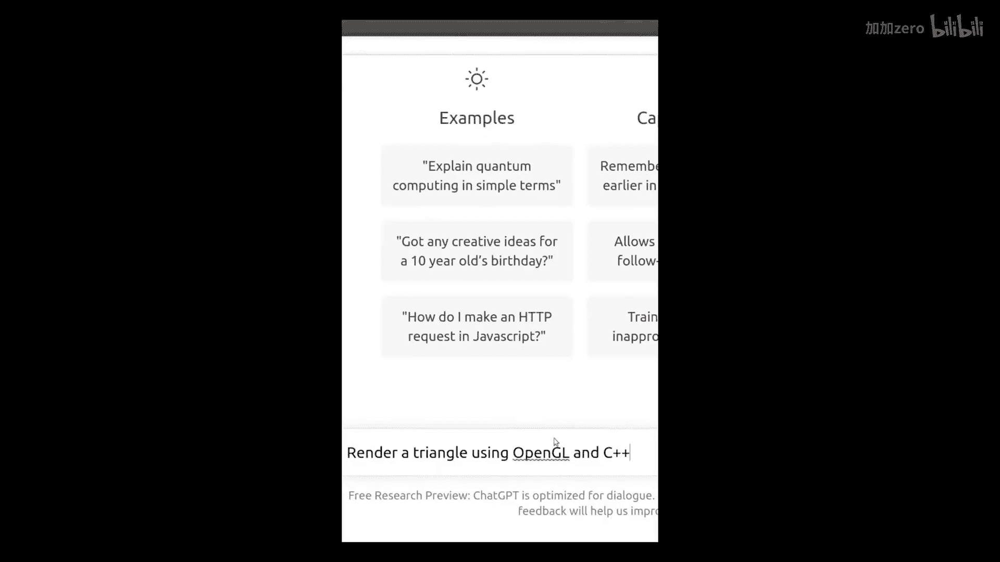

# 025：OpenGL与ChatGPT 🧠

在本节课中，我们将探讨一个有趣的插曲：使用ChatGPT来辅助OpenGL编程。我们将看到AI工具如何生成代码片段，并讨论其在学习过程中的潜在作用与局限性。

---

上一节我们介绍了现代OpenGL的核心概念，本节中我们来看看AI工具如何介入编程学习过程。

不妨尝试一下。

是的。

好的。如果有人站出来批评我，我会用这个来回应。

虽然结果令人印象深刻，但我们最好还是继续我们的C++现代OpenGL系列教程。

---

以下是使用ChatGPT等AI工具时需要注意的几个要点：

*   **辅助而非替代**：AI可以生成代码片段，但理解其原理和调试仍需人工完成。
*   **验证代码正确性**：生成的代码可能存在错误或非最佳实践，必须进行测试和审查。
*   **学习核心概念**：依赖AI生成代码可能阻碍对OpenGL底层机制的理解。

---

总的来说，AI工具如ChatGPT可以作为编程的有趣辅助，快速生成代码框架或提供思路。然而，扎实掌握**OpenGL**的**着色器（Shader）**、**缓冲区对象（VBO/VAO）** 等核心概念，以及**C++**的编程能力，才是学习图形学的根本。

本节课中我们一起学习了如何辩证地看待AI在编程学习中的角色。工具虽强大，但深入理解与亲手实践更为重要。

期待在下一课中与你再见。