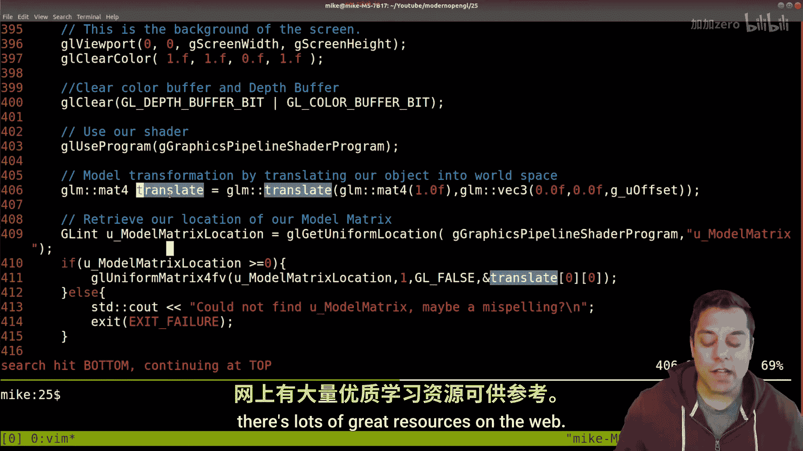
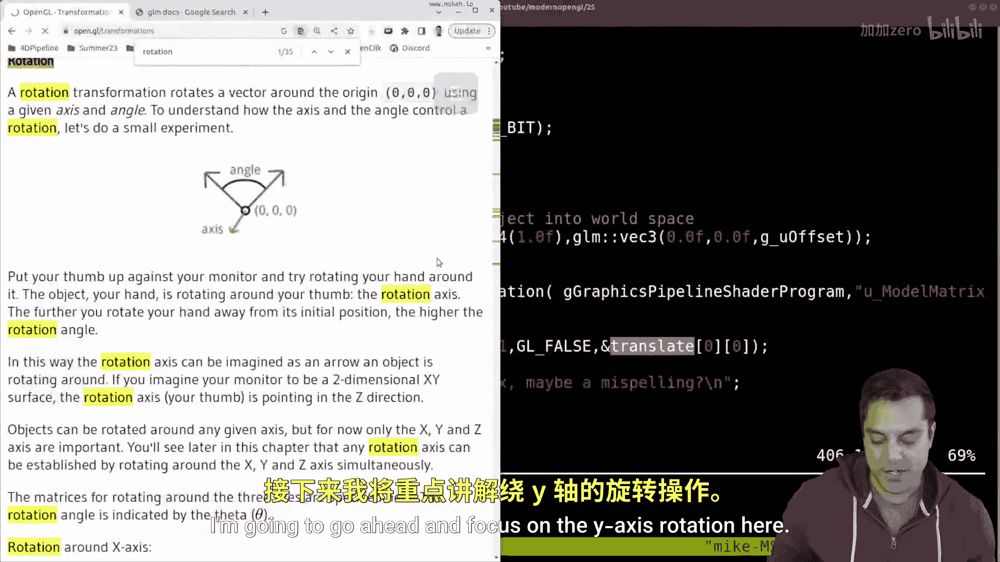
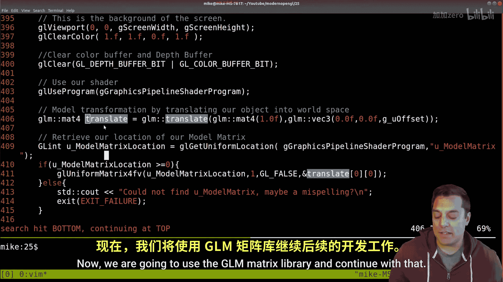
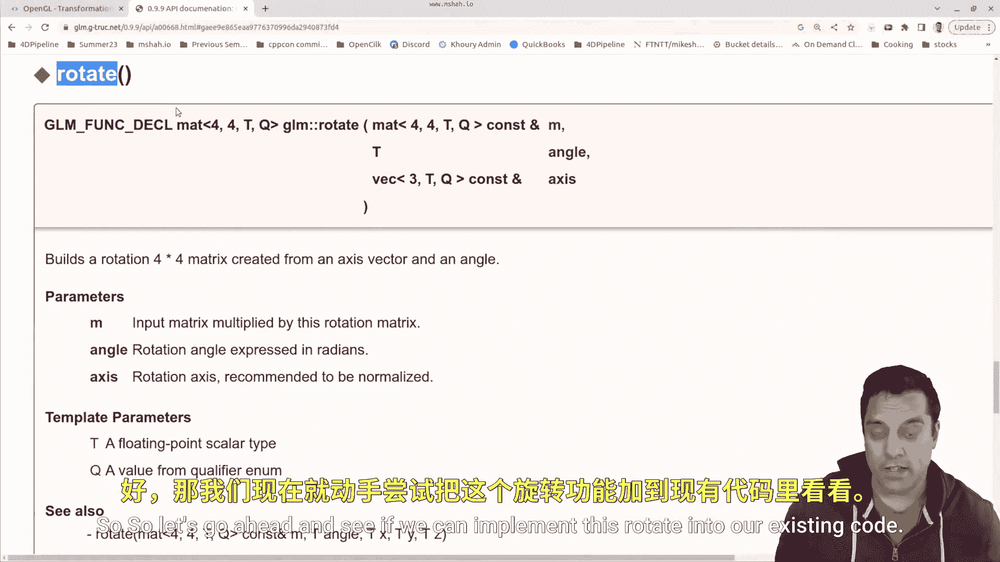

# 026：旋转矩阵（使用GLM）

在本节课中，我们将学习如何在OpenGL中使用旋转矩阵。我们将回顾图形渲染管线的基本概念，然后重点介绍如何利用GLM库实现绕Y轴的旋转，并最终让我们的图形对象动起来。

## 概述

上一节我们介绍了平移变换，本节中我们来看看旋转变换。旋转变换是计算机图形学中用于让物体绕特定轴旋转的核心操作。我们将学习其背后的矩阵原理，并动手实现一个可交互的旋转四边形。

## 图形渲染管线回顾



首先，让我们快速回顾一下图形渲染管线的基本流程。这对于理解变换发生的位置至关重要。

1.  **顶点规格化**：我们首先在局部坐标系中定义一系列顶点。
2.  **顶点着色器**：每个顶点被送入顶点着色器，在这里进行从局部坐标到世界坐标的变换。
3.  **世界空间**：经过变换后，顶点被放置在世界坐标系中。



我们之前已经通过平移矩阵学习了如何移动顶点。其核心思想是创建一个矩阵，并与顶点向量进行矩阵乘法运算。

**代码示例：平移矩阵**
```cpp
glm::mat4 translate = glm::translate(glm::mat4(1.0f), glm::vec3(offsetX, offsetY, offsetZ));
```

## 旋转变换原理

现在，让我们聚焦于旋转变换。旋转是通过特定的旋转矩阵来实现的，该矩阵定义了物体绕某个坐标轴（如X、Y、Z轴）旋转的角度。



例如，绕Y轴旋转θ角度的矩阵如下：

**公式：绕Y轴旋转矩阵**
```
[ cosθ,  0, sinθ,  0]
[   0,   1,   0,   0]
[-sinθ,  0, cosθ,  0]
[   0,   0,   0,   1]
```

理解这个矩阵的关键在于：当绕Y轴旋转时，物体上各点的Y坐标值保持不变，而X和Z坐标会根据三角函数关系发生变化。想象一个物体绕垂直的Y轴旋转，它只会水平转动，而不会上下移动。



幸运的是，我们无需手动记忆或构造这些矩阵。GLM库提供了现成的函数来生成旋转矩阵。

## 使用GLM实现旋转

GLM库中的`glm::rotate`函数可以方便地创建旋转矩阵。该函数需要三个参数：一个输入矩阵（通常是单位矩阵）、旋转角度（以弧度为单位）以及旋转轴（一个三维向量）。

**代码示例：创建绕Y轴旋转45度的矩阵**
```cpp
glm::mat4 rotate = glm::rotate(glm::mat4(1.0f), glm::radians(45.0f), glm::vec3(0.0f, 1.0f, 0.0f));
```
其中，`glm::vec3(0.0f, 1.0f, 0.0f)` 表示Y轴。

## 代码集成与实践

接下来，我们将旋转功能集成到现有的OpenGL程序中。我们的程序结构主要包括初始化、顶点规格化、着色器创建和主渲染循环。

以下是实现旋转的关键步骤：

1.  **创建模型矩阵**：我们将组合平移和旋转等变换到一个“模型矩阵”中。
2.  **更新变换顺序**：在预绘制阶段，先应用平移，再应用旋转。注意矩阵乘法的顺序（从右向左应用）。
3.  **传递矩阵到着色器**：将最终计算出的模型矩阵和投影矩阵一起传递给顶点着色器。

**顶点着色器核心代码**
```glsl
gl_Position = projection * model * vec4(position, 1.0);
```

为了让旋转动起来，我们可以通过键盘输入来动态改变旋转角度。

以下是实现交互式旋转的逻辑：

1.  定义一个全局变量（如 `u_rotate`）来存储当前旋转角度。
2.  在输入处理函数中，监听左右方向键，按下时增加或减少 `u_rotate` 的值。
3.  在主循环中，使用更新的 `u_rotate` 值重新计算旋转矩阵，并更新模型矩阵。

**代码示例：键盘控制旋转**
```cpp
// 全局变量
float u_rotate = 0.0f;

// 输入处理中
if (key == SDL_SCANCODE_LEFT) {
    u_rotate -= 1.0f; // 每帧减少1度
}
if (key == SDL_SCANCODE_RIGHT) {
    u_rotate += 1.0f; // 每帧增加1度
}

// 预绘制阶段
glm::mat4 model = glm::translate(glm::mat4(1.0f), glm::vec3(0.0f, 0.0f, -5.0f));
model = glm::rotate(model, glm::radians(u_rotate), glm::vec3(0.0f, 1.0f, 0.0f));
```

运行程序后，你将看到一个四边形。通过左右方向键，可以控制它绕Y轴平滑地旋转。

## 总结

本节课中我们一起学习了OpenGL中的旋转变换。我们回顾了渲染管线中变换的应用点，理解了绕Y轴旋转矩阵的构成，并利用GLM库的 `glm::rotate` 函数轻松实现了旋转。最后，我们通过集成键盘输入，创建了一个可交互的旋转动画。


记住变换顺序的重要性，并时刻注意你的坐标系。尝试修改代码，让物体绕X轴或Z轴旋转，或者组合多种变换，观察不同的效果。