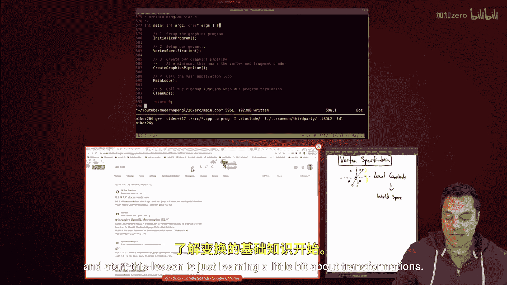

# 027：缩放矩阵 (glm::scale)

在本节课中，我们将要学习如何在OpenGL中使用缩放矩阵来改变物体的大小。我们将通过GLM库的`glm::scale`函数来实现这一操作。




上一节我们介绍了旋转矩阵，本节中我们来看看如何对物体进行缩放。

## 缩放矩阵基础

缩放是我们在顶点着色器中对每个顶点执行的特殊变换之一。我们通过一个矩阵乘法来改变每个顶点的坐标，从而放大或缩小整个物体。

缩放矩阵的结构如下：

```
| Sx  0   0   0 |
| 0   Sy  0   0 |
| 0   0   Sz  0 |
| 0   0   0   1 |
```

其中：
*   **Sx** 是沿X轴的缩放因子。
*   **Sy** 是沿Y轴的缩放因子。
*   **Sz** 是沿Z轴的缩放因子。

当这些因子为1时，矩阵是单位矩阵，物体大小不变。当因子大于1时，物体会放大；当因子在0到1之间时，物体会缩小。

## 在代码中实现缩放


缩放操作通常在我们的主渲染循环中，更新模型矩阵时进行。我们将使用GLM库提供的`glm::scale`函数。

以下是实现缩放的关键步骤：

1.  **包含头文件**：确保包含了GLM的头文件。
    ```cpp
    #include <glm/glm.hpp>
    #include <glm/gtc/matrix_transform.hpp>
    ```

2.  **定义缩放变量**：创建一个变量来控制缩放比例。
    ```cpp
    float g_uScale = 0.5f; // 缩放因子，0.5表示缩小一半
    ```

3.  **应用缩放变换**：在更新模型矩阵时，在平移和旋转之后应用缩放。
    ```cpp
    // 初始化模型矩阵为单位矩阵
    glm::mat4 model = glm::mat4(1.0f);
    // 先平移物体
    model = glm::translate(model, glm::vec3(0.0f, 0.0f, -2.0f));
    // 然后旋转物体
    model = glm::rotate(model, angle, glm::vec3(0.0f, 1.0f, 0.0f));
    // 最后缩放物体
    model = glm::scale(model, glm::vec3(g_uScale, g_uScale, g_uScale));
    ```

4.  **传递矩阵到着色器**：将最终计算出的模型矩阵通过uniform变量传递给顶点着色器。
    ```cpp
    glUniformMatrix4fv(u_model_matrix_location, 1, GL_FALSE, glm::value_ptr(model));
    ```

**注意变换顺序**：代码中先平移、再旋转、最后缩放的顺序很重要。这个顺序意味着缩放是在物体的局部坐标系中进行的。如果改变顺序，会得到不同的视觉效果。

## 运行效果

编译并运行程序后，你会看到物体的大小根据`g_uScale`的值发生了变化。例如，当`g_uScale`设置为0.5时，物体会缩小到原来的一半。


本节课中我们一起学习了OpenGL中的缩放变换。我们了解了缩放矩阵的构成，并通过GLM库的`glm::scale`函数在代码中实现了对物体的缩放操作。同时，我们再次强调了变换顺序的重要性。掌握了平移、旋转和缩放这三种基本变换，你就拥有了在3D空间中操纵物体的核心工具。