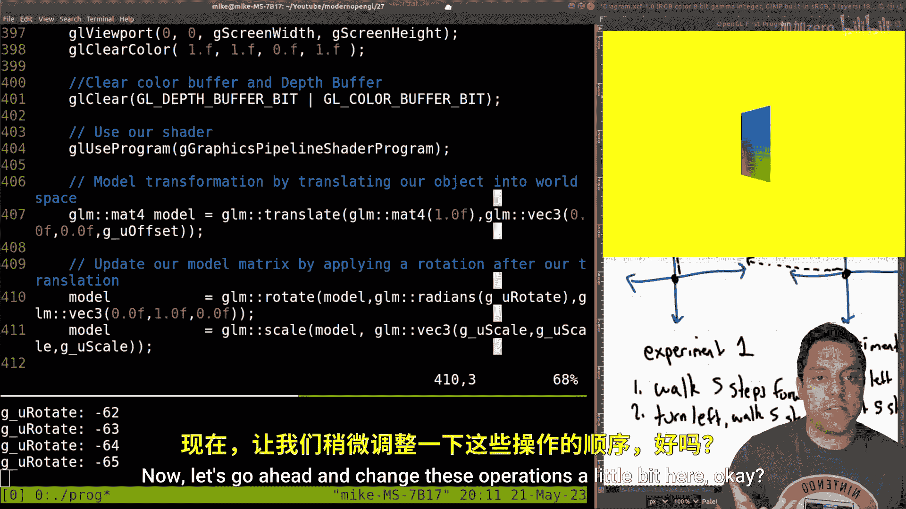
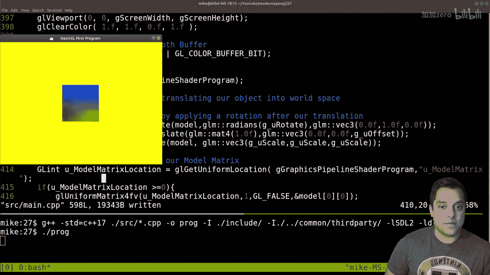
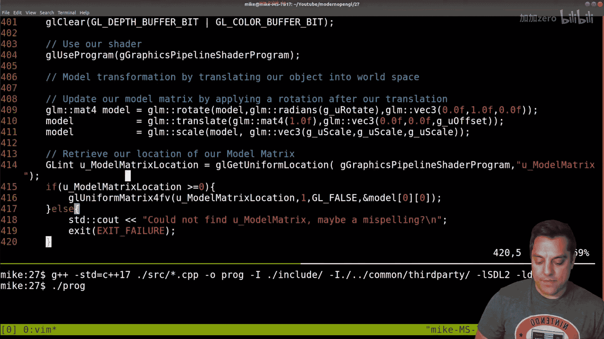
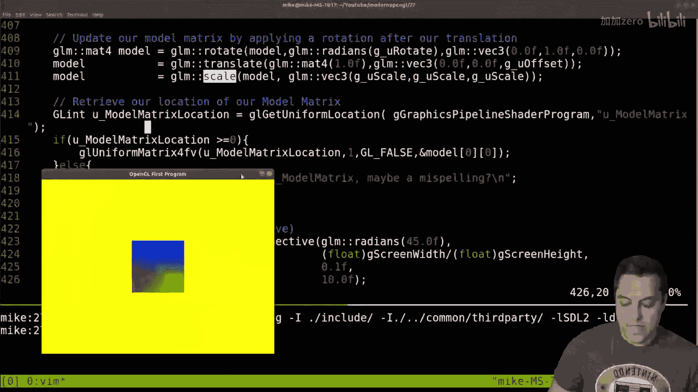
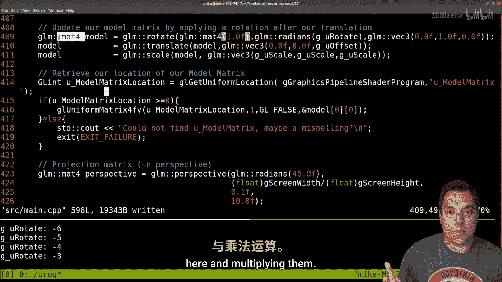

# 028：矩阵变换顺序的重要性


在本节课中，我们将要学习OpenGL中矩阵变换顺序的重要性。我们将通过一个简单的实验和代码演示来理解，为什么先旋转后平移与先平移后旋转会产生截然不同的结果。

## 概述

上一节我们介绍了基本的矩阵变换。本节中我们来看看这些变换的顺序如何影响最终结果。矩阵乘法不满足交换律，因此变换的顺序至关重要。

## 实验：顺序如何影响位置

为了直观理解，我们可以做一个简单的物理实验。以下是两个步骤相同但顺序不同的实验：

**实验一**
1.  向前走5步。
2.  向左转90度。
3.  再向前走5步。

执行后，你的最终位置是 `(-5, 5)`。

**实验二**
1.  向左转90度。
2.  向前走5步。
3.  再向前走5步。

执行后，你的最终位置是 `(-10, 0)`。


可以看到，尽管步骤相同，但顺序不同导致了完全不同的终点。这个原理同样适用于计算机图形学中的矩阵变换。

## 代码演示：变换顺序的影响



现在，让我们在OpenGL代码中观察这一现象。我们有一个基本的渲染管线，并在绘制前对模型应用一系列变换。

以下是初始的变换顺序（平移 -> 旋转 -> 缩放）：
```cpp
// 初始顺序：先平移，后旋转
glm::mat4 model = glm::mat4(1.0f); // 单位矩阵
model = glm::translate(model, glm::vec3(0.0f, 0.0f, -2.0f)); // 平移
model = glm::rotate(model, glm::radians(-65.0f), glm::vec3(0.0f, 1.0f, 0.0f)); // 旋转
model = glm::scale(model, glm::vec3(0.5f, 0.5f, 0.5f)); // 缩放
```
运行此代码，物体会以其自身轴心进行旋转。







接下来，我们交换平移和旋转的顺序：
```cpp
// 改变顺序：先旋转，后平移
glm::mat4 model = glm::mat4(1.0f); // 单位矩阵
model = glm::rotate(model, glm::radians(-65.0f), glm::vec3(0.0f, 1.0f, 0.0f)); // 旋转
model = glm::translate(model, glm::vec3(0.0f, 0.0f, -2.0f)); // 平移
model = glm::scale(model, glm::vec3(0.5f, 0.5f, 0.5f)); // 缩放
```
运行修改后的代码，物体会围绕世界坐标系原点进行“公转”，就像一个手臂末端被甩动一样，而不是绕自身中心“自转”。这清晰地展示了变换顺序带来的巨大差异。

## 理解原理：矩阵串联

理解变换顺序的另一种方式是将其视为矩阵的串联（乘法）。每个变换操作都对应一个4x4矩阵。

当我们按顺序应用变换时，实际上是在进行矩阵乘法。例如：
*   **顺序A（先平移T，后旋转R）**：最终变换矩阵是 `M = R * T`。
*   **顺序B（先旋转R，后平移T）**：最终变换矩阵是 `M = T * R`。

由于矩阵乘法不满足交换律（`A * B ≠ B * A`），因此 `R * T` 与 `T * R` 的结果不同。你可以将变换顺序想象成一个字符串，如“TRS”或“RTS”，不同的字符串代表不同的最终效果。

## 核心概念总结

记住以下核心公式，它代表了模型变换的典型串联顺序：
**最终模型矩阵 = 投影矩阵 * 视图矩阵 * 模型矩阵**

而模型矩阵本身又是多个变换的串联：
**模型矩阵 = 平移矩阵 * 旋转矩阵 * 缩放矩阵**
（注意：这是常见的“TRS”顺序，但根据需求顺序可以变化）

在代码中，这体现为连续的矩阵乘法：
```cpp
glm::mat4 modelMatrix = translationMatrix * rotationMatrix * scaleMatrix;
// 然后传入着色器：MVP = projection * view * modelMatrix;
```

## 实用技巧

对于初学者，以下方法有助于理解：
1.  **物理模拟**：像开头的实验一样，用身体或手势（例如，拳头作为物体，手臂作为平移）来模拟变换。
2.  **记住常见模式**：`平移(T) -> 旋转(R) -> 缩放(S)` 是让物体绕自身轴心变换的常见顺序。若想让它绕世界原点旋转（如行星），则使用 `旋转(R) -> 平移(T) -> 缩放(S)`。
3.  **从单位矩阵开始**：总是从一个单位矩阵开始构建你的模型矩阵。



## 总结


本节课中我们一起学习了OpenGL中矩阵变换顺序的核心重要性。我们通过一个行走实验直观理解了顺序不同导致结果不同，并在代码中演示了交换平移和旋转顺序如何让物体从“自转”变为“公转”。关键点在于矩阵乘法的不可交换性。理解变换顺序是掌握3D图形编程的基础，请务必动手实验以加深印象。