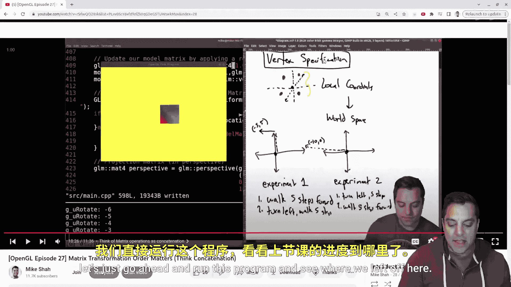
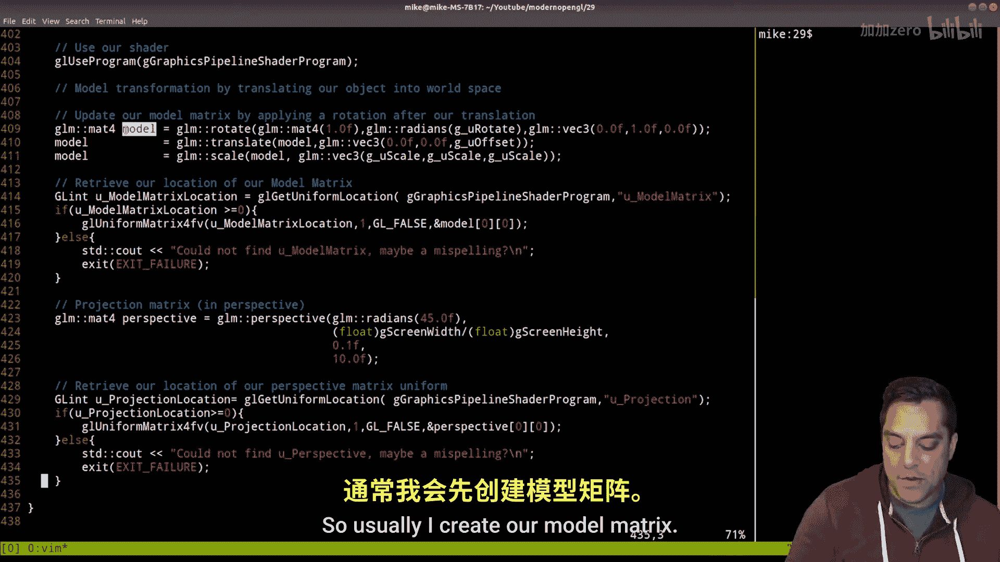

# 030：快速修复与回顾 🎬


在本节课中，我们将回顾上一节关于矩阵变换的内容，并修复一个在代码中常见的小错误。我们将通过运行现有程序来理解其工作原理，并简要介绍即将添加的相机（视图矩阵）概念。

## 代码回顾与程序结构



上一节我们介绍了矩阵变换及其顺序的重要性。现在，让我们回顾一下当前项目的整体结构。

我们的项目包含一个着色器程序（由顶点着色器和片段着色器组成）、主程序文件 `main.cpp`，以及用于管理绘制状态的顶点数组对象（VAO）。

以下是程序初始化的核心步骤：
1.  初始化SDL窗口库和OpenGL（通过GLAD）。
2.  设置顶点数据，包括位置和颜色。
3.  创建并绑定顶点数组对象（VAO）和顶点缓冲对象（VBO）。
4.  设置顶点属性指针，告知OpenGL如何解析顶点数据。

## 修复一个常见的绑定错误

在绘制循环中，我们通常不需要在每次绘制时重新绑定顶点缓冲对象（VBO）。绑定VAO后，它会自动管理其关联的VBO状态。

以下是需要删除的冗余代码行：
```cpp
// 在绘制函数中，以下这行是不必要的：
glBindBuffer(GL_ARRAY_BUFFER, gVbo);
```
删除此行后，程序功能保持不变，但代码更加简洁高效。

## 变换流程详解


现在，我们来详细看看物体是如何从本地坐标变换到世界坐标的。

这个过程通过模型矩阵（Model Matrix）实现。我们首先在本地空间定义一个四边形，然后通过模型矩阵对其进行平移、旋转或缩放，从而将其放置到世界空间中。




在代码中，我们这样应用模型矩阵：
```cpp
// 1. 创建模型矩阵（例如，进行缩放）
model = glm::scale(model, glm::vec3(g_uScale));
// 2. 将矩阵传递给着色器中的uniform变量
glUniformMatrix4fv(gModelMatrixLocation, 1, GL_FALSE, glm::value_ptr(model));
```

## 着色器中的矩阵应用

这些变换最终在顶点着色器中执行。顶点着色器负责计算每个顶点的最终位置。

在顶点着色器中，我们这样使用模型矩阵：
```glsl
// GLSL 顶点着色器代码
uniform mat4 model;
void main() {
    gl_Position = model * vec4(aPos, 1.0);
}
```
**重要提示**：确保着色器中的uniform变量名称与C++代码中查询的名称完全一致，并且该变量确实在着色器中被使用。否则，GLSL编译器可能会将其优化掉，导致获取位置失败。

## 展望：相机与视图矩阵

目前，我们只应用了模型矩阵将物体置于世界空间。为了获得真实的3D透视效果，我们还需要两个关键矩阵：
1.  **视图矩阵（View Matrix）**：模拟相机的位置和观察方向。
2.  **投影矩阵（Projection Matrix）**：模拟相机的镜头，将3D坐标投影到2D屏幕上，并产生“近大远小”的透视效果。

在接下来的课程中，我们将重点介绍如何创建和集成视图矩阵，让我们的场景能够通过“相机”进行观察。


本节课中，我们一起回顾了OpenGL程序的绘制流程和矩阵变换基础，并修正了一个关于VBO绑定的小错误。我们明确了模型矩阵的作用，并预览了为场景添加相机（视图矩阵）的下一步方向。理解这些基础是构建复杂3D图形的关键。