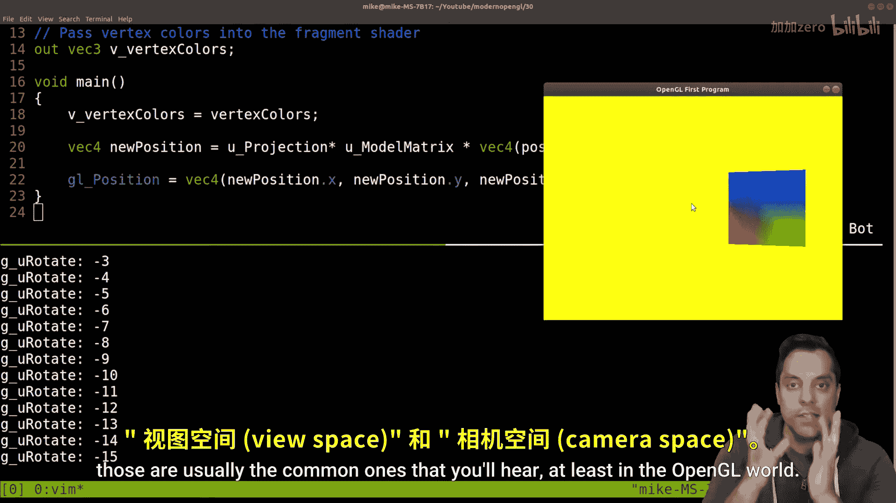

# 031：视图矩阵理论 🎥

在本节课中，我们将学习OpenGL中一个核心概念——视图矩阵。我们将探讨为什么需要它，它在图形渲染管线中的作用，以及如何使用GLM库的`lookAt`函数来构建它。理解视图矩阵是实现一个可移动“相机”的关键，它能让我们在3D场景中自由穿梭，而不是仅仅移动物体。

---

## 当前程序的演示与问题

上一节我们介绍了模型和投影变换。本节中，我们来看看当前程序的一个现象，并引出视图矩阵的必要性。

这是我们的项目。左侧是源代码，主函数和图形管线着色器都在这里。

当我运行这个程序，并按下前进或后退键时，物体似乎在靠近或远离我们。但请记住，我们实际上是在移动物体本身。顶点着色器负责变换顶点，代码如下：

```glsl
gl_Position = projection * model * vec4(aPos, 1.0);
```



我们通过模型矩阵（`model`）变换物体，再通过投影矩阵（`projection`）处理透视。当我旋转物体时，感觉就像在转动相机观察它。

然而，这并非真正的相机。我们只是在变换物体。如果我们希望像在游戏中一样，让观察者（相机）在场景中移动，观察静止的物体，就需要引入视图变换。

---

## 视图矩阵在管线中的位置

现在，让我们明确视图矩阵在整个渲染管线中的位置。

想象我们有一些顶点，它们最初位于**局部空间**。
我们应用**模型矩阵**，将其变换到**世界空间**。此时，物体可能已经过旋转和平移，不再位于世界原点。

接下来，我们将应用本节课的核心——**视图矩阵**。这相当于在场景中放置一个相机，并从相机的视角来观察世界。应用视图矩阵后，坐标就从世界空间转换到了**视图空间**（或称相机空间）。

**管线流程总结：**
**局部空间** -> (模型矩阵) -> **世界空间** -> (视图矩阵) -> **视图空间** -> (投影矩阵) -> **裁剪空间**

---

## 理解相机：位置、朝向与上方向

那么，如何定义这个“相机”呢？我们可以从现实世界的摄影来类比。

一个相机由三个关键属性定义：
1.  **位置**：相机在三维世界中的坐标点。
2.  **观察方向**：相机镜头对准的焦点或方向。
3.  **上方向**：相机顶部指向的方向。这通常被定义为世界空间中的“向上”向量（例如，正Y轴），但它会随着相机的倾斜而改变。

在航空领域，这类似于**俯仰**、**偏航**和**翻滚**。为了简化，GLM库提供了一个强大的工具来根据这三个属性构建视图矩阵。

---

## GLM的lookAt函数

以下是构建视图矩阵的核心工具。GLM库中的`glm::lookAt`函数可以为我们完成所有复杂的数学计算。

该函数需要三个参数来定义相机：
*   `eye`：相机在世界空间中的位置。
*   `center`：相机所观察的目标点。观察方向就是从`eye`指向`center`的向量。
*   `up`：世界空间中的“向上”向量（通常是`(0, 1, 0)`）。

函数原型如下：
```cpp
glm::mat4 viewMatrix = glm::lookAt(glm::vec3(eye),
                                    glm::vec3(center),
                                    glm::vec3(up));
```

这个函数会返回一个4x4的视图矩阵。当我们将这个矩阵乘以世界空间中的顶点坐标时，就能得到从相机视角看到的坐标。

---

## 上方向向量的重要性


为什么需要明确指定“上”方向？这确保了相机的正确朝向。

想象你的手机相机。当你水平握持时，“上”方向是屏幕的顶部。如果你把手机侧过来（竖屏拍摄），“上”方向就变成了手机的侧边。在3D图形中，即使相机倾斜了（例如飞机爬升时），我们仍然需要知道“哪个方向是上”，以便正确计算围绕自身轴（如偏航）的旋转。

`lookAt`函数内部会利用`up`向量，结合`eye`和`center`计算出的前向向量，通过叉乘运算生成一个相互垂直的右向量和上向量，从而构建出完整的、正交的相机坐标系矩阵。

---

## 总结与练习

本节课中我们一起学习了视图矩阵的理论基础。我们了解到，视图矩阵将顶点从世界空间转换到以相机为原点的视图空间，是实现3D相机控制的核心。GLM库的`lookAt`函数通过指定相机位置、观察点和上方向，简化了这一矩阵的构建过程。

作为练习，我强烈建议你尝试在不依赖`glm::lookAt`的情况下，手动推导并编写自己的视图矩阵生成函数。思考如何通过`eye`、`center`和`up`这三个向量，计算出相机的**前向**、**右向**和**实际上向**向量，并将它们组合成一个4x4变换矩阵。这个过程能极大地加深你对3D变换和坐标系的理解。

在下一节中，我们将把理论付诸实践，在代码中集成视图矩阵，实现一个真正的可移动相机。