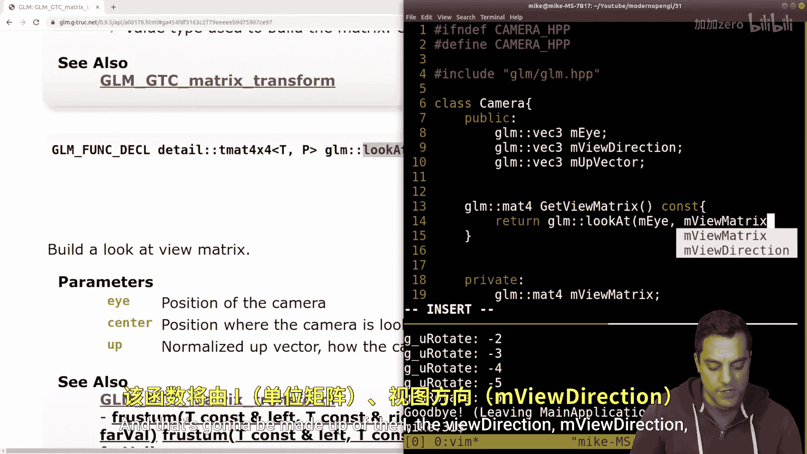
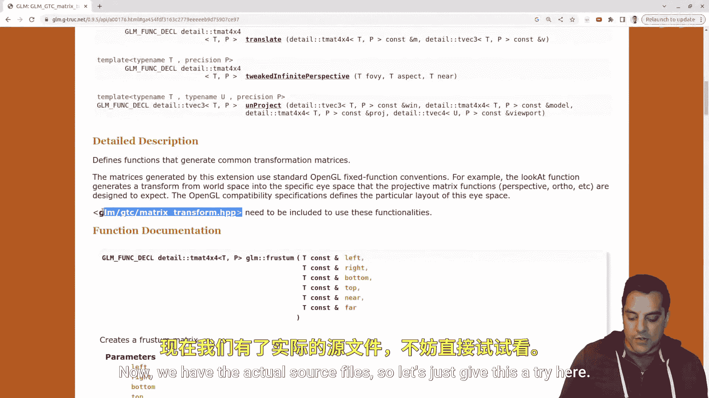
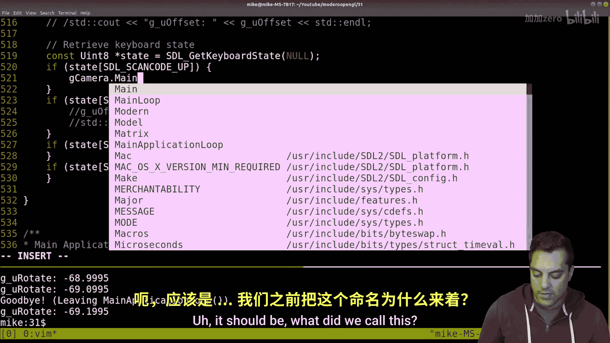

# 032：使用glm::lookat构建视图矩阵（并移动摄像机）

## 概述
在本节课中，我们将继续学习现代OpenGL系列。我们将从上一节课结束的地方开始，着手在代码中构建一个实际的摄像机。我们将利用GLM库中的 `glm::lookat` 函数来构建摄像机矩阵，并开始对代码进行一些抽象和重构，以便更好地管理场景中的组件。


## 回顾：视图矩阵与摄像机
在上一节中，我们介绍了视图矩阵的概念，它负责将世界坐标系中的顶点转换到摄像机坐标系。本节中，我们将看看如何具体实现一个摄像机类来生成这个矩阵。

视图矩阵的核心是确定三个向量：摄像机位置（eye）、观察目标（center）和世界空间的上方向（up）。`glm::lookat` 函数正是利用这三个参数来构建矩阵的。其基本形式如下：
```cpp
glm::mat4 viewMatrix = glm::lookAt(eye, center, up);
```

## 创建摄像机类
为了封装摄像机功能，我们需要创建一个独立的类。以下是创建摄像机类的步骤。



首先，我们创建头文件 `camera.hpp`，定义摄像机类的基本结构。

```cpp
// camera.hpp
#include <glm/glm.hpp>
#include <glm/gtc/matrix_transform.hpp> // 包含 lookAt 函数

class Camera {
public:
    // 构造函数，设置默认值
    Camera();

    // 获取视图矩阵
    glm::mat4 getViewMatrix() const;

    // 移动摄像机的基本函数
    void moveForward(float speed);
    void moveBackward(float speed);
    void moveLeft(float speed);
    void moveRight(float speed);

private:
    glm::vec3 m_eye;         // 摄像机位置
    glm::vec3 m_viewDirection; // 观察方向（指向目标）
    glm::vec3 m_upVector;    // 世界空间的上方向
};
```




接下来，我们实现源文件 `camera.cpp`，为这些函数提供具体实现。

```cpp
// camera.cpp
#include "camera.hpp"

// 默认构造函数
Camera::Camera() {
    m_eye = glm::vec3(0.0f, 0.0f, 0.0f); // 初始位置在原点
    m_upVector = glm::vec3(0.0f, 1.0f, 0.0f); // 假设Y轴向上
    m_viewDirection = glm::vec3(0.0f, 0.0f, -1.0f); // 初始看向负Z轴
}

// 获取视图矩阵
glm::mat4 Camera::getViewMatrix() const {
    // 计算观察目标：当前位置 + 观察方向
    glm::vec3 center = m_eye + m_viewDirection;
    return glm::lookAt(m_eye, center, m_upVector);
}

// 向前移动（沿观察方向）
void Camera::moveForward(float speed) {
    m_eye += m_viewDirection * speed;
}

// 向后移动
void Camera::moveBackward(float speed) {
    m_eye -= m_viewDirection * speed;
}

// 向左移动（需要计算右向量）
void Camera::moveLeft(float speed) {
    glm::vec3 right = glm::normalize(glm::cross(m_viewDirection, m_upVector));
    m_eye -= right * speed;
}

// 向右移动
void Camera::moveRight(float speed) {
    glm::vec3 right = glm::normalize(glm::cross(m_viewDirection, m_upVector));
    m_eye += right * speed;
}
```

## 在场景中使用摄像机
创建好摄像机类后，我们需要将其集成到主渲染循环中。这涉及更新着色器uniform变量和处理用户输入。

首先，在主程序中包含摄像机头文件并创建一个全局摄像机实例。

```cpp
// main.cpp
#include "camera.hpp"
// ... 其他包含

Camera g_camera; // 全局摄像机实例
```

接着，在绘制前（`preDraw` 函数中），我们需要获取摄像机的视图矩阵，并将其传递给着色器。

```cpp
// 在绘制前更新uniform
void preDraw() {
    // ... 其他矩阵计算（如模型、投影矩阵）

    // 获取摄像机的视图矩阵
    glm::mat4 viewMatrix = g_camera.getViewMatrix();

    // 找到着色器中视图矩阵uniform的位置并设置其值
    GLint viewMatrixLocation = glGetUniformLocation(shaderProgram, "viewMatrix");
    if (viewMatrixLocation >= 0) {
        glUniformMatrix4fv(viewMatrixLocation, 1, GL_FALSE, &viewMatrix[0][0]);
    } else {
        std::cerr << "Could not find uniform: viewMatrix" << std::endl;
    }
}
```

然后，我们需要更新顶点着色器，将视图矩阵纳入顶点变换管线。顶点变换的顺序是：局部坐标 -> 模型矩阵 -> 世界坐标 -> 视图矩阵 -> 摄像机坐标 -> 投影矩阵 -> 裁剪坐标。

```glsl
// vertex_shader.glsl
#version 330 core



layout (location = 0) in vec3 position;

uniform mat4 modelMatrix;
uniform mat4 viewMatrix;
uniform mat4 projectionMatrix;

void main() {
    // 正确的乘法顺序：投影 * 视图 * 模型 * 顶点
    gl_Position = projectionMatrix * viewMatrix * modelMatrix * vec4(position, 1.0);
}
```

## 处理用户输入以移动摄像机
最后，我们需要将键盘输入映射到摄像机的移动函数上。以下是处理箭头键输入的基本逻辑。

```cpp
// 在主循环或事件处理函数中
void handleInput() {
    // 假设有方法获取按键状态，这里使用伪代码
    float moveSpeed = 0.1f;

    if (isKeyPressed(GLFW_KEY_UP)) {
        g_camera.moveForward(moveSpeed);
    }
    if (isKeyPressed(GLFW_KEY_DOWN)) {
        g_camera.moveBackward(moveSpeed);
    }
    if (isKeyPressed(GLFW_KEY_LEFT)) {
        g_camera.moveLeft(moveSpeed);
    }
    if (isKeyPressed(GLFW_KEY_RIGHT)) {
        g_camera.moveRight(moveSpeed);
    }
}
```

## 当前实现的局限性
通过以上步骤，我们实现了一个可以前后左右移动的基础摄像机。然而，这个实现存在一些局限性。


*   **移动方向固定**：目前的 `moveForward` 和 `moveBackward` 是沿着初始的观察方向（负Z轴）移动，而不是根据摄像机当前的朝向。这更像是一个2D的“缩放”效果，而非第一人称的移动。
*   **缺少旋转**：摄像机无法左右看（偏航，yaw）或上下看（俯仰，pitch）。要实现第一人称视角，需要根据鼠标或键盘输入来更新 `m_viewDirection` 向量。
*   **未使用增量时间**：移动速度 `moveSpeed` 是固定的，帧率变化会导致移动速度不一致。最佳实践是乘以帧间时间差（delta time）。

## 总结
本节课中我们一起学习了如何使用 `glm::lookat` 函数构建视图矩阵，并创建了一个基础的摄像机类。我们实现了摄像机的前后左右移动，并将其集成到了渲染管线中。虽然当前的摄像机还比较简单，但它为场景提供了动态的观察视角，是构建交互式3D应用的重要一步。


在下一节课中，我们将探讨如何完善这个摄像机，实现基于鼠标的第一人称视角旋转，让移动方向与摄像机朝向真正关联起来。