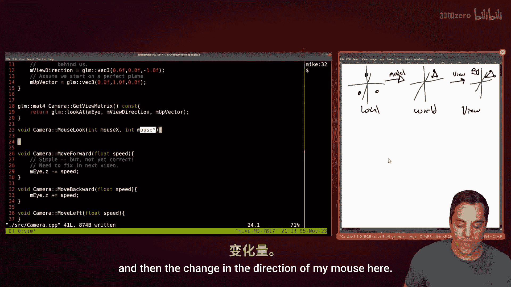
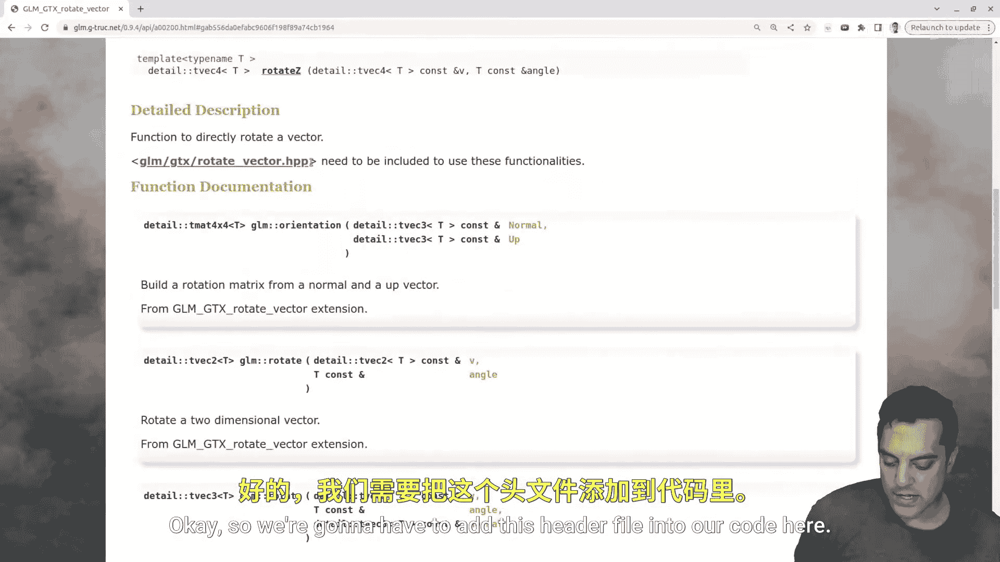
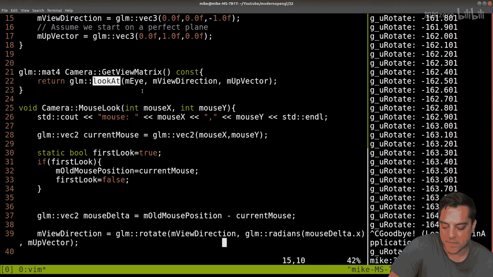
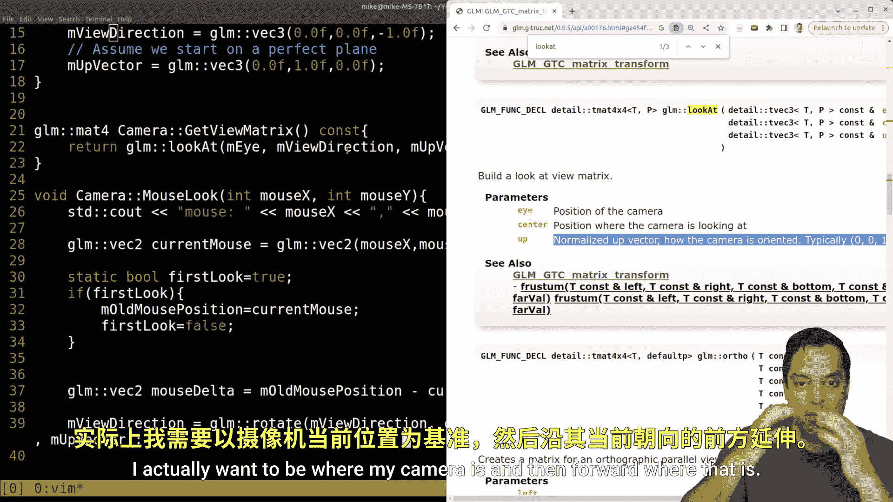

# 033：第一人称鼠标视角相机 🎮

在本节课中，我们将继续完善我们的相机系统，实现一个第一人称视角的鼠标观察功能。我们将学习如何通过鼠标移动来旋转相机的观察方向，并修正上一节中相机移动的逻辑，使其能根据观察方向正确前进后退。

---

## 课程回顾

上一节我们介绍了相机的基本抽象，并实现了通过键盘按键（如上下箭头或WASD）来前后左右移动相机位置。我们创建了一个`Camera`类，它使用`glm::lookAt`函数来生成视图矩阵，该矩阵定义了从“眼睛”位置观察场景的视角。

然而，之前的移动逻辑仅简单地更新了相机位置的Z坐标，这并不符合第一人称相机的直觉。当我们转动视角后，前进的方向应该是我们“看”的方向，而不仅仅是世界坐标的Z轴负方向。本节我们将解决这个问题。

---

## 实现鼠标观察功能

为了实现用鼠标控制视角旋转，我们需要做以下几件事：
1.  捕获SDL中的鼠标移动事件。
2.  计算鼠标在相邻两帧之间的移动差值（Delta）。
3.  根据这个差值来旋转相机的`viewDirection`向量。




以下是具体步骤：

### 1. 在Camera类中添加鼠标观察函数

首先，我们需要在`Camera`类的头文件和源文件中声明并定义`MouseLook`函数。

**代码示例：在 `Camera.h` 中添加**
```cpp
class Camera {
public:
    // ... 其他现有函数 ...
    void MouseLook(int mouseX, int mouseY);
private:
    // ... 其他现有成员变量 ...
    glm::vec2 mOldMousePosition; // 用于存储上一帧的鼠标位置
    bool mFirstMouseLook = true; // 首次调用的标志
};
```

**代码示例：在 `Camera.cpp` 中实现**
```cpp
#include <glm/gtx/rotate_vector.hpp> // 用于旋转向量

void Camera::MouseLook(int mouseX, int mouseY) {
    // 将当前鼠标位置转换为vec2
    glm::vec2 newMousePosition(mouseX, mouseY);

    // 如果是第一次调用，只记录位置，不进行旋转
    if(mFirstMouseLook) {
        mOldMousePosition = newMousePosition;
        mFirstMouseLook = false;
        return;
    }

    // 计算鼠标位置的差值（Delta）
    glm::vec2 mouseDelta = newMousePosition - mOldMousePosition;

    // 根据X方向的差值，绕Y轴（上向量）旋转观察方向
    // 将像素差值转换为弧度。这里的0.01f是一个灵敏度系数，可以调整。
    float rotateAngle = mouseDelta.x * 0.01f;

    // 使用GLM的rotate函数旋转viewDirection向量
    // 参数：待旋转的向量，旋转弧度，旋转所绕的轴（这里是世界空间的上向量Y轴）
    mViewDirection = glm::rotate(mViewDirection, rotateAngle, glm::vec3(0.0f, 1.0f, 0.0f));

    // 更新旧鼠标位置，为下一帧做准备
    mOldMousePosition = newMousePosition;
}
```

### 2. 在SDL中捕获并处理鼠标事件


接下来，我们需要在主循环的输入处理部分捕获鼠标移动事件，并调用相机的`MouseLook`函数。

**代码示例：在主程序输入处理部分**
```cpp
// 在程序初始化部分（主循环之前），将鼠标锁定到窗口中心并隐藏
SDL_WarpMouseInWindow(gGraphicsApplicationWindow, SCREEN_WIDTH / 2, SCREEN_HEIGHT / 2);
SDL_SetRelativeMouseMode(SDL_TRUE);



// 在主循环的事件处理部分
while(SDL_PollEvent(&event)) {
    if(event.type == SDL_MOUSEMOTION) {
        // 获取鼠标的相对移动量
        int mouseX = event.motion.xrel;
        int mouseY = event.motion.yrel;
        // 调用相机的鼠标观察函数
        gCamera.MouseLook(mouseX, mouseY);
    }
    // ... 处理键盘等其他事件 ...
}
```

### 3. 修正基于观察方向的移动逻辑

上一节中，`MoveForward`和`MoveBackward`函数只是简单地修改了相机位置的Z分量。现在我们需要根据动态变化的`mViewDirection`来移动。

**代码示例：修正后的相机移动函数**
```cpp
void Camera::MoveForward(float speed) {
    // 沿着观察方向向前移动
    mEyePosition += mViewDirection * speed;
}

void Camera::MoveBackward(float speed) {
    // 沿着观察方向的反方向向后移动
    mEyePosition -= mViewDirection * speed;
}
```

同时，我们需要更新`GetViewMatrix`函数中的`lookAt`调用，确保“观察目标点”是“眼睛位置”加上“观察方向”。

**代码示例：更新视图矩阵计算**
```cpp
glm::mat4 Camera::GetViewMatrix() const {
    // 观察目标点是眼睛位置加上观察方向
    return glm::lookAt(mEyePosition, mEyePosition + mViewDirection, mUpVector);
}
```

---

## 核心概念与公式

本节涉及的核心变换是**向量旋转**。我们使用以下公式（由GLM库实现）来根据鼠标输入旋转观察方向向量：

**向量旋转公式（绕任意轴）**
对于一个向量 **v**，绕单位轴 **k** 旋转角度 **θ**，其旋转后的向量 **v'** 可以通过罗德里格斯旋转公式计算：
**v' = v cosθ + (k × v) sinθ + k (k · v)(1 - cosθ)**

在我们的代码中，这被简化为一次函数调用：
```cpp
mViewDirection = glm::rotate(mViewDirection, angleInRadians, axisOfRotation);
```

---




## 总结与挑战



本节课中，我们一起学习了如何构建一个第一人称鼠标观察相机。我们实现了：
1.  **鼠标视角控制**：通过捕获鼠标移动差值，旋转相机的观察方向。
2.  **正确的方向性移动**：使相机的前后移动基于当前的观察方向，而非固定的坐标轴。
3.  **视图矩阵的持续更新**：确保`lookAt`矩阵使用最新的眼睛位置和观察方向。

你现在拥有了一个可以环顾四周并朝看的方向移动的基础第一人称相机。

**给你的挑战：**
1.  **实现左右平移（Strafe）**：尝试实现`MoveLeft`和`MoveRight`函数。提示：你需要计算与观察方向和世界向上向量都垂直的“右向量”（Right Vector），可以使用叉积 `glm::cross(mViewDirection, mUpVector)` 来获得。
2.  **实现上下俯仰（Pitch）**：修改`MouseLook`函数，使其也能根据鼠标Y移动来绕“右向量”旋转观察方向，实现抬头和低头。注意需要限制俯仰角度，避免万向节死锁或视角翻转。
3.  **改进鼠标控制**：尝试不同的鼠标灵敏度设置，或者实现鼠标光标隐藏与锁定，以获得更流畅的体验。


通过完成这些挑战，你将能完全掌控你的3D相机，为制作漫步场景或第一人称游戏打下坚实基础。继续实验，享受编程的乐趣！