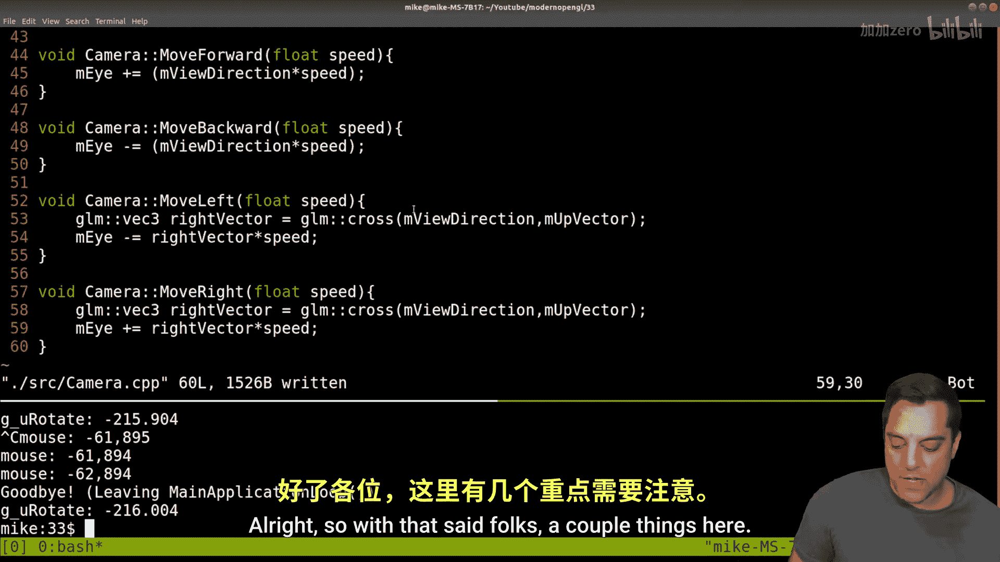

# 034：第一人称摄像机的左右移动 🎮

在本节课中，我们将完成第一人称摄像机的实现，重点学习如何实现摄像机的左右平移。我们将运用之前讨论过的数学概念，如叉乘，来计算正确的移动方向向量。这个构建新矩阵（例如通过 `lookAt` 函数构建视图矩阵）的思想，在计算机图形学的其他领域也非常有用。

---

上一节我们实现了通过鼠标控制视角旋转以及前后移动。本节中，我们来看看如何实现摄像机的左右平移。

如果只是简单地更新摄像机位置（`eye position`）的X坐标，会导致移动方向不符合当前的视角方向。例如，当你面朝前方时按右键，你希望向右平移；但当你旋转视角后，再按右键，你仍然希望沿着你“右侧”的方向移动，而不是世界坐标的X轴正方向。

因此，我们需要计算一个“右向量”（`right vector`），它始终指向摄像机自身的右侧。然后，沿着这个向量的方向更新摄像机位置，即可实现正确的左右平移。

那么，如何计算这个“右向量”呢？我们已知两个向量：摄像机的“前向向量”（`view direction`）和世界的“上向量”（`up vector`，通常是 `(0, 1, 0)`）。根据右手坐标系规则，对这两个向量进行叉乘运算，就可以得到垂直于它们的新向量，即“右向量”。

计算公式如下（使用GLM数学库）：
```cpp
glm::vec3 right = glm::cross(viewDirection, upVector);
```
**注意叉乘的顺序**：`glm::cross(a, b)` 的结果向量垂直于a和b构成的平面，方向遵循右手定则（四指从a弯向b，拇指方向即为结果方向）。为了得到正确的“右向量”，我们通常使用 `glm::cross(viewDirection, upVector)`。

以下是实现左右移动的关键步骤：

1.  **计算右向量**：在每一帧，根据当前视角方向（`viewDirection`）和世界向上向量（`up`）计算右向量。
2.  **更新摄像机位置**：
    *   按下“右移”键时，摄像机位置 `eye` 加上 `rightVector * movementSpeed`。
    *   按下“左移”键时，摄像机位置 `eye` 减去 `rightVector * movementSpeed`。
3.  **重建视图矩阵**：更新 `eye` 位置后，使用 `glm::lookAt(eye, eye + viewDirection, up)` 重新计算视图矩阵。

通过这种方式，无论摄像机朝向何方，左右移动键都能让摄像机沿着其自身的左右方向平滑平移，从而实现了完整的第一人称移动控制（前、后、左、右、视角旋转）。

---

本节课中我们一起学习了如何为第一人称摄像机实现左右平移功能。核心在于利用叉乘计算基于当前视角的“右向量”，并沿此向量移动摄像机。至此，我们已构建了一个具备基础自由移动和视角控制功能的摄像机系统。




你可以尝试进一步的挑战，例如：
*   将移动键映射为常见的WASD控制模式。
*   增加摄像机的升降功能（例如使用空格键上升）。
*   实现视角的上下倾斜（俯仰角），完成全自由度的视角控制。


希望你能从中获得乐趣，并继续探索计算机图形的精彩世界。我们下节课再见！