# 035：GL_FLOAT枚举与GLfloat类型错误修复


在本节课中，我们将对代码进行一些修正和改进，主要涉及修复一个关于OpenGL数据类型使用的细微错误，并添加一个通过键盘退出程序的功能。这些改动旨在提升代码质量，为后续添加更多功能做好准备。

上一节我们介绍了OpenGL渲染管线的基本流程，本节中我们来看看如何修正代码中的一些潜在问题。

## 修正数据类型错误


在查看顶点规范设置代码时，我发现了一个细微的错误。一些OpenGL函数调用中，我错误地使用了`GL_FLOAT`枚举，而实际上应该使用`GLfloat`类型。

以下是需要修正的核心代码部分：

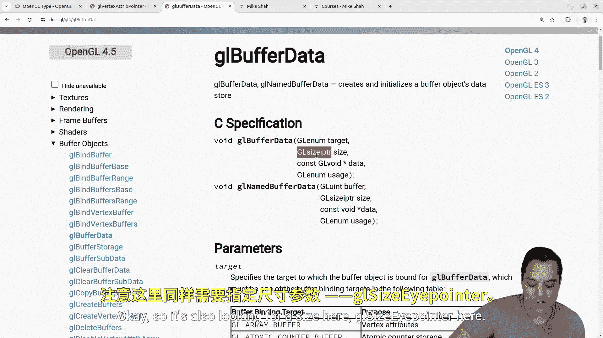

```cpp
// 错误示例：使用了GL_FLOAT枚举（一个整数值）来指定数据类型大小
glBufferData(GL_ARRAY_BUFFER, sizeof(vertices), vertices.data(), GL_STATIC_DRAW);
glVertexAttribPointer(0, 3, GL_FLOAT, GL_FALSE, 3 * sizeof(GL_FLOAT), (void*)0);
```

`GL_FLOAT`是一个枚举常量，其值通常为整数（例如0x1406），它用于在函数参数中指定数据类型。而`GLfloat`是一个类型别名，它保证了在目标平台上是一个32位的浮点数（通常是4字节）。在需要传递类型大小或进行指针运算时，应使用`GLfloat`。

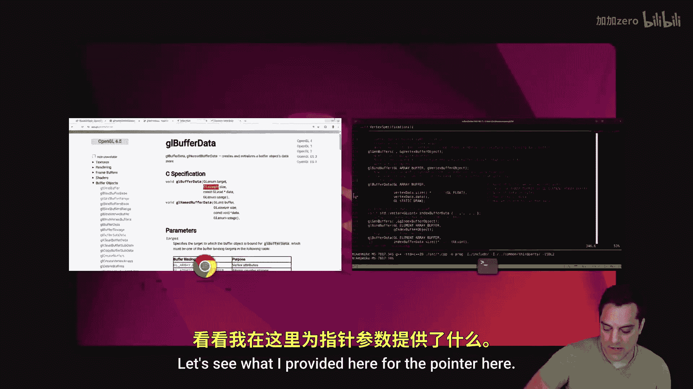


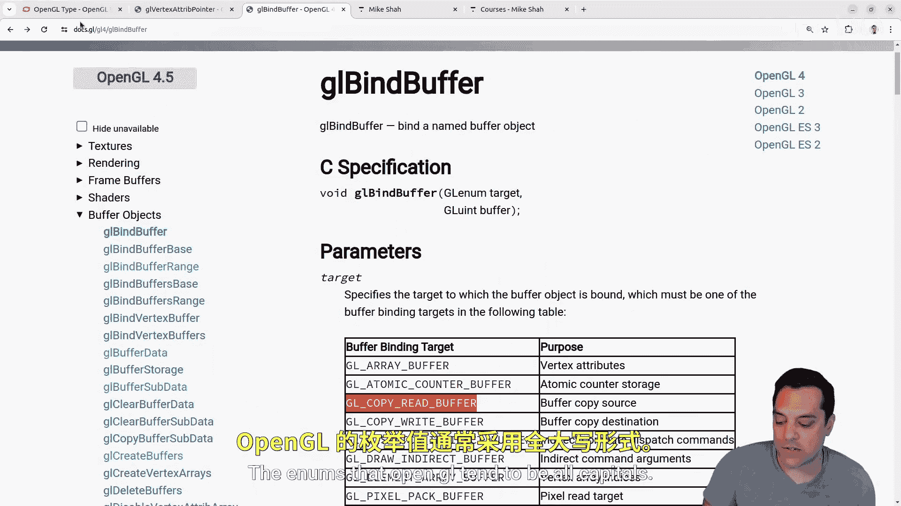


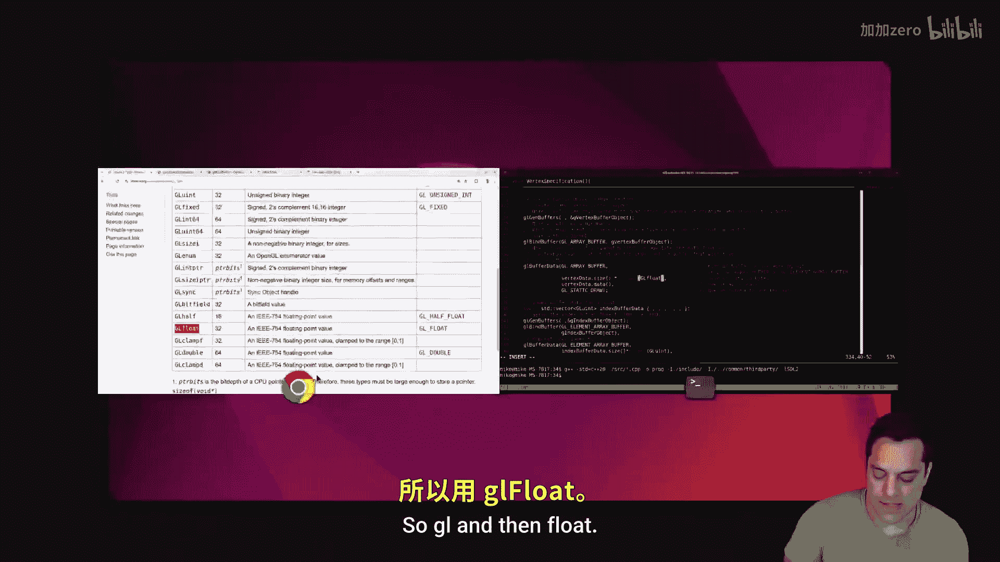

为了更清晰地理解，以下是OpenGL中类型与枚举的区分：

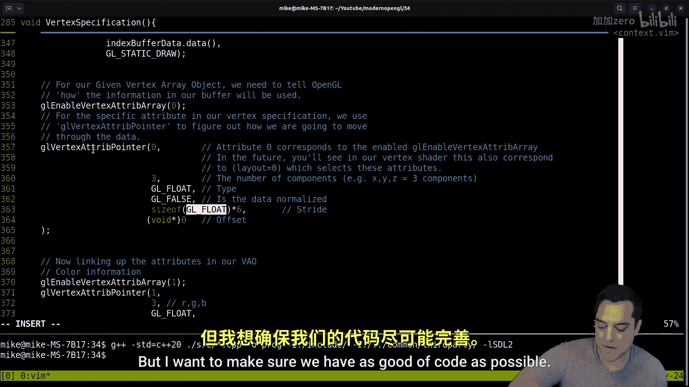

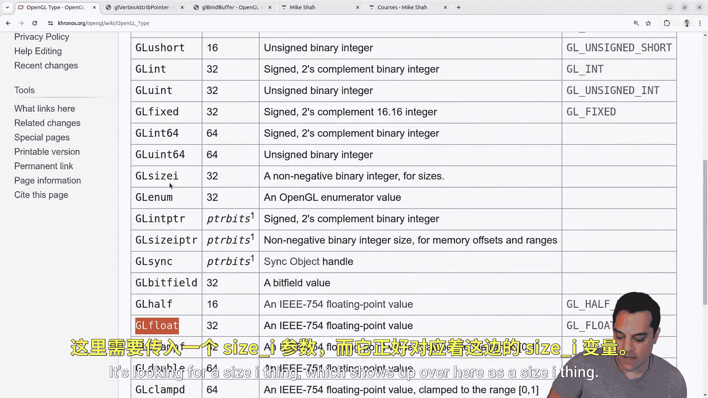

*   **枚举（Enum）**：通常全大写（如`GL_FLOAT`, `GL_STATIC_DRAW`），用于指定函数参数选项。
*   **类型（Type）**：混合大小写（如`GLfloat`, `GLsizei`），用于变量声明、`sizeof`运算和指针偏移计算。

因此，正确的用法应该是：

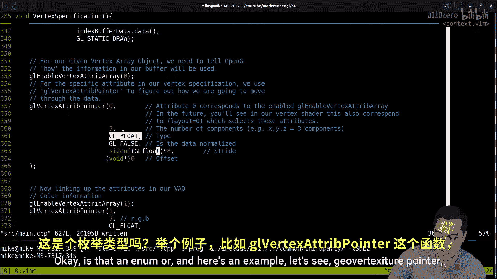


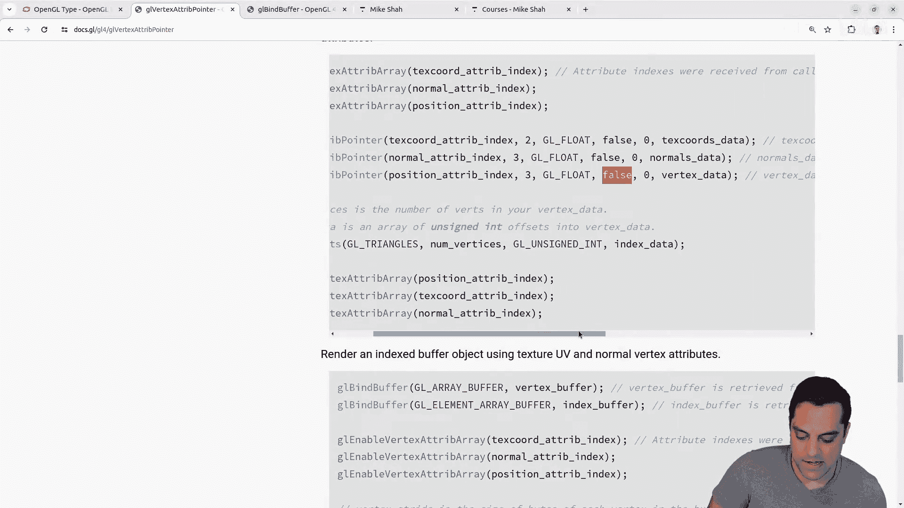

```cpp
// 正确示例：使用GLfloat类型来计算大小和偏移
glBufferData(GL_ARRAY_BUFFER, vertices.size() * sizeof(GLfloat), vertices.data(), GL_STATIC_DRAW);
glVertexAttribPointer(0, 3, GL_FLOAT, GL_FALSE, 3 * sizeof(GLfloat), (void*)0);
```

虽然在某些架构上`GL_FLOAT`的整数值可能恰好等于4（`sizeof(float)`），但这并非保证。使用`GLfloat`可以确保代码在不同平台上的可移植性。

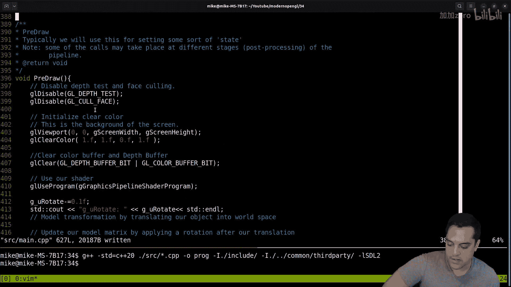

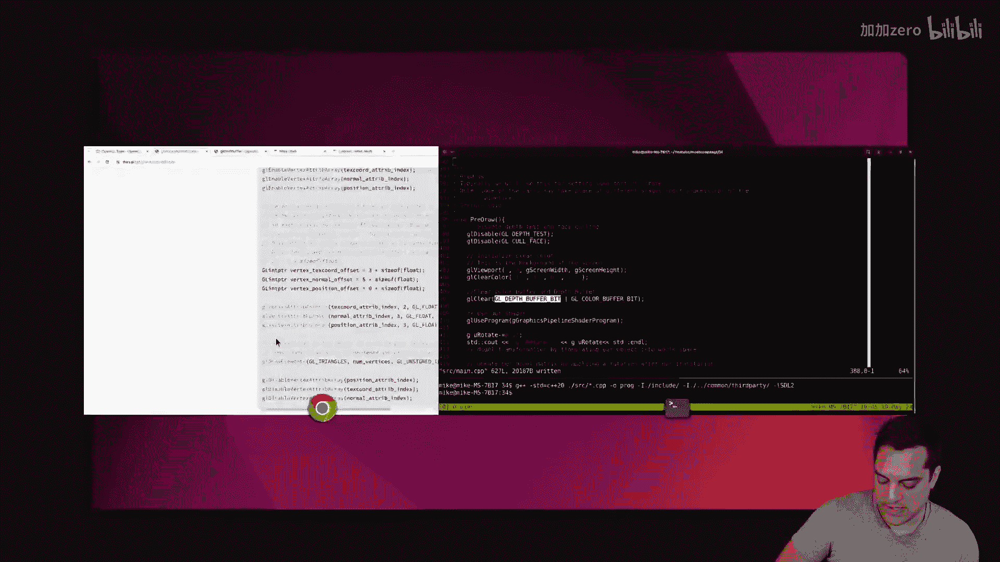

## 查找并修正其他类似错误

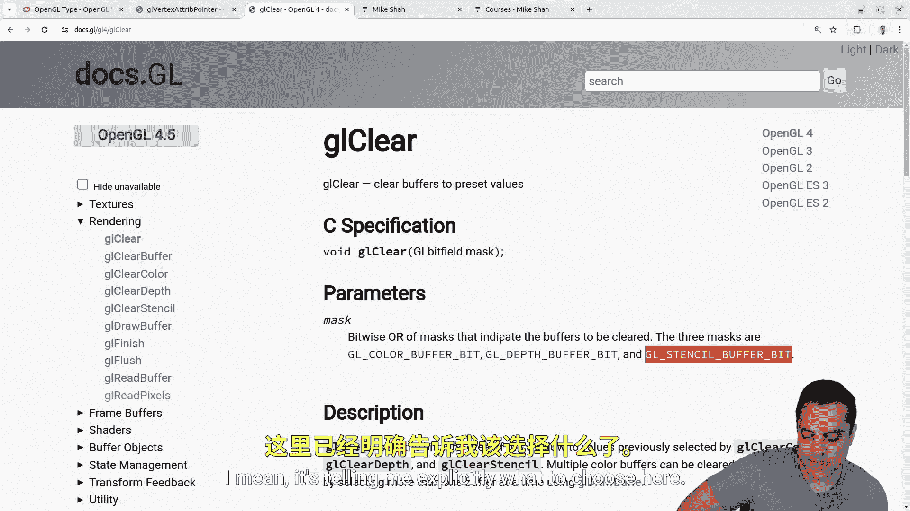

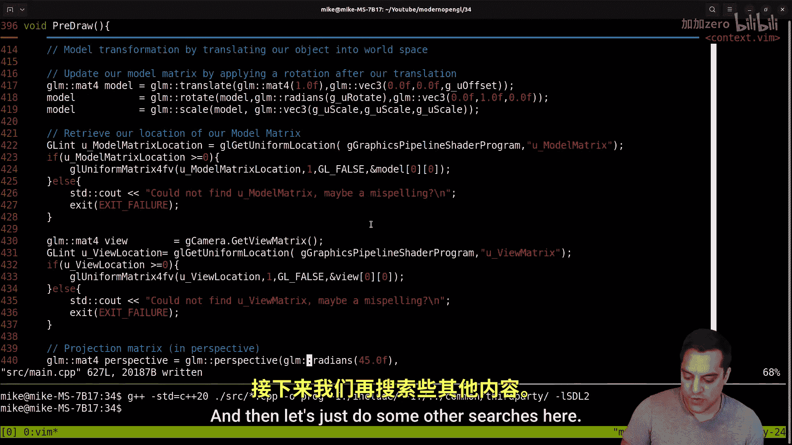


我们需要在整个代码库中搜索并修正类似的错误。以下是需要检查的其他常见函数：

*   `glUniformMatrix4fv`：其`transpose`参数应使用`GLboolean`类型（或直接使用`GL_FALSE`枚举），但确保类型匹配。
*   指针偏移计算：在任何需要计算字节偏移的地方，都应使用`sizeof(GLfloat)`、`sizeof(GLuint)`等类型大小，而不是枚举值。

通过仔细审查代码并参考OpenGL官方文档，我们可以确保所有数据类型的使用都是准确和一致的。


## 添加程序退出功能


除了修正数据类型，我们还将添加一个实用的功能：通过按下`ESC`键来退出程序。这提升了程序的交互性。

以下是实现该功能的步骤：


1.  在程序全局状态中，定义一个控制主循环的布尔变量（例如`gQuit`）。
2.  在主循环中，使用SDL库的函数（如`SDL_GetKeyboardState`）检测键盘状态。
3.  检查`ESC`键（扫描码`SDL_SCANCODE_ESCAPE`）是否被按下。
4.  如果按下，则将`gQuit`变量设置为`true`，从而退出主渲染循环。

核心代码逻辑如下：


```cpp
// 全局变量
bool gQuit = false;

// 在主循环中
while (!gQuit) {
    // ... 处理其他事件 ...

    // 检查键盘状态
    const Uint8* state = SDL_GetKeyboardState(NULL);
    if (state[SDL_SCANCODE_ESCAPE]) {
        gQuit = true; // 按下ESC，设置退出标志
    }

    // ... 渲染代码 ...
}
```

添加此功能后，用户可以通过按下键盘上的`ESC`键来优雅地关闭应用程序窗口。

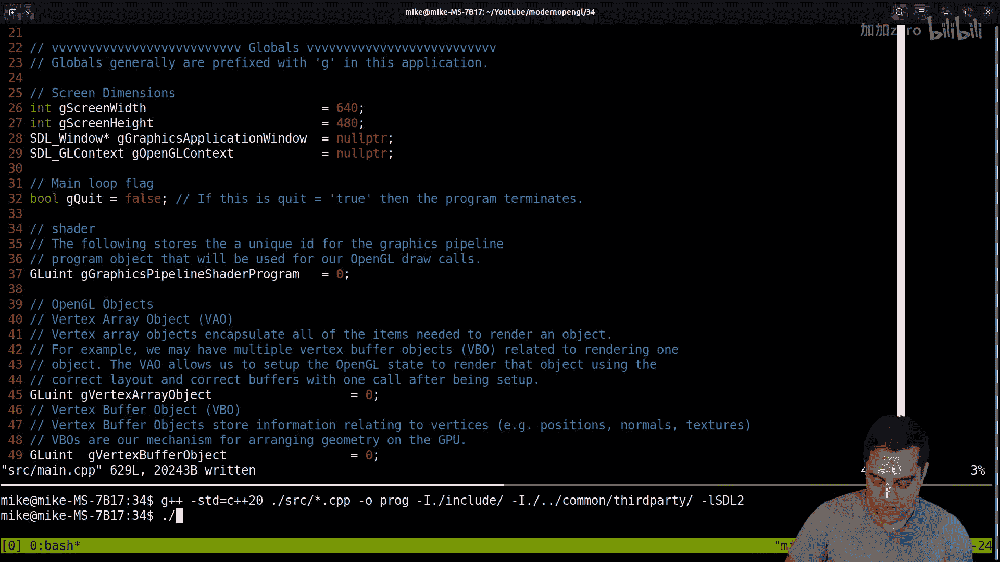

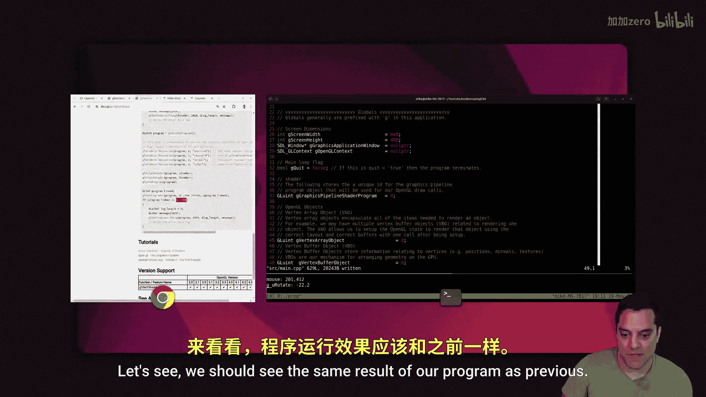

## 测试修正结果

完成上述修正和添加功能后，编译并运行程序。你应该看到与之前相同的渲染输出（旋转的几何图形）。现在，尝试按下`ESC`键，程序应该会立即退出。这验证了我们的代码修正没有引入新的错误，并且新功能工作正常。


本节课中我们一起学习了两个重要的内容：一是如何正确区分和使用OpenGL中的数据类型（`GLfloat`）与枚举常量（`GL_FLOAT`），以确保代码的精确性和跨平台兼容性；二是如何通过SDL库实现一个简单的键盘交互功能来退出程序。这些看似微小的改进，对于构建健壮、可维护的图形应用程序至关重要。