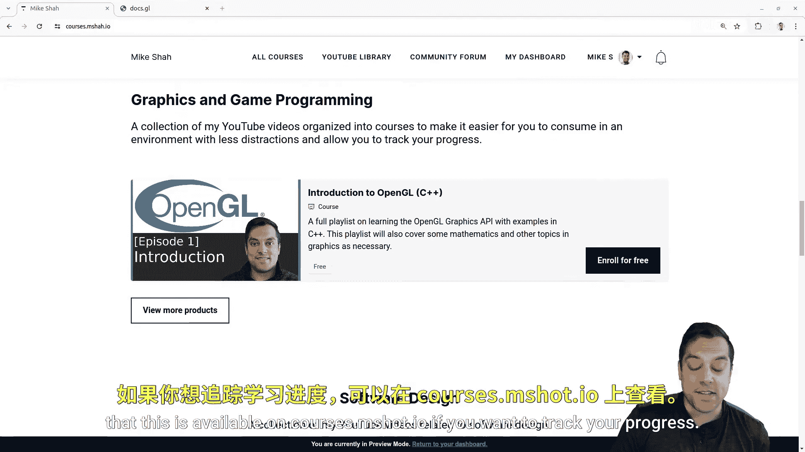

# 036：应用启动与网格抽象重构 🎮


在本节课中，我们将学习如何重构我们的OpenGL应用程序代码，使其更加模块化和可扩展。核心目标是抽象出应用状态和网格数据，为后续添加多个3D对象到场景中打下基础。我们将通过将全局变量封装到结构体中，并创建独立的网格数据结构来实现这一目标。



---

## 概述 📋

目前，我们的代码将所有状态（如窗口尺寸、着色器程序、网格数据）都存储为全局变量。虽然这很简单，但随着程序变得复杂，管理这些变量会变得困难。本节课，我们将把这些变量组织到两个主要的结构中：一个用于管理应用程序的整体状态（`App`），另一个用于管理单个3D网格的数据（`Mesh3D`）。这样做的目的是为了能够轻松地创建和管理多个对象。

## 代码重构：创建应用与网格结构 🏗️

上一节我们介绍了重构的目标，本节中我们来看看具体的实现步骤。我们将创建两个主要的结构体来封装数据。

### 应用程序结构体 (`App`)

`App` 结构体将包含所有与应用程序全局状态相关的变量，例如窗口尺寸、主循环标志、着色器程序和相机。

```c
struct App {
    // 窗口与上下文
    SDL_Window* graphicsApplicationWindow;
    SDL_GLContext openglContext;
    int screenWidth;
    int screenHeight;
    bool quit;

    // 图形管线
    GLuint graphicsPipelineShaderProgram;

    // 相机
    Camera camera;
};
```

### 网格结构体 (`Mesh3D`)

`Mesh3D` 结构体将封装单个3D对象的所有数据，包括其OpenGL缓冲区对象、变换数据（位移、旋转、缩放）以及顶点数据。

```c
struct Mesh3D {
    // OpenGL 对象
    GLuint vertexArrayObject;
    GLuint vertexBufferObject;
    GLuint indexBufferObject;

    // 变换
    glm::vec3 offset;
    glm::vec3 rotate;
    glm::vec3 scale;

    // 顶点数据 (示例)
    // 在实际应用中，这些数据可能来自文件或生成算法
    // GLfloat vertexData[...];
    // GLuint indexData[...];
};
```

---

## 重构初始化与绘制逻辑 🔄

现在我们已经定义了数据结构，接下来需要更新我们的函数，让它们使用这些新的结构体，而不是直接操作全局变量。

### 初始化程序 (`InitializeProgram`)

这个函数负责设置SDL窗口和OpenGL上下文。现在它接收一个指向 `App` 结构体的指针，并初始化其成员。

以下是更新后的函数签名和核心逻辑：

```c
void InitializeProgram(App* app) {
    // 初始化SDL
    SDL_Init(SDL_INIT_VIDEO);
    app->screenWidth = 800;
    app->screenHeight = 600;
    // ... 设置SDL窗口属性 ...
    app->graphicsApplicationWindow = SDL_CreateWindow(...);
    app->openglContext = SDL_GL_CreateContext(...);

    // 初始化GLAD
    if (!gladLoadGLLoader((GLADloadproc)SDL_GL_GetProcAddress)) {
        // 错误处理
    }
}
```

### 顶点规范 (`VertexSpecification`)

这个函数负责设置网格的几何数据（顶点和索引）。现在它接收一个指向 `Mesh3D` 结构体的指针，并填充其OpenGL缓冲区对象。

以下是该函数的核心步骤：

```c
void VertexSpecification(Mesh3D* mesh) {
    // 1. 生成并绑定顶点数组对象 (VAO)
    glGenVertexArrays(1, &(mesh->vertexArrayObject));
    glBindVertexArray(mesh->vertexArrayObject);

    // 2. 生成并绑定顶点缓冲区对象 (VBO)，上传顶点数据
    glGenBuffers(1, &(mesh->vertexBufferObject));
    glBindBuffer(GL_ARRAY_BUFFER, mesh->vertexBufferObject);
    glBufferData(GL_ARRAY_BUFFER, sizeof(vertexData), vertexData, GL_STATIC_DRAW);

    // 3. 设置顶点属性指针 (例如位置、颜色)
    glVertexAttribPointer(0, 3, GL_FLOAT, GL_FALSE, 6 * sizeof(GLfloat), (void*)0);
    glEnableVertexAttribArray(0);
    // ... 设置其他属性 ...

    // 4. 生成并绑定索引缓冲区对象 (EBO)，上传索引数据
    glGenBuffers(1, &(mesh->indexBufferObject));
    glBindBuffer(GL_ELEMENT_ARRAY_BUFFER, mesh->indexBufferObject);
    glBufferData(GL_ELEMENT_ARRAY_BUFFER, sizeof(indexData), indexData, GL_STATIC_DRAW);

    // 5. 解绑VAO（安全做法）
    glBindVertexArray(0);
}
```

### 预绘制与绘制 (`PreDraw` 和 `Draw`)

在 `PreDraw` 函数中，我们设置全局的OpenGL状态，如视口和清除颜色。它现在从 `App` 结构体中获取屏幕尺寸。

```c
void PreDraw(App* app) {
    glViewport(0, 0, app->screenWidth, app->screenHeight);
    glClearColor(0.0f, 0.0f, 0.0f, 1.0f);
    glClear(GL_DEPTH_BUFFER_BIT | GL_COLOR_BUFFER_BIT);
    glUseProgram(app->graphicsPipelineShaderProgram);
}
```

`Draw` 函数负责渲染单个网格。它接收 `App` 和 `Mesh3D` 的指针，计算模型矩阵（结合网格的位移、旋转、缩放），并将其与相机的视图投影矩阵一起传递给着色器。

```c
void Draw(App* app, Mesh3D* mesh) {
    // 计算模型矩阵
    glm::mat4 modelMatrix = glm::translate(glm::mat4(1.0f), mesh->offset);
    modelMatrix = glm::rotate(modelMatrix, glm::radians(mesh->rotate.x), glm::vec3(1.0f, 0.0f, 0.0f));
    modelMatrix = glm::rotate(modelMatrix, glm::radians(mesh->rotate.y), glm::vec3(0.0f, 1.0f, 0.0f));
    modelMatrix = glm::scale(modelMatrix, mesh->scale);

    // 从相机获取视图和投影矩阵
    glm::mat4 viewMatrix = app->camera.GetViewMatrix();
    glm::mat4 projectionMatrix = glm::perspective(glm::radians(45.0f), (float)app->screenWidth / (float)app->screenHeight, 0.1f, 100.0f);

    // 计算最终的MVP矩阵并传递给着色器
    glm::mat4 mvpMatrix = projectionMatrix * viewMatrix * modelMatrix;
    GLint mvpLocation = glGetUniformLocation(app->graphicsPipelineShaderProgram, "u_MVP");
    glUniformMatrix4fv(mvpLocation, 1, GL_FALSE, glm::value_ptr(mvpMatrix));

    // 绑定网格的VAO并绘制
    glBindVertexArray(mesh->vertexArrayObject);
    glDrawElements(GL_TRIANGLES, /*索引数量*/ , GL_UNSIGNED_INT, 0);
}
```

### 输入处理与主循环 🎮

输入处理函数（如处理键盘和鼠标）现在需要更新 `App` 结构体中的相机状态和退出标志。

主循环的结构基本保持不变，但内部调用的函数现在都接收 `App` 和 `Mesh3D` 的指针。

```c
// 全局变量（重构后数量大大减少）
App gApp;
Mesh3D gMesh1;
// 未来可以添加： Mesh3D gMesh2;

while (!gApp.quit) {
    ProcessInput(&gApp); // 处理输入，可能更新 gApp.camera 和 gApp.quit
    PreDraw(&gApp);
    Draw(&gApp, &gMesh1);
    // 未来可以添加： Draw(&gApp, &gMesh2);
    SDL_GL_SwapWindow(gApp.graphicsApplicationWindow);
}
```

---

## 清理工作 🧹

最后，我们需要在程序退出时正确地清理资源。我们为每个结构体创建了对应的清理函数。

以下是应用程序和网格的清理逻辑：

```c
void CleanUp(App* app) {
    // 删除OpenGL上下文和窗口
    SDL_GL_DeleteContext(app->openglContext);
    SDL_DestroyWindow(app->graphicsApplicationWindow);
    // 删除着色器程序
    glDeleteProgram(app->graphicsPipelineShaderProgram);
    SDL_Quit();
}

void CleanUpMesh(Mesh3D* mesh) {
    // 删除OpenGL缓冲区对象
    glDeleteBuffers(1, &(mesh->vertexBufferObject));
    glDeleteBuffers(1, &(mesh->indexBufferObject));
    glDeleteVertexArrays(1, &(mesh->vertexArrayObject));
}
```

在 `main` 函数的最后，调用这些清理函数：

```c
CleanUpMesh(&gMesh1);
CleanUp(&gApp);
```

---

## 总结 🎯

本节课中我们一起学习了如何对OpenGL应用程序进行初步的抽象和重构。我们主要完成了以下工作：

1.  **创建了数据结构**：将散落的全局变量封装到 `App`（应用状态）和 `Mesh3D`（单个网格数据）两个结构体中。
2.  **重构了函数**：更新了初始化、顶点规范、绘制和清理函数，使其操作这些结构体，提高了代码的模块化。
3.  **奠定了扩展基础**：通过将网格数据独立出来，我们现在可以轻松地创建多个 `Mesh3D` 实例（例如 `gMesh1`, `gMesh2`），并在主循环中分别绘制它们，为创建更复杂的3D场景做好了准备。


这次重构是迈向更复杂、更可维护的图形应用程序的关键一步。在接下来的课程中，我们将利用这个新的结构添加多个对象，并深入探讨深度测试、纹理和光照等主题。