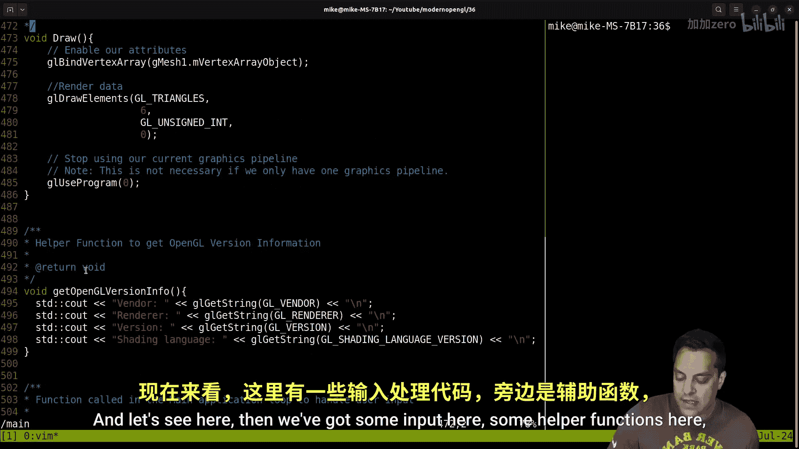
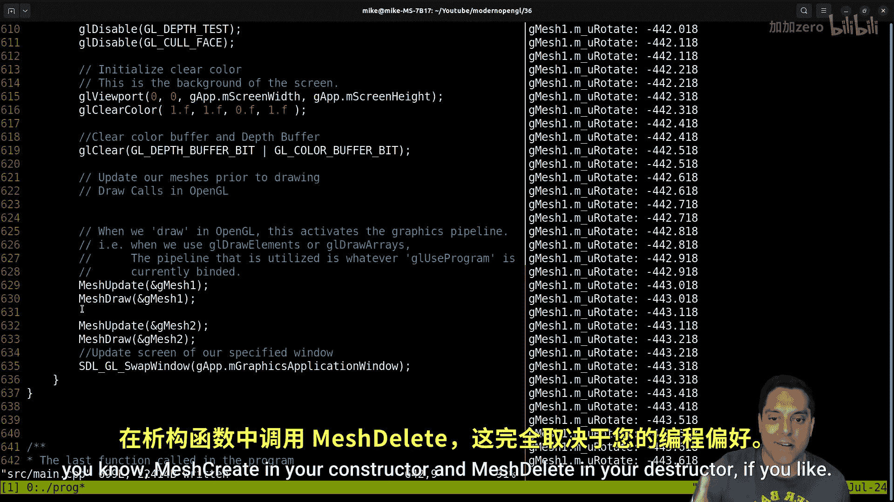

# 037：网格抽象重构续篇——绘制两个四边形

在本节课中，我们将继续重构我们的图形代码或小型图形框架。我们的最终目标是理解如何渲染不止一个，而是两个网格对象。

上一节我们介绍了网格抽象的基本结构，本节中我们来看看如何扩展它以支持多个对象的渲染。

## 项目结构与代码回顾




首先，让我们回顾一下当前项目的结构。我们保持代码相对简洁，目前将许多内容放在主文件中，这便于我们整体概览。

以下是当前项目中的核心结构：

*   **应用程序状态类 (`App`)**：这是一个结构体，用于存放全局数据，例如相机、着色器管线、窗口状态等。虽然可以创建其实例，但目前我们将其视为应用程序的全局状态容器。
*   **三维网格类 (`Mesh3D`)**：这个类封装了顶点数组对象、顶点缓冲对象和索引缓冲对象。它旨在消除全局变量，并将网格数据与变换状态（如位移、旋转、缩放）绑定在一起。
*   **主程序流程**：程序初始化、顶点规范设置、图形管线创建，最后进入包含输入处理、更新、绘制和缓冲区交换的主循环。

## 重构绘制函数

在分析代码时，我们发现 `draw` 函数是重构的一个关键点。目前它直接操作全局网格数据，我们需要将其通用化，以便能绘制任意网格。

以下是重构 `draw` 函数的具体步骤：

1.  **创建通用绘制函数**：我们将创建一个名为 `MeshDraw` 的新函数，它接收一个 `Mesh3D` 指针作为参数。
2.  **绑定网格状态**：在函数内部，绑定该网格的顶点数组对象，然后调用 `glDrawElements` 进行绘制。
3.  **考虑管线绑定**：绘制时还需要指定使用哪个图形管线（着色器程序）。我们可以选择在每次绘制网格时都绑定一次管线，但这在性能上并非最优。为了学习阶段的灵活性和清晰度，我们暂时采用这种方式，并添加备注说明。

```c
// 注意：为每个网格切换图形管线状态通常效率不高。
// 此处为了学习阶段的灵活性和代码清晰度而采用此方式。
void MeshDraw(Mesh3D* mesh) {
    if (mesh == nullptr) return;
    glBindVertexArray(mesh->m_vertexArrayObject);
    glUseProgram(mesh->m_pipeline); // 绑定该网格使用的着色器程序
    glDrawElements(...); // 根据网格索引数据绘制
}
```

## 分离网格创建与状态设置

接下来，我们需要改进网格的创建和初始化流程。最初，我们在一个函数中同时设置了网格的几何数据和着色器管线。更好的设计是遵循单一职责原则。

以下是优化后的API设计：

1.  **`MeshCreate` 函数**：只负责创建和配置网格的几何数据（VAO, VBO, IBO）。
2.  **`MeshSetPipeline` 函数**：一个独立的函数，用于为已创建的网格指定要使用的着色器程序。
3.  **`MeshUpdate` 函数**（原 `PreDraw`）：用于在绘制前更新网格的变换状态（如模型矩阵），并将这些值传递给着色器uniform变量。
4.  **`MeshDelete` 函数**：负责清理网格占用的OpenGL资源。

这种分离使得代码逻辑更清晰，也更容易管理多个网格。

## 实现多网格渲染

完成基础重构后，我们现在可以实现渲染两个网格的目标。

以下是创建和渲染两个四边形的步骤：

1.  **声明两个网格对象**：我们创建两个全局的 `Mesh3D` 实例，例如 `g_mesh1` 和 `g_mesh2`。
2.  **分别创建网格**：调用 `MeshCreate` 为两个网格初始化几何数据（这里都是四边形）。
3.  **设置共享管线**：调用 `MeshSetPipeline` 为两个网格设置同一个编译好的着色器程序。
4.  **设置不同变换**：为两个网格的 `transform` 成员设置不同的位置值，使它们在场景中分开。
5.  **在主循环中更新和绘制**：在主循环中，依次调用每个网格的 `MeshUpdate` 和 `MeshDraw` 函数。

```c
// 初始化阶段
Mesh3D g_mesh1, g_mesh2;
MeshCreate(&g_mesh1);
MeshCreate(&g_mesh2);

GLuint shaderProgram = CreateGraphicsPipeline(...); // 创建着色器程序
MeshSetPipeline(&g_mesh1, shaderProgram);
MeshSetPipeline(&g_mesh2, shaderProgram);

g_mesh1.transform.x = -2.0f; // 设置网格1的位置
g_mesh2.transform.x = 2.0f;  // 设置网格2的位置

// 主循环中
while (running) {
    // ... 处理输入 ...
    MeshUpdate(&g_mesh1); // 更新网格1的uniform
    MeshUpdate(&g_mesh2); // 更新网格2的uniform
    // ... 清除屏幕 ...
    MeshDraw(&g_mesh1);   // 绘制网格1
    MeshDraw(&g_mesh2);   // 绘制网格2
    // ... 交换缓冲区 ...
}
```

## 调试与注意事项

在实现过程中，我们遇到了一些典型的调试问题：

*   **对象不显示**：这通常是由于着色器管线未正确绑定或uniform变量未更新导致的。确保 `MeshSetPipeline` 在 `MeshDraw` 之前被调用，且 `MeshUpdate` 正确计算并上传了模型矩阵。
*   **状态管理**：注意OpenGL是一个状态机。我们重构后的 `MeshUpdate` 函数（负责设置uniform）和 `MeshDraw` 函数（负责绑定VAO和绘制）需要按正确顺序调用，且要确保在绘制每个对象前，其对应的状态已设置好。
*   **深度测试**：当两个网格在三维空间中重叠时，如果没有启用深度测试，它们可能会产生奇怪的叠加效果。确保在初始化时启用 `GL_DEPTH_TEST`。

## 总结与展望

本节课中我们一起学习了如何通过重构网格抽象来渲染多个OpenGL对象。我们主要完成了以下工作：

1.  将通用的绘制逻辑封装进 `MeshDraw` 函数。
2.  将网格的创建、管线设置、状态更新和资源删除分离成独立的函数，遵循更好的API设计。
3.  成功创建并渲染了两个具有独立位置的四边形成功。

通过这次重构，我们的代码向一个更模块化、更易扩展的小型图形框架迈进了一步。虽然目前我们仍使用全局变量和简单的函数式管理，但这为后续引入更高级的特性（如变换类、资源管理、场景图等）奠定了基础。在代码行数继续增长后，我们可以考虑将不同功能的代码拆分到独立的文件中，以保持项目的可维护性。




---
**本节课中我们一起学习了**：如何重构OpenGL代码以支持多网格渲染，包括创建通用的网格绘制函数、分离关注点以改进API设计，以及实现两个独立对象的创建、变换和绘制流程。