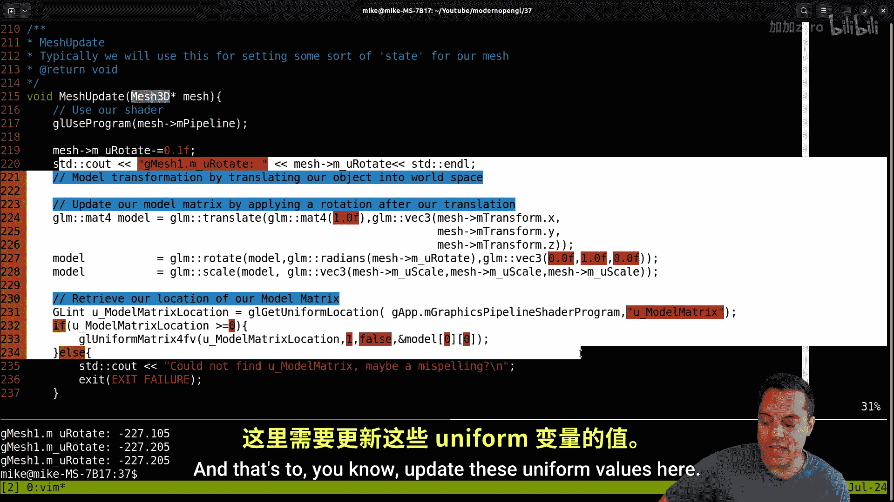
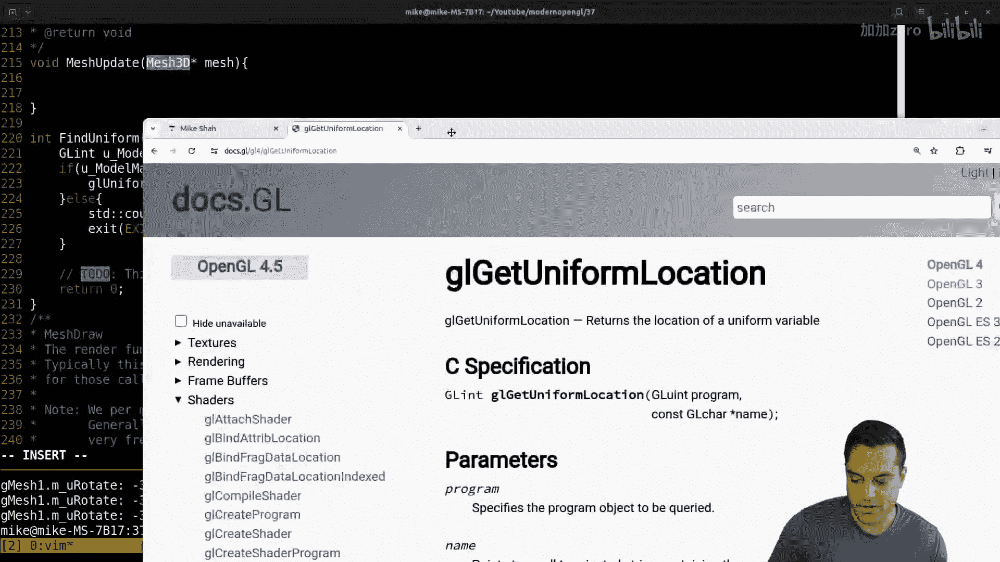
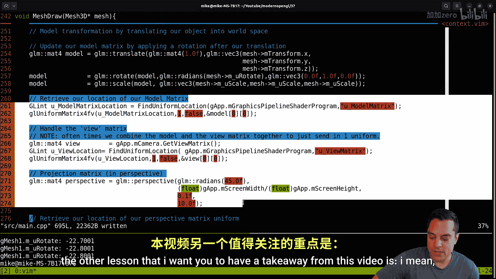

# 038：重构MeshUpdate与查找Uniform


## 概述


在本节课中，我们将继续重构我们的OpenGL抽象层。我们将重点关注`mesh`类，特别是`mesh_update`函数，并创建一个辅助函数来简化Uniform变量的查找和错误处理。通过这次重构，我们的代码将变得更清晰、更易于维护。

上一节我们介绍了`mesh`类的基本结构和初步重构。本节中，我们来看看如何进一步优化`mesh`的绘制流程，并抽象出Uniform查找的逻辑。

## 代码现状与目标


我们的`main.c`文件已经变得相当庞大。虽然我们很想立即将代码拆分到不同文件中，但在此之前，我们需要先理清一些抽象概念和整体系统设计。

目前，我们有一个`Mesh3D`结构体，它包含以下核心成员：
*   `GLuint vao`：顶点数组对象
*   `GLuint vbo`：顶点缓冲对象
*   `GLuint ibo`：索引缓冲对象（用于索引绘制）
*   `GLuint pipeline`：用于渲染该网格的图形管线（着色器程序）
*   `Transform transform`：变换类，用于存储模型矩阵等信息

以下是`Mesh3D`结构体的代码表示：
```c
typedef struct {
    GLuint vao;
    GLuint vbo;
    GLuint ibo;
    GLuint pipeline;
    Transform transform;
} Mesh3D;
```

我们目前创建了两个网格实例，程序运行时会显示两个矩形。由于深度测试被禁用，我们会看到一些重叠的奇怪现象，这将在后续完成抽象后讨论。


## 重构Mesh绘制流程




当前，我们有一个`mesh_update`函数，它负责在绘制网格前设置Uniform值。这个函数本质上是绘制前的准备工作。

我们可以考虑将这个更新逻辑直接移到`mesh_draw`函数中。因为在绘制时，我们需要绑定管线，然后设置Uniform值。对于当前的简单管线来说，这是合理的做法。

以下是重构步骤，我们将`mesh_update`中的代码移入`mesh_draw`：

1.  将Uniform查找和设置的代码从`mesh_update`剪切。
2.  将其粘贴到`mesh_draw`函数中，放在绑定着色器程序之后、实际绘制调用之前。
3.  重新编译并运行程序，确保功能与之前一致。

完成这一步后，`mesh_update`函数就变得多余了。

## 创建Uniform查找辅助函数

在清理`mesh_draw`函数中的Uniform设置代码时，我们发现其中有重复的错误处理逻辑。遵循“不要重复自己”（DRY）的原则，我们将其抽象成一个辅助函数。


这个函数的目标是：根据Uniform变量名，在指定的着色器程序中查找其位置，并进行统一的错误处理。



以下是`find_uniform_location`函数的实现：
```c
/**
 * 根据名称返回着色器程序中Uniform变量的位置。
 * @param program 着色器程序ID
 * @param name Uniform变量的名称
 * @return Uniform的位置。如果返回值小于0，则表示查找失败，程序会报错退出。
 */
GLint find_uniform_location(GLuint program, const char* name) {
    GLint location = glGetUniformLocation(program, name);
    if (location < 0) {
        fprintf(stderr, "错误：在程序中未找到Uniform变量 '%s'\n", name);
        exit(EXIT_FAILURE);
    }
    return location;
}
```

使用这个辅助函数，我们可以大幅简化`mesh_draw`函数中的代码。以下是重构前后的对比示例：

重构前：
```c
GLint modelMatrixLocation = glGetUniformLocation(mesh->pipeline, "u_model_matrix");
if (modelMatrixLocation < 0) {
    fprintf(stderr, "错误：未找到Uniform变量 'u_model_matrix'\n");
    exit(EXIT_FAILURE);
}
glUniformMatrix4fv(modelMatrixLocation, 1, GL_FALSE, glm::value_ptr(mesh->transform.modelMatrix));
```

重构后：
```c
GLint modelMatrixLocation = find_uniform_location(mesh->pipeline, "u_model_matrix");
glUniformMatrix4fv(modelMatrixLocation, 1, GL_FALSE, glm::value_ptr(mesh->transform.modelMatrix));
```

我们对视图矩阵和投影矩阵的Uniform设置也进行同样的重构。

## 代码清理与洞察

完成重构后，我们的代码变得更加简洁清晰。一个有趣的额外收获是，代码结构清晰后，我们更容易发现潜在的优化点。

例如，我们注意到目前是分别传递模型矩阵（`u_model_matrix`）和视图矩阵（`u_view_matrix`）到着色器，然后在顶点着色器中进行相乘。这会导致每个顶点都执行一次矩阵乘法。

一个常见的优化是：在CPU端将模型矩阵和视图矩阵相乘，得到一个“模型-视图”矩阵（`u_model_view_matrix`），然后只传递这一个Uniform到着色器。这样，每个顶点就只需与一个矩阵相乘，减少了计算量。

**公式**：`model_view_matrix = view_matrix * model_matrix`




虽然有时出于某些操作需要将矩阵分开，但在大多数绘制调用中，合并它们是更高效的做法。

## 最终调整与总结

我们将新创建的`find_uniform_location`函数移到了文件顶部，并归类在一个“OpenGL工具函数”的注释块下，以便管理。

最后，由于`mesh_update`函数已经没有任何实际作用，我们选择直接删除它，而不是保留一个空函数。这遵循了“最好的代码就是被删除的代码”这一理念。

本节课中我们一起学习了如何通过重构来简化OpenGL代码。我们主要完成了两件事：

1.  将网格的Uniform更新逻辑整合到绘制函数中，使流程更直接。
2.  创建了一个`find_uniform_location`辅助函数，封装了Uniform查找和错误处理，消除了代码重复，并使主逻辑更清晰。


这次重构不仅减少了代码量，还让我们对数据流有了更清晰的认识，甚至发现了合并模型/视图矩阵的优化机会。在接下来的课程中，我们将继续进行重构，为添加纹理等图形功能打下坚实的基础。