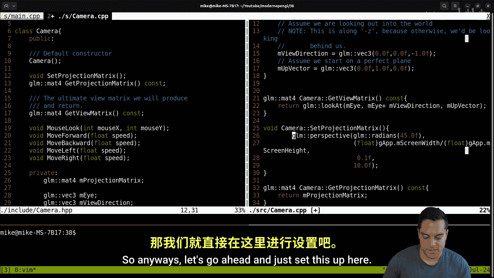
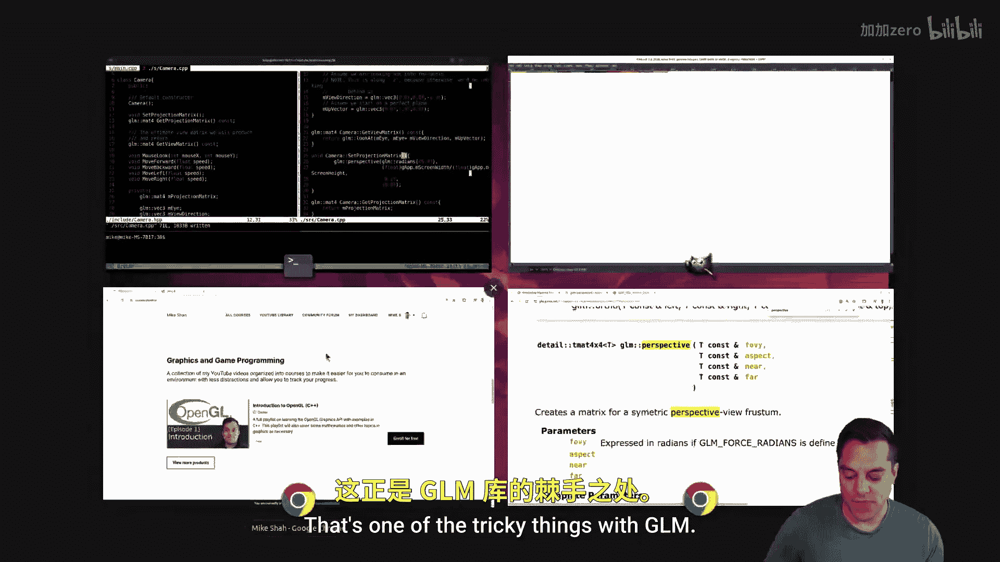

# 039：重构Mesh绘制与相机


在本节课中，我们将继续重构代码库，目标是构建一个简洁的游戏框架。今天的重点是处理 `mesh3D` 类，我们将清理抽象层，使其更加清晰。


## 概述

首先，回顾一下当前的项目结构。在 `main.cpp` 中，我们有一个 `Mesh` 类，它负责设置几何体。这对应着图形渲染管线中的顶点规范阶段，即在CPU上设置缓冲区等操作。


我们为网格提供了一个默认的变换位置，以便移动它们。目前，我们依次创建了两个网格，这是有意为之，因为我们尚未讨论深度测试。在完成一些重构后，我们会处理这个问题。

接着，我们创建图形管线。管线设置完成后，就可以设置网格。你可能会想，我们其实可以在一步中创建网格并设置管线。我们可能会在后续进行这样的重组，例如在程序启动前编译所有图形管线，然后将管线与网格关联。但目前，这是一个两步过程，每个函数只做一件事，这是一种合理的软件设计方法。

然后，我们进入主循环。在主循环中，我们基本上就是绘制网格，当然也处理输入（例如移动按键）。

## 重构Mesh绘制函数

现在，让我们看看 `mesh3D` 类。今天的目标是继续清理这个类。我们需要更多地思考之前提到的 `transform` 结构体。在上节课中，我们开始处理获取统一变量位置，因为需要在 `meshDraw` 函数中进行清理。

`meshDraw` 函数目前看起来有些杂乱，我们将所有统一变量的设置集中在一起。但还有一些问题需要处理，例如如何处理我们为每个网格不断创建的透视相机。这个功能应该属于相机类本身。

因此，是时候移除这部分代码，将其改为两步操作。我们希望实现类似 `Gf.mcaa.git projection matrix` 这样的调用。这里称之为“投影矩阵”，因为我们不确定它将是透视投影还是正交投影。

## 为相机类添加投影矩阵

让我们打开 `Camera.cpp` 文件。就像我们有一个 `getViewMatrix` 函数一样，让我们创建一个 `getProjectionMatrix` 函数。它应该是一个常量函数。

我们可以在相机类中存储一个投影矩阵。在构造相机时，也许可以用一个默认的投影矩阵来初始化它。但这里隐藏了一些细节，我们可能想要改变它。

实际上，我们更希望有一个单独的函数来设置投影矩阵，而不是在构造函数中隐藏算法。因此，让我们创建一个 `setProjectionMatrix` 函数。




最好的方法是参考GLM的透视矩阵函数。GLM是一个高度模板化的库，如果你不习惯阅读C++代码，可能会有些挑战。





`glm::perspective` 函数需要以下参数：视野（FOV，浮点数）、宽高比（浮点数）、近平面（浮点数）和远平面（浮点数）。它返回一个4x4矩阵。

因此，我们的 `setProjectionMatrix` 函数将简单地调用 `glm::perspective` 并设置成员变量 `m_projectionMatrix`。

以下是该函数的核心代码：
```cpp
void Camera::setProjectionMatrix(float fovY, float aspect, float near, float far) {
    m_projectionMatrix = glm::perspective(fovY, aspect, near, far);
}
```

## 在主程序中使用新的相机功能

现在，回到 `main.cpp` 文件。在初始化程序并设置相机之后，我们可以调用 `GApp.m_camera.setProjectionMatrix(...)` 来设置投影矩阵。我们需要传入视野、宽高比、近平面和远平面的值。

然后，在 `meshDraw` 函数中，我们不再直接计算透视矩阵，而是从相机中获取投影矩阵。我们可以这样调用：
```cpp
glm::mat4 projection = GApp.m_camera.getProjectionMatrix();
```

这样，我们就将投影矩阵的计算和管理抽象到了相机类中。

## 测试与总结

编译并运行程序，应该能看到两个四边形正常显示，与重构前一样。这次重构减少了出错的可能性，使代码更加清晰，并进一步抽象了功能。

然而，仍然有一些小问题需要处理。例如，变换操作仍然在 `draw` 函数中处理，这负担过重。我们希望能够控制网格的平移、旋转和缩放。这将是下一节课的重点。

一旦我们有了可以操作的网格和基础框架，我们将深入介绍更多图形学入门知识。


本节课中，我们一起学习了如何将投影矩阵的计算从网格绘制函数中抽离，并将其封装到相机类中，使代码结构更加清晰和模块化。