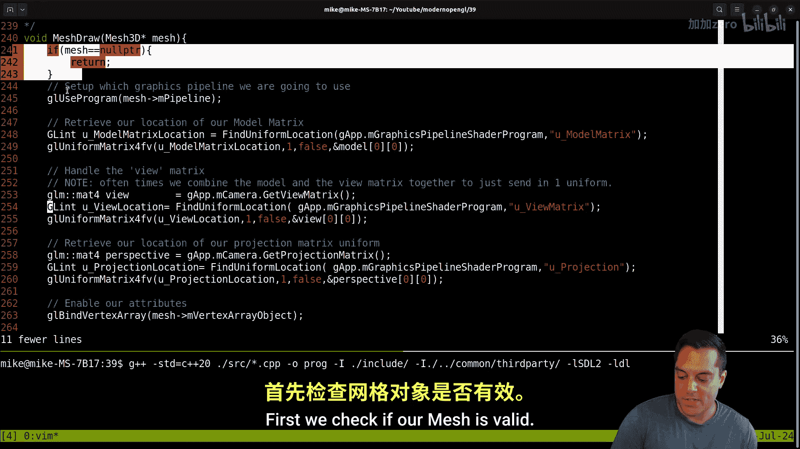
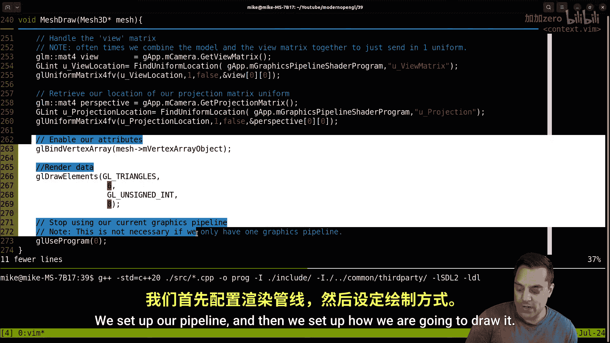
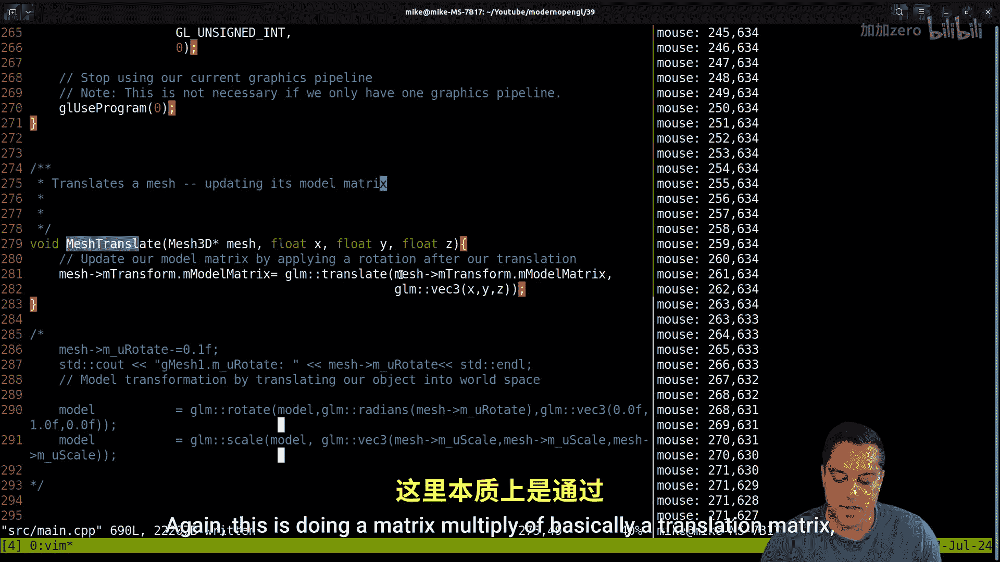

# 040：为Mesh3D类添加平移、旋转和缩放操作 🎮

在本节课中，我们将学习如何为我们的`Mesh3D`类抽象出平移、旋转和缩放操作。我们将创建`mesh_translate`、`mesh_rotate`和`mesh_scale`函数，以简化模型变换的代码，使主渲染循环更加清晰。

## 概述

目前，我们的代码在`mesh_draw`函数中直接处理模型的旋转和平移，这与网格绘制本身的核心逻辑混杂在一起。为了建立更清晰的抽象，我们将把这些变换操作提取出来，作为`Mesh3D`类的独立功能。这样，`mesh_draw`函数可以专注于设置管线、传递uniform变量和实际绘制网格。

上一节我们介绍了`Mesh3D`类的基本结构和绘制流程，本节中我们来看看如何将变换操作从绘制函数中分离出来。

## 代码回顾与目标

首先，让我们简要回顾当前的代码结构。在我们的`main`函数和`mesh_draw`函数中，我们直接使用GLM库进行矩阵变换计算。例如，我们这样设置模型矩阵：

```cpp
glm::mat4 model = glm::mat4(1.0f);
model = glm::translate(model, glm::vec3(x, y, z));
model = glm::rotate(model, glm::radians(angle), glm::vec3(0.0f, 1.0f, 0.0f));
model = glm::scale(model, glm::vec3(scaleX, scaleY, scaleZ));
```

我们的目标是创建类似`mesh_create`、`mesh_delete`和`mesh_set_pipeline`的函数，来专门处理这些变换。我们将创建`mesh_translate`、`mesh_rotate`和`mesh_scale`函数。



## 重构Mesh3D结构体



为了实现变换的抽象，我们首先需要修改`Mesh3D`结构体，为其添加一个模型矩阵成员，用于存储该网格的当前变换状态。

```cpp
typedef struct Mesh3D {
    // ... 其他现有成员（如VBO、IBO、管线等）
    glm::mat4 model_matrix; // 新增：存储模型变换矩阵
} Mesh3D;
```

在创建网格时，我们需要将`model_matrix`初始化为单位矩阵。

```cpp
Mesh3D mesh_create(...) {
    Mesh3D mesh;
    // ... 初始化其他成员
    mesh.model_matrix = glm::mat4(1.0f); // 初始化为单位矩阵
    return mesh;
}
```

## 创建变换函数

现在，我们可以开始编写处理变换的独立函数了。这些函数将直接操作`Mesh3D`结构体中的`model_matrix`。

### 平移函数 (mesh_translate)

`mesh_translate`函数将网格平移到指定的(x, y, z)位置。它通过将平移矩阵与网格当前的模型矩阵相乘来实现。

平移矩阵的公式如下：

```
[ 1, 0, 0, Tx ]
[ 0, 1, 0, Ty ]
[ 0, 0, 1, Tz ]
[ 0, 0, 0, 1  ]
```

其中Tx, Ty, Tz是平移量。

以下是该函数的实现：

```cpp
/**
 * 平移一个网格，更新其模型矩阵。
 * @param mesh 指向目标Mesh3D结构体的指针。
 * @param x 沿X轴的平移量。
 * @param y 沿Y轴的平移量。
 * @param z 沿Z轴的平移量。
 */
void mesh_translate(Mesh3D* mesh, float x, float y, float z) {
    mesh->model_matrix = glm::translate(mesh->model_matrix, glm::vec3(x, y, z));
}
```

### 旋转函数 (mesh_rotate)

`mesh_rotate`函数使网格绕任意轴旋转指定角度（弧度制）。我们提供一个绕Y轴旋转的简化版本`mesh_rotate_y`。

旋转矩阵（绕Y轴）的公式较为复杂，GLM库为我们处理了这些计算。




以下是该函数的实现：

```cpp
/**
 * 绕任意轴旋转一个网格。
 * @param mesh 指向目标Mesh3D结构体的指针。
 * @param angle_radians 旋转角度（弧度）。
 * @param axis 旋转轴向量（例如 glm::vec3(0.0f, 1.0f, 0.0f) 代表Y轴）。
 */
void mesh_rotate(Mesh3D* mesh, float angle_radians, glm::vec3 axis) {
    mesh->model_matrix = glm::rotate(mesh->model_matrix, angle_radians, axis);
}

/**
 * 绕Y轴旋转一个网格（便捷函数）。
 * @param mesh 指向目标Mesh3D结构体的指针。
 * @param angle_radians 绕Y轴的旋转角度（弧度）。
 */
void mesh_rotate_y(Mesh3D* mesh, float angle_radians) {
    mesh_rotate(mesh, angle_radians, glm::vec3(0.0f, 1.0f, 0.0f));
}
```

### 缩放函数 (mesh_scale)

`mesh_scale`函数对网格进行缩放。缩放可以是均匀的（所有轴比例相同）或非均匀的（各轴比例不同）。

缩放矩阵的公式如下：

```
[ Sx, 0,  0,  0 ]
[ 0,  Sy, 0,  0 ]
[ 0,  0,  Sz, 0 ]
[ 0,  0,  0,  1 ]
```

其中Sx, Sy, Sz是缩放因子。

以下是该函数的实现：

```cpp
/**
 * 非均匀缩放一个网格。
 * @param mesh 指向目标Mesh3D结构体的指针。
 * @param scale 包含X、Y、Z轴缩放因子的向量。
 */
void mesh_scale(Mesh3D* mesh, glm::vec3 scale) {
    mesh->model_matrix = glm::scale(mesh->model_matrix, scale);
}

/**
 * 均匀缩放一个网格（便捷函数）。
 * @param mesh 指向目标Mesh3D结构体的指针。
 * @param uniform_scale 所有轴的统一缩放因子。
 */
void mesh_scale_uniform(Mesh3D* mesh, float uniform_scale) {
    mesh_scale(mesh, glm::vec3(uniform_scale));
}
```

## 更新绘制函数

创建了变换函数后，我们需要更新`mesh_draw`函数。现在，它不再需要自己计算模型矩阵，而是直接使用`Mesh3D`结构体中存储的`model_matrix`。

更新后的`mesh_draw`函数核心部分如下：

```cpp
void mesh_draw(Mesh3D* mesh) {
    if (!mesh_is_valid(mesh)) return;

    mesh_set_pipeline(mesh);

    // 获取模型矩阵并传递给着色器
    GLint model_loc = glGetUniformLocation(mesh->pipeline, "model");
    glUniformMatrix4fv(model_loc, 1, GL_FALSE, glm::value_ptr(mesh->model_matrix));

    // ... 绑定VBO、IBO并执行绘制调用（glDrawElements）
}
```

## 在主循环中使用

现在，我们可以在主渲染循环中以更清晰的方式使用这些函数。以下是更新后的主循环示例：

```cpp
// 初始化网格
Mesh3D g_mesh1 = mesh_create(...);
Mesh3D g_mesh2 = mesh_create(...);

// 初始变换
mesh_translate(&g_mesh1, 0.0f, 0.0f, 0.0f);
mesh_translate(&g_mesh2, 0.0f, 0.0f, -4.0f);
mesh_scale(&g_mesh2, glm::vec3(1.0f, 2.0f, 1.0f)); // 让第二个网格在Y轴上更高

float rotation_angle = 0.0f;

while (!glfwWindowShouldClose(window)) {
    // ... 处理输入、清屏等

    // 更新旋转角度
    rotation_angle += 0.05f;

    // 应用变换
    mesh_rotate_y(&g_mesh1, rotation_angle);
    mesh_rotate_y(&g_mesh2, -rotation_angle); // 反向旋转

    // 绘制网格
    mesh_draw(&g_mesh1);
    mesh_draw(&g_mesh2);

    // ... 交换缓冲区、检查事件
}
```


## 总结

本节课中我们一起学习了如何为`Mesh3D`类抽象出平移、旋转和缩放操作。通过创建`mesh_translate`、`mesh_rotate`和`mesh_scale`函数，我们将变换逻辑从绘制函数中分离出来，使代码结构更加模块化和清晰。

我们主要完成了以下工作：
1.  在`Mesh3D`结构体中添加了`model_matrix`成员来存储变换状态。
2.  实现了独立的变换函数，这些函数直接操作模型矩阵。
3.  更新了`mesh_draw`函数，使其直接使用网格自身的模型矩阵。
4.  在主循环中演示了如何使用新的API来轻松控制多个网格的变换。


现在，我们拥有了一个更健壮的小型图形框架基础，可以方便地创建、变换和渲染多个网格对象。这为我们后续加载复杂几何体、添加颜色和光照等功能奠定了良好的基础。