# 第一章：哲学、数字和函数

## 引言

我们考虑我们的努力将集中在的基本上下文：数字和函数的领域。我们描述了“标准函数”，这些函数在你的世界中最常出现，并且逆函数

## 主题

1.1  哲学

1.2  数字

1.3  函数

1.4  标准函数

1.5  其他函数

1.6  反函数

1.7  隐式函数

## 1.1 哲学

我们不会深入探讨哲学，只是列出一些我们希望在课程中融入的特点。

**课程的哲学**

1\. 尽可能多地使用计算机。

2\. 使用电子表格。

3\. 鼓励积极学习而不是被动学习；试图让你思考材料。

4\. 将一元微积分与多元微积分结合起来，使它们一起处理而不是一个接一个地处理。

5\. 在适当时通过电子邮件向我提交作业。

6\. 让你重新做作业直到正确为止。

7\. 反馈是所需活动的重要组成部分。

**学习的哲学**

1\. 学到的东西与投入的时间成正比。

2\. 学习的最佳方式是自己想出想法或将其教给别人。

3\. 第二好的方法是通过朋友或我们这样的人的提示来做。

4\. 第三好的是从阅读中获取思想；但在阅读中停下来思考它们。

5\. 第四好的：不可接受的：根本不了解它们。

6\. 一个讲座的目的不是告诉你重要的事实，而是激发你尝试学习某个概念。

7\. 课程的目标是使您能够在任何情境中使用微积分的概念。

## 1.2 数字

**我们从数字的基本概念开始。自然数，表示为 N**，是数字 1,2,3,...，在加法下是封闭的。

**能够与 N 或 N 的子集建立一一对应关系的集合称为可数集。** 对应

引入减法的概念使我们将 N 扩大到得到**整数，表示为 Z**，正数、负数或 0，使得我们的数字在减法运算下是封闭的。

**练习 1.1 Z 可数吗？** 解答

Z 在乘法下是封闭的；也就是说，两个整数的乘积是一个整数。

要得到一个在除法下封闭的数字集合：我们必须将 Z 扩大以得到**有理数 Q**，其形式为 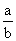，其中 a 是 Z 中的数，b 是 N 中的数。

**练习：**

**1.2 Q 可数吗？**（参见图片提示。） 解答

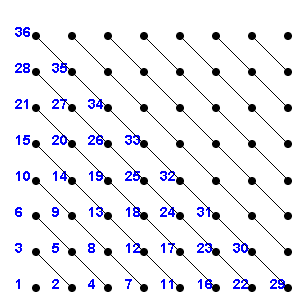

**1.3 证明或反驳：可数集的可数子集是可数的。** 解答

**数字的十进制形式**

0 到 1 之间的数可以表示为小数点后跟着无限位数字的形式，每个数字为 1、2、3、...、9、0 中的一个。

有理数在某一点之后无休止地重复自己：（例如 1 / 4 是 .250* 或者 .249*，星号表示你无休止地重复星号后的数字）1 / 3 是 .3*，1 / 7 = .(142857)*，57 / 100 = .570*。

无理数不会这样做。

**练习：**

**1.4 证明有理数无休止地重复相同的有限数字序列，而无理数不会。** 解答

**1.5 是否存在非有理小数位序列？** 解答

**1.6 所有这样的序列都可数吗？**（查看图片以获取提示。）解答

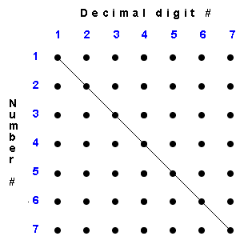

**一个数，其第 k 位小数与列表中第 k 位数不同，不能在任何位置上！**

**代数数**是整系数多项式方程的解。

**练习 1.7 代数数可数吗？** 解答

**实数 R**是**所有不同的无限数字序列，有一个符号和有限位数的小数点前的数字。**

你可以对它们进行加减乘除，但不允许除以 0。

**还有其他我们可能称之为数的集合吗？**

**是的！有“模 x 的数”。这些是当你除以 x 时得到的 Z、Q 或 R 的余数。**

**还有复数，形成集合 C。这些是形如 a + ib 的表达式，其中 i² = -1，a 和 b 在 R 中，乘法和除法与 R 中的规则相同，附加规则如上。**

**评论 - 更多关于复数的内容**

## 1.3 函数

**集合**是一个基本概念。我们以集合（或者另一个称呼：**集合**）作为基本概念。

有序可数集也被称为**序列**。1, 2, 3, ... 就是一个序列。

如果有两个元素，它被称为**有序对**。（3, 4）就是这样一个对。

**函数**是一组有序对的集合，其第一个元素都不相同。

第一个元素称为**参数**，第二个称为**值**。

参数的集合称为其**定义域**。

值的集合称为其**值域**。

我们通过**f(参数) = 值**来描述函数 f 中的每一对。

**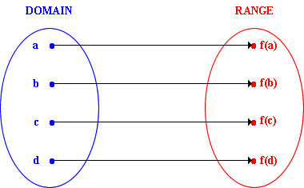**

当 f 对两个不同的参数具有相同的值时，比如对 f(d) 和 f(e) 的值相同，这是完全可以的。

我们可以通过列出其对或者通过通常方式绘制代表性对的图形来描述一个函数：如果**f(a) = b**，*在 x 轴上通过 a 的垂直线和 y 轴上通过 b 的水平线的交点处放一个点*。

然而，我们无法列出具有无限或巨大定义域的任何函数中的所有对。

我们定义这样一个函数，通过提供一个你可以用来构建其值的过程，你可以选择其定义域中的任意参数。这个过程通常被称为函数的“公式”。

## 1.4 标准函数

**标准函数** 是在 R 的一个区间上定义的，它通过从任意**三个基本函数**的任意组合开始的有限序列的**标准操作**获得。

**基本函数是什么**？

**恒等函数 f(x) = x**

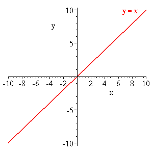

**指数函数 **f(x) = exp(x)**

**正弦函数 **f(x) = sin(x)**

**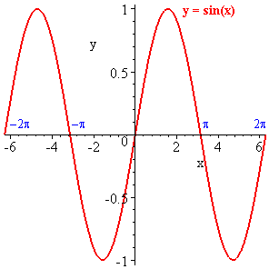**

**标准操作是什么？**

*实数中的乘法、加法、减法、乘法、除法、将一个函数的值代入另一个函数作为参数，并进行“逆运算”。*

我们遇到的大多数函数将是标准函数。

例如：4x²，x sin(x)，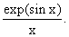

你可以在下面的小程序中输入你喜欢的标准函数 f 和 g，并观察以各种方式组合 f 和 g 的效果，还可以查看 f 的逆函数。

注意，当 f 对于多个参数具有相同的值时，你必须决定你想将哪个参数称为逆函数的值。

<applet code="OperationsOnFunctions" codebase="../applets/" archive="operationsOnFunctions.jar,mk_lib.jar,parser_math.jar,jcbwt363.jar" width="760" height="450"></applet>

## 1.5 其他函数

**还有其他函数吗？**

是的，但我们主要关注标准函数。

**我们可能会遇到哪些其他函数？**

**分段标准函数:** 这些是在其定义域的子区间上是标准函数的函数，但在所有子区间中不一定是相同的标准函数。对于任何负参数为 0，对于正参数为 1 的函数是一个例子。这被称为阶梯函数。

x 的绝对值，对于负参数 x 是 -x，对于正 x 是 +x，是另一个例子。它的图像在 x 轴原点处呈 V 形。

**通过无限级数定义的函数:** 特别是通过一系列幂 x^n 和系数是幂的标准函数。一个简单而基础的例子是几何级数，由 g(x) = 1 + x + x² + ... + x^k + ... 定义。

**使用微积分运算定义的函数:** 这些通常是由标准函数的导数或积分定义的函数。一旦这些概念被定义，这样的定义就很容易。

**序列可以被看作是以 N 或 N 的子集为其定义域的函数。**

**递归或隐式定义的函数：**函数的递归定义是通过一个需要重复应用的过程来构造其值的过程来描述的，以便在整个定义域上定义它们。

例如，斐波那契数 f(n) 根据以下规则形成一个序列：f(0) = f(1) = 1；对于大于 1 的整数 n，f(n) = f(n - 1) + f(n - 2)。

这是这个序列的递归定义。

隐式定义的函数将在第 1.7 节中详细讨论。

**来自真实现象的函数：**这些通常起初是未知的。它们可能是任何东西。令人惊讶的是，我们将它们视为标准函数，或者视为上述其他类别中的一个函数时，我们的表现有多么出色。

**为什么考虑标准函数？**

它们可在计算器和电脑上使用。

它们只有孤立的奇点。

除了通常很容易定位的某些奇异点外，它们在大部分定义域上都是无限可微的。

它们可以在复平面上定义。

它们非常有用。

我们可以对任何在同一定义域上定义的 *序列* 或 *函数* 进行**加、减**或**乘**，并且在其中一个被除的地方，只要不是 0，就可以**除**另一个。为此，在它们的定义域中的每个自变量处，加、减、乘或除它们的值。

## 1.6 反函数

什么是**反函数**？

取一个函数 f：按照通常的方式画出它的图形；交换 x 和 y 轴，然后你就得到了反函数 f^(-1) 的图形。

y = f(x) 意味着 x = f^(-1)(y)。

这可以通过在纸上画图，将纸翻转过来，使旧的第一象限出现在右上角，并透过纸看旧图形来完成。

不要混淆反函数与倒数函数；它们是完全不同的概念。粗心的人可能会使用相同的符号表示法。这样做是错误的，因为它会引起混淆。

请注意，如果将 x = f^(-1)(y) 替换到 y = f(x) 中，你会得到 x = f^(-1)(f(x))。这最后一个方程可用作 f 的反函数的替代定义。

定义反函数存在问题。对于每个自变量，一个函数只能有一个有序对，而同样的值可以出现多次。这意味着交换自变量和值（这是我们在创建反函数时所做的），会产生一个非函数，除非原始函数确实每次都采用每个值。

当一个函数多次取值时，我们必须额外工作来为其定义一个反函数。换句话说，我们必须选择一个值作为新的自变量，并且放弃其他值。当 f 不是单值时，可以用许多不同的方式来做到这一点，因此在定义 f^(-1) 时总会存在某种任意性。

这方面最清晰的例子是函数 x²。它每个正值都有两个对应值。4 和 -4 都有相同的平方。对于这个函数的标准做法是定义其逆函数，x^(1/2)，为正平方根，忽略负平方根。（然后负平方根用 -x^(1/2) 表示。）这个定义有两个优点：一个是正数比负数更正。另一个是，用这个定义（而不是选择负根作为逆函数），乘积的平方根是其因子的平方根的乘积。

一般来说，你可以通过查看 f 的图像，在 f 是单值的定义域上进行选择，并将其作为 f ^(-1) 的值域来选择 f 的逆。

一些有趣的配对：����� ���

|   |  |
| --- | --- |

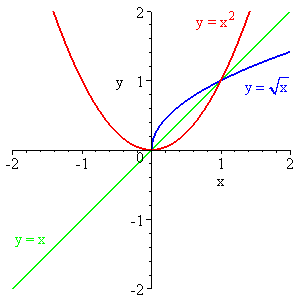                   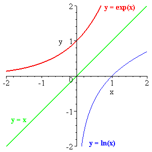

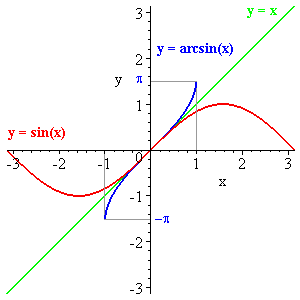                  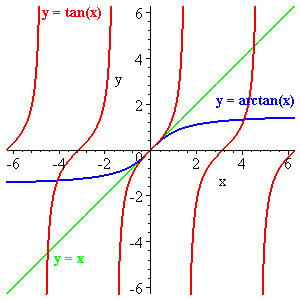

**练习 1.8 对于哪些值可以定义函数 cos(sin x) 的逆函数。(提示：设 f = cos(sin x)，看看它的逆函数并找出答案。)** 解答

<applet code="OperationsOnFunctions" codebase="../applets/" archive="operationsOnFunctions.jar,mk_lib.jar,parser_math.jar,jcbwt363.jar" width="760" height="450"></applet>

## 1.7 隐式函数

函数的隐式定义是指没有给出其值的显式公式，而是通过给出其满足的条件来定义它。因此，其值必须被推断为定义的结果，因此它是“通过暗示”定义的。

一个例子是：通过 x² + y² =1 和 y > 0 来定义 y(x)。

将一个函数定义为其逆函数是隐式定义的另一个例子。

注意，在这个例子中你可以得到一个关于 y(x) 的公式；该公式表示了这个相同函数的显式定义。

**练习：**

**1.9 这些内容对你来说有多熟悉？**

**1.10 陈述 cos x 是 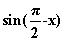 意味着什么关于 arccos y 和 arcsin y？** 解答

**1.11 想出一个可以放在这里的问题。**
