# 第二章：指数函数和三角函数

## 简介

我们考虑我们基本函数的性质。

## 主题

2.1  指数函数

2.2  三角函数

2.3  三角函数的性质

2.4  对数

## 2.1 指数函数

指数函数，用 **exp x** 表示，由两个条件定义：

**它在参数 0 处的值为 1。**

**它是它自己的导数。** 评论

这意味着它在 0 处的斜率为 1，这意味着它在那里增长，因此随着 x 的增加增长得更快，并且作为它自己的斜率，即使在负值时也增长得更快，永远不会变成 0。

如果你绘制它，并在参数 x 处画一条切线，那么该切线将保持在它下方，并在 x 轴上的 x - 1 处相交。

我们可以将 exp x 的表达式找到为 x 的无限级数，从一个常数开始，通过使用定义条件和导数的整数幂 x^n 的导数是 nx^(n-1) 的事实。

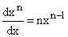

（如果这对你来说不熟悉，现在就相信它；在定义了我们的术语之后我们将证明它。如果你是初学微积分的人，你可能会觉得这一切都很神秘。如果是这样，请不要担心，但请阅读解答以了解下面提到的基本性质。）

**如何？**

当 x = 0 时，exp 为 1，这意味着第一个或常数项为 1。这一项必须是另一项的导数，根据上述幂导数公式，唯一可能的具有 1 作为其导数的项是 x。

类似地，唯一具有 x 作为其导数的项是 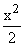。因此等等，这导致了指数函数表达式的级数的一般项是...

现在轮到你了。通过做下面的练习来完成这个句子。

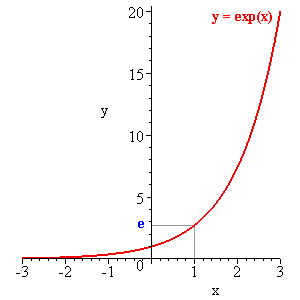

**练习：**

**2.1 弄清楚 exp x 的级数，并证明它确实如此。** 解答

**2.2 设定一个电子表格，使用你的级数计算它直到第 100 项为止。** 解答

**2.3 对于 x = 1，你需要多少项才能获得 10 位的精度？** 解答

**2.4 随机选择一个 x 并用电子表格计算 (exp x)*(exp(-x))。你得到什么？(exp 3x)*(exp(-x))³呢？** 解答

**对于任何函数，如果它是自己的导数或其导数是它的一个常数倍数，那么都可以获得相同类型的级数解。**

这一事实使我们能够证明 **指数函数的基本性质**。

这些是 **exp(x + r)** 和 **exp rx** 的替代表达式。

**exp(x + r)** 的导数是它自己，但在 x = 0 时值为 exp r；

**exp rx** 在 x = 0 处的值为 1，但其导数为 r 乘以它自身。

这两个陈述都是导数的链式法则的直接结果，这将在第七章中详细讨论。

给定一个正数$a$，我们可以通过将$n$个$a$的因子相乘来计算任意整数$n$的$a^n$。我们可以定义$a^{(1/n)}$为$a^n$的逆函数。我们可以定义$a^{(m/n)}$为$a^{(1/n)}$的$m$个因子的乘积。因此我们可以为任意有理数$r$定义$a^r$。

**但我们如何定义无理数$r$的$a^r$呢？**

我们可以证明，对于任意有理数幂$r$，有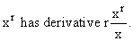 暂时就这样接受吧。

**我们现在将明确地定义$x^r$，以便它具有相同的性质。**

我们需要的条件是它的导数是自身乘以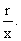

这意味着根据链式法则，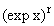必须具有导数为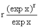乘以 exp x 的导数，而后者是 exp x。因此，的导数必须是自身的 r 倍。

但这恰恰就是$\exp rx$的导数。当$x$为 0 时，这两个函数都是 1。

这意味着它们必须有相同的幂级数展开，因此必须是相同的函数！

所以我们有了我们对$\exp rx$的替代表达式，并且一下子定义了无理数次幂。至于$\exp(x + r)$呢？轮到你了。

**练习 2.5：陈述并证明这些基本性质，即，表达式 exp(x + r)和 exp rx。(提示：它们在 x = 0 时有什么值？它们的导数是什么？从这些陈述中推导出它们的级数并识别它们。)** 解答

由于我们有$\exp rx = (\exp x)^r$，对于任何$x$，我们可以将其应用于$x = 1$，利用我们总是可以写成$r = 1 * r$的事实，来注意到：$\exp r = (\exp 1)^r$。

习惯上我们定义$e = \exp 1$，这样我们可以写成$\exp r = e^r$。

表达式$e^a$在 99%的情况下都是指$\exp a$。事实上，使用符号$\exp a$的主要用途是当使用上标不方便时，比如在打字或机器输入时，特别是当$a$有上标或下标时。计算机和电子表格使用$e^a$的符号表示，这样可以避免上标，但不美观。

## 2.2 三角函数

正弦在直角三角形中是对边长度与斜边长度的比。

**如果斜边长度为 1**，那么 sin就是三角形的对边长度。

如果角度很小，单位斜边对应的对边长度接近但小于单位圆周围两边的距离；而这个距离就是**弧度**中的角度大小。

因此，对于小角度，正弦略小于以弧度表示的角度本身。

余弦的补角被称为余弦$x$，并写为$\cos x$。

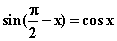

下面的小程序可以帮助您可视化正弦和余弦代表单位圆上位置的 x 和 y 分量，作为角度（用弧度表示）的函数。它下面的图片显示了各种三角函数的大小表示为图中线段的长度的含义。

<applet code="TrigonometricFunctions" codebase="../applets/" archive="trigonometricFunctions.jar,mk_lib.jar,parser_math.jar,jcbwt363.jar" width="760" height="450"></applet>

还有其他四个三角函数的几何定义如***此处的插图***所示

它们彼此相关，可以从图中通过观察相似三角形推断出来。

角 OAC、OBE 和 DBC 都等于。

sin  = DB = OE，

tan = BC，

sec  = OC，

cos = OD = EB，

cot  = AB，

csc  = OA

因此，第一象限中角的**切线**是垂直于该角的一边，在距其中心 1 的地方到另一边的切线的长度。

该象限中的角的**正割**是从其中心到与该角的一边距离为 1 的切线在该角的另一边的交点的线段的长度。

**每个这些函数都有对应的余弦函数，对于余角来说是相同的。** **在其他象限中，它们有适当的符号。**

**练习：**

**2.6 通过使用相似三角形推导出这些函数之间的关系。** 解答

**2.7 在不同象限中，每个函数的适当符号是什么？** 解答

**2.8 找出(tan x� + cot x)²的另一种表达式。** 解答

**2.9 哪些三角形与 OBD 相似？** 解答

## 2.3 三角函数的性质

重要的性质有：

勾股定理（这实际上是我们下面讨论的距离的定义）。

加法定理，即 sin(a + b)和 cos(a + b)的表达式。

半角定理（前两者的推论）。

所有三角函数仅取决于角度模 2 的值。

正弦定理：在三角形 ABC 中，长度 AB 和 AC 的比是相对角的正弦比：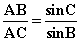。这只是事实，ABsin B 和 ACsin C 都等于 AH。

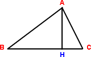

余弦定理。（参见**练习 3.5**）

在原点为中心的单位圆上，角度为  的点的坐标是 (cos, sin)，这意味着 y = sin，x = cos。

通过原点的单位圆的切线穿过 (x, y) 垂直于从中心到 (x, y) 的线，并指向第一象限的 y 轴。其方向由 (-sin, cos) 给出。

**所有性质都可以从正弦的微分性质中得出。**

目前我们假设

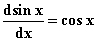

然后使用

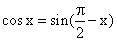

我们得到

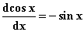

这两个声明结合起来告诉我们，如果我们两次对 sin x 进行微分，我们得到 -sin x；三次微分得到 -cos x，四次回到我们从 sin x 开始的地方。

并且我们有 cos 0 = 1，sin 0 = 0。

所以我们有 sin 0 = 0，(sin 0)' = 1，(sin� 0 )" = 0，(sin 0)''' = -1，并且进一步的导数在参数为 0 时重复为 (从起始点 0 1 0 -1 0 1 0 -1 0 1 0 -1，等等)。

这些信息确定了 x 的正弦的幂级数公式。

常数项必须为 0；线性项 x，二次项 0，三次项 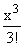，继续下去，所有偶次幂项必须为 0，并且奇次幂项必须交替出现，并且除此之外就像 exp x 的级数展开中的那样。

所有这些都是因为单项式 x^k 在 x = 0 处的所有导数都为 0，除了第 k 个导数为 k！因此，我们可以从在 0 处的导数值序列中读取正弦的幂级数。

我们得到

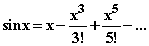

同样地

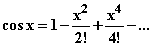

这意味着

exp ix = cos x + i sin x���� (A)

因此，我们可以使用指数函数的性质推导三角函数的性质。

例如，正弦和余弦的加法定理可以推导如下

exp i(a+b) = cos (a + b) + i sin( a + b) = (exp ia) * (exp ib)

= cos a cos b � sin a sin b + i(cos a sin b + cos b sin a)

对这些表达式进行实部和虚部的识别给出了加法公式。

**练习：**

**2.10�推导出以 exp ix 和 exp(-ix) 表示的 sin x 和 cos x 的公式，该公式源于上述方程(A)。** 解答

**2.11 从勾股定理和余弦加法定理中找出 (sin t/2)² 和 (cos t/2)² 的表达式。** 解答

**2.12 设置一个电子表格来计算任意输入 x 的 sin x。需要评估 sin .5 到 8 位小数的 sin x 幂级数展开需要多少项？** 解决方案

## 2.4 对数

自然对数，表示为**ln x**，是指数函数 exp x 的反函数。

它实际上在许多情境中自然出现。它有两个重要性质，可以从指数的两个基本性质推导出来。

ln x 的定义可以这样表述：它是你必须将 e 提升到的幂次方，以便得到 x：e^(ln x) = x = e ^(ln x)。

我们经常将其他数字，特别是 2 和 10，提升到幂次方，并**通常会问：为了得到 x，你必须将 z 提升到什么幂次方？** 答案被称为以 z 为底 x 的对数，写作 log [z] x。它是 z^x = z^x 的反函数。

上述提到的两个重要性质可以写成

**ln ab = ln a + ln b**

和

**log[a]b * log[b]c = log[a]c 对于任何 a、b 和 c**

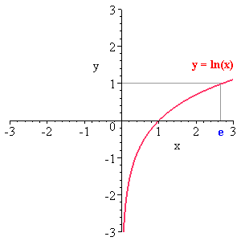

**练习：**

**2.13 推导它们。（我必须承认，我总是被糟糕的符号搞混，但我相信你们，年轻又聪明，能够做到。）** 解决方案

**2.14 从这两个方程推导出对于任何基数的对数我们有 log ab = log a + log b。** 解决方案

第一个性质或者说练习 2.13 的结果意味着我们可以通过取 a 和 b 的对数，将它们相加，然后从其对数中检索出 ab 来执行乘法。因此，乘法可以简化为加法和取对数以及“反对数”。

在计算器出现之前，加法和乘法同样困难，这是对对数的一个重要用途，我记得在高中时被迫使用对数表和反对数表进行练习，并且当然要在这些表格中的值之间进行插值。很难想象比这更繁琐的数学事情了，你们这些幸运的家伙！
