# 第三章：向量，点积，矩阵乘法和距离

## 引言

我们在这里引入向量和矩阵以及点积和矩阵乘法的概念。我们注意到点积在坐标旋转下是不变的，定义了线性依赖性，并描述了极坐标及其在三维中的推广。

## 主题

3.1  向量

3.2  欧几里得空间中的旋转坐标

3.3  点积

3.4  矩阵乘法

3.5  线性相关性和独立性

3.6  极坐标

3.7  柱面和球面坐标

3.8  关于向量空间中长度和距离的离题讨论

## 3.1 向量

我们将长度为 k 的数字序列称为 **k-向量**。

我们将 k-向量之间的加法和减法定义为逐项加法和减法，因此对于 2-向量，我们有

(a, b) + (c, d) = (a + c, b + d)

如果我们在欧几里得平面中选择一个原点 O，我们可以用一个向量来描述平面上的任意点，其第一个分量是点的 x 坐标，第二个是 y 坐标，即 (x, y)，一个 2-向量。

我们称第 i 个分量值为 1，其余为 0 的向量为第 i 个方向上的基向量。在普通的三维空间中，x、y 和 z 方向上的基向量分别表示为 **i**、**j** 和 **k**。向量 (x, y, z) 也可以写作 x**i** + y**j** + z**k**。

我们在这里假设基向量彼此垂直，并且每个基向量的长度为单位长度。

## 3.2 在欧几里得空间中旋转坐标

如果我们将基向量 i' 和 j' 按角度  从 i 和 j 旋转（以使 i' 方向朝向 j），则固定向量 **v** 的分量变化如下：

v[i] 变为

v[i]' = v[i] cos +� v[j] sin

并且 v[j] 变为

v[j]' = - v[i] sin + v[j] cos

这些效果在附带的小程序中有所说明。你可以移动向量，也可以旋转基向量。

<applet code="RotatingCoordinates" codebase="../applets/" archive="rotatingCoordinates.jar,mk_lib.jar,parser_math.jar,jcbwt363.jar" width="760" height="450"></applet>

## 3.3 点积

给定两个分量为 R 中元素、具有相同分量数的向量 **v** 和 **w**，我们将它们的 **点积** 定义为 **对应分量的乘积之和，写作 **vw 或 (v, w)**，如 *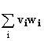.*。

显而易见的事实：点积在 **v** 和 **w** 中是线性的，并且在它们之间是对称的。

我们定义 **v 的长度** 为 **(v, v)** 的正平方根；**v 的长度** 通常用 **|v|** 表示。

**奇妙的事实：点积在坐标旋转下保持不变。**

**练习 3.1 证明此陈述。** 解答

由于这个事实，当评估**vw**时，我们可以旋转坐标，使第一个基向量指向**v**的方向，第二个基向量垂直于在**v**和**w**的平面上。

**那么 v 将具有前两个坐标（|v|, 0），如果 v 和 w 之间的角度为 ，则 w 将具有定义类似的坐标（|w|cos，|w|sin)。

因此，点积 v****w** 在此坐标系（即具有这些基向量的坐标系）中为 **|v||w| cos**，因此在通过从中旋转得到的任何坐标系中也是如此。

**点积在每个参数上是线性的**这一事实非常重要和有价值。这意味着您可以在任一参数上应用**分配律**来表示和差的点积为点积的和或差。

**示例**

**练习 3.2 用点积表达具有 v 和 w 为边的平行四边形的面积的平方。** 解答

**v** 和 **w** 的点积除以 **w** 的大小，即 **|v|cos**，称为 **v 在 w 方向上的分量**。

与 **w** 方向的矢量，其大小和符号为 |**v**|**cos**，被称为 **v 在 w 上的投影**。

从 **v** 在 **w** 上的投影中减去 **v** 得到的矢量称为 **v 垂直于 w 的投影** 或 **w 的法向量**。（按定义，此投影在 **w** 方向上的分量为零，因此法线于 **w**。）

**练习：**

**3.3 用点积表达 v 在 w 方向上分量的平方。** 解答

**3.4 用点积表达 v 垂直于 w 方向上的分量。** 解答

**3.5 利用点积在每个参数上的线性性质，写出 (v - w)****(v - w)。这建立了哪个著名定律？** 解答

**3.6 用点积和向量 w 表达 v 在 w 上的投影。** 解答

<applet code="OperationsOnVectors" codebase="../applets/" archive="operationsOnVectors.jar,mk_lib.jar,parser_math.jar,jcbwt363.jar" width="760" height="450"></applet>

## 3.4 矩阵乘法

一个数字的矩形数组，比如 n 行 m 列，被称为一个**矩阵。矩阵 A 的第 i-j 个元素是第 i 行第 j 列的元素，并表示为 A[ij]。**

这里有两个矩阵的示例，一个是 2 行 2 列，另一个是 2 行 3 列

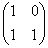

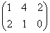

如果矩阵 A 的列数与 B 的行数相同，我们定义**乘积矩阵 AB 为 A 的行与 B 的列之间的点积。通过取 A 的第 i 行和 B 的第 j 列的点积得到的元素描述为 (AB)[ij]。** 详见第 32.2 节以获取有关矩阵及其属性的更全面讨论。

**练习：**

**3.7 找到上述两个矩阵的乘积。**

**3.8 构建一个可以将 4 行 4 列矩阵相乘的电子表格。** 解决方案

**3.9 在练习 3.8 中：**

**1\. 矩阵乘积 AB 在哪里？**

**2\. 在前四行中列 p、q、r 和 s 中出现了什么？**

**如果更改 A 或 B 中的任何条目，乘积将自动更改，因此您已经构建了一个 4 行 4 列的矩阵自动乘积查找器。**

**3\. 你能用这个方法找到一个 2 行 3 列矩阵和一个 3 行 4 列矩阵的乘积吗？如何做？**

**4\. 使用您的乘积查找器找到矩阵 A 的十次幂。（提示：对 A 和 B 使用它，并在正确的位置查找，您将找到它。）**

向量 v 可以被写成由单行组成的矩阵，或由单列组成的矩阵。当将其写为列时，我们将写为 |**v**>；当写为行时，<**v**|。然后，向量 **v** 的长度的平方可以写为矩阵乘积 <**v**||**v**>。

当 Mv 是 v 的倍数时，向量 v 是矩阵 M 的特征向量。倍数称为 M 具有特征向量 v 的特征值。如果特征值为 s，则我们有 Mv = sv。

此处的小程序允许您输入任意 2 行 2 列的矩阵，并移动向量**v**。当 M**v** 与 **v** 对齐时，**v** 是 M 的特征向量，其实数特征值由 M**v** 的长度（在小程序中称为**v'**）与 **v** 的长度之比给出，当它们指向相同方向时，符号为正。

<applet code="MultiplicationVectorByMatrix" codebase="../applets/" archive="multiplicationVectorByMatrix.jar,mk_lib.jar,parser_math.jar,jcbwt363.jar" width="760" height="450"></applet>

**练习** **3.10 选择一个对称矩阵，并使用小程序近似确定两个特征向量。在纸上画出它们。你能注意到什么？是什么？**

## 3.5 线性相关性和独立性

向量 v(1) 到 v(k) 之间的**线性相关性**是一个方程，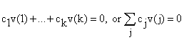 其中一些 c 不为 0。如果一组向量之间没有线性相关性，则称为**线性独立**，如果存在一个或多个线性相关性，则称为**线性相关**。

**例子：假设 v(1) = i + j；v(2) =2i；v(3) = 3j。**

那么 v(1), v(2) 和 v(3) 线性相关，因为存在关系

6v(1) = 3v(2) + 2v(3), 或者 6v(1) - 3v(2) - 2v(3) = 0

**练习 3.11 证明：任何 k + 1 个 k-向量都是线性相关的。（你可以通过使用数学归纳法来做到这一点。）（如果你不熟悉数学归纳法，请阅读这个解决方案并熟悉一下！）** 解答

## 3.6 极坐标

**一个二维向量 (x, y) 可以由两个不是求和系数的数字描述：它的长度和它的向量与 x 轴的角度。**

这两者中的第一个通常写作 r，第二个写作 。**

**这些参数遵循 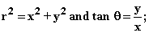

逆关系是 

r 和  被称为极坐标。**

计算极坐标中的角度  有点棘手；显而易见的尝试是 atan(y, x) 但是它只定义在 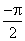 到  之间，而  的定义域大小为 2。

这里有一个有效的方法：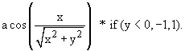

这给出了范围为 - 到  的 theta。如果你想要它的范围为 0 到 2，你可以给它添加 if(y < 0,8 * atan(1), 0)。

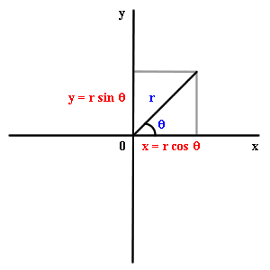

## 3.7 圆柱坐标和球坐标

**在三维中有两个极坐标的类比。**

**在圆柱坐标中，x 和 y 被 r 和  正好像在二维中一样描述，而第三维度 z 被视为普通坐标。**

**r 然后表示到 z 轴的距离。**

**在球坐标系中，** 一个一般的点由两个角度和一个径向变量描述，，代表到原点的距离：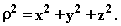

这两个角度变量与**经度和纬度**相关，但**纬度在赤道为零，而我们使用的变量 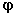 在 z 轴上为零（这意味着在北极）。**

我们定义 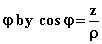，以使得 r 总是由 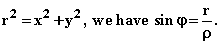 这里定义

经度角由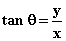**定义，与二维情况完全相同。** 因此我们有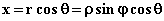**，y 是什么？**

**练习：**

**3.12 用 x、y 和 z 表示柱面和球面坐标的参数。**

**3.13 构建一个电子表格转换器，将坐标 x、y 和 z 转换为球面坐标的三个参数；反之亦然。通过将一个的结果替换为另一个的输入来验证它们的工作。**

## 3.8 �关于向量空间中长度和距离的离题

两个向量**v**和**w**之间的距离是差向量**v - w**的长度。

在世界上你会遇到许多不同的距离函数。我们这里使用“欧几里得距离”，其中我们使用勾股定理。

如果距离和长度的概念在没有额外描述的情况下被使用，这就是我们的意思：

**向量 w 的长度的平方是其分量的平方之和（或更一般地说，当分量为复数时，是其绝对值的平方之和）。它是点积（w，w）或 ww。**

但这并不是你在生活中会遇到的唯一距离概念。

向量的长度应具有哪些性质？

传统的要求如下：

它应为正，并且对于零向量为零。

它应遵守三角不等式：两个向量的和的长度不大于它们长度之和。

如果长度为 0，则向量为(0)向量。

**还有哪些长度或距离概念存在？**

**曼哈顿距离：** 向量的长度是其分量的绝对值之和。

**汉明距离：** 长度是非零分量的数量。

**最大分量距离：** 长度是最大分量的绝对值。

假设我们称分量为 x[i]，任何一个 dx[i]的小量，以及具有分量 dx[i]的距离值，我们称之为 ds。

然后在**欧几里得空间**中我们有**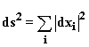。我们定义度量**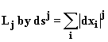。**

欧几里得空间可以被描述为**L[2]。**

**练习 3.14 在 L[j]的定义中，哪些 j 值对应于汉明、曼哈顿和最大分量大小？（提示：j 可以是无穷大；对于汉明距离，概念类似但并非完全相同，并且仅在极限情况下类似。）**

**在使用非直角坐标时的欧几里得空间中的长度：**

当你用极坐标描述欧几里得空间中的普通向量时，这些向量不遵守普通直角坐标的线性性质。例如，两个向量的和的长度不是它们长度的和，和的角度与 x 轴的角度也不是和的角度的和。

我们可以问，一个小向量的长度是多少，其端点之间的坐标差为 r 坐标 dr，角度差为 d？

如果我们在具有给定坐标的特定点，r 方向是指向远离原点朝向该点的方向，这个方向上的距离的测量方式与 x 或 y 方向上的测量方式相同。在这个方向上，具有坐标 dr 的向量的长度是|dr|。

方向垂直于 r 方向，逆时针方向增加，但距离不是 d。圆周的周长与圆的半径成比例，因此角向的距离也与 r 成比例。

结果是，极坐标中的距离由以下方式测量

**非正交坐标中的长度：**

任何 k 个线性无关的 k-向量都可以用作基础：**任何其他 k-向量都可以表示为它们的线性组合。（为什么？通过练习 3.11，任何其他 k-向量与它们线性相关，可以用基础来解决该 k-向量。）**

因此，在二维空间中，例如，任意两个具有不同方向的向量**a**和**b**可以形成基础，任何向量**v**都可以用这两个向量的系数来描述：如果**v** = s **a** + t **b**，那么我们可以用 2-向量（s，t）来描述**v**。

然而，如果我们描述欧几里得空间，向量**a**和**b**不是正交的，那么**v**的长度平方将不是 s² + t²。总的来说，如果我们定义（s，t）为**v'**，我们得到长度平方为<v'|G|v'>，其中矩阵 G 取决于**a**和**b**之间的角度。

因此，如果**a**和**b**是夹角为的单位向量，则矩阵 G 为

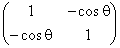

矩阵 G 被称为给定基础的度量张量。

**不同的度量：闵可夫斯基空间：**

甚至有些向量空间中，距离的概念被可以是正的或虚的东西所取代：这就是闵可夫斯基空间：它有四个维度，三个空间维度和一个时间维度。在其中，距离的类比由��描述。

ds² = dx² + dy² + dz² �c²dt²

具有正或负 s²的向量被称为空间样或时间样；s² = 0 的向量被称为位于“光锥”上。

**为什么有人要费心研究这些**？

在欧几里得空间中，坐标的线性变化具有不改变距离的特性（使得两点之间的距离在变化后仍然保持不变），这些变化称为空间中的旋转。在闵可夫斯基空间中类似的变化是麦克斯韦电动力学方程的对称性，并且对应于空间中的旋转和“洛伦兹变换”。因此，即使是最后这个概念也具有重要的物理应用。所有其他概念在适当的情境下也是如此。
