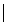
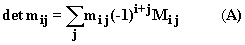
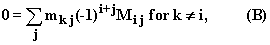
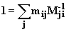
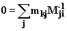
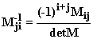
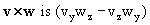
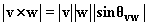

# 第四章：平行四边形的面积、行列式、体积和超体积，向量积

## 引言

我们考虑平行四边形的面积和平行六面体的体积以及二维和三维中行列向量作为边的图形的行列式概念。然后我们考虑矩阵应用于描述向量上的线性变换，并评估行列式的方法。

我们进一步讨论了矩阵的逆的概念以及如何计算它，引入了特征值和特征方程的概念，以及向量或叉乘。

## 主题

4.1  二维和三维中的面积、体积和行列式

4.2  矩阵和向量上的变换；零行列式的含义

4.3  通过高斯消元和通过行或列展开来评估行列式

4.4  行列式和矩阵的逆

4.5  向量积

4.6  特征值和矩阵的特征方程

## 4.1 二维和三维中的面积、体积和行列式

在二维空间中，由向量**v**和**w**限定的平行四边形的面积有一个简单的公式，其中**v** = (a, b)和**w** = (c, d)：即ad - bc

**为什么会这样？**

1\. 如果 b 和 c 为 0，那么以向量(a, b)和(c, d)为边的平行四边形的面积是|ad - bc|显然成立，因为平行四边形是边长为|a|和|d|的矩形，其面积为|ad|。

2\. **如果我们给(a, b)或(c, d)添加它们的倍数，面积和ad - bc都不会改变。**平行四边形只是倾斜，其底和高保持不变。例如，如果我们给 c 加上 a，那么 ad - bc 就变成 ad - b(c + a)，所以是-ba；但是如果给 d 加上 b，则产生的变化是 ab 到它；a(b + d) - b(c + a) = ad - bc，变化的净值为 0。

3\. 从任意的 a、b、c 和 d 开始，**通过反复添加其中一个行的倍数到另一个行，我们可以使 b 和 c 变为 0**，之后我们就处于第一段考虑的情况，我们知道面积是|ad - bc|。

4\. 由于这些添加没有改变面积，也没有改变|ad - bc|，所以这些必须从一开始就是相同的。

**矩阵的行是(a,b)和(c,d)的矩阵的**组合**ad - bc**称为**行列式**。通常写成

****

给定三维空间中的**三个**向量，我们可以形成一个 3×3 矩阵，其元素为它们的分量，并且我们将看到该矩阵的行列式的绝对值是由这三个向量确定的平行六面体的体积。

实际上，对于 k k-向量，类似的结果成立：它们的分量矩阵的行列式的绝对值是它们所界定的图形的 k-体积。

**那么一个矩阵的行列式是什么呢？**

**在任何维度中，行列式的定义如下：**

**1\. 行列式对任意行（或列）的元素是线性的，因此将该行中的所有元素乘以 z 会使行列式乘以 z，并且行为 v 和 w 的行列式等于除了该行为 v 和该行为 w 的行列式之外的所有其他行的行列式之和。**

**2\. 如果两行交换，则行列式的符号会改变（**等价条件是**如果两行相同则行列式为 0）。**

**3\. 对角线为 1，其他位置为 0 的矩阵的行列式为 1。**

k×k 矩阵的行列式的另一个定义是它是 k 维度中体积的“带符号”版本，因此是线性的。

行列式通常写作 det M 或| M |，有时候也写作|| M ||。

如果 v 和 w 是矩阵 M 的两行，我们可以从前两个条件推断，将 v 的倍数添加到 w 不会改变 M 的行列式。

由 u，v 和 w 的方向和长度确定的平行六面体的体积几乎与 u，v 和 w 成线性关系；它与线性度的不同之处仅在于它总是正的，就像一维中的长度一样。

如果向量长度为单位长度并且相互垂直，则该体积为 1，并且如果将一边加到另一边，则不会改变；（这只是使平行六面体倾斜而不改变其体积。）由这三个向量的分量形成的矩阵的行列式的绝对值完全遵循相同的条件，因此是同一件事情。

在更高维度中，体积的类比被称为超体积，通过相同的论证可以得出相同的结论：由 k 维度中的 k 个向量确定的平行边区域的超体积是行列式的绝对值，其元素是它们在（标准正交）基向量方向上的分量。

实际上，行列式可以被认为是超体积的线性和带符号版本。

考虑一个以 x 为变量的平行边区域的超体积。对于正或负的 x，它对 x 是线性的，但它总是正的，并且其图形看起来像一个 V，对于 x = 0 取值为 0。

行列式对于正或负的 x 是相同的超体积，对于另一个 x 是超体积的负，且对 x 是线性的。其**符号**由约定确定，即对于具有对角线为 1 且其他位置为 0 的**“单位矩阵”**，其行列式为正。该单位矩阵通常写作 I。

**练习：**

**4.0 证明上述论断：行列式在两行交换时改变符号的条件等价于另一条件，即当两行相同时行列式为 0（考虑到它对行的线性性质）。**

**4.1 假设 A、B 和 C 是平面上的三个向量。考虑三个三角形，其边分别是 A 和 B、A 和 C、A 和 B + C。它们的面积之间存在什么关系？（如果你没有看到，尝试一些简单的例子并推广。这里寻求的关系是一个或另一个的陈述。）关于行列式，其行是给定向量的分量（A 和 B）、（A 和 C）和（A 和 B + C）的，类似的陈述是什么？**

在下面的小程序中，您可以输入三个 3 维向量，看到它们及其定义的平行六面体，以及其绝对值为体积的行列式的值。我们很快将看到如何计算行列式。还显示了这些向量（或叉乘）对的向量积，它们将在**4.5 节**中定义。

<applet code="DeterminantVectorProducts" codebase="../applets/" archive="determinantVectorProducts.jar,go.jar,goText.jar,mk_lib.jar,parser_math.jar,jcbwt363.jar" width="760" height="450"></applet>

## 4.2 矩阵和向量的变换；0 行列式的含义

矩阵和行列式在另外两个重要的情境中出现；一个是在解多个变量的同时线性方程组时。另一个是在表示向量的线性变换时。其中第一个在第三十二章中有详细讨论。

在后一情境中，**矩阵表示将列基向量转换为矩阵对应列的向量的转换。**

**原始基向量的和被转换为相应列的相同和。** 这一事实定义了所有向量的变换。

**当矩阵的行列式为零时，由其列或行给出的区域的体积为零**，这意味着将基向量转换为线性相关的向量，并定义 0 体积的矩阵被考虑为一种转换。

当矩阵的列（和行）线性相关时，**行列式为零**。

**练习：**

**4.2 哪个矩阵描述了将 x 轴方向的单位向量转换为 y 轴方向的单位向量，类似地，将 y 轴方向的单位向量转换为 z 轴方向的单位向量，将 z 轴方向的单位向量转换为 x 轴方向的单位向量？**

**4.3 哪个矩阵描述了将向量在 x 方向的分量加倍，y 方向的分量减半，而 z 方向的分量保持不变的转换。**

**4.4 哪个矩阵描述了将向量投影到（x，y）平面的三维转换？投影到 x 轴？投影到（x，y）平面上的对角线？**

## 4.3 通过高斯消元和通过行或列展开来评估行列式

这一部分非常简略。有关更多讨论，请参见第三十二章。

**通过高斯消元法求行列式：** 通过将一行的倍数加到另一行，直到主对角线下的所有条目为 0，来进行这个操作。行列式（这些操作不会改变行列式）然后是对角线条目的乘积。机器可以对数百或数千的 n 阶矩阵进行这样的操作，但人们觉得这个练习有点乏味。

**行列式在行或列中的展开：** 让矩阵 M 具有元素 m[ij]。第一个索引描述行号，第二个描述列号。

M 的行列式是任意单行元素乘以一个因子的和。什么因子？

对于第 i 行的第 j 个元素，它是通过去掉该行和列得到的矩阵的行列式，乘以一个符号因子-1 到元素的索引之和，i + j

其中**M[ij]是通过消除第 i 行和第 j 列并将其余部分合并成一个方阵得到的矩阵的行列式。**

**为什么会这样？**

乘以 m[ij]的因子必须是其他行中的线性因子，并且如果其中两行相同，则必须为 0，因此它必须与它们的行列式 M[ij]成比例。（还因为行列式对第 j 列是线性的，所以这个项除了来自该列的 m[ij]外不能有其他因子。）

**那么，唯一剩下的问题是：为什么有符号因子？**

当矩阵的两行或两列具有相同奇偶性（这意味着两者都有偶数索引或奇数索引）时，您可以通过偶数次单行或单列交换来交换它们，而当它们具有相反奇偶性时，您需要奇数次交换。每次交换都需要一个符号变化，因此如果行和列索引的奇偶性不同，必须有一个符号变化，以使不同索引的计算保持一致。

注意我们还有

因为根据方程（A），这是一个矩阵的行列式，其中两行，第 i 行和第 k 行，等于 M 的第 k 行，而两个相同的行的矩阵行列式为 0。

公式（A）称为在第 i 行中展开 det M。同样的操作也可以在列中进行，甚至可以同时对几行或几列进行。

表达式（-1）^(i + j)M[ij]被称为矩阵 M 的 ij-th **余子式**。然后可以表述为：**M 的任意一行与该行中条目的余子式向量的点积是 M 的行列式。** 如果将“行”替换为“列”，同样的陈述也成立。

**练习：**

**4.5 评估矩阵的行列式，其行依次为（1, 2, 5），（3, 1, -2）和（4, -2, 7），使用上述每种方法。你觉得哪种方法更快？**

**4.6\. 对于一个随机但非平凡的 4 乘 4 矩阵，做同样的事情。哪个更快？**

## 4.4 矩阵的行列式和逆矩阵

方阵 M 的逆矩阵是一个矩阵，表示为 M^(-1)，满足 M^(-1) M = M M^(-1) = I。这里的 I 是与 M 相同大小的单位矩阵，对角线上为 1，其它位置为 0。

就变换而言，M^(-1)撤消了 M 产生的变换，因此组合 M^(-1)M 代表了什么变换都没有改变。

条件 MM^(-1) = I 可以写成

和

当 k 和 i 不同时，这些条件完全确定了给定 M 时矩阵 M^(-1)，当 M 具有逆时。

这些方程与 4.3 节的两个条件(A)和(B)具有相同的形式，不同之处在于在(A)中行列式 det M 位于左边，而不是 1，在(A)和(B)中出现的是(-1)^(i + j)M[ij]，而不是 M^(-1)[ji]。

因此我们可以将(A)和(B)两边都除以 det M，推导出

****

记住这里 M[ij]是通过省略 M 的第 i 行和第 j 列而得到的矩阵的行列式；M 的元素是 m[ij]，而 M^(-1)[ji]代表的是 M 的逆矩阵中第 j 行第 i 列的元素。

我们可以用文字表达为：**矩阵 M 的逆是其代数余子式组成的矩阵，行列互换，除以其行列式。**

**练习：**

**4.7 使用这个公式计算** 练习 4.4 **中矩阵的逆。检查乘积 M^(-1)M 以确保结果正确。**

**4.8 设置一个电子表格，使用这个公式计算任意非零行列式的三乘三矩阵的逆。

（提示：通过将前两行复制到第四行和第五行，将前两列复制到第四列和第五列，你可以一次性获得所有的(-1)^(i + j)M[ij]。然后剩下的就是重新排列以交换指标，并除以行列式（行列式是 M 的任意一行与相应余子式的点乘）。）**

## 4.5 向量积

两个 3 维向量**v**和**w**的**向量积**，记作**vw**，是一个 3 乘 3 矩阵的行列式，其前两列是向量**v**和**w**的分量，第三列是基向量**i, j**和**k**。

这个定义看起来有些神秘。但它的意思只是**在各个轴方向上的分量**是**这里的 i, j,**和**k**的代数余子式。这些是普通二乘二矩阵的行列式。

**vw**是一个向量而不是一个数，有时被称为**“叉乘”**的**v**和**w**的结果。

从这个定义中，我们可以看到**vw**与另一个向量**u**的点积是一个矩阵的行列式，这个矩阵的列（或行）是这三个向量的分量，按照**v, w, u**的顺序排列，这使得它的大小成为由这些向量确定的平行六面体的体积。

明确地，叉乘的 x 分量为。

其他分量可以通过在变量 x、y 和 z 之间循环移位来获得，将 x 变为 y，y 变为 z，z 变为 x。

**向量积**是根据行列式的性质**对其向量因子都是线性的**。因此，如果你将**v**乘以 10，**vw**也会乘以 10，而且你还有

**(v + z)w = vw + zw**

此外，**vw**如果其因子的顺序颠倒，则会改变符号：**vw** = - **wv**。这些陈述源自行列式的类似性质。

**vw 的大小是由其因子定义的平行四边形的面积，即**

**vw**垂直于其两个参数：**vwv** = **vww** = 0。这是因为具有两个相同列的矩阵的行列式为 0。

我们可以推断**(vw) (vw) = (vv)(ww) - (vw)(wv),** 因为这两边代表的是以**v**和**w**为边的平行四边形的面积的**平方**（见 Exercise 3.2）。

人类在计算 3x3 行列式或向量积时，大约每四次中就会出现数值错误，尤其是当向量分量或矩阵条目具有许多负值时。在电子表格上建立一个行列式和向量积工具，并用它来检查而不是替换你自己的计算是明智的。这样你每次都会得到正确的答案。

实际上，构建这样一个工具比手动进行叉乘要容易得多。这几乎和进行点积一样容易。要做到这一点，将 **v** 和 **w** 输入为两个平行行，比如将 v[x] 放在 A2，v[y] 放在 B2，v[z] 放在 C2，以及类似地将 **w** 的分量放在 A3-C3。在 D2 中输入 =A2，并将其复制到 D3、E2 和 E3。 （你现在完成了一半。）接下来，在 A4 中输入 =B2*C3-C2*B3，并将其复制到 B4 和 C4。就是这样！第四行包含 **vw**，**v** 与 **w** 的叉乘。你可以通过验证它与前两行中的任意一行的点积是否为 0 来检查。

请注意，现在你可以改变 **v** 和 **w**，然后（幸运的话）第四行将包含新的第二行和第三行的叉乘。

你可以从第 4.1 节的 applet 中看到向量积的样子。

**练习：**

**4.9 将向量积 vw 明确写出，用其因子的分量表示。**

**4.10 计算两个向量 (1, 2, 3) 和 (4, 5, 6) 的向量积。**

**4.11 按照上述指示构建一个向量积工具。**

## 4.6 特征值和矩阵的特征方程

**满足 Mv = xv（其中 x 是某个数）的向量称为矩阵 M 的特征向量，x 被称为 M 对应于 v 的特征值。（v 被称为对应于 x 的特征向量。）**

条件 M**v** = x**v** 可以重写为 (M - xI)**v** = **0**。这个方程表示矩阵 (M - xI) 将 **v** 转换为 **0** 向量，这意味着 (M - xI) 不能有逆矩阵，因此其行列式必须为 0。

方程 **det (M - xI) = 0** 是给定 M 的变量 x 的多项式方程。它被称为矩阵 M 的**特征方程**。你可以解它以找到 M 的特征值 x。

方阵 M 的**迹**，**写作 Tr(M)**，是**其对角元素的和。**

一个 2x2 矩阵 M 的特征方程形式为

x² - xTr(M) + det M = 0

一旦你知道矩阵 M 的特征值 x，就有一种简单的方法可以找到对应于 x 的列特征向量（当 x 不是特征方程的多重根时有效）。我们将其描述为 3x3 矩阵，但可以推广应用于任何大小的方阵。为此，**取 (M - xI) 的任意两行的叉乘。**

如果它不是 **0** 向量，那么它就是列特征向量！

**为什么这样做有效？**

**v** 是矩阵 M 的列特征向量的条件是 (M - xI)**v** = **0**。

(M - xI)**v** 的分量是 (M - xI) 的行与 **v** 的点积。

如果 **v** 是 (M - xI) 两行的向量积，那么它肯定与这两行的点积为 0。

另一方面，它与 (M - xI) 的另一行的点积是 (M - xI) 的行列式，也是 0。

我们可以推断出，任意两行的向量积 (M - xI) 与 (M - xI) 的每一行都有 0 的点积，这是**v**是 M 的一个特征向量，对应于特征值 x 的条件。

问题可能出在哪里呢？嗯，向量积可能是**0**。如果其中一行是另一行的倍数，这种情况就会发生。如果两个不同的行对都发生了这种情况，这意味着所有行都是彼此的倍数，这意味着垂直于任何非全零行的每个向量都是特征向量。

**练习：**

**4.12 为行 (1, 2) 和 (3, 4) 的矩阵写出特征方程。**

**4.13 对于行 (1, 2, 5)，(3, 1, -3) 和 (4, -2, -8) 的矩阵也做同样的事情。**

**4.14 找到该矩阵的一个特征值。（提示：有一个是相当简单的数字。）**

**4.15 找到与之对应的一个列特征向量。**
