# 第五章：二维和三维中的向量与几何

## 介绍

我们研究了三维空间中的平面和二维和三维空间中的线的各种描述，以及描述点、线和平面之间相互关系的向量的使用。 我们还研究了向量三重积的性质。

## 主题

5.1  一些问题

5.2  线或平面的表示：初步说明

5.3  二维和三维中线的表示

5.4  三维中平面的表示

5.5  投影与应用

5.6  向量三重积

5.7  关于向量和平面的事实回顾

## 5.1 一些问题

这里有一些我们将要讨论的问题。

我们如何描述二维中的一条线或三维中的一条线或平面？

如何找到一条线上或平面内的点？

一个点与一个平面之间的距离，或者与一条线？

三维空间中两条斜线之间的距离？

平行线之间的距离？

一个点在一条线或平面上的投影？

所有这些都可以通过适当定义和操纵向量来回答。

## 5.2 线或平面的表示：初步说明

一个单一线性方程可以用来解出一个变量，其余变量的值用其他变量表示。 它将解的维度降低 1。

因此，**三维空间中平面中的点将是一个线性方程的解。在二维中，一个线性方程确定一条线，而在三维中，需要两个方程来确定一条线。**

形式为 ax + by + cz = d 的线性方程可以写成点积 **v****r** = d，其中**v**是向量(a, b, c)，**r**是(x, y, z)。

因此，对其的解决方案在**v**方向的分量上都具有相同的值，并且在**v**的垂直、法向或正交方向上**不确定**(所有这些词都是指同一件事)。 因此，**v**是从一个解到另一个解的向量的法线。

**线可以通过给出其上的两点的坐标来描述**（在任何空间），而**平面可以通过给出三个不全位于一条直线上的点的坐标来描述。**

此外，我们可以通过给出其上的任意一点和指向其方向的向量来描述**一条线。**

同样，我们可以通过给出一个点和从该点开始指向平面上其他点的两个线性独立向量来描述**平面上的点。**

我们现在来研究各种线和平面的各种特征之间的关系。

## **5.3 二维和三维中线的表示**

**线 L 上的两点 P[1]和 P[2]确定了 L。**

**L 可以被参数化描述为具有坐标 P[1] + s * (P[2] - P[1])的点集，其中 s 是某个数字。**

**（P[2] - P[1]）是指向 L 方向的向量。**

在二维空间中，向量是二维向量，只有一个垂直于 L 的方向，并且可以通过交换(**P[2] - P[1]**)的坐标并改变一个符号来获得该方向（因此(7，-4)垂直于(4，7)）。

使用垂直向量**N**，线的方程变为**N****r = N****P[1].**

**我们明确地做出了这个。L 由遵守的点组成**

x� = P[1x]� + s * (P[2x] - P[1x] )

y� = P[1y]� + s * (P[2y] - P[1y] )

而 L 的方程是

（P[2y] - P[1y] ) x - (P[2x] - P[1x] )y = (P[2y] - P[1y] )P[1x] - (P[2x] - P[1x] )P[1y]

当求解 y 时：

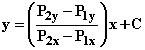对于某个常数 C。

**比值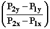，即线的方程中 x 的系数，是两点的 y 坐标之差除以 x 坐标之差。** 它被称为**线 L 的斜率**。

常数 C 称为线 L 的 y 截距。它是 L 与 y 轴相交的地方的 y 值。

<applet code="SlopeOfLine" codebase="../applets/" archive="slopeOfLine.jar, mk_lib.jar, parser_math.jar, jcbwt363.jar" width="760" height="450"></applet>

在三维空间中，一条直线由两个方程确定。您可以像上面那样参数化描述它（尽管现在所有点和向量都有三个分量），但是您必须找到**（P[2] - P[1]）**的两个垂直向量以找到表征它的方程。您可以自由选择这样做，但是两个方便的选择是：

**i****( P[2] - P[1]) ** 和 **j(P[2] - P[1])**

您可以要求这两者与**r**（回忆**r** =（x，y，z））的点积与**P[1]**相同。这给您提供了两个共同确定直线的方程。

从方程中找到一条直线上的点，您可以任意固定一个坐标，然后解另外两个坐标的方程。

以下小程序允许您输入任意两点。然后，它会显示您的点确定的三维空间中的直线，以及该直线的参数表示。

<applet code="LinesInSpace" codebase="../applets/" archive="linesInSpace.jar,go.jar,goText.jar,mk_lib.jar,parser_math.jar,jcbwt363.jar" width="760" height="450"></applet>

**练习 5.1 找出此小程序中默认直线的两个方程。然后选择两个随机点，并找出它们所在直线的两个方程。**

## 5.4 三维空间中的平面表示

我们现在解决问题：**用点，一个点和一个向量，或者一个方程来描述平面的不同方法之间的关系是什么？**

假设点**P[1], P[2,] P[3]**位于平面 Q 上，它们不全在一条直线上。

然后向量 **P[2] - P[1]** 和 **P[3] - P[1]** 在 Q 中具有方向，Q 中的任意点将具有 **P[1]** + s (**P[2] - P[1]) +** t **(P[3] - P[1])** 的坐标，其中 s 和 t 是一对值。

这被称为具有参数 s 和 t 的平面的**"参数化"表示**。

(s 和 t 可以被认为是在由 (**P[2] - P[1])** 和 **(P[3] - P[1])** 给定的基底中的平面上的点的分量。)

你可以通过取叉积 (**P[2] - P[1])(P[3] - P[1])** 来计算 Q 的法线。

我们通过定义缩写来简化

**N** = (**P[2] - P[1])(P[3] - P[1]) = P[2]P[3] + P[3]P[1] +P[1]P[2]**

**因此平面的方程为**

**N****P = NP[1]**

其中 P = (x, y, z)。

您可以明确写出这个方程

N[x] x + N[y] y + N[z] z = (N, P[1]) = (N[x]P[1x] + N[y]P[1y] + N[z]P[1z])

通常，但不是必要的**对 N 进行 "标准化"**，即用 **n** 替换它，其中 **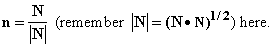**

在实践中，平面通常由一个法向量描述，如这里的 **n**，以及其中的一个点。

我们从三个点开始，从中得到了平面的参数表示。然后从该表示中找到描述平面的方程。

如果我们可以通过这个方程从 Q 的描述回到三个点，我们将能够完全绕一圈并从任何其他点找到 Q 的任何表示。

Q 中有无限多个点，选择其中三个需要做出任意决定以确定其中三个。

如果 **N** 的三个分量都非零，我们可以将每对变量设为零并解出第三个。然后三个点将是

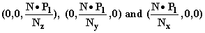

这些是平面与三个坐标轴相交的点。

从这些点出发，您可以再次绕圈，确定 Q 的任何表示。

在这个 applet 中，您可以输入三个任意点，它将找到并显示平面，显示 **N, (N, P[1])**，以及平面上点的参数表示。您可以做所有这些事情，除了制作图片。

<applet code="PlanesInSpace" codebase="../applets/" archive="planesInSpace.jar,go.jar,goText.jar,mk_lib.jar,parser_math.jar,jcbwt363.jar" width="760" height="450"></applet>

**练习：**

**5.2 写出此 applet 中默认平面的方程，并找到在该平面上具有两个 0 坐标的三个点。**

**5.3 从三个随机点开始，按照这个步骤找到 N 和平面与坐标轴相交的点。**

**5.4 建立一个电子表格，每当 N 的所有分量都不为零时就执行此操作。**

当 N[z]不为零时，我们可以解方程得到平面的方程，**N****P = N****P[1]** 关于 x 和 y，得到

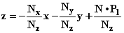

这里的 x 和 y 的系数对我们来说特别有趣。如果你固定 y，那么我们的三维空间就变成了一个平面。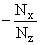 然后代表着**我们的平面与方程描述的平面的交点处的线的斜率：y = constant。** 在这个情况下，交换 x 和 y 后，同样的陈述成立。

**5.5 找到您在练习 5.3 和 5.4 中描述的平面的两个斜率（y 固定和 x 固定）。**

## **5.5 投影与应用**

如果你从一个点向一条线或平面垂直投影，你到达该线或平面上的点被称为**该点到该线或平面的投影**。

假设我们有一个点**P'**，一条线 L 和一个平面 Q。假设 L 由两个点**P[1]**和**P[2]**描述，Q 由法向量**N**和一个点**P[3]**描述。

在将向量概念应用于几何情况时，有一个基本事实是相当简单而极其有用的：

**向量 A 在向量 B 上的投影由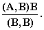给出**

**为什么会这样？**

因为它是一个在 B 方向上的向量，其长度是 A 的长度乘以 A 和 B 之间的角度的余弦，这正是这个投影所代表的。

**我们如何利用这个事实？**

假设我们想要找到**P'到 L 的投影**。我们可以将 P'写成**P' - P[1] + P[1]**，其中**P' - P[1]**是一个向量。如果我们将**P' - P[1]**投影到**P[2] - P[1]**上，那么（**P[1]**加上这个投影）将在 L 上，并且是我们想要的点。

因此答案是

**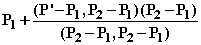**

如果我们想要**P'到 L 的距离**，我们可以从 P'减去这个点。得到的向量的长度就是我们要找的答案。

假设我们想要找到**P'到 Q 的距离**。这将是**P[3] - P'**在**N**上的投影的长度。

P'在 Q 上的投影可以通过将**P[3] - P'**在**N**上的投影加到 P'上获得。

两条直线之间的距离就是两条直线上的一个点之间的向量的投影长度，该向量在每个点上的向量的叉乘方向上。如果两条直线是平行的，则这不起作用，因为这里需要的叉乘将是零向量。

如果直线平行，你可以形成一个从一条直线上的一个点到另一条直线上的一个点的向量，将其投影到直线方向的一个向量上，并将这个投影从中减去。得到的向量将垂直于直线，其长度将是所需的距离。

因此，如果你知道如何将一个向量投影到另一个上，并保持头脑清醒，你可以回答 5.1 节中提出的所有几何问题。

**练习：**

**5.6 绘制一个适当的图片并找到计算以下各项的公式：

然后根据以下输入计算答案：

P' = (1, 2, 3), P[1] = (1, 0, 0), P[2] = (1, 1, 1), P[3] = (-1, 2, -1), N = (2, 1, 4) , P[1]' = (-1, 4, 3), P[2]' = (2, 3, 4), P[1]" = (6, 0, 3), P[2]" = (6, 2, 6).**

**5.7\. 将点 P' 投影到线 L（包含 P[1] 和 P[2]）。**

**5.8 将点 P' 投影到平面 Q（法线为 N，包含 P[3]）。**

**5.9 点 P' 和 Q 之间的距离。**

**5.10 点 P' 和线 L 之间的距离。**

**5.11 三维空间中两条斜线 L 和 L' 之间的距离（包含 P[1]' 和 P[2]'）。**

**5.12 三维空间中两条平行线 L 和 L" 之间的距离（包含 P[1]"和 P[2]"）。**

## 5.6 矢量三重积

具有边长 **A**，**B** 和 **C** 的平行六面体的体积是其底面的面积（比如面积为 |**BC**| 的平行四边形）乘以其高度，即 **A** 在 **BC** 方向上的分量。 这就是 **ABC;** 但它也是由列为 **A**，**B** 和 **C** 的矩阵的行列式，所以这里向量的线性函数是相同的，直到符号相同。 通常的符号约定给出

**A(BC) = det(A, B, C)**

通过循环排列向量（例如到 **B**，**C**，**A**）或通过反转点积因子的顺序，这个乘积不会改变。

我们可以推断出 **ABC = CAB =** **ABC.** 换句话说，**我们可以在不改变这个实体的情况下交换点积和叉积。**（当然，你必须先进行叉积运算。）与行列式一样，如果你只是反转叉积中的向量，这个乘积会改变符号。

矢量三重积 **A****(B****C**) 是一个向量，是法线于 **A** 和法线于 **B****C** 的，这意味着它在 **B** 和 **C** 的平面上。它在所有三个向量上都是线性的。

我们可以推断它是**B**的一个关于**A**和**C**的线性倍数加上**C**的一个关于**A**和**B**的线性倍数，条件是它与**A**垂直。

任何**B(A****C) - C(A****B)**的倍数都将满足所有这些条件。

什么是**A****(B****C**)**的倍数？

假设**A(BC**) **= q(B(AC) - C(AB))**成立。

早些时候我们看到一个具有边长为**A**和**B**的平行四边形的面积的平方可以写成**（AA)( BB) - (AB)( AB)**或者(**B****A)****(B****A)**。通过在右边的点和第一个叉积处交换，您可以将这个等式重写为

(**B****A)****(B****A) = B****(A****(B****A)) =(A****A)( B****B) ) - (A****B)( AB)**

如果我们在**A(BC)**中将**A**和**C**标识为相同的，并且将**A****(B****A)**与**B**进行点积，我们得到 q = 1，然后我们得到

**A****(BC**)� = **B(AC) - C(AB)**

*这有时被称为**后车法则**，以便更容易记住适当的符号。当使用这个名称时，请记住这里的括号都尽可能地在表达式的最后。在不记住任何内容的情况下正确获取这里的符号的最简单方法是猜测一个符号，然后在**A = i = C，B = j**的情况下检查它。*

**练习 5.13 假设我们有一个三维空间中的向量 A 和一个未知向量 v，但我们知道 Av 和 Av。我们能找到 v 吗？是的！怎么做？**

## 5.7 向量和平面事实回顾

这里是你应该对这些事物感到舒适的关键事实清单。

向量的每个分量分别相加。

通过将向量的每个分量乘以该数字来将向量乘以一个数字。

标量（点）积对每个参数都是线性的（因此您可以在其上使用分配律）。

标量积是通过将相同分量相乘然后求和来计算的。

标量积是两个向量参数的长度与它们之间夹角的余弦的乘积。

行列式在每一行和每一列中都是线性的，其大小是由其列（也由其行）确定的平行四边形或平行六面体的面积。

如果交换其两列，行列式的符号会改变。

作为单个元素 a[ij] 的函数，行列式的形式为 det(A) = ra[ij] + s；（它是一个具有非齐次项的线性函数）

系数 r 是 ij-**余子式**：从 A 中移除第 i 列和第 j 行后得到的矩阵的行列式，乘以 (-1)^(i+j)。

行列式可以通过行变换或在列或行上展开来求值。

两个向量的向量积是通过将它们的分量作为矩阵的前两列，并取其行列式来获得的向量，其中**i, j, k**是第三列。

向量积垂直于其向量因子，在三维空间中的大小是它们的平行四边形的面积。它还与其因子向量是线性的。

二维空间中的一条直线可以通过参数方程或线性方程来描述。

三维空间中的平面可以通过方程来描述，或者其点可以通过具有两个线性参数的公式确定。

如果一个平面的方程是 az + by + cx = d，它的方程也可以写成 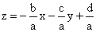。

量 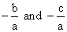 分别称为 z 在 x 和 y 方向上的斜率。在二维空间中没有 z，斜率类似于 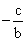。
