# 第六章：可微函数、导数和微分

## 介绍

我们介绍了可微性的概念，讨论了标准函数的可微性以及不可微行为的示例。然后我们描述了两个变量函数的可微性、方向导数、偏导数、切平面和梯度。一些哲学含义也被讨论了。

## 主题

6.1  可微性、切线-线性近似

6.2  标准函数的可微性

6.3  非可微行为示例

6.4  二维导数：方向导数和偏导数

6.5  切平面和梯度向量

6.6  梯度和方向导数

6.7  哲学含义

## 6.1 可微性、切线-线性近似

一元实变量函数 f 在参数 x 处被称为**可微的**，**如果其图形在任何包括 x 的开区间内的参数看起来像一条直线**。（开区间是不包含其端点的区间。）

**它在 x 处的导数是该直线的斜率。**

（更确切地说，无论您选择多小的正近标准，都存在一个包含 x 的开区间，以便于该区间中除 x 本身之外的每个 x'，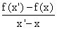 与该直线的斜率之差小于该近标准。）注

在参数 x 处，f 类似于的线称为**f 在参数 x 处的切线**，它表示的线性函数称为**f 在参数 x 处的线性近似**。

在 x 处切线的斜率由该线上任意两点 P[1] 和 P[2] 的 给出，其中 P[1] = (P[1x], P[1y])，P[2] = (P[2x], P[2y])

df = P[2y]- P[1y]

dx = P[2x] - P[1x]

我们使用符号**dx**和**df**来表示对应变量的变化，这种变化非常小，以至于我们可以假设**对于 f（以及定义 f 的任何其他函数）的线性近似是精确的满足**（如果没有这样的距离，请在您的想象中创建一个）。

这种变化称为**微分**。f 在参数 x 处的导数通常写作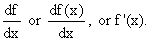

实际上，如果 df 和 dx 是微分，那么根据定义，导数是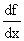，因为导数是线性近似中 f 的变化与 x 的变化的比率。

此处的小程序允许您输入任何标准函数和定义域，并查看它，它的斜率和导数。

<applet code="DerivativeTangentLine" codebase="../applets/" archive="derivativeTangentLine.jar,mk_lib.jar,parser_math.jar,jcbwt363.jar" width="760" height="450"></applet>

## 6.2 标准函数的可导性

所有标准函数在某些奇异点处可导，具体如下：

多项式在所有自变量处可导。

有理函数 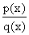 在 q(x) = 0 处不可导，函数在那里趋向无穷大。这发生在两种方式中，由 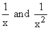 演示。

正弦、余弦和指数函数在所有点可导，但正切和割线在某些值处是奇异的。（在哪里？）

诸如 x^(1/2) 和 x^(1/3) 的幂函数的反函数在它们定义的地方可导，除非它们的逆函数在那里的导数为零。

## 6.3 非可导行为的示例

函数发生跳跃时在跳跃处不可导，也不可导的是具有尖点的函数，就像 |x| 在 x = 0 处那样。

通常，最常见的非可导行为形式涉及函数在 x 处趋向无穷大，或者在 x 处跳跃或出现尖点。

然而也有一些更奇怪的情况。例如，函数 sin(1/x) 在 x = 0 处是奇异的，即使它总是位于 -1 和 1 之间。很难说它在 0 附近的行为如何，但它肯定不像一条直线。

如果函数 f 的形式为 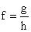，如果 h 在那里消失，f 通常会在参数 x 处奇异，h(x) = 0。但是如果 g 在 x 处也消失，那么 f 通常在 x 附近表现良好，尽管严格来说在那里是未定义的。

我们通常在这种情况下定义 x 处的 f 为 x 很接近的地方的线性近似到 g 和 h 的比值，这意味着我们定义 f(x) 为 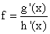，当然，这里的分母不会为零。（如果分母为零且分子也为零，则可以尝试类似地定义 f(x) 为这些导数的比值，依此类推。）

这种情况，即函数在孤立点处未定义，称为 "可去奇点"，刚才讨论的消除它的程序称为 **"洛必达法则"**。

一个例子是 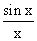 在 x = 0 处。

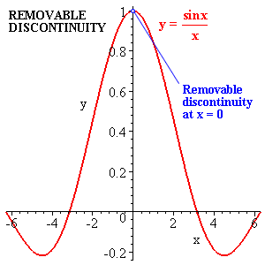                         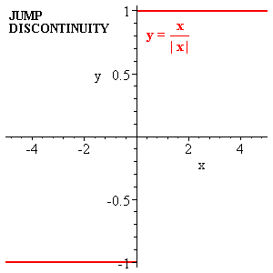

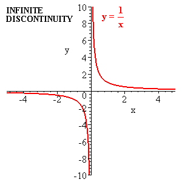                         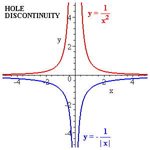

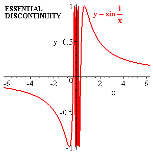

**连续但非可导函数**

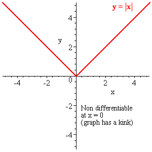                         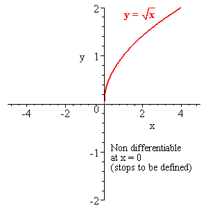

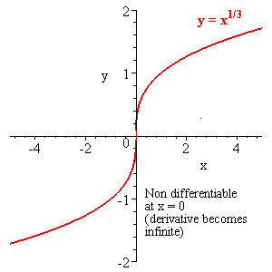

## 6.4 二维导数：方向导数和偏导数

假设我们有一个两个变量的函数 f(x, y)。

这些东西有时被称为**标量场**。（标量表示它们不是向量，场表示有两个或更多变量。）

我们可以在 xy 平面中选择一条特定的线（例如 x = x[0] + rcos, y = y[0] + rsin），并考虑 r 的函数（其他所有内容固定）：f(x[0] + rcos, y[0] + rsin）。

**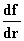** 然后被称为**在 xy 平面上以 tan斜率方向上在(x[0], y[0])处 f 的方向导数**。

**换句话说，我们可以通过在 xy 平面中选择任何特定的线，将 f 简化为在该线上定义的单个值的函数，并定义该单变量函数关于该线上的距离的导数。**

这个导数称为**沿着该线方向的 f 的方向导数**。（您可以在 applet 中查看两个变量函数的方向导数。）

f 关于 x 轴方向的方向导数称为**关于 x 的偏导数**，并写为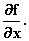

类似地，f 在 y 轴方向上的方向导数称为**关于 y 的偏导数**，并写为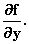

这些偏导数的计算方式与普通一维导数完全相同。计算关于 x 的偏导数时，将 y 视为常数，并且与一维情况下完全相同地对 x 进行微分。

## 6.5 切平面和梯度向量

我们定义二维可微性如下。**如果两个变量的函数 f 在参数(x[0], y[0])处的曲面在(x, y, f)空间中对于接近(x[0], y[0])的参数看起来像一个平面，那么我们称其在该参数处可微。**

（给定任何正数标准，存在一个以(x[0], y[0])为中心的圆，在该圆内，其图形与平面之间的差异小于该标准。）

回想一下，f, x 和 y 变量的平面由一个线性方程定义，可以写成以下形式

f(x, y) = a (x - x[0]) + b (y - y[0]) + f(x[0], y[0])     (A)

这里 f 类似的平面称为**在(x[0], y[0])处 f 的切平面**，它代表的函数称为**在(x[0], y[0])处定义的 f 的线性近似**。

量 a 和 b 被称为**关于 x 和 y 的偏导数，并写成如下形式**

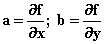

这里 a 是 f 在 x 轴方向的方向导数，**i**，而 b 是 f 在 y 轴方向的方向导数，**j**。

因此，在参数 x[0]和 y[0]处描述 f(x, y)的线性近似，描述在(x[0], y[0])处的 f 的切平面，因此采用以下形式

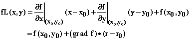

其中向量**grad** f，称为**在(x[0], y[0])处 f 的梯度向量**，是在点(x[0], y[0])处 f 在 x 和 y 方向的偏导数的向量

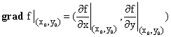

我们通常不写出指示梯度和线性近似定义点(x[0], y[0])的繁琐下标，因为它们太繁琐了，只需写成

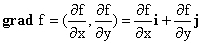

注意我们可以将**grad** f 写成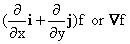，其中符号称为“del”，表示组合。

## 6.6 梯度和方向导数

我们已经看到上面的 2-矢量

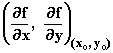

被称为**在参数(x[0], y[0])处 f 的梯度**，通常写为**grad** f 或**f.**

在点(x[0], y[0])处由 f 定义的曲面的切平面方程可以用梯度描述为

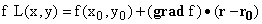

从这个方程我们可以推断，切平面的法线在三维空间中的方向是(**grad** f, -1)的方向。

这个法线在(x, y)平面上的投影就是**grad** f 本身。

因此，**grad f 在投影到 f 在(x[0], y[0])处的切平面的法线到(x, y)平面的方向。**

这种关系可以在下面的小程序中看到。

符号**被称为“del”。** 它是一个奇怪的矢量算子。单独来看，它的意义和单手拍掌的声音一样难以理解。但放在可以作用其导数的东西旁边，它就变得很有意义。

在点(x[0], y[0])处对 f 的线性近似 fL 的方程使我们能够计算该点的 f 的方向导数。

假设我们寻求 f 在由单位向量**u**定义的方向上的方向导数。那么如果(**r** - **r[0]**) = s**u**，那么 f 在该方向上的方向导数（在(x[0], y0)附近接近 fL）就是对 s 的 fL 导数。

但我们有

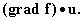给出

如果 f 是一个更多变量的函数，比如 x、y、z、t，......我们可以用完全相同的方法来描述变化，唯一的区别是切线平面变成了切平面，而且有更多方向的偏导数。结论完全相同：

**1\. 梯度向量在法线投影的方向上进入坐标的超平面。**

**2\. 任意方向的方向导数由该方向上的单位向量与梯度向量的点积给出。**

**3\. 梯度向量在任意轴方向上的分量是 f 对应距离变量在该方向上的偏导数。**

**4\. 那个偏导数是假定所有其他变量保持不变的情况下，对那个变量的普通导数。**

所有这些的结果是，梯度向量，其分量可以通过普通的一维微分来计算，对于任意维度的场，都是计算其任意方向的方向导数所需的一切。

如果这些概念对你来说很奇怪，那就在下面的小程序中玩耍，直到你感觉舒服为止。左侧的图显示了右侧所表示的场限制在右侧所示的切割半平面上。在那一半平面的边缘也显示了它的线性近似。该线性近似的斜率是在那一半平面的边缘处的场的方向导数。

（当然，所显示的不是一个确切的半平面，而是一个矩形。在此感兴趣的边缘是第三个滑块的旋转轴。）

<applet code="DirectionalDerivatives" codebase="../applets/" archive="directionalDerivatives.jar,go.jar,goText.jar,mk_lib.jar,parser_math.jar, jcbwt363.jar" width="760" height="450"></applet>

## 6.7 哲学含义

上面在二维中的讨论展示了关于导数的一个重要事实，这个事实既解释了微积分的有用性，也解释了我们能够计算所有标准函数以及其他函数的导数。

**事实是：在线性近似中，即微分和导数的领域中，从两个不同原因引起的可微函数的变化，比如从 x 的变化和 y 的变化，并不相互作用，它们只是简单地相加，如上述** 方程（A） **所述。**

这一事实的一个含义是，在计算导数时，你可以将函数分析成简单的部分，计算由每个部分的变化导致的导数，并从每个原因中累加，得到整个函数的导数。

例如，恒等函数 f(x) = x 显然遵循 df = dx 和 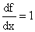，如果 c 是一个常数，而 f = cx，我们有 df = cdx 和 f ' = c：这种情况下斜率为 c 的切线就是 f 本身。

换句话说，当作用于 x 或 cx 时，取导数的作用是将因子 x 替换为 1。

现在假设我们考虑 f = x^n，其中 n 是某个正整数。这是 n 个因子中的每一个都是 x 的乘积。对于任何一个因子进行导数，其他因子保持不变，得到的和就是我们的事实，关于 x 的 f 的导数。我们得到

n 来自于将 n 个不同因子中的每一个替换为 1。

作为第二个示例，假设 f = g * h，函数 f 是 g 和 h 的乘积。

那么由于单独改变 g 而导致的 f 的微分变化将是(df)[h 固定] = (dg) * h，由于单独改变 h 而导致的将是(df)[g 固定] = g * dh。我们可以得出结论，f 的一般变化将是这些的和：df = dg * h + g * dh，这意味着 f ' = g' h + gh'。

另一个同样重要的事实的重要含义是，当你面对一个依赖于许多参数的未知函数时，你可以在考察函数关于任何事物的导数时，**单独模拟函数相对于每个参数的变化**，从而得到函数在任何变量的微分变化下如何变化的相对简单的模型。

然后，您可以希望通过对您建模的微分变化**“积分”来发现函数在参数实际变化下的实际行为**。

这种方法的替代方案是直接对参数进行实际变化的影响进行建模，这要困难得多。由于来自不同来源的变化相互作用并且可能变得非常难以建模，这一点使情况变得复杂。

虽然我们研究已知函数的导数以发展对该主题的理解，但微积分的深刻用途在于帮助我们通过这种“分析”过程确定未知函数：对其微分变化进行建模，然后“积分”它们。

牛顿发明了微积分来研究行星和受各种力作用的运动体的运动，并取得了令人难以置信的成功。

**练习：**

**6.1 导数 applet 展示了您可以输入的任何函数的导数。** **输入函数(sin x)² 在 -4 和 4 之间，看看您是否能找到其导数为 1/2 的点。**

**6.2 在 x = 1 处你找到了什么导数？导数为 0 的位置在哪里？**

**6.3 一个具有两个变量的函数在某点具有对 x 和 y 的偏导数是否意味着它在那里可微？**

**6.4 一个函数在某点所有方向都有方向导数，是否意味着在那点可微？**

（提示：考虑在 x = y = 0 时的 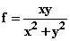。）**

**6.5 鉴于(sin x)' = cos x，我们可以如何定义在 x = 0 时的 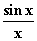？在 x = 0 时的 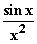呢？**

**6.6 函数 (x²+y²) sin x 的梯度是什么？在点 x = 1, y = 2 处沿着向量 (1, 1) 的方向导数是多少？**
