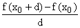
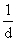
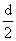
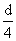
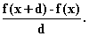
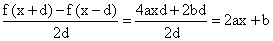
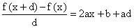
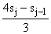
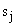
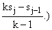

# 第七章：从定义中计算导数

## 引言

我们讨论了在电子表格上计算导数的方法，重点是重复使用对称逼近法，指数级递减的 d 并推断结果。

## 主题

7.1  引言：显然的逼近法：f'(x) ~ (f(x+d) - f(x))/d

7.2  四舍五入误差和导数

7.3  对称逼近法：f'(x) ~ (f(x+d) - f(x-d))/(2d)

7.4  推断答案序列

## 7.1 引言：显然的逼近法：f '(x) ~ (f(x+d) - f(x)) / d

假设我们有一个给定的函数 f，并且我们寻求其在参数 x[0] 处的**导数**。

一种估计它的方法是在两个点 x[1] 和 x[2] 处评估 f，然后检查从 (x[1], f(x[1])) 到 (x[2], f(x[2])) 的线的斜率。但是我们应该如何选择 x[1] 和 x[2]，以及我们将学到 f '(x[0]) 的什么？

人们首先想到的选择是设置 x[1] = x[0]，并且 x[2] = x[0] + d，其中 d 是一个非常小的值。因此可以计算

这不是一个可怕的做法，但是也不是很好，我们会看到。

**问题在哪里？**

如果 d 太大，线性逼近法将不准确，如果 d 太小，你的计算工具的不准确性可能会毁掉你的答案。而从太大到太小的过渡可能很难找到。

## 7.2 四舍五入误差和导数

**d 太小会导致什么问题？**

通常计算器、计算机或手工计算的结果并不完全准确。会有非常小的误差。通常，这些非常小的误差（称为**四舍五入误差**）可以忽略，因为它们在你的评估中所代表的“噪音”与 f 的值相比极其小。（一个值得注意的例外是当你的答案是 0 时；那么机器的答案将只是它产生的错误。）

一般来说，如果你取两个非常相似的数字，如 f(x[0] + d) 和 f(x[0])，然后取它们的差值，那么这个差值将远远小于任何一个数字，并且由差值表示的信号的信息因此远远小于任何一个数字所表示的信号，而噪声水平通常保持在相同水平上，用于差值的项和差值。

将减法结果除以一个非常小的 d（这相当于乘以一个巨大的 ），将信号和噪声放大在一起。最终结果是你得到了预期的答案加上大量的噪声，而你使 d 越小，噪声就会越大，这种影响会使你的计算不准确。

如果你将 d 设定为低于你的计算机计算的准确度，你的答案通常会偏离超过 1，或者当你除以 d 时，你的程序会指责你除以 0。

电子表格允许你对大量不同的 d 值进行这种计算，而实际上所需的工作量*不超过进行一次这样的计算*。这通常使你有能力自己查看并确定舍入误差导致的重大误差出现在哪里。

只有当你计算的答案偏离正确答案太远，以至于这种效果变得明显时，你才会受到这种影响的困扰。因此，我们试图利用一些技术，使我们能够尽可能大地得到准确估计的 d 值。

**怎么回事？**

在电子表格的一行上设置一个 d 值的计算，然后在下一行上设置 d =旧的，并将结果向下复制至所需的行数。你将得到以替换的 d 重复的计算结果，然后是，然后是,...，直到所得到的值太小以至于你的机器无法将其识别为 0 以外的值。

如果你对导数的估计能够接近一个值并保持在那里，那很可能就是你寻找的导数。不幸的是，这并不总是发生。估计值倾向于接近然后再次远离，因为舍入误差的影响开始显现。

（幸运的是，现代计算机在计算时保留了比屏幕显示更高的精度，因此你可以容忍一定程度的舍入误差而不会注意到它。）

然而，有一件事情要好得多，通常可以接近你寻找的导数的值，并且不需要更多的工作！而不是计算！自己试试。

## 7.3 对称逼近：f '(x) ~ (f(x+d) - f(x-d)) / (2d)

**使用这个公式对导数的“d-逼近”比使用天真的公式效率高得多**

**为什么它更好呢？**

答案是，如果 f 是一个二次函数，那么“对称公式”就是完全正确的，这意味着它的误差与 d²或更小的值成正比，随着 d 的减小而减小。天真的公式对于二次函数是错误的，并且产生与 d 成正比的误差。

为什么呢？

假设 f 是一个二次函数：f(x) = ax² + bx + c。

然后我们得到

f(x + d) = a(x + d)² + b(x + d) + x

和

另一方面，我们得到

这意味着对于任何二次函数的任何值的 d，对称逼近都是精确的；不需要使 d 变小；这对于非对称公式来说是不成立的。

一般来说，如果我们要求导的函数，f(x + d)，可以在 d 的幂级数中展开，那么我们对称公式的第一个误差来自三次项，并且与 d²成正比。

发生这种情况的原因是 f(x + d) - f(x - d) 中的 d² 项会相互抵消，因为两项相同。顺便说一句，所有偶数次幂项也是如此；这个对于 x 处 f 的幂级数展开的近似中的误差都来自于奇数次幂项。

因此，如果我们用  替换 d，对称近似的误差将按 4 倍减少，而当我们将 d 除以 2 时，非对称公式的误差仅按 2 倍减少。

因此，随着 d 的减小，对于导数的对称公式比天真的非对称公式更快地接近真实答案。

**现在我们问：我们能否获得更快的收敛速度？**

## 7.4 推断答案序列

**是的！** 通过推断它！

推断是一种根据少数项来预测序列的发展方向，并创建一个新序列，每个阶段都是根据迄今为止序列项中的信息给出的最佳猜测答案。

一个巧妙的技巧可以消除一个序列中按固定因子从项到项减少的项，方法如下。例如，假设我们有一个序列，并且想要从中消除按 4 倍从项到项减少的项。

那么，如果你取序列中的任意一项的 4 倍，然后减去前一项，任何按 4 倍从项到项减少的贡献将在两者之间抵消；当然，你将得到正确答案 4-1 或 3 倍。

因此，在一个序列 s[1], s[2],... 中，每个序列中都有误差项按 4 倍减少，新序列，其第 j 项为，将消除按 4 倍减少的误差项。（在一般情况下， 中的主导误差项按 k 减少，类似的公式是 

在我们的情况下，我们可以这样做。计算对导数的对称近似，并让 d 每行减少一半。然后，对称近似中的主导误差将每行减少 4 倍。如果我们将上述的二次近似应用于推断公式，我们将消除那个主导项，并且剩下的主导项将减少 16 倍（来自 f(x + d) 中的 d⁵ 项）。

**这是我们能做到的最好的吗？**

**不！** 我们可以使用 k = 16 的推断公式将这里的 16 替换为 64，然后使用 k = 64 的推断来做得更好。

这个方法的一个很好的特点是，每一步，从形成对称近似到产生所示的推断，都非常容易在电子表格上完成，并且只需要在一行中完成，然后复制到后续行中。

另一个好处是，如果你合理设置了这个，你可以通过只更改电子表格中的一个条目来改变微分的参数。你可以只输入新函数一次，并适当复制它来改变被微分的函数。其余所有事情，包括外推，只需要执行一次，几乎适用于所有标准函数。

**练习：**

**7.1 按照上面的讨论描述设置一个电子表格的微分器，使用两级外推的对称差分形式。**

**7.2 在对 (sin x)² 在 x = 2 处进行求导时，你需要设置什么值的 d 才能使计算达到你的计算机所能显示的精度？**

**7.3 制作一个电子表格，保持 d 不变（比如设为 .001），并允许 x 变化。使用电子表格的 xy 图表功能，在范围为 -3.5 到 3.5 的区间内为 f 和 f' 绘制图表，其中 f = sin x。**

**7.4 你能找到一个此方法失效的函数吗？是什么函数？在哪里？你能修复它吗？**
