# 第八章：按规则计算导数

## 引言

我们回顾如何区分标准函数，以及如何找到在空间和时间中移动的物体所经历的函数的时间导数。

## 主题

8.1  基本函数的导数

8.2  函数组合的导数

8.3  高维导数

## 8.1 基本函数的导数

由于我们定义标准函数是通过将固定的一组操作（算术操作、替换和反转）应用于三个原始函数的组合而获得的，所以如果我们知道如何区分这三个函数以及如何在其他函数的导数方面对它们应用每个操作来区分由其他函数获得的函数，我们就可以区分任何标准函数。

三个基本函数的导数如下

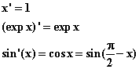

通过处理每个操作的规则，对标准函数进行微分的任务仅需要解析其定义以将其分解为单个操作，然后对每个操作应用相应的规则。

为此，我们需要以下规则。

## 8.2 函数组合的导数

如果 **f = cg**，其中 c 是一个常数，那么 f ' 和 g ' 之间的关系是什么？

如果 **f = g + h�** 或 **f = g - h**，那么 f ' 与 g' 和 h ' 之间的关系是什么？

如果 **f = g * h**，同样的问题吗？

如果 **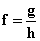**，那么 f ' 与 g ' 和 h ' 之间的关系是什么？

如果 **f(x) = g(h(x))**，同样的问题。

如果 **f 是 g 的反函数，f = g^(-1)?**

如果 f 满足方程 **g(f(x)) = 0**，在包含 x 的任意开区间内，如何用 g 和 g ' 的术语找到 f '(x)？

根据导数的定义，当 c 是常数时，我们知道 **(cg) ' = cg '**。

我们还知道根据第六章描述的基本原理，来自不同来源的导数贡献仅仅相加。

我们可以立即推断出如何区分求和、差异和乘积。

**求和的区分规则：** **(g + h)' = g' + h'。同样的 (g - h)' = g' - h'。**

**乘积的区分规则：** **(g * h)' = g * h' + g' * h。**

如果我们知道如何区分 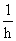，我们可以利用之前的规则得到求 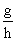 导数的规则，因为我们有 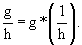。

我们可以通过利用事实 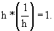 来找到 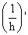。

通过乘法法则，我们得到 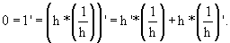

重新排列这个语句并除以 h 得到 **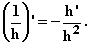**

**练习 8.1 陈述根据这些事实得出的“商法则”，即用于找到 f'的规则给出。应用它来找到**

要找到 f'，只需观察当我们将 df 和 dg 视为微分时，我们将有 df = dg，而 f'意味着，并且给定 g = g(h)知道 g'会给我们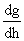从而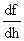。

要从得到，我们需要乘以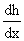，因此我们得到**“链式法则”** **(g(h(x))' = g'(h) * h'(x)**� **其中 g'(h)在 h = h(x)处评估。**

要找到函数 h(x)的反函数的导数，只需要观察到反函数是通过交换 x 和 y 轴获得的；由于 h 的导数是其图形切线的斜率，在交换 h 和 x 轴后，我们得到斜率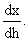。

因此，函数 h 的反函数(h^(-1)(x))在参数 h(x)处的导数是与 x 和参数 x 有关的 h 的导数的**倒数**。

我们得到在 x = h(z)处评估的(h^(-1)(x))'是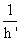与 z 处评估的 h'。这听起来比实际情况更糟。

获得相同结果的另一种方法是将链式法则应用于反函数的替代定义：h^(-1)(h(x)) = x。

通过链式法则，我们得到 1 = x' = (h^(-1)(h(x))' = (h^(-1))' * h'(x)，其中 h^(-1)在 h(x)处评估；再次得出结论，**(h^(-1))'在 h(x)处评估时是 h'(x)的倒数。**

**练习：**

**8.2 使用它们与 sin x 的关系找到 cos x，tan x，cot x，sec x 和 csc x 的导数。**

**8.3 使用 x^(1/n)是 x^n 的反函数的事实来找到(x^(1/n))'，并且通过应用刚刚描述的“反函数法则”，找到指数函数 exp(x)，sin x 和 tan x 的反函数的导数（即 ln(x)，arcsin x 和 arctan x）**

现在假设 g(f(x)) = 0 在包含 x 的区间上成立。

然后我们可以应用链式法则找到(g(f(x)))' = 0' = 0 = g'(f) * f'(x)，并且这个方程将以 f 的形式确定 f'。这实际上是上面用来评估和 h^(-1)（倒数和反函数到 h）的导数的一般想法。

这是我们需要做微分的全部吗？答案是肯定的。

请注意，这里我们实际上只调用了两个规则，这两个规则允许我们对所有标准函数进行微分。

其中一个是**多次出现规则**，它允许我们单独处理变量的不同出现，并将它们的各自导数相加，以得到整个导数。

第二个是**链式法则**，它指出导数是一个变化率，是变化的比率，因此改变自变量，即改变斜率的分母，需要改变比率的导数，即原分母到新分母的导数。

为了说明如何使用这些规则，我们从中推导出了“幂规则”。

请记住，我们可以将任何指数 a 的函数定义为 exp(a * ln(x))。

我们可以利用指数函数 exp(x) 是其自身的导数这一事实，结合链式法则告诉我们

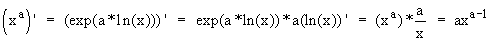

**好的，我们是如何得到 ln(x) 的导数公式的？**

嗯，ln(x) 是 exp(x) 的反函数。这意味着如果 y = exp(x) 那么 x = ln(y)。但是 exp(x) 是其自身的导数，这意味着当 y = exp(x) 时 **y' 是 y**。

由于反函数的导数是原函数的倒数，我们得到了**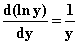**，这是我们使用的公式。

还有一种变量出现的方式我们尚未遇到但应该提到。它们可以且经常出现在积分的上（或下）限中。当讨论到这个概念时，你将学会如何对这种类型的函数进行微分。然而你应该在这里意识到，当一个变量既出现在这样一个限制中，又出现在普通函数中时，你可以调用“分开出现”规则来单独处理这些出现，并将从每个出现中得到的导数贡献相加，以得到整个导数。

**练习 8.4 找出 x^x 对 x 的导数。**

## 8.3 高维度中的导数

**在更高维度中会变得更加复杂吗**？其实不会。

关于偏导数的重要事情是，根据其定义，它是普通导数，尽管其中某些依赖被忽略，并且它的计算方式与普通导数的计算方式完全相同。没有新的技巧，也不需要新的技巧。

当一些数量取决于一些变量，而这些变量又取决于其他变量时，会出现一些问题。

比如，假设我们对一个微小物体的温度 T 感兴趣，这个微小物体正在普通空间中运动，具有这样的特性，即随着它的移动，它的温度会达到其周围的温度。这个温度随时间和空间而变化。

身体的温度会因为时间的变化而改变，但也会因为它的运动而改变。

这里空间中的 T 是位置 (x, y, z) 和时间 t 的函数：T = T(x, y, z, t)（我们使用相同的字母来描述时间和温度，以最大程度地增加否则将是单调和不具说服力的叙述的混乱）。

现在进一步假设所讨论的物体通过方程 x = x(t)，y = y(t)，z = z(t) 描述了空间中的轨迹。（你可能想将这个简写为**r = r**(t)，其中 **r** = (x, y, z)。）

我们提出了一个问题，即该物体所经历的温度随时间的导数是什么？

我们用微分的形式写出 dT

� 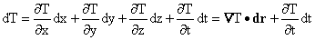

我们还有

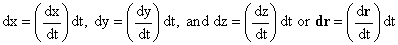

将这些放在一起，我们得到

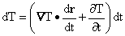

从中我们得出结论

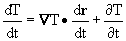

当你遇到这样的公式时，意识到它无疑是从一个类似的情况产生的不是一个坏主意，其中一个函数依赖于时间，也依赖于时间本身依赖于时间的空间变量。

这种事情有点像广义链式法则，有时被称为这样。

请注意，处理这类问题的方法是考虑微分，包括它们之间的所有可能依赖关系，并将它们都与独立变量的微分，这里是 t，相关联。然后，你可以将微分除以找到导数。

当存在多个相互关联的变量时会出现复杂情况。然后，可以有不同的偏导数，取决于哪些其他变量被保持不变，而且在你变化其中一个特定变量时，你可能可以选择固定哪个坐标。为了保持清晰，你必须引入一种符号，其中有一个位置可以描述要保持不变的变量。
