# 第九章：矢量场的导数和极坐标中的梯度

## 介绍

定义了矢量场的散度和旋度，讨论了提供场的视觉表示的问题，并详细讨论了标量场的梯度。 特别是，我们考虑了如何以三种不同的方式在任意正交坐标系中表示它。 

## 主题

9.1  矢量函数的导数; 散度

9.2  旋度

9.3  可视化两个变量的函数

9.4  极坐标和其他正交坐标系中的梯度

## 9.1 矢量函数的导数; 散度

梯度是几个变量的矢量函数。 这样的实体称为**矢量场**，我们可以问，**我们如何计算这些东西的导数？**

我们将在三维空间中考虑这个问题，并回答如下。

由于三维空间中的矢量有三个分量，并且每个分量在三个方向上都有偏导数，因此在任何坐标系中，矢量场的偏导数实际上有九个。

因此，在我们通常的直角坐标中，对于一个矢量场**v**(x, y, z)，偏导数为

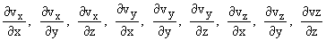

所有这些都可以通过计算用于计算标量函数（通常称为标量场）的偏导数的相同规则来计算。 幸运的是，对于我们来说，通常遇到的只有两种组合，而且值得了解。

这些中的第一个是**散度**，写作 div **v**，或用微分算子 del 表示， 它是具有分量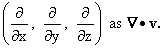 的矢量算子

明确地说，它是这个微分算子与矢量**v**的点积

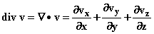

由于它是点积，所以它是一个数而不是一个矢量。

这就是散度的定义方式，再次可以通过直接微分来计算，但是我们也必须解决以下问题：这意味着什么？ 它对我们有什么兴趣？ 我们如何使用它？ 我们如何在其他坐标系中计算它？

我们将推迟回答这些问题，直到我们讨论了积分，因为答案与该主题密切相关。

然而，我们可以使用微分的规则来推导出以下有用的陈述：

**两个矢量的和的散度是它们各自散度的和。**

**而函数 f 乘以矢量 v 的散度如下给出**

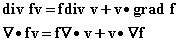

**练习：**

**9.1 推导这个方程。**

**9.2 将其应用于在球坐标中找到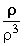的散度。回忆一下，向量 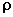 在球坐标中有分量 (x, y, z)。**

## 9.2 旋度

向量场 **v** 的第二个重要的偏导数组合是其**旋度**。

这是微分算子  与向量 v 的**叉乘积**。

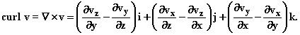

虽然我们将再次推迟对这个实体含义的全面解释，但我们可以观察到一些重要的性质，这些性质本身就使它具有重要性。

由于我们可以通过取梯度来从标量创建一个向量，我们可以问：

现在，如果我们对结果梯度取旋度会发生什么？也就是说，**旋度梯度** f 是什么？我们也可以问。**旋度** **v** 的散度是多少？以及**梯度** f 的散度是多少？

这些问题的前两个有非常简单而极其重要的答案。第三个问题有一个重要的答案，尽管其含义尚不明显。

**练习：**

**9.3 一般情况下评估散度旋度 v 和旋度梯度 f；这些答案本身使旋度和散度成为重要的算子。**

**9.4 根据偏导数写出梯度散度算子。 （通常被称为“拉普拉斯算子”。）**

## 9.3 两个变量函数的可视化

两个实数变量的函数在三维空间中定义了一个表面，维度是原始的两个维度和函数本身。

我们今天可以产生一个三维图像，但在很多年里这是相当不切实际的，数学家们不得不满足于三维空间中这些表面的二维图像。有两种基本而互补的方法来做到这一点。

第一个是在 xy 平面上绘制**等值轮廓线**。这种方法用于显示等压线（称为等压线）在天气图中，或者用于显示地形图中的地表高度。

当这些等高线相当平滑时，等高线的切线表示一个方向，这个方向在该点处是**水平平面**和**表面的切平面**的**交点**。

xy 平面上**等值轮廓线**的法线指向**梯度向量（加或减）**的方向，也可以**用来描述表面**。

经过一点练习，你可以从这些等值轮廓线中得到函数表面的相当好的概念。因此，当这些等值轮廓线代表函数的不同值时，**函数的上升相对陡峭**，当它们彼此之间**距离很远时**，上升相对缓和。

**描述两个变量函数的第二种方法是在许多点上沿着梯度向量的方向绘制小箭头，并将其连接成“增长线”**（不是一个常见的术语）。

这些线将垂直于相等值等高线，并且会从“函数的局部最小点到局部最大点”（或者到或从你正在检查函数的区域的边界）。

你可以通过这种图片得到函数的性质的相当好的概念。

当正在研究的函数代表一些物理情境中的**势能**，或者是**静电学中的电势**时，这里描述的线是显示对物体或微小带电粒子的力指向的**“力线”**。

对于物理应用，我们真的希望能够可视化三个变量的函数，这在一个平面上描述起来非常困难。我们将尝试找到一天能够做到这一点的方法。

在接下来的 applet 中，你可以输入你喜欢的两个变量的标准函数和一个定义域，并查看它的等值线是什么样子的。使用第一个滑块，你可以在平面上的一个网格点处查看梯度（网格点的数量是可调的）。

在上次访问的网格点，你可以使用第二个滑块查看方向导数。对于箭头所示的角度，方向导数的大小由箭头的长度表示。当方向与梯度的点积为正时，方向导数的符号为正。

你可以查看方向导数 applet 中由函数定义的实际曲面来磨练你的直觉。

<applet code="ContourLinesGradients" codebase="../applets/" archive="contourLinesGradients.jar,mk_lib.jar,parser_math.jar,jcbwt363.jar" width="760" height="450"></applet>

## 9.4 极坐标和其他正交坐标系中的梯度

假设我们有一个以 f(x, y) 形式给出的函数在二维中，或者以 g(x, y, z) 形式给出的函数在三维中。我们可以对给定的变量进行偏导数，并将它们排列成变量的向量函数，称为**f 的梯度**，即

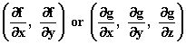

意思是

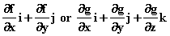

但是假设我们以 r 和  的形式给出了 f 作为函数，即在极坐标中，（或者 g 在球坐标中，作为 ，，和  的函数）。

例如，假设 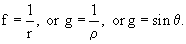

**我们如何找到 f 或 g 的梯度？**

**找到这样一个函数的梯度的一种方法是**，**将 r 或  或  转换为直角坐标，使用适当的公式进行转换**，然后对结果表达式进行偏微分。

因此我们可以写成

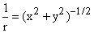

并通过普通的偏微分得到

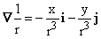

有时，直接用极坐标或球坐标表达梯度更方便，就像用直角坐标表达的那样。

我们在这里想要一个包含对 r 和  的偏导数相乘的表达式，**分别乘以指向 r 方向和  方向的向量。**

所以我们想知道：**这些偏导数应该与什么向量相乘才能形成梯度？**

**当我们找到答案时，实际上关于每个极坐标变量的偏导数将是极坐标方向单位向量与梯度的点积。**

**因此我们岔开话题讨论这些单位向量是什么，以便你能认识它们。**

r 方向是从 x 轴逆时针倾斜了一个角度  的方向。 在那个方向上的单位向量，称为 **u[r],** 可以用以下三种形式之一表示

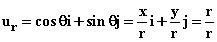

 方向上的单位向量位于 r 方向的逆时针 90° 方向，因此它由以下方式给出:

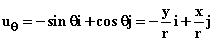

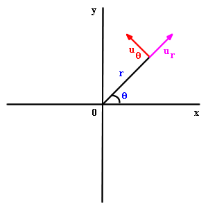

**我们现在问：在极坐标中 f 是什么？**

我们知道，如果我们在 r 和  上做微小变化，f 的结果变化将由以下公式给出

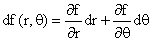     (A)

因为这个关系适用于任何变量。

但它们也必须遵守

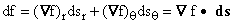

如我们在 第 3.8 节 中简要提到的，在变量 r 和  做微小变化时，极坐标中的距离由以下公式描述：

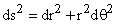

由此我们推导出 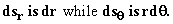

将两个关于 ds 的方程组合起来，我们得出：

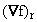 是 f 关于 r 的偏导数，正如 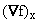 是它关于 x 的偏导数一样。

但是**因为 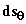 中有一个 r 因子，所以在  方向上的  分量的分母中必须有一个补偿因子 r**

**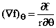**

**和**

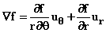

对于任何维度中的任何正交方向，都可以进行类似的计算，我们可以预期结果。

**f 在任何此类变量方向上的分量将是 f 对该变量的偏导数，除以该方向的距离变化与变量本身变化的比率。**

**使用**最后一个方程，我们可以立即推断出**的梯度为 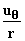，当然在 r = 0 时除外，那里  不可微分。** 类似地，我们发现 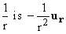 的梯度。

**练习：**

**9.5 利用球坐标中的两个角变量都是极坐标变量的事实，将 3 维空间中的 ds² 表达为球坐标三个变量的微分。从中推导出球坐标中的梯度公式。**

**9.6 通过这种方法找到球坐标中  的梯度以及球坐标中  的梯度。**

还有一种**第三种方法**可以通过使用**链式法则**来找到给定坐标的梯度。

我们首先考虑直角坐标中 f 的微分变化，然后将 x 和 y 的微分变化与其他坐标，比如 r 和  的微分变化联系起来。结合这些，我们可以将 f 的变化与后两个变量的变化联系起来。

由于我们知道如何在直角坐标中写出梯度，并且可以识别单位向量，我们可以将结果表达为另一坐标系中梯度的分量。

明确地，我们可以写成

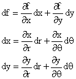

并使用后两个方程式消除第一个方程式中的 dx 和 dy。结果是一个关于 dr 和 d 的表达式，**其系数可以用各个方向的单位向量和直角坐标中的梯度来描述。**

将该方程与**定义偏导数的基本公式**方程（A）进行比较，您可以读取梯度的分量。

当 f 以直角坐标给出但你想在你的坐标系中写出梯度时，或者如果你不确定 ds²和该坐标系中的距离之间的关系时，这种方法很有用。

**练习：**

**9.7 在极坐标中明确地进行这个计算。**

**9.8 在球坐标中也这样做。**

**在进行偏导数时应该保持哪些变量恒定？**

值得注意的是**当我们对 x 或 y 进行偏导数时，我们总是指保持另一个变量，y 或 x，恒定；另一方面，对 r 和的偏导数总是指保持另一个变量，或 r，恒定。**任何其他含义都必须明确描述。

有时候在偏导数中，人们可能会困惑于哪个变量或变量被保持恒定，在这种情况下，明确提供这些信息是明智的。因此，我们可以写成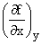表示对 x 的偏导数，保持 y 不变，这样就不会有关于什么是恒定的混淆。

**关于梯度需要记住的最重要的事实是：**

在**任何**正交坐标系中计算起来都很简单

你可以用它来确定所涉及函数的方向导数，无论方向如何。

在直角坐标中，它的分量是各自的偏导数。

两个场的和的梯度是它们梯度的和（梯度是一个线性算子）。

一个乘积的梯度可以通过应用常规的求导乘积法则来计算。
