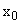
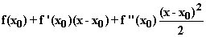
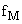
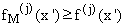
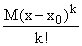
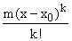
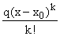
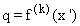
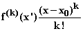

# 第十章：更高阶导数，泰勒级数，二次逼近和逼近的准确性

## 介绍

我们研究了对函数的二次和更高阶多项式逼近，最终得到泰勒级数。讨论了在临界点处的行为和确定逼近的准确性的应用。

## 主题

10.1  二次逼近

10.2  更高阶逼近和泰勒级数

10.3  更高阶逼近的用途

10.4  临界点处的二次行为

10.5  逼近的准确性和均值定理

## 10.1  二次逼近

线性逼近$f$在$f'$是恒定时确实是精确的，这意味着$f$是线性的。在线性逼近$f$在参数$x[0]$处的不准确性来自于参数$x[0]$和$x$之间$f'$的变化。

如果$f'$在$x[0]$和$x$之间的区间内是可微的，我们可以通过对$f'$进行线性逼近并将其用于估计区间内$f$的变化来获得对$x$处的$f$的更好逼近。

简而言之，如果$f'$在该区间内是可微的，我们可以计算其导数，称为**关于$x$的$f$的二阶导数**，并写为$f"(x)$或$！$，有时也写为$！$，并使用它来改进对$f$的估计。

所有我们的标准函数在它们定义的地方都具有可微的导数，甚至可微的二阶导数，等等，直到永远，除了可能在特定的奇异点处。

它们被称为“无限可微”，因为只要我们愿意，我们就可以不断地对它们进行微分。因此，我们可以计算二阶导数，以及第三阶和更高阶导数，并生成一系列对任何这样的函数的更好逼近。

## 10.2  更高阶逼近和泰勒级数

我们探讨以下问题：

这些对$f$的更高阶非线性逼近是关于它的导数的什么？

我们为什么要做这些事情？

这些逼近有多精确？

当$f$是多个变量的函数时会发生什么？

$f$在$x[0]$处的线性逼近是线性函数，其值为$f(x[0])$，在那里的一阶导数为$f'(x[0])$。

二次逼近是其值和前两个导数与$f$在参数$x[0]$处相同的二次函数。作为二次函数，它可以写为$f(x[0]) + a(x - x[0]) + b(x - x[0])²$。

我们通过应用其导数等于$f$在参数处的导数的条件来确定$a$和$b$。由于它在处的一阶导数为$a$，二阶导数为$2b$，我们推断出$！$，以便$f$在处的二次逼近变为

****

我们可以将这个论点扩展到创建立方逼近等，当 f 在 x[0]处适当可微时，通过应用相同步骤与更高阶导数。如果我们永远这样做下去，我们就得到了**"在参数 x[0]处 f 的泰勒级数展开"**。

**练习：**

**10.1 写出一个关于 x[0]的一般无限可微函数 f 的泰勒级数展开。**

**10.2 写出一个一般函数的 5 次可微的 5 次逼近公式，并明确应用于 x[0] = 0 处的正弦函数。** **给出在 x[0] = 1 处形成的正弦的立方逼近。**

**10.3 指数函数，作为其自身的导数，可以从其泰勒级数展开中分解出来。将该展开应用于 x[0]周围，推导出 exp(x)和 exp(x[0])之间的关系。**

以下 applet 允许您输入一个标准函数，并查看这些逼近的前三个是如何定义在您选择的域上的。

<applet code="FunctionApproximations" codebase="../applets/" archive="functionApproximations.jar,mk_lib.jar,parser_math.jar,jcbwt363.jar" width="760" height="450"></applet>

## 10.3 高阶逼近的用途

这些更高阶逼近在以下方面是有用的：

1\. 当所有较低导数在 x[0]处为 0 时，它们告诉我们关于 f 的关键信息。

2\. 它们使我们能够获得对较低逼近的准确性的界限。

3\. 它们可以用来推断重要事实（如练习 10.3 中所示）。

4\. 作为多项式，它们通常比 f 本身更容易操作。

5\. 有时高阶导数本身也很有趣。因此，力学的运动方程直接涉及加速度，这是位置的二阶导数。

6\. 最后，与较低逼近相比，它们扩展了在其准确性范围内的展开点的距离。

## 10.4 临界点处的二次行为

一个 f '为 0 的参数 x[0]，使得 f 本身是平的，被称为 f 的**临界点**。

当 f 在这样一个点上不为零时，它在那里的二次逼近是以 x[0]为中心的二次逼近。

二次函数基本上看起来都一样，特别是如果你愿意倒立。当以 0 为中心时，它们的行为是 ax² + c 的行为。常数 c 决定了它在图中的出现位置，但图的外观完全由参数 a 决定。如果 a 是正的，函数看起来像一个更胖或更瘦的 x²；如果 a 是负的，它看起来像一个更胖或更瘦的-x²。这告诉我们，当其二阶导数为**正**时，f 在 x[0]处有一个局部**最小值**，就像 x²一样；当 a 为负时，它在一个局部最大值处有一个局部最大值（f 在一个点处有一个局部最大值，该点至少与包含它的某个开区间中的值一样大）。

当 a 为零时，即 f 和 f ' 在 x[0] 处均有临界点时，二次近似是平坦的，你必须寻找三次或更高次近似来确定该点附近的 f 的行为。

**练习 10.4 在什么情况下，当其一阶和二阶导数均在那里消失时，f 在 x[0] 处会有一个最大值？**

## 10.5 近似精度和平均值定理

我们现在问，这里的任何近似都有多 **准确**，从微不足道的常数近似，线性近似，等等。

假设 x > x[0]，m 是这两个参数之间 f 的 k 次导数的最小值，而 M 是那里的导数的最大值。

我们将引用一个原则，其最简单的形式是：**你移动得越快，你走得越远，其他条件相同。** 在这里，我们声称，如果我们通过在整个区间 (x[0], z) 内用该区间内的 k 次导数的最大值替换函数 f 的实际值来发明一个新函数 f[M]，那么  和它的所有一阶到第 k = 1 阶导数将在该区间内的所有 x ' 上都遵守 。

这样想：如果你将速度 f ' 增加到值 M，你会增加行驶距离。如果你交替将加速度 f " 增加到 M，同样的论点，那将增加速度，从而增加行驶距离。依此类推。如果你增加更高阶的导数，这种增加将传导到所有更低阶的导数，并最终传导到 f 本身。

这样做的好处是，在  处的  的 k 次近似在参数 x 处是 **精确** 的，因为在  和 x 之间的区间内， 的 k 次导数是常数。现在， 的 k 次近似是 f 的 k-1 次近似加上 。

我们上面的不等式应用于 j = 0，因此告诉我们，f 的 (k - 1) 次近似加上  **至少** 是 f(x)，而通过应用相同的论点以相反的顺序，并将 M 替换为 m，我们可以推断出相同的近似加上  **至多** 是 f(x)。

所有这些的结果是对这里的任何近似的程度 k - 1 的 f 在  处与参数 x 处的 f 之间的差异有界：它们的差异在  和  之间。

我们可以进一步注意到，这告诉我们 k - 1 次近似的误差可以写成  其中 q 位于 m 和 M 之间。

由于 m 和 M 是 f ^((k)) 在 x[0] 和 x 之间的最小值和最大值，如果 f ^((k)) 在该区间内取得其最大值和最小值之间的所有值（如果它在该区间内可微分，则必须如此），它将取值为 q。因此，我们可以写成  对于该区间内的某个 x '。

这使我们能够将我们的结论转化为以下陈述。

**定理：**

**在参数 x 处评估的 f 的 k - 1 次近似的误差为**

****

**对于该区间内的某个 x '，如果 f ^((k)) 在该区间内连续。**

**练习：**

**10.5 当 k = 1 时陈述这个定理。这个结果被称为“平均值定理”。**

**10.6 重复上面的论证，针对当 x < x[0] 时发生的情况。结论如何改变？论证中有什么不同？**
