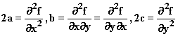
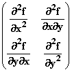

# 第十一章：多维度中的二次逼近

## 介绍

在二维或更多维中考察了二次逼近。我们考虑这样一个问题：在两个或更多个方向上，临界点何时是鞍点，

## 主题

11.1  二维或更多维的二次行为

11.2  临界点何时是最大值、最小值或鞍点？判据

## 11.1 二维或更多维的二次行为

现在让我们考虑当 f 是两个变量 x 和 y 的函数时会发生什么。

我们已经看到在这种情况下以及更高维度中可以定义偏导数、方向导数和可微性。

我们也可以再次定义二次逼近，但现在更加有趣。二维或更多变量的二次函数比一维的要多样得多。

二维中的一般二次函数形式为

**ax² + bxy + cy² + dx + ey + g**

这样的函数将有一个**临界点，其梯度为 0 向量**，即

2ax + by + d = 0

和

bx + 2cy + e = 0

两者都成立。

如果我们将该点称为(x[0], y[0])，我们可以像一维一样写二次函数

**a(x - x[0] )² + b(x - x[0])(y - y[0]) + c(y - y[0])²� + g'**

以便线性项已被消除。

在两个或更多维中，我们以显而易见的方式定义更高阶偏导数。

对于两个变量的 f 的二阶偏导数是通过先对一个变量取一阶偏导数，然后对该函数的下一个变量取偏导数得到的。

这里的一个很好的特点是，当您对适当可微的 f 取混合二阶导数时，**取它们的顺序无关紧要。**

这里二次函数的行为，除了一个常数，由系数 a、b 和 c 捕获，它们与偏导数的关系如下

****

注意，如果我们以显而易见的方式将四种可能的偏导数组成一个矩阵

****

**(这个矩阵的行列式是二次函数的判别式，即 4ac - b²。)**

**这样的二次函数的行为如何？**

如果 a 和 c 都是正数，**而 b 为 0**，这里每个变量的行为看起来像一维的 x²，f 在(x[0], y[0])处有一个最小值。

如果我们反转所有符号，使 a 和 c 为负数，**同样取 b = 0**，二次函数将在该点具有最大值，就像-x² - y²在(0, 0)处一样。

但现在有第三种可能性，即**鞍点。**

**鞍点** 是一个临界点，函数在某些方向上增加，在其他方向上下降。

有两个例子可以说明：在(0, 0)处的 x² - y²；以及在(0, 0)处的 xy。

第一个增加如果你远离原点移动到 |x| > |y| 的方向，否则不会增加。

当两个变量都具有相同的符号时，第二个增加，否则不会。

也有可能出现一些方向上函数增加（比如）而在另一些方向上是平坦的行为：就像在二维中的 x²。我不知道你应该如何称呼这种行为。与一维情况类似，当这种情况发生时，你必须查看导数 = 0 方向上的高阶导数，以了解你是否有一个真正的局部最大值或最小值。

**练习 11.1 找到 (x - y - 1)xy 的临界点。它在那一点上的行为是什么？（你可以在 applet 中测试。）**

在这个 applet 中，你可以输入具有鞍点的函数。这个名称的来源就变得清楚了。

<applet code="CurvesSurfaces" codebase="../applets/" archive="curvesSurfaces.jar,go.jar,goText.jar,mk_lib.jar,parser_math.jar,jcbwt363.jar" width="760" height="450"></applet>

## 11.2 临界点何时是最大值、最小值或鞍点？标准

我们已经看到，在两个维度上的临界点，一个函数可能有一个最小值，或者一个最大值，或者一个鞍点。

**我们想知道如何从函数的公式确定将会发生什么。**

我们特别关注函数在临界点的二次行为。

这种行为是由二阶导数决定的，也是二阶导数所确定的二次函数的行为。

所以我们真的想知道：**给定一个没有线性项的二元二次函数，在原点时何时有最大值，何时有最小值，何时既不是？**

答案如下：

我们可以将一个矩阵与函数关联起来，即其临界点的二阶偏导数矩阵，如上一节所定义。

二次函数的行为由该矩阵的特征值决定。

当它们是实数且为正时，你会得到一个最小值，当为负时，你会得到一个最大值，否则是一个鞍点，除非其中一个为 0，那么你会得到平坦。（这意味着对于一般函数，你必须查看这些方向上的高阶导数。）

**为什么？**

与特征值相对应的特征向量是基向量**i**和**j**的线性组合。它表示从临界点出发，二次函数在该方向上的行为类似于其特征值乘以该方向的距离。

因此，如果两个特征值都是实数且为正，函数将看起来像是 ax'² + by'²，其中 a 和 b 为正值，x' 和 y' 为适当方向上的坐标，我们的函数将有一个最小值。

另一方面，如果它们有相反的符号，函数会在一个方向上增加，在另一个方向上减少，我们将会得到一个鞍点。

**如果存在复特征值呢？**

不可能有！因为我们的矩阵是实的且对称的（记住混合偏导数与取偏导数的顺序无关），它的所有特征值都是实数。

而且，对应于不同特征值的特征向量总是彼此正交的！

这意味着二次函数的行为在原点处与 a'² + b'²完全相同，只是坐标轴可能沿着特征向量的方向旋转。

关于矩阵和特征值的相关性质的简要讨论见第三十二章。您可以用 applet 图形化地寻找二乘二特征值：矩阵乘向量。

**在三维空间中会发生什么？**

完全相同的陈述适用，只是现在我们有一个三乘三的对称二阶偏导数矩阵。

它的特征值将是实数，如果它们都是正数，你会得到一个最小值，如果它们都是负数，你会得到一个最大值。如果符号混合，你得到一个鞍点，如果某些特征向量为 0，则必须查看这些方向上的更高阶导数以确定发生了什么。同样，对应于不同特征值的特征向量将是正交的。

实际上，所有相同的陈述在任何有限维度中都成立。

**练习 11.2 找出二次多项式 3x² + 2xy - xz + z² + y² 的第二部分矩阵的特征值。**

**为了确定是否有最大值或最小值，有必要知道二阶导数矩阵的特征值吗？**

不需要！

您只需看特征方程式。**如果它的所有可能项都存在并且符号交替，你得到一个最小值，如果它们都有相同的符号，你得到一个最大值，否则既不是最小值也不是最大值。**

**练习 11.3 怎么回事？**
