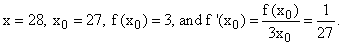
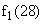
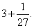
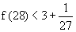
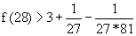
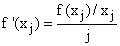
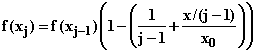

# 第十二章：导数的应用：直接使用线性近似

## 介绍

我们考虑将线性近似作为一种近似方法，并通过迭代使用它来确定逆函数以达到机器精度。

## 主题

12.1 使用线性近似估算函数值

12.2 通过迭代线性近似准确确定逆函数

12.3 此过程的电子表格实现

## 12.1 使用线性近似估算函数值

假设我们有一个函数 f，我们发现很难评估，但我们对它了解一些情况。我们希望尽可能利用我们所知道的东西来估计它在参数 x 处的值，知道它在某个参数 x[0] 处的值。

例如，假设我们想要评估 28 的立方根。

我们知道 27 的立方根是 3。

我们能做的最简单的事情就是进行“常数近似”，并将 28 的立方根近似为 3，好像立方根函数是一个常数。

如果我们想做得更好，接下来可以尝试的是应用线性近似。

f1 = f(x[0]) + (x-x[0])f '(x[0])

在我们的例子中，我们有 

对于立方根的线性近似， 那么，对于 28 的立方根，我们有 

给定任何我们知道 f(x[0]) 和 f '(x[0]) 的函数 f，我们可以立即评估这个近似值。使用它涉及假装函数 f 的图形是其在 x[0] 处的切线，而不是它实际的样子。

我们可以通过考虑 f 的二阶导数来判断这个近似值有多好。

请注意，f '在 27 和 28 之间的范围内是负的，这意味着该区间内的一阶导数在那里减小。在 27 处的切线上保持不变。

这意味着在 27 的切线线性近似上高估了该区间内 f 的变化，因此我们知道

我们还可以观察到 f 的三阶导数在问题的区间内是正的，因此二次近似也低估了二阶导数和所有较低导数的变化，因此它是 f(28) 的一个下界，我们得到

在数值上，精确到小数点后六位，我们得到 3.03658 < f(28) < 3.03704；事实上，我们有 f(28) = 3.03659 的精度。

此处考虑的立方根函数是我们直接计算其逆函数的函数的**逆函数**，即立方函数。**我们可以使用线性近似来计算任何这样的逆函数，以机器允许的精度**，我们接下来将会看到的。

## 12.2 通过迭代线性近似准确确定逆函数

**如何？**

给定一对数字，（x[0]，f(x[0])），在 x[0]处定义的线性近似函数 fLx[0]允许我们计算 fLx0 作为对 f(x)的近似。

如果我们知道 f 的逆函数，我们可以计算 f^(-1)(fLx0)，这给我们带来了一对新的数字，（f^(-1)(fLx0)，fLx0），我们可以称之为（x[1]，f(x[1])），然后重复（或迭代）此操作以产生 x[2]，然后 x[3]，...，直到收敛。

这在旧日里是一种非常乏味的过程，学生们根本无法忍受。现在对于电子表格来说，这简直易如反掌，我们可以为所有我们遇到的逆函数设置并计算，只需要几分钟的时间：这些函数包括根（x^(1/j)）、（自然）对数、arcsin 和 arctan。

**还需要做什么？**

在 x[j]处定义的线性近似函数 fLx[j]在 x 处的值由以下公式给出：

**fLxj = f(x[j]) + f '(x[j]) (x - x[j])**

设置这个，设置

**x[j+1] = f^(-1) (fLxj)**

只需进行迭代即可。

**练习：**

**12.1 设置一个通用的根查找电子表格，以便您可以输入 x 和 j，它将使用这种方法来输出 x 的第 j 个根，其中计算机只计算整数次幂。（如何做到这一点的提示在下一节中。）**

**12.2 设置一个电子表格来使用计算机计算 exp x 的能力来查找 ln x。**

**12.3 对正弦和正切的逆函数做同样的操作。通常这些函数被写成 arcsine 和 arctangent 或 asin 或 atan 或介于两者之间的某个东西。**

**12.4 这种方法可能失败吗？如果是这样，为什么？**

## 12.3 此过程的电子表格实现

**你怎么能做到这样的事情？** 首先将 x 和 j 放在固定的位置 X 和 Y。

然后在电子表格上设置以下列：

**f(x[j]):**

在第一列中输入 f(x[j])的连续值，从第一个已知值开始。

对于根，您可以从 x[0]� = f(x[0]) = 1 开始。

通过使用在 x[j-1]处的切线的线性近似在参数 x 处评估的 x[j-1]或 f(x[j-1]) + f '(x[j-1]) (x-x[j-1])来计算后续值 f(x[j])。（x[j-1]是前一行中第二列中的条目。）

**x[j]:**

在第二列中应用逆函数，f^(-1)，到第一列中的值。

一旦你为 f(x[1])和 x[1]输入了指令，你可以将这些指令复制到一百行，然后完成任务。

如果 f 是一个根，x^(1/m)，会发生什么？

一般来说我们有

**f(x[j]) = fLxj-1 = f(x[j-1]) + (x - x[j-1])f '(x[j-1])**

�对于第 j 个根，�，因此该公式简化为

****

那就是您需要输入的所有内容。剩下的就是复制。
