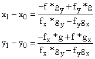

# 第十三章：解方程

## 介绍

我们构造了四种迭代方法来解方程 f(x) = 0。它们是：牛顿法，在这种方法中，我们通过找到旧点处 f 的线性近似为零的位置来从旧点到新点；穷人的牛顿方法与之相同，只是我们在线性近似中近似斜率，并且还有两种插值方法。

我们还提出了在二维空间中解两个联立方程的问题。

## 主题

13.0  解一个变量的方程

13.1  牛顿法

13.2  穷人的牛顿法

13.3  另一种线性方法

13.4  分而治之

13.5  解两个含两个变量的一般方程

## 13.1 牛顿法

正如刚才提到的，这种方法包括迭代过程，将 f 的线性近似设置为 0 以改进对 f = 0 解的猜测。

我们将在这里称为 fLx0 的自变量 x[0]的 f(x)的线性近似可以用以下方程描述

如果我们设置 fLx0 = 0，并解出 x，我们得到

因此我们得到，一般可以定义

在随后的小程序中，您可以输入一个标准函数，选择可以显示的迭代次数（nb points），用第二个滑块调整 x[0]，并使用第一个滑块查看每次迭代。您将看到函数和迭代的效果。

你会注意到，使用这种方法，你可能会得到一个附近的 0，或者一个远离的 0，这取决于一点运气。

<applet code="NewtonsMethod" codebase="../applets/" archive="newtonsMethod.jar,mk_lib.jar,parser_math.jar,jcbwt363.jar" width="760" height="450"></applet>

在过去，找到 x[j]的步骤的繁琐程度是如此可怕，以至于不能安全地施加在学生身上。

现在，借助电子表格，我们可以在大约一分钟内设置并执行此操作，即使是混乱的函数 f。

**要做到这一点，将您的初始猜测 x[0]放在一个框中，比如 a2，将“= f(a2)”放在 b2 中，并将“= f '(a2)”放在 c2 中。然后在 a3 中放入“= a2-b2/c2”，并将 a3、b2 和 c2 复制到您喜欢的任何地方。**（当然，在执行此操作时，您必须解释 f 和 f'是什么。）

就是这样。

如果 b 列趋近于零，则 a 列中的条目将收敛到一个答案。

如果您想要更改您的初始猜测，您只需要在 a2 中输入其他内容；要解不同的方程，您只需要更改 b2 和 c2 并将它们复制下来。

这提出了一些有趣的问题；也就是说，**我们能不能说出这种方法何时起作用，何时不起作用？**

首先，您应该意识到许多函数有不止一个参数，使它们的值为 0。因此，您可能得不到您想要的解。

另外，如果函数 f 没有零点，比如 x² + 1，你永远也找不到解。

这里还有另一个问题：如果你的初始猜测，（或任何后续的）接近 f 的临界点（在该点 f' = 0），那么在该参数处，数量可能会变得巨大，导致你看到与你寻找的目标非常远的参数。

如果 f 是隐式定义的，你可能会发现在某个新的猜测 x[j]中，f 甚至没有定义，迭代会陷入死胡同。

**我们能对这种方法的使用说些什么积极的吗？**

是的！**如果 f 在真解 x 处从负变为正，且 f'在 x 和您的猜测 x[0]之间是增加的，而且大于 x**，那么该方法将始终收敛。类似的情况也适用于 f 从正变为负，以及许多其他情况。

**为什么会这样？**

如果 f'是增加的，那么 f 在 x[0]处的切线将在 x 和 x[0]之间低于 f 曲线，使得线性近似，即其曲线，将在 x 和 x[0]之间达到零，而在每次迭代中也是如此。因此，x 将朝着真解不断前进，无法逃脱，并最终到达那里。

该方法的另一个优点是，随着接近解，可微函数将越来越像当前猜测和真解���间的线性近似。因此，一旦当前猜测接近解，该方法就会非常快速地收敛。

**练习：**

**建立一个电子表格来应用到以下函数：**

**13.1     ** **exp(x) - 27**

**13.2     ** **sin (x) - 0.1**

**13.3     ** **x²**

**13.4     ** **tan x**

**13.5     ** **x^(1/3)**

**13.6     ** **x^(1/3) - 1**

## 13.2 穷人牛顿法

要应用刚才描述的牛顿法，需要在每次猜测时对函数 f 进行微分。这并不困难，但需要一点努力。

我们可以使用本质上相同的方法，使用形式为的近似值来代替，其中 d 为某个值。然后我们需要决定使用什么值作为 d，但是通过电子表格，我们可以选择一个小值作为起始值，并在迭代过程中让它慢慢趋近于零。如果我们想更加精细，我们可以使用对称的导数近似。

**我们如何做到这一切？**

在 e2 单元格中，我们可以放入我们的初始值 d，比如 10^(-3)；然后在 e3 中放入"= e2*9/10"，并向下复制，这样 d 将慢慢减小到 0。（为什么要这样慢慢减小？如果你进行得太快，舍入误差可能会在找到解之前毁掉你。）这里的迭代是

因此，我们可以将我们的猜测放在 f2 中，将 "= e2+f2" 放入 g2，将 h2 设置为 "= f(f2)"，将其复制到 i2 中，然后将 f3 设置为 "= f2-e2*h2/(i2-h2)"，并复制 g2、h2、i2 和 e3 和 f3 下去，我们就完成了。

**练习 13.7 对于 13.1 节的练习中的每个函数都这样做。你在这里和常规牛顿法的结果之间发现了差异吗？如果有，是什么？**

## 13.3 另一种线性方法

另一种简单的应用方法是选择两个参数，x[0] 和 x[0']，希望它们接近你想要的解，评估函数在它们处的值，并假设由这两个值和参数定义的直线是对 f 的合理近似。然后，你可以找到这条直线与 x 轴相交的地方，并将其用于替换两个初始值中的一个。

在进行这个过程时有两种情况；一种情况是 f 在两个点处具有相同的符号。这意味着它们的直线不会在你的猜测之间与 x 轴相交，然后你可以用新点来替换其中距离它最远的两个点之一。

另一方面，如果你的两个参数处的 f 的值具有相反的符号，则应该替换旧参数，在这个参数处 f 的符号与在新参数处的符号相同，这样在下一次也会是如此。

这种方法优于牛顿法的地方在于，一旦你找到值的 f 具有相反符号的参数，你必须在这些参数之间逐渐逼近一个解。（解是一个使 f 改变符号的点；对于连续的 f，这是一个使 f 为 0 的点；像 tan x 这样的函数在它们为无穷大（或更正确地说，未定义）的参数处改变符号，以及在它们为 0 的参数处。）

它的缺点是存在一些函数，其在你的猜测之间的真导数远非直线，每次迭代获得的收益非常少。因此，它可能收敛得非常慢。

用于找到 x[i + 1] 的方程，给定你用来计算它的两个值 x[i] 和 x[i'] 是

如果你将这与之前的方法进行比较，这相当于用前两个猜测的值近似牛顿法中的导数，而不是像“穷人的牛顿法”中一样，用最后一个猜测及其加上 d 的值。

这个方程可以解决，我们可以像以前一样轻松地找到一个新的 x[i]。通过少量的努力，我们可以弄清楚要丢弃的旧参数中的哪一个；以下设置可以做到：

在 s2 和 t2 中放入你的初始猜测。在 u2 中放入 "= f(s2)"，并将其复制到 v2 中。

现在在 s3 中放入 "= s2 -(s2-t2)*u2/(u2-v2)"，在 w2 中放入 "= if(abs(s3-t2)<abs(s3-s2),t2,s2)"。（这将把旧参数放在 w2 中更接近新参数。）

复制 s3 和 u2，现在在 t3 中放入 "= if(u2*v2>0,w2,if(u2*u3>0,t2,s2))"，并将 t3、w2 和 v2 复制下来。

这个可怕的最后一条指令使得如果 u2 和 v2 具有相同的符号，t3 将保持更接近旧参数的值，否则将旧参数的值 f 相反的替换到 u3 中。

**练习 13.8 这种方案与你之前的例子相比如何？在之前练习的各种例子上试一试吧。**

## 13.4 分而治之

上一个方法使用直线逼近来获得两个旧参数之间的新参数，一旦旧参数的值 f 具有相反的符号。这通常是一个聪明的做法，除非区间的端点（在上面的列 s 和 t 中）收敛得非常慢。

为了避免这种可能性，我们可以一旦函数 f 在两点 a 和 b 处具有相反的符号，就在中点评估它，并将一个端点替换为中点。

这将使解必须位于的区间的大小减半。与牛顿算法的最佳部分或上述变体相比，这是较慢的收敛，但它是稳定且有效的，并且在固定数量的步骤中总是会明显提高准确性。

由于 2 的十次方略大于一千（是 1024），所以每十次迭代间隔的大小至少减少了 1000 倍，因此如果它从 1 开始，大约经过 35 步你将得到十位小数的答案。

**算法是怎么进行的？**

我们从两个参数 a 和 b 开始，并假设我们假定 a < b。我们评估 f(a)和 f(b)，还有。然后，如果这些中的最后一个和第一个具有相同的符号，您将替换 a 为，保留 b，否则保留 a 并将 b 替换为。

**在电子表格中，您可以将您的初始猜测放在 aa2 和 ab2 中，在 ac2 中放置“= aa2/2+ab2/2”，在 ad2 中放置“= f(aa2)”并将其复制到 ae2 和 af2。然后您可以在 aa3 中放置“= if(ae2*af2>0, aa2,ac2)”，在 ab3 中放置“= if(ae2*af2>0,ac2,ab2)”，然后向下复制即可完成。**

除非有错误潜伏，或者你以 ad2 和 ae2 具有相同的符号开始，否则在大约 35 步之后，这将使初始的 a 到 b 的间隔缩短至少 10^(-10)倍。

**练习 13.9 将此算法的性能与以前的算法在相同的示例上进行比较。有什么评论吗？**

## 13.5 求解两个一般的二元方程

牛顿法（以及贫穷人的牛顿方法）的一个很好的特点是它可以轻松地推广到二维甚至三维。

也就是说，假设我们有两个标准函数 f 和 g，它们是两个变量 x 和 y 的函数。每个方程，f(x, y) = 0 和 g(x, y) = 0 通常在曲线上满足，就像类似的线性方程在直线上满足一样。假设我们寻找这两个方程的同时解，那么它们将在这些曲线的交点上满足，如果有的话。

如果我们能够解出其中任一方程以 y 为自变量的 x 的表示式，我们可以找到一个曲线解的参数表示（以 y 为参数），并且在另一个函数上使用上一节的分而治之方法，每次将参数区间减半，就像在一维中一样。

这是一种缓慢而稳定的方法，可以相当容易地实现。但它假设我们可以获得一个或另一个曲线的参数表示。

我们总是可以尝试牛顿法，这在一般情况下相当容易实现。

要使用牛顿法，我们**在某个初始点计算 f 和 g 的梯度，并找到一个新点，在该点上由初始点的梯度定义的 f 和 g 的线性近似都为 0**。然后我们迭代这一步。

要实现这种方法大致需要牛顿法在一维中所需工作的三倍。另一方面，三倍几乎等于零，仍然是很小的。

这种方法遭受与牛顿法在一维中遭受的相同问题。

我们可能会远离我们在 xy 平面上想要的地方，特别是如果我们来到一个梯度很小的点。

当然，两条随机曲线可能根本不相交，所以可能根本没有解决方案，或者可能有许多解决方案。

但是如果我们能够在接近解的地方开始，再加上合适的情况，这个方法的效果会非常好。

**我们如何设置它？**

首先，您选择 x[0] 和 y[0] 的初始猜测；在电子表格中，将它们输入到前两列中（假设）。然后您需要一列输入 f(x, y) 和一列输入 g(x, y)；以及一个分别用于 f 和 g 的 x 和 y 导数的列（一共四个导数）。

您现在已经拥有了计算 x[1] 和 y[1] 所需的所有信息。一旦您完成了这一步，您只需要复制所有内容，比如说 30 行，然后您就可以看到会发生什么。如果 f 和 g 都趋近于零，这意味着 x[i] 和 y[i] 都收敛，那么您将得到一个解决方案。

**那么我们如何迭代？**

我们必须解出关于 x 和 y 的两个线性方程，这两个方程陈述了在 (x[0], y[0]) 处由初始点的梯度定义的 f 和 g 的线性近似都为 0。

这些方程是什么？它们是

**解是什么？**

我们可以使用克拉默法则（行列式比的法则）来告诉我们解是什么。

并且

当然，所有进一步的迭代都与这个新猜测的迭代相同。因此，一旦输入了这些公式，只需复制它们就足以应用该方法。

**练习 13.10 在以下函数的电子表格中尝试此方法：f(x, y) = exp(x * y) - y² , g(x, y) = cos(x + y)。

找出三个解，使得两个变量都是正的。有多少这样的解呢？**

相同的方法可以在三维中实现，尽管在电子表格上所需的工作量开始变得稍微繁琐。

现在你必须输入三个变量，三个函数，它们的九个偏导数，当然克莱姆法则现在涉及到两个三乘三行列式的比值，现在是三倍。

如果你真的想要的话，你可以做到，而且实际上找到三个任意非线性方程在三个变量中的解，有合理的运气的话。

<applet code="NewtonsMethodTwoVariables" codebase="../applets/" archive="newtonsMethodTwoVariables.jar,mk_lib.jar,parser_math.jar,jcbwt363.jar" width="760" height="450"></applet>
