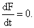
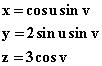
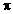
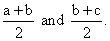
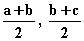

# 第十四章：极值点

## 简介

我们考虑如何找到单变量函数和多变量函数的最大值和最小值。

## 主题

14.1  最大值或最小值的一般条件

14.2  二维曲线上的极值点

14.3  三维曲面上的极值点

14.4  三维曲线上的极值点

14.5  分治法寻找一维极值点

## 14.1 最大值或最小值的一般条件

函数的局部最大值（或最小值）是指在其定义域内，函数取得比其邻居更大的值的点。

在任何我们可以向前和向后移动的方向上 f 有非零方向导数的点 q，不能是最大值或最小值，因为从 q 开始向前和向后移动会导致 f 在一个方向上增加，在另一个方向上减少。

对于可微函数 f 在点 q 处的内部“极值”点的基本条件是，**f 在你可以从 q 出发的每个方向上都具有零导数，同时满足问题的条件。**

**对于一个变量的函数来说，这仅仅是 f ' 在 x = q 处等于 0 的条件，也就是说 q 是 f 的临界点。**

要确定临界点是否是 f 的最大值或最小值，你必须查看 f 的二次近似（或者如果必要的话，查看 f 偏离平坦性的第一个更高的近似）。如果它的二阶导数是**正数**，那么像 x² 一样，f 在 q 处有一个**最小值**，如果是负数，那么 f 在 q 处有一个最大值。

**你应该始终检查你找到的任何局部最大值或最小值是否是 f 的“全局”最大值或最小值。该全局极值点（或任何这样的点）可能出现在边界上，或者与你找到的第一个局部极值点不同的另一个局部极值点处。**

如果 f 是一个多变量函数，那么即使在二次近似中也可能发生奇怪的事情，q 是一个临界点并不意味着它是一个极大值或极小值，即使二次近似远非平坦。正如 第十一章 中所指出的，q 很容易成为一个鞍点，你必须像该章节中指示的那样检查。

要解决这类问题，你要通过将所有导数都设为零来寻找 f 的临界点，并解决得到的方程。然后你必须检查你是否有一个最大值、最小值或者鞍点。

在这里，我们考虑的是当你处于二维或三维空间时，但是在一些曲面或曲线上寻找一个函数 F 的极值点时会发生什么。

## 14.2 二维曲线上的极值点

假设我们有一条曲线 C，由方程 G(x, y) = 0 定义，并且我们寻找 F(x, y) 在限定在这条曲线上的点之间的极值。

举个例子，假设 G 表示一个椭圆，**ax² + by² = 1**，我们想要找到 C 上 xy 的最大值。

在 C 上的任意点 q 处，我们可以沿着曲线的切线方向自由移动而保持在 C 上。我们上面对于极值的条件告诉我们，对于 q 要成为 F 的极值，F 在切线 **t** 方向上必须有 0 导数，定义为 G 曲线的切线。

这意味着 F 的梯度必须垂直于 **t**。但 G 的梯度也必须垂直于 **t**，所以 **在二维空间中，F 的梯度和 G 的梯度必须平行，才能使 F 在 G 上有极值。**

有两种标准表达这个条件的方法。

一个是注意到这意味着 **由 F 和 G 形成的平行四边形没有面积，因此以这些向量为列的行列式必须为 0。**

另一个是注意到这意味着 **F = cG，其中 c 是某个常数。**

任一观察都可以帮助我们找到极值。

示例

**第二种方法称为“拉格朗日乘数法”，常数 c 称为拉格朗日乘数。**

<applet code="LagrangeMultipliersTwoVariables" codebase="../applets/" archive="lagrangeMultipliersTwoVariables.jar,mk_lib.jar,parser_math.jar,jcbwt363.jar" width="760" height="450"></applet>

在你可以点击上面的示例中，如果你写出由 G = ax²+by² -1 =0 定义的三个方程，**i****(****F **-** c****G) = 0� 和 **j**(****F **-** c****G) = 0，你可以解出它们的 x、y 和 c，并得到相同的解。**

**再次，计算二阶导数（或检查 F 的值）必须用于确定局部和/或全局极大值和极小值。**

当曲线以参数 t 参数化时，你可以写成 F = F(x(t), y(t)) 并应用单变量条件 

**练习：**

**14.1 解决上述示例的拉格朗日乘数方法的细节。**

**14.2 假设我们想要最大化一个垂直定向圆柱的体积，给定其侧面和顶部（但不包括底部）的表面积 q 的固定值。它应该有什么半径和高度？**

## 14.3 三维空间中曲面上的极值

三维空间中的一个曲面由一个方程确定，我们将其写为 G = 0。

再次假设我们希望在这个曲面上找到 F 的极值。

这次 ****F 在曲面的切平面上的极点不能有非零分量，与之前的情况完全相同。

**这意味着F 和G 必须再次指向同一个方向。**

我们可以观察到这意味着叉乘****F****G 必须为 0，这个向量方程给了我们两个独立的分量方程，我们可以解决 G = 0 来找到极值。

我们也可以像以前一样应用拉格朗日乘子法。这次所有向量都有三个分量，因此方程****F = c****G 给出了我们三个方程，加上 G = 0，足以确定 c 和极值的坐标。

再次，您必须识别最大值和最小值，并在每个极值点上区分仅局部极值和全局极值。

当曲面由参数表示时，您可以通过替换将问题减少到曲面的两个参数的二维问题中，对参数没有限制。然后，找到临界点涉及求解通过将 F 对参数的偏导数设置为 0 得到的方程。上一章的二维牛顿法可用于数值示例中执行此操作。

**练习：**

**14.3 假设我们想要最大化 xyz - x，条件是 2x² + 4y² + 3z² = 6。写出由叉乘方法得到的临界点处 x、y 和 z 满足的方程。**

**14.4 写出拉格朗日乘子法得到的相同问题的方程。**

**14.5 假设由参数表示的曲面**

****

**对于 0 < u < 2，0 < v < 。

我们想要找到 F 的临界点，F = x⁴ - 2y²z²。

找到相同的方程。**

## 14.4 三维空间中的曲线上的极值

三维空间中的曲线 C 可以由两个方程定义（即作为两个曲面的交点），或者使用单个参数如同二维空间中一样。

如果 q 是 C 上 F 的极值，我们不能在 q 的参数处有****F**t**非零，根据我们的一般原理；否则，F 在 q 处将比 C 上的值大一侧而比另一侧小。

然而，这里的条件含义不同。我们不能再说****F 在极值点指向某个特定方向。相反，它必须是某个特定方向的法向量，即 C 在这些点处的切向量。

当 C 被描述为两个方程 G = 0 和 H = 0 时，**t** 沿着 ****G ****H 的方向，而 ****F 在该方向上没有分量的说法是 **F 落在 G 和 H 的平面内**，因此它们的平行六面体的体积为 0，且所有这些梯度的行列式必须为 0。

此条件和 G = 0 和 H = 0 确定了临界点的 x、y 和 z。

另一种陈述相同条件的方法是使用两个拉格朗日乘数，比如 c 和 d，并写成 ****F = c ****G + d ****H。我们可以通过编写此向量方程的所有三个分量并使用它们以及 G = 0 和 H = 0 来解出 c、d、x、y 和 z 的三个方程。

**练习：**

**14.6 给定曲线定义为由方程 xyz = 1 和 x² + 2y² +3z² = 7 定义的表面的交点，通过行列式方法找到确定 2x³ - y³ 的临界点的方程。**

**14.7 为相同问题使用拉格朗日乘数法得到的临界点的方程。**

**14.8 我们寻找曲线 x = 5 sin t, y = 3 cos 3t, z = sin 2t 的 F 的临界点，其中 t = 0 到 2，其中 F = x² + y² + z²。为它们编写方程。**

## 14.5 用于查找一维极值的分治法

在上一章讨论的解方程的分治算法可以应用于寻找一维函数的极值，因此也可以应用于参数化曲线上的函数的极值。

例如，假设您寻找曲线上的局部最大值。

要开始，您需要找到定义曲线的参数的三个值，使得在由中间参数值定义的曲线上，F 的值大于在其他两个点的值。

假设这些参数值是 a、b 和 c。然后，您可以检查参数值为  的函数 F。这两个点和 b 处的值的最大值将是具有与 a、b 和 c 相同特性的三个参数值的中心，即中间值的 F 值大于其他值的 F 值，但在此步骤之后，中心值和另一个值之间较大参数区间的大小将减小两倍。

迭代将像零点找算法一样精确地找到解决方案。

**练习：**

**14.9 解释为什么在和 b 处 F 值的最大值大于这些点中最接近它的 a 和 c 周围点的两个值。**

**14.10 您可以将参数的域分成大小为 d 的区间，并列出曲线上这些区间之间点的 F 值列表。从中，您可以找到值列表上的局部最大值，并在每个局部最大值处开始此过程。为曲线 x = 5 sin t, y = 3 cos 3t, z = sin 2t, 对于 t = 0 到 2，以及 F = x² + y² + z²建立一个电子表格。找到局部最大值至小数点后 5 位。**
