# 第十五章：曲线

## 介绍

到目前为止发展的微积分工具使我们能够描述光滑曲线的大部分重要属性：在任何点的方向，以及它在那里与直线的偏差有多大。这由其曲率来衡量。其路径与平面性的差异由其挠率来衡量，也很容易计算。

## 主题

15.1  曲线及其固有属性的参数化表示

15.2  曲线的固有属性

15.3  曲率和曲率半径

15.4  曲率的计算

15.5  挠率

## 15.1 曲线及其固有属性的参数化表示

通过点 (x[0], y[0]) 且斜率为 r 的一条直线可以被参数方程 y - y[0] = rt, x - x[0] = t 表示。

在三维空间中，你还将会有 z - z[0] = st。

在二维空间中，一条直线可以描述为一个线性方程的解，而在三维空间中，可以描述为两个这样的方程的解。

类似地，一条曲线可以被参数化地表示为一个向量从原点到点 P 的分量 x、y 和 z，作为参数 t 的函数，或者作为空间维度的方程的解。

不同之处在于典型曲线不是一条直线。

假设我们有一个参数化表示的曲线。

这是一个例子：x = cos t, y = sin t, z = t。

这些特定的方程描述了称为 "螺旋线" 的曲线。

如果你愿意，你可以想象参数 t 代表时间变量，这些方程描述了某个粒子随时间的运动。

这些方程包含两种信息：关于**沿着曲线的运动**的信息，即沿着粒子轨道的运动的 "速度"，以及关于轨道**或曲线本身**的信息。

我们希望从曲线的信息中提取出它所代表的曲线的固有属性。我们进一步想知道如何计算它们。

## 15.2 曲线的固有属性

首先，它们是什么？曲线的固有局部属性是什么？

一条直线有一个方向，我们可以用一个单位向量来描述它：

因此，方程组 x = 2t, y = 3t, z = t 描述了具有向量 (2, 3, 1) 的方向和单位向量的线。

一个一般的可微曲线在一个足够短的区间内看起来像一条直线。因此，在任何一点上它都有一个斜率，而该斜率通常是向量 **v**(t) 的方向。

我们定义 **T**(t) 为 *v*(t) *方向的单位向量*

**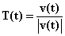**

我们再定义一个参数 s(t)，表示你在 t = 0 处和 t 时位于曲线上的距离之间的距离。

曲线的内在信息包含在**切向量和沿曲线的距离参数**之间的关系中。

**在任何一点，曲线的第一次近似是由其在那里的斜率所确定的，**即**T**(t)或**T**(t(s))的方向。

## 15.3 曲率和曲率半径

下一个重要的感兴趣的特征是曲线在位置 s 处与直线的偏差有多大。

我们通过**曲率**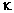**(s)**来衡量，其定义为

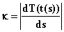

即**单位切向量在沿曲线的距离单位变化中的变化量的大小**。

向量**T**是一个单位向量，没有维度；即它不受所有坐标的统一比例变化的影响。另一方面，s 是一个长度；因此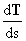具有长度的倒数，即距离的倒数的维度。

描述曲率所代表的信息的第二种方法是有的。参数 t 处的曲线的**曲率中心**是**点 q(t)，使得以 q 为圆心的圆与我们的曲线在 r(t)处相交，将在那里具有相同的斜率和曲率。**

**那个圆的半径**称为**参数 t 处曲线的曲率半径。**

我们将看到，**曲率半径**，即长度，正好是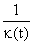，**曲率的倒数。**

在下一节的应用程序中，您可以输入您喜欢的参数化曲线，并查看曲率圆。

曲率的中心和曲线的切向量**T**(t)确定一个平面，称为**曲率平面。**

由于圆的半径始终垂直于切向量，因此从**r**(t)指向曲率中心的线将垂直于**T**。称为曲线的**法向量**的向量**N**(t)是一个从**r**(t)指向曲率中心的单位向量。

**B**(t)，即**"法向量"**是一个单位向量，垂直于**T 和 N**，即曲率平面。按照惯例，其方向为**TN**。

**我们定义 a(t)（加速度）为 v(t)（速度）关于 t 的导数。**按照这些术语，**T 是 v 方向的单位向量，N**是指向**垂直于 v 的法线的投影方向的单位向量，而 B 是指向 va 的单位向量。**

**由曲线在“时间”t 处定义的“Frenet 框架”是单位向量集合，T(t)，N(t)和 B(t)。**

## 15.4 曲率的计算

对于曲线的曲率和各种感兴趣的方向的计算相当简单，只要给出曲线的参数表示，我们就可以指示电子表格计算沿着我们的曲线的所有内容。

向量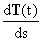，根据链式法则为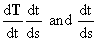是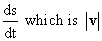的倒数，也可以写成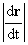。

由于**T**是指向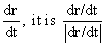的单位向量。

对于这个后面的表达式关于 t 的导数，根据商规则有

我们可以将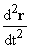识别为我们用**a**(t)表示的运动的加速度。

我们需要在这里对|**v**|关于 t 进行微分，鉴于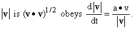

将所有这些放在一起，我们发现

这个结果看起来有点混乱，但实际上并不那么糟糕。回想一下**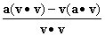**是**a**垂直于**v**的投影。因此，我们在这里有是*垂直于**v**的**a**的投影除以***v***的大小的平方*。

**因此，曲率，即这个向量的大小，是垂直于 v 的法向量的分量除以 v 的大小的平方。**

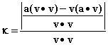

考虑螺旋线的例子：x� =� cos t, y = sin t, z = t。

我们可以计算：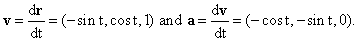

这里**a**和**v**是垂直的，因此我们得到对于所有 t 值都有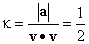。

曲率中心在通过计算的曲线上的点在 z 轴上的反射处，即在坐标为(-cos t, - sin t, t)的点处，距离(cos t, sin t, t)在**a**垂直于**v**的投影方向上的投影的方向上 2（或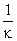）的距离。

**练习：**

**15.1 证明圆的曲率为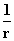。（这证明了曲率半径为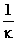。）**

**15.2� 对于以下曲线（使用电子表格），找到曲率，位置 r 和曲率中心在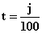处，j = 0 到 700**

**x= cos t, y = cos 2t, z = sin 3 t**

**尽力绘制它。**

**15.3 在 applet 上设置这条曲线。曲率最大的地方在哪里。**

<applet code="Curves3D" codebase="../applets/" archive="curves3D.jar,go.jar,goText.jar,mk_lib.jar,parser_math.jar,jcbwt363.jar" width="760" height="450"></applet>

## 15.5 挠率

我们可以进一步。下一个感兴趣的量是曲率平面的“扭转”程度。这由曲线的**挠率 **来衡量，**这是曲率平面法线相对于曲线上的距离的导数的大小。**

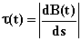

这个导数可以直接计算得到。正如前面已经提到的，**B**(t)可以根据以下方式书写

**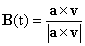**

根据链式法则，我们有

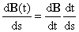

进一步注意到我们可以应用乘法规则来得到叉积�

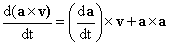

而后一项为 0。

我们还有

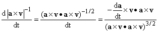

我们还可以使用恒等式

**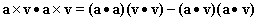**

将所有这些放在一起� 我们得到

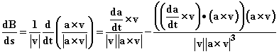

**我们发现挠率是这个的大小，因此是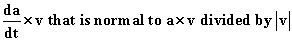分量的大小除以 a 和 v 构成的平行四边形的面积。**

没有人记得这个公式。满足于知道它的存在，知道如果你被迫这样做，你可以自己计算它，并且它可以设置为用电子表格自动计算。

**练习：**

**15.4 作为对你手动技能的测试，看看你是否能够自己完成上述步骤并得到正确答案（我希望是上面给出的答案）。**

**15.5 创建一个电子表格来表示练习 15.3 的曲线和定义域，并在参数的代表值上计算其曲率和挠率，以及相同数值下曲线的坐标。在你的范围内，挠率最大在哪里？**
