# 第十六章：一些重要例子和物理中的一个表述

## 引言

牛顿定律规定具有质量 m 和坐标 x 的物体的运动可以用方程**F** = m**a**描述，其中**a**，物体的加速度是其位置 x 关于变量时间 t 的二阶导数，**F**是物体所受的力。

单个物体在三维空间中移动，其中力、位置和加速度都是向量。有一些简单的基本上是一维的例子，对于一般情况来说是如此重要以至于有普遍的重要性。我们考虑其中的两个。

我们还考虑了**F** = m**a**的一个重要的替代表述。

## 主题

16.1  恒定力

16.2  线性恢复力

16.3  哈密顿量

16.4  量子力学是什么？

## 16.1 恒定力

物体在地球表面上受到地球引力作用而运动是这样一个具有这样一个力的系统的例子。

当加速度是恒定的并且由-g**k**给出时，我们可以推导出物体的速度**v**(t)遵循

**v**(t) = **v**(t[0]) - g(t - t[0])**k**

这个速度是一个位置向量**r**(t)的导数，必须采用以下形式

**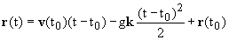**

到目前为止我们还没有讨论如何推导这些东西，但我们可以通过对**r**和**v**进行微分，并在时间 t[0]检查它们的正确性来验证它们。

(一般来说，如果加速度以 t 的多项式函数给出，我们可以生成包含多项式的形式，其次数比加速度大一和两个的速度和位置向量描述，并调整它们的系数以产生它们的正确公式。

然而，物理现象很少由明确依赖于时间的力和加速度描述。相反，最重要和基本的情况是物体经历一个与其位置线性相关的力。

虽然这些方程提供了在三维空间中受恒定加速度影响的运动问题的完整解，但它们并不能方便地回答我们可能提出的所有问题。

因此，我们可以使用它们来确定任何时间 t 的**r**和**v**，但它们并不特别方便用于推断**r**作为**v**的函数，反之亦然。

为了帮助回答这类问题，我们通过以下定义能量函数 E

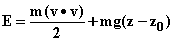

这些术语中的第一个被称为物体的动能 T，第二个是它的势能 V。物体所受的力可以写成-V；E 对时间的导数则为

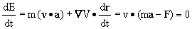

这个事实，称为能量守恒，更普遍地成立：每当 F 可以被写成**梯度**时。

在这里，如果我们知道任何时候的 E 的值，我们可以利用它来计算 z 作为 **v** 的函数，或者反之亦然，从上面的表达式中得出 E。

## 16.2 线性恢复力

一个普通的弹簧的行为由线性恢复力描述。弹簧具有一个正常长度 x[e]，如果拉伸或压缩，它会经历一种强度为

k |x-x[e]|

将其推回或拉回到其正常位置。这可以用以下力律描述。

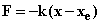

我们可以通过一个势能函数 V 描述这样的力，该函数由 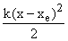 给出，并且再次具有能量守恒。

如果运动以质量 m 来描述，则系统遵循的微分方程是�

可以重写为

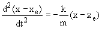

这正是 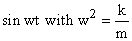（以及 cos wt）遵循的微分方程。

因此，我们可以得出结论

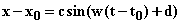

其中 c 和 d 是依赖于弹簧的位置和速度的初始值的常数。一般解也可以写成正弦和余弦项的和。

这个系统具有一个有趣的特性，这里出现的参数 w（顺便说一句，它是正弦运动的频率的度量，以及它的周期），只取决于 m 和 k，而不取决于初始条件。

此系统的势能函数为 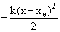。

一旦你知道系统中的能量，你可以再次利用能量守恒来推断速度与弹簧伸长之间的关系。

这里的解决方案，弹簧永远振荡，显然是不现实的。

弹簧停止移动。这是因为我们刚刚使用的模型遵循弹簧运动的能量守恒，而在现实中，弹簧运动中有空气阻力和一些摩擦，当你开始时，其中的一些能量会被转化为热量。

同样地，空气阻力会改变抛出的球的运动，例如在常重力情况下。

我们将很快考虑模拟摩擦和空气阻力的力律。首先，我们考虑牛顿运动定律的一个重要改写，可以应用于保守系统，即类似我们在这里考虑的两个系统，其中能量是守恒的。

要理解一个物理系统，你需要对它在不受干扰时的行为有所感觉，以及这取决于它的参数，还要了解它对外部刺激的反应，即外部强迫函数。

乍一看，你可能会认为有很多不同的可能刺激，这是一个不可能的任务。

研究此响应的标准方法是检查作为频率函数的周期性强迫函数的响应作为该频率的函数。

然后我们希望通过使用这些信息来描述对更一般的刺激的响应。这是通过称为傅立叶分析的过程完成的，该过程在第 30.6 节中简要讨论。

在第 33.3 节中，我们描述了如何在电子表格上解决接下来提到的二阶微分方程。这很容易做到，并且您可以使用在那里讨论的方法来研究振荡器的行为。

振荡器的微分方程可以写成

Mx" = -kx - f x' + csin wt

其中 x 是迄今为止称为 x-x[0] 的变量，M 是弹簧质量，k 是弹簧常数，f 表示系统受到的摩擦损失，w 是强迫函数的频率，c 是其振幅。

在自由系统中，c 是 0\。

**练习：**

**16.1 首先按照第 33.3 节描述的方案进行操作，以便在没有摩擦的情况下（因此 f = 0）观察发生的情况。

您可以选择您的 x 的比例，使得 M = 1，并假设您的 t 的比例是 k = 1。

您可以绘制 x 和 x' 相对于 t 和 x 相对于 x' 的图表，然后查看以下问题：**

**16.2 当你将 k 乘以 4 时会发生什么？**

**16.3 当你为 f 引入一个小的正值时会发生什么？**

**16.4 当你保持 k 和 M 不变时，随着 f 的增加会发生什么？**

**当 f > 0 且 c = 0 时的振荡被称为瞬态。**

**当 f 和 c 都是正值时，那么就像 c = 0 一样存在瞬态行为，但同时也存在对强迫函数的稳态响应。**

**一个有趣的参数是稳态响应的振幅与 c 的比值，作为 w 的函数（其他参数固定）。**

**16.5 找到使此参数最大的 w 的值，对于 M - k = 1 且 f = .1。**

**16.6 当你将 f 增加到 .2 时会发生什么？ .3？ .5？ 1？**

## 16.3 哈密顿量

牛顿定律涉及力，而力是向量，比普通函数更难处理和思考。当处理一个复杂的系统时，通过描述系统的能量并从中推导出力，比直接跟踪力要容易得多。

在十八世纪末和十九世纪初，物理学家们开始设想以能量函数的形式重新表述运动定律，特别是对于能量守恒的相互作用对象系统。

最重要的重新表述涉及定义一个名为**哈密顿量**的函数�。它是我们之前遇到的能量 **E**，但是不是用位置和速度变量而是用位置和动量变量表达的。

例如，假设我们有一组物体，每个物体有三个位置变量和相应的动量变量。与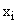相对应的动量变量！，它本身是第 i 个物体的 x 坐标，则为！。然后物体 i 的动能为**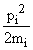**。如果它们之间存在相互作用的势能（例如由引力引起的），那么将会有形如的每对物体 i 和 j 之间的势能项。

**系统的哈密顿量，H,�，将如下所示**

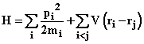

在这种表述中，对应于**F** = m**a**的运动方程为：

**对于每个带有动量和位置 p[i]和 r[i]的粒子 i，以及每个方向 d，我们有**

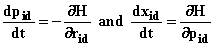

（这里的下标 d 指的是方向 x，y 和 z。）

这些方程被称为**哈密顿方程**。

实际上，在这种情况下，它们与牛顿方程具有相同的内容。它们的重要性特别在于量子力学最容易以哈密顿量的术语来描述。

如果我们在这里选择一个关于位置和动量变量的函数 Z，那么它的时间依赖性可以通过链式法则计算为

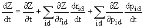

将哈密顿方程代入这里我们得到

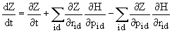

这里略显难看的最后两项被称为 Z 和 H 的**“泊松括号”**，并写为{Z, H}，因此我们有

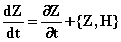

**练习：**

**16.7� 考虑由太阳和地球组成的系统，它们之间的势能为** *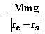*。写出这个系统的哈密顿方程。

**16.2 径向力（正或负）称为中心力。以上例子暗示的地球上的力是其中的一个例子，如果我们选择太阳为原点。计算该系统中 r[e]****v[e]的时间导数。**

## 16.4 什么是量子力学？

在研究原子中电子的行为时，物理学家遇到了以下难题：

电子似乎被电静力的影响困在原子周围的轨道上，就像行星在引力的影响下围绕太阳运行一样。引力和电静力吸引的力律实际上是相同的，电子似乎沿着具有明确定义能量的轨道运动。

另一方面，我们知道电子是带电粒子，我们也知道加速带电物质会根据麦克斯韦方程辐射能量，并最终停止。

任何人能想到的唯一结论是电子以某种方式在轨道上，其电荷密度随时间保持恒定。

但是，如果将电子设想为被限制在一个点的带电粒子，这怎么可能呢？唯一合理的静止点将是原点，但电子却分布在相当大的区域上。（直径约为 10^(-8)cm）

物理学家通过改变他们设想物理系统的方式做出了回应。

最初，人们认为电子具有可测量的变量，如位置和动量，这些变量是数字，描述它们的运动问题是发现它们的轨道。

他们转而认为**系统的状态**应该被描述为**向量**，可测量的变量被描述为**作用于这些向量的线性变换**（想象矩阵）。

**在这种描述中，由矩阵 M 描述的变量在具有行向量<s|和列向量|s>的状态中的值是<s|M|s>。**

在这种表述中，系统的动态发展源自基本运动方程：**状态向量的时间导数与作用于该向量的哈密顿矩阵成比例。**

量子力学的另一个有趣特征是，使用**位置 x（由一个数字表示，这意味着状态是位置算符的特征向量，相应的动量变量表示为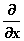的倍数）为基础，这些变换（或算符或矩阵）显然不对易。**（您也可以定义一个相反的基础）。

**测量一个变量并发现它的值为 z 是什么意思？**

**这意味着将系统的状态从原来的状态投影到具有特征值 z 的变量的特征向量（或如果有多个“特征空间”）。**

**当代表两个变量如 x 和的算符不对易时，这意味着什么？**

这意味着它们**没有共同的特征向量，因此不能同时测量。**（如果同时测量，系统将被两者的特征向量所描述。但 x 和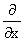没有共同的特征向量。）

**这里使用的是什么样的向量空间？**

这被称为**希尔伯特空间；它是无限维的，描述每个方向上的分量的数字是复数。**

**原子中电子的状态是持续一段时间的稳定状态。它们是电子哈密顿量的特征态或特征向量。**

它们实际上确实随时间演变，但并非以易于观察的方式；它们的状态在复平面上的角度变化，而这并不改变它们的电荷密度。

这个讨论不能假装教给你任何有关量子力学的有价值的东西，除了这样一个事实：它可以被看作是对这门课程中的概念的应用，每一个概念都变得无序起来。

这个方案能够以惊人的精度描述原子光谱。而且它还解释了更多其他事情。
