# 第十七章：乘积法则和矢量微分

## 介绍

对于向量导数，微分的乘积法则同样适用。实际上，它允许我们推导出在非矩形坐标系中形成散度的规则。这可以通过找到指向每个基方向的具有 0 散度的向量来实现。

## 主题

17.1  介绍

17.2  乘积法则和散度

17.3  球坐标中的散度

17.4  乘积法则和旋度

## 17.1 介绍

在对称函数进行微分时，即被称为**标量场**的函数时，函数的**梯度**包含了所有关于切（超）平面（或线性近似或微分）的信息。

当微分**向量场**时，即关于几个变量的矢量值函数时，在每个方向的每个分量都有偏导数；因此在三维空间中有九个分量。

然而，**散度**和**旋度**在应用中具有特殊的重要性，我们将重点关注它们。它们表示为

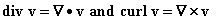

对于

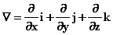

## 17.2 乘积法则和散度

现在我们来回答一个问题：如何应用乘积法则来评估这些内容？

**"del"**运算符和**点积**和**叉积**都是线性的，并且每个偏导数都遵循乘积法则。

我们的第一个问题是：**什么是** 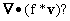

应用乘积法则和线性性我们得到

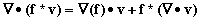

**这有什么用？**

借助它，如果你要求的散度函数可以写成某个函数乘以一个你知道或者可以轻松计算其散度的向量，那么求解散度就简化为求解该函数的梯度，利用你的信息并进行点乘。

**练习 17.1 矢量场(x, y, z)的散度是多少？(-y, x, 0)的散度是多少？**

## 17.3 球坐标中的散度

当你用球坐标或圆柱坐标描述向量时，也就是说，将向量写成由这些坐标定义的单位向量的倍数之和时，计算导数时会遇到问题。

单位向量本身随着坐标的变化而变化，因此您的向量的变化由于倍数的变化以及单位向量的变化而产生。

我们可以通过找到指向这些单位向量方向且具有 0 散度的向量来在这些坐标系中找到散度的简洁表达式。

然后，我们将我们的向量场写成这些向量的线性组合，而不是单位向量的线性组合。

根据乘积法则，我们寻找的散度表达式将是这些向量之一与其系数的梯度的点积的三个方向之和。乘积法则中的第二项都将为 0。

在将来的生活中，您很可能会遇到在这些坐标中表达散度的需要，因此我们将使用球坐标系来进行这种方法。

**首先请注意：每当您在极坐标中微分函数时，您必须单独并仔细地处理其中的原点。坐标本身在那里是奇异的！最安全的做法是添加"除了 r = 0"或类似的声明，除非您确定您的结论在那里是合理的。通常情况下，它在您的坐标原点处是不成立的。**

**下面省略了这样的注意事项，但在涉及极坐标参数的微分时，您应该假设它们存在。**

做这个过程中唯一非平凡的步骤是找到各个所需方向上的具有 0 散度的向量。这可以通过找到这些方向上任何向量的散度，并计算在每种情况下需要应用的倍数来抵消其散度，再次使用散度的乘积定理来完成。

向量(x, y, z)在球坐标系中径向指向，我们称之为方向。它的散度为 3。

它也可以写成或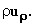

因此，将其散度转换为 0 的乘数必须具有梯度，根据乘积定理，是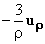乘以自身。

函数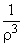正是这样做的，因此在方向上的 0 散度函数是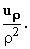

**练习 17.2 注意到(x, y, 0)的散度，也称为 r 或** r**u[r]，为 2。你应该乘以 r 的什么函数才能得到一个散度为 0 的向量呢？**

向量(-y, x)指向方向，已经具有 0 散度。它可以写成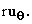

方向是这两个方向的法向量，您可以通过取(-y, x, 0)和(x, y, z)的叉积得到一个在其中的向量，结果为(xz, yz, -r²)。

这个向量的散度为 2z，形式为 rz**u[r]**- r²**u[z]**。

这两个项中的第一个项，rz**u[r]**（即(xz, yz)）具有非零散度，导致它的是 x 和 y，而不是 z 因子。我们可以借助上一个练习的结果引入一个乘数来消除该散度。

结果向量的形式为 ，其长度为 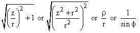 因此可以写成 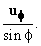

总之，向量 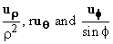 具有 0 散度。

如果我们将这些组合定义为 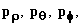，那么形式为 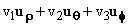 的向量也可以写成

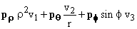

其散度是

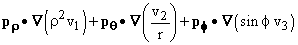

或

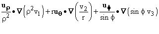

或

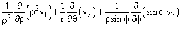

这就是球坐标中的散度形式。

在这里的最后一行中，我们使用了球坐标中的梯度形式：请记住， 是一个极坐标变量，其半径为 r， 是一个极坐标变量，其半径为 。还请记住，r 是 sin。

这最后一个表达不太漂亮，但在物理应用中相当重要。

它特别出现在组合 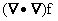 中，称为 f 的**拉普拉斯**。

在矩形坐标和球坐标中，**拉普拉斯**采用以下形式，这些形式来自梯度和散度的表达式

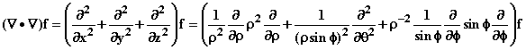

**练习：**

**17.3 找到 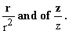 的散度**

**17.4 根据上面对球坐标的逻辑，推导出柱坐标中的散度形式。应用它来找到柱坐标中的拉普拉斯。**

## 17.4 乘积法则与旋度

乘积法则应用于旋度的形式为

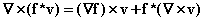

（这是一维乘积规则和我们所有乘积的线性性的直接推论。当这些导数作用于 f 时，它们形成这里的第一项，当它们作用于 v 时，它们形成第二项。这里的怪异星号表示普通乘法。）

最后一节中用于减少球坐标中散度计算的方法同样适用于旋度的计算。

你会记得，方法是找到指向正确方向的具有 (0) 旋度的向量，将一般向量表示为这些向量的组合，并使用乘积定理来表示结果。有了旋度为 (0)，乘积定理中的两项之一消失了，我们就得到了我们的公式。

你需要做的就是找到每个适当方向上旋度为零的向量。这很容易做到，因为任何函数的梯度都会有旋度为零。

因此，我们可以取和以及的梯度，这些将是指向正确方向的向量，并立即给出

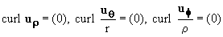

通过乘积定理，我们推导出

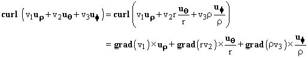

不幸的是，我必须承认在任何情境下我从未使用过这个结果。所以你可以放心地忽略它，我想。

**练习：**

**17.5 找到柱坐标中与旋度类似的表达式。**

**17.6 找到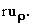的旋度**
