# 第十八章：复数及其函数

## 引言

复数、它们在复平面上的表示以及在复平面上定义的函数在许多学科中都非常重要。基本性质得到了回顾。

## 主题

18.1  符号、用大小和角度表示复数、实部和虚部

18.2  复变函数

18.3  函数 z 的 z = x + iy，没有旋度，作为向量

18.4  德莫弗定理

18.5  对数和角度的多值性问题

## 18.1 符号、用大小和角度表示复数、实部和虚部

**为什么要研究复数和复变函数？** 答案

我们引入 i，即 -1 的平方根，以允许负数有平方根，这是普通实数中没有的。

复数可以被描述为二维欧几里得空间中的向量。

我们通常使用 x 变量表示数字的实部，使用 y 变量表示其虚部。因此，在处理复数时，基础向量**i**和**j**分别是数字 1 和 i。 

数字 (1 + i) 可以表示为向量 (1, 1)。

在这个**背景下，向量的长度 r 是分量的平方和的正平方根。**

对于数字 (a + ib)，r 是 (a + ib)(a - ib) 的平方根。

**角度**  的定义与向量完全相同。

我们通常将这个向量的 x 分量称为其**实部**，将 y 分量称为其**虚部**。

复数具有普通向量所缺乏的附加属性，即我们可以定义它们之间的乘法，使其遵守算术的通常交换、结合和分配律。这一事实允许按照我们用来定义普通实函数的规则来定义复值函数。

<applet code="ComplexNumbers" codebase="../applets/" archive="complexNumbers.jar,mk_lib.jar,parser_math.jar,jcbwt363.jar" width="760" height="450"></applet>

## 18.2 复变函数

依赖于组合 (x + iy) 的 (x, y) 函数被称为**复变函数**，而这种函数在这个变量上可以展开成幂级数的函数尤为重要。

这个组合 (x + iy) 通常被称为 z，并且我们可以定义诸如 z^n、exp(z)、sin z 以及所有标准 z 函数的函数，以及 x 函数。

它们的定义方式完全相同，唯一的区别是它们实际上是复值函数，也就是说，它们是这个二维复数空间中的向量，每个向量都有一个实部和一个虚部（或分量）。

我们先前讨论的大多数标准函数具有一个性质，即当它们的参数为实数时，它们的值是实数。明显的例外是平方根函数，对于负参数它变为虚数。

由于我们可以将 z 乘以自身和任何其他复数，因此我们可以形成 z 的任何多项式和任何幂级数。我们通过它们在复平面上处处收敛的幂级数展开式来定义 z 的指数和正弦函数。

由于产生标准函数的所有操作都可以应用于复杂函数，因此我们可以通过与产生实变量的标准函数相同的步骤来产生复变量的所有标准函数。

<applet code="ComplexFunctions" codebase="../applets/" archive="complexFunctions.jar,go.jar,goText.jar,mk_lib.jar,parser_math.jar,jcbwt363.jar" width="760" height="450"></applet>

## 18.3 z 的函数，z = x + iy，在向量方面没有旋度

我们已经看到，在向量中，函数 r 维度单位向量的旋度在导数被定义的地方为 0。关于变量 z 的任何函数 f 的一个类似的陈述也有。

我们可以通过对 f(z) 进行微分的链式法则来推导它。

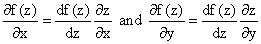

由于 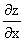 是 1，而 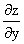 是 i，我们发现

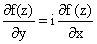

并且在取此方程的实部和虚部时，我们得到

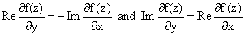

这些条件告诉我们，对于 x + iy 的函数的实部和虚部的“梯度向量”在复平面的任何地方都是正交的。

将这两个方程结合起来告诉我们**任何 z 的两次可微函数的实部或虚部的二维拉普拉斯算子都为 0**。

**练习 18.1 在此明确推导这个性质。**

我们可以将任何函数 f(z) 的实部或虚部表示为两个变量 x 和 y 的实函数。

我们可以将其作为三维图像，或者可以使用“等势线”方法，在平面图中通过等势线来表示任一函数。

在讨论该表示时，我们注意到我们还可以在适当点将梯度向量连接在一起形成路径，有时这些路径被称为“力线”，因为它们在某些物理上下文中是如此。

我们讨论的关系告诉我们的是，任何适当可微函数的 z 的实部的等势线都是虚部的力线，反之亦然！

例如，考虑函数 z²。它的实部是 x² - y²，虚部是 2xy。

**练习：**

**18.2** **使用 applet 查看每个的等高线；并验证其中一个的等高线是否与另一个的垂直。**

**18.3 尝试计算 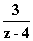，其中 x 和 y 均小于 1。**

## 18.4 德莫弗定理

变量 z，z = x + iy 可以用它的长度和角度表示，就像任何二维向量一样，关系如下

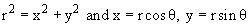

德莫弗定理是这样陈述的：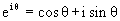。因此，我们可以写成

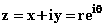

## 18.5 对数和角度多值性问题

z 的对数可以从上一个方程描述为

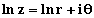

这个公式存在一个问题，问题在于角度  在复平面上不是一个良定义的函数，因此 ln z 也不是。

困难在于，当我们逆时针绕原点转动时，角度不断增加，并在每一次旋转后增加 2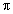。

因此，对于给定的 z 值，对数的值取决于你是如何到达的；除非你人为地限制其角度，比如范围从 - 到 。如果这样做，函数 ln z 在负实轴上是不连续的。

对于像 x^(1/2) 和 x^(1/3) 这样的反幂函数也存在类似的问题。

有几种方法可以解决这个问题。

通俗的方法是通过引入**一个为它们定义的不连续线，称为切线，**来精确定义这样的反函数。

因此，对于对数函数，你可以说它的虚部，，的值从 0 到 2。如果是这样，它在正实轴上是不连续的，一个一侧为 0，另一侧为 2。

或者你可以让它的值从 - 到 +，这样它的不连续线就是负实轴，你可以选择从原点开始的任何其他半不连续线。

处理这个问题的另一种方法是将复平面替换为一个称为**黎曼曲面**的几何结构，在此曲面上，所涉及的函数是单值的，没有不连续性。

对于对数函数来说，这个曲面绕着原点旋转。对于平方根来说，如果你绕原点转两圈，你会回到起点。

**练习：**

**18.4 为函数 (z² - 1)^(1/2) 定义一个适当的切割系统。你能找到一个定义其切割线为单线段的定义吗？**

**18.5 描述每种情况下此函数的黎曼曲面。**
