# 第十九章：反导数或不定积分

## 介绍

找到反导数就是找到一个在一系列值上具有给定导数的函数。 可以做到这一点的导数类别以及一些找到反导数的方法都在描述。

## 主题

19.1  Introduction

19.2  反导数的非唯一性

19.3  通过观察找到反导数以及我们可以反导数的函数类

19.4  替换

19.5  分部积分

19.6  关于参数的微分

19.7  偏分解

## 19.1 介绍

如果我们想要研究由某种物理或其他情况定义的未知函数，那么分析的方法就是研究其导数，作为适当变量的函数，并从中推导出一个方程。

这个方程通常是微分方程的一个例子，微分方程是涉及未知函数的导数的方程。解微分方程的过程称为积分。

当我们有一个关于单变量 x 的区间上的函数 f 的导数的显式公式，并且此公式仅依赖于自变量 x 时，这个问题的一个重要特例发生了。

**我们想要尽可能多地了解这些信息能为我们提供的关于函数 f 的信息。**

因此，我们希望从 g(x)，其中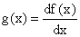，对于 a < x < b，到达 f(x)；我们想“撤销”微分算子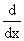，并且这可以被称为找到 g(x)的反导数来找到 f(x)本身或者尽可能多的关于它的信息；这个任务的标准名称是找到**反导数**的。

这个过程也被称为**找到关于 x 的 g(x)的不定积分**。

我们将不再使用这个术语，因为我们想以完全不同的方式定义*定积分*，并且想要避免这两个概念之间的混淆。

当然，你可以从名称的相似性中预料到 *定积分*（此处根本没有定义）和此处的*反导数*之间会有密切关系。如果你这么猜，你是对的。但是这种关系是一个基本定理，称为微积分的基本定理。

## 19.2 反导数的非唯一性

找到类似于定义函数的*逆*的问题与找到反导数的困难相似，该函数在某些参数上取得多个值。 知道原始函数达到其中一个值并不能确定逆函数；在这种情况下，需要以附加条件的形式提供额外信息，以区分可能被称为逆函数的多个可能原始参数之间的差异。

从导数到函数的过程中，我们必须面对常数的导数为零的事实：因此，我们可以将任何常数添加到任何可能的反导数中，并得到另一个同样有效的反导数。

这实际上是说要完全确定一个反导数，你必须添加额外的信息。特别是函数在任一参数处的值足以通过其定义域上的导数来确定它。

因此，我们必须认识到没有附加条件的情况下，对于给定的 g，没有一个单一的反导函数 f；我们可以找到一个反导函数，或者描述所有反导函数（在这种情况下，你应该给任一反导函数加上 +c），但在另外指定附加条件之前使用术语“g 的反导函数”并不完全正确。

（我记得当我在古代学习微积分时，我们必须玩一个类似于“西蒙说”的游戏，带着 +c；如果问题是这样提出的，答案必须有 +c；否则不带。正如我从更久远的时候记得的那样，很容易让一个人分心以输掉西蒙说的游戏，同样容易忘记在需要时写上 +c。）

## 19.3 凭眼观察求反导数和我们可以反区分的函数类

**区分**已知标准函数的过程可以通过解析函数定义并将适当的区分规则应用于其定义的每一步来实现。

没有特定的**反区分**规则；我们必须反向使用区分规则。这些规则允许我们反区分大量标准函数，但并非全部。

我们几乎可以立即将一些函数识别为其他函数的导数。例如，我们可以通过将规则应用于反向区分幂来反区分 x 中的任意多项式。

因此，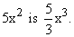 的一个反导数（当反区分多项式时，一个标准错误是在做这个过程中精神上出现疏忽，而不是反区分某个项；请始终检查你是否已经这样做了。）

我们可以类似地反区分**任意幂**（甚至 ，其中之一的反导数是 ln(x)）。而且我们可以反区分 e^(ax) 和 **任意多项式的 sin(x) 和 cos(x)，**尽管后者需要应用一些技巧。

原来，还有更多的技巧可以让我们对**任何有理函数 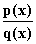 进行求导，其中 p 和 q 是多项式，如果我们可以将 q(x)分解为一次和二次因子；**还有一些技巧可以让我们对**指数与多项式、正弦和余弦的倒数、多项式除以线性或二次函数的平方根、指数正弦和多项式的乘积**以及其他各类函数进行反求导。

另一方面，有一些看起来简单的标准函数我们无法反求导，因为它们的反导数恰好不是标准函数。

（如果这些反导数足够重要，我们会给它们起名字，制作表格，并将它们添加到我们基本函数列表中（目前包括 x、sin x 和 e^x）。但事实证明，它们很重要，但不是那么重要；我们给它们起名字、列表格，但称它们为**特殊函数。**

最简单的不能作为标准函数反求导的函数是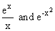，这两个函数都有特殊函数作为特定的反导数。

在微积分教师中，曾经存在着一种争论，即学生是否应该学会所有反求导的技巧，以便对任何可反求导的东西进行反求导。

有些人认为，掌握微积分的标志是能够通过尝试应用各种技巧来进行反求导，从而对奇怪的函数进行反求导。其他人指出，有“积分表”，列出了基本上所有可反求导函数及其反导数，因此，这种技能，其发展是一种奇妙的智慧和记忆练习，但实际价值非常有限。

当时学生面临的障碍是，他们很难获得一本相对完整的积分表副本，并且很难在庞大的积分表中查找内容，这使得第一个观点稍微占据了一点优势。

然而，今天，有商业可用的程序，如 Maple、MATLAB 和 Mathematica（也许还有其他程序），它们可以为您输入的任何函数提供详细的反导数公式，并且立即执行；这似乎使争论倾向于第二个观点。

无论如何，每个微积分学生都应该了解反求导的四个基本工具，我们现在讨论这些工具。

在这样做之前，我们应该注意到一个重要事实，即找到反导数是一个线性操作（与求导相同），因此**一个和的反导数是其和的各项的反导数之和。**

## 19.4 替换

到目前为止，反积分最重要的工具是将链式法则反向应用；这意味着给定一个函数 f(x)，找到一个函数 u(x)，使得你可以将 f(x) 写成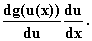 在这种情况下，你可以声明 f 的一个反导数是 g(u(x))。

（这种写法看起来复杂，但实际使用起来比看起来容易。）

例如，假设我们有 f(x) = sin⁵ x cos x。

然后我们可以设定 u(x) = sin x，并找到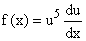，我们可以将其识别为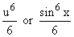的导数，这就是 f 的一个反导数。

相同的思想可以用于反积分任何奇次正弦和余弦多项式，如果你应用恒等式(sin²x + cos²x = 1)将所有项转换为一个正弦或余弦的线性形式，就像上面的 f 一样。

使用这种技术被称为**“替换”**；变量 u 在某种意义上替代了 x。

注意，**如果我们能够识别 f(x) 是已知函数的导数，那么我们可以通过检查进行反积分。**

**使用** u(x) **的替换，我们将问题转换为：我们能否将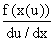识别为 u 的函数的导数？**

在上面的例子中，新问题变成了：我们能否将 sin⁵ x 识别为关于变量 sin x 的导数？由于 sin⁵ x 是 sin x 的幂，我们可以将其识别为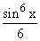的导数，从而找到了 f 的一个反导数。

有一些众所周知的标准替换，可以让我们对许多潜在有用的函数进行反积分。我们在下面进行回顾。

寻找适当的替换可能有助于找到某个特定反导数，这有点像智力侦探工作。这类似于解决国际象棋问题，虽然也许没有实际价值，但可能是一个很好的锻炼，可以培养你的推理能力或者找到一开始看起来像大海捞针的东西的能力。

这里有一些函数类（称为被积函数），你至少应该在理论上能够积分。细节可能变得复杂和乏味，但这仅仅意味着你不会被要求经常做这些计算。

1\. **任何 x 的多项式。** 这些可以直接通过逐项使用反向幂规则来进行检查。

2\. **任何 x 的单一正或负幂次，** 如 (x-3)^(1/3) 或 (1-x)^(-1)。同样的方法。

3\. **任何指数形式如 e^(ax)。** 同样，可以直接应用不同 iating exponents 的规则进行反积分。

4\. **任何正弦和余弦的多项式乘以任何指数**，就像最后一种情况一样。在这里，你可以使用正弦和余弦的指数公式，将其转换为一组指数的丑陋和，每个指数都适用于情况 3。一些指数将是复数，但又怎样���

5\. **函数 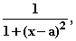**，其积分是 (x-a) 的反正切。

6\. **任何 x 的有理函数**，即任何形如  的函数，其中 p 和 q 都是多项式。要做到这一点，你必须能够将 q 因式分解为线性（也许是二次的）项，使用后面讨论的**"部分分式展开"**技术，然后使用上述的情况 1、2 和也许 5 进行积分。

（思路是 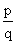 可以写成一个多项式和 q(x) 的零点的单个倒数幂之和（如果你不喜欢使用复数零点，也许还有类似情况 5 的项）。）

7\. **x 的正弦和余弦的有理函数**（理论上）。这可以通过神奇的代换 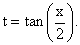 减少为一个有理函数，然后应用情况 6。对于一个复杂函数完成这个过程的想法对我来说太可怕了，但它应该有效。理论上，对于 sinh 和 cosh 的有理函数，使用代换 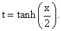 应该也可以。

8\. **任何 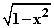 和 x，或者 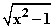 和 x，或者 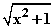 和 x 的有理函数。** 要做到这些，你可以使用代换 x = sin t，或者 x = cosh t 或者 x = sinh t，分别得到 t 的正弦和余弦的有理函数，然后可以应用情况 7 完成任务。

9\. **x 和一个平方根的有理函数，要么是线性函数要么是二次函数。**（一个丑陋的例子是 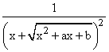；这里是另一个 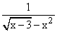。）

如果你有一个线性因子的平方根，你可以使用代换 t = 那个平方根因子，将你的被积函数转换为一个有理函数，然后可以使用情况 6 进行积分。

对于二次因子，你可以**完成平方**，然后进行线性替换，将被积函数转换为情况 8 的形式之一。

能够识别这些方法可能适用的被积函数类别是个好主意。然而，除非你在做任何事情时从不犯错误，否则我建议你如果被迫做一个复杂的后续类型的积分，最好使用 Maple 或 Mathematica 或类似的工具来实际完成。

有一些简单的例子可以练习，以了解涉及的内容。

10\. **正弦、余弦或指数与 x 中的多项式的乘积。**

这可以简化为对每个多项式中的幂进行正弦、余弦或指数与单个幂的乘积，并将结果相加。

后面的积分可以通过分部积分或关于参数的微分来完成，这两种方法都在下面讨论。

11\. **指数、正弦和余弦的多项式与 x 的多项式的乘积。**这可以通过使用三角函数的复指数表达式将其简化为情况 10。

12\. **涉及对数和其他函数的积分。**你可以通过**分部积分**来消除对数，然后，如果你得到了你可以识别的内容，你就可以完成任务。

**这些是我们可以积分的所有函数吗？**

不，还有其他的。(你可以通过写出看起来很可怕的函数并对其进行微分来生成任意复杂的函数，你会发现将结果积分很容易。)

**每个被积函数**由标准函数组成，在积分时不会出现奇点，可以以任何所需的精度进行数值积分。上述方法相对于数值积分的优势在于，你可以在这里保持参数不定，并且必须在进行简单的数值积分时指定它们。

此外，还有一大类特殊函数，它们的性质已经被广泛研究，并且大量的积分可以用它们来表示。

在这个现代化的时代，培养识别哪些被积函数看起来对你来说是可积的艺术是一个好主意。如果你要积分的函数对你来说看起来不熟悉，请尝试使用其中一个数学程序。

## 19.5 分部积分

第二个有用的工具是乘积法则的反向版本。正如我们经常提到的，乘积法则告诉我们

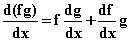

这意味着如果我们寻求 h(x) 的一个反导数，并且我们可以将 h 写成 fg'，那么我们可以将 fg' 写成 (fg)' - f 'g，并且 fg' 的一个反导数就是 (fg)' 的任意反导数与 f 'g 的一个之间的差值。

但是 (fg)' 的一个反导数由 fg 给出；所以我们可以在这里使用乘积法则将寻找 fg' 的反导数的问题简化为寻找 f 'g 的反导数，对于任何 f 和 g。

对于形式为 A(x)x 的乘积，如果你知道 A(x) 的一个反导数 B(x) 和 B(x) 的一个反导数 C(x)，那么这个工具就是有用的。

我们可以在上述等式中将 f = x 和 g = B，然后写出 A(x)x = B'(x)x，通过这个过程是 (Bx)' - B，其中我们使用了恒等式 x' = 1。这具有 Bx - C 作为一个反导数，因此 Bx - C 因此是 Ax 的一个反导数。

这个过程称为**分部积分**。它对于找到指数和幂的乘积、三角函数和幂的乘积或对数和幂的乘积的反函数非常有用，等等。

**例如，假设我们要对 x ln x dx 进行积分，也就是说，我们要求关于 x 的 x ln x 的反导数。**

如果我们设 u = ln x 并且 dv = x dx，我们可以推导出 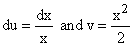 是 x 的一个可能的反函数。

通过分部积分，我们得到 udv = (uv)' - vdu，积分后得到

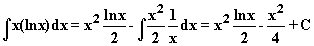

**练习：**

**尝试使用这种技巧对下面的被积函数关于 x 进行积分：**

**19.1\. x⁴(ln x)**

**19.2\. x sin x**

**19.3\. x exp x**

**19.4\. (sin x) exp x (提示：分部积分两次并解出得到的方程。)**

**19.5\. x (sin x) exp x**

## 19.6 关于参数的微分

还有另一种工具，有时可以用来计算反函数，当满足某些收敛条件时有效。

假设我们知道 g(x, y) 的反函数，其中 g 是参数 y 的某个可微函数，同时也是 x 的一个函数。然后我们可以推导出 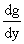 的反函数是 g 的反函数关于 y 的导数。

例如，我们知道 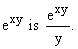 的一个原函数是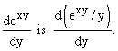

在这里你也可以对 y 进行更高阶的导数。这使得你可以通过对 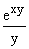 关于 y 求 k 次导数，然后设置 y = a 来推导出形如 x^k e^(ax) 的反函数的公式。

当适用时，这种方法将反函数的查找转换为适当的求导。然而，几乎你用这种方法推导出的一切都可以通过分部积分得到。

## 19.7 部分分解

我们知道如何对形如 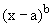 的函数进行反函数，其中 a 和 b 可以是任意值。这将使我们能够找到有理函数  的反函数，如果我们能将它化简为这种形式的项的和以及可能的多项式。

如果 p(x) 的次数高于 q(x)，我们可以通过类似长除法的过程提取一个商多项式 s(x)，称为合成除法。

然后我们可能会剩下一个余项多项式 r(x)。我们知道如何对 s(x) 进行反函数，因此对于  的反函数化简为对 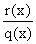 进行反函数，其中分子的次数低于分母的次数。

现在假设我们可以将 q 因式分解成像 (x-a) 或 (x-b)³ 或 ((x-d)²+ c²)^m 这样的因子。

令人惊讶的事实是，表达式 可以分解为每个都具有形式 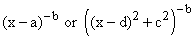或 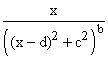的项，其中 a、d 和 c 为某些整数值的 b，每个都可以进行反求导。

这里是一个分解它的过程。

假设分母 q 可以分解为(x-b)^kt(x)，使得 t(b)不为 0。

假设我们找到了关于 x = b 的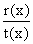的*泰勒级数展开*的前 k 项

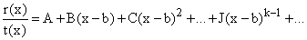

那么在涉及(x-b)的负幂的中，给出如下：

**如果 k = 1**，则只有一个项，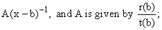

**对于 k = 2**，我们有 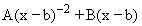，其中 A 与之前一样，而 B 为 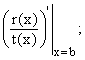，依此类推。

对于二次因子也有类似的规则。

以这种方式分解分母 q 的过程称为**"部分分式法"**。

我们再次回顾各种方法，详见第 27.1 节，并提供一些练习积分，详见第 27.3 节。对于重复我们深感抱歉。
