# 第二十章：曲线下的面积及其许多推广

## 引言

由正函数 f 定义的曲线与 x 轴之间的面积在两个特定的 y 值之间被称为 f 在这些值之间的定积分。从矩形的面积是其边长的乘积这一事实开始，我们可以给出一般曲线下面积的形式定义。所使用的方法是广义的，可以定义多种不描述面积的积分。这些包括在复平面上的路径上的积分，在任意欧几里德空间中的路径上的积分，在平面上的区域上的积分，在三维空间中的曲面上的积分以及在体积上的积分。

## 主题

20.1   面积和符号

20.2   精确定义和黎曼和

20.3   总是可积函数

20.4   不可积函数

20.5   特殊黎曼和

20.6   在复平面上的曲线积分

20.7   欧几里德空间中的曲线积分

20.8   面积积分

20.9   曲面积分

20.10  体积积分

## 20.1 面积和符号

假设我们有一个非负函数 f 关于变量 x，在某个包含区间[a, b]的定义域内，其中 a < b。

如果 f 足够良好，**在线段 x = a，x = b，y = 0 和曲线 y = f(x)之间存在一个明确定义的面积。**

**那个面积被称为 f dx 在 x = a 和 x = b 之间的定积分**（当然，只针对那些有意义的函数）。

它通常写为

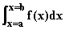

如果 c 位于 a 和 b 之间，显然有

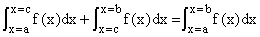

为了使这个方程对任意 c 成立，当 b 小于 a 时，我们要求上面的符号代表所指示面积的**负值**。

在函数 f 有时为负的地方，我们定义定积分和相同的符号来表示*自变量 x 和 y = f(x)之间的面积，其中 f 为正数**减去**当 f 为负数时两者之间的面积*（当 a 小于 b 时）。

要使这个定义具有数学意义，我们必须给出一个计算面积的过程，至少在理论上，并且给出我们可以和不能定义的函数 f 的一些指示。

这里 f 被称为**被积函数**，并且它被积分为"ds"。

我们定义面积的方法基于我们知道矩形的面积是什么，即它是其边长的乘积。如果函数 f(x)是一个常数 c，那么所讨论的面积将是一个矩形，面积将是 c(b - a)。

这就是我们为常数函数定义面积所需的全部。

我们的任务是将这个定义推广到不是常数的函数上。

## 20.2 精确定义和黎曼和

标准方法通过想象我们将区间[a, b]分成许多小带来处理更一般的函数类，并估计每个带的面积为其宽度与带内 x 的某个 f(x)值的乘积。

那么面积将会像带的面积之和那样。 如果我们让最大带长趋向于零，我们可以希望找到带面积的结果和逼近真实面积。

标准做法是让第 i 条带从 x[i-1]开始，到 x[i]结束；该带的面积估计为(x[i]-x[i-1])f(x'[i])，其中 x'[i]在带内的任意位置。

**黎曼和**是刚才指出的形式的和：**它是带宽乘以带内 f(x)值的和。** 如果带的面积之和趋向于一个与每个带中使用的参数无关的常数，当最大带宽趋向于零时，该函数被称为**黎曼可积的**。

上述使用的符号可以从这个方法理解；我们正在对带的面积求和，对于大小为 dx 的 x 周围的一个非常小的区间，其被估计为**f(x)dx**，并将这个求和应用于所有这样的带。

## 20.3 总是可积函数

有两种情况我们知道 f 将在区间*a*和*b*上是黎曼可积的。

如果 f 在包括有限端点的区间内处处**连续**，则 f 将是可积的。

如果一个函数在 x 处连续，那么在 x 附近足够接近的值将彼此足够接近，并且足够接近于其在 x 处的值。

在[a, b]上 f 的连续性意味着在任何带中估计的变化可以通过使带的宽度足够小来使之成为带宽的任意小倍数。

因此，通过要求最大带宽足够小，你可以使黎曼和的总可能变化量成为 b - a 的任意小倍数。

我们可以（并且很快将）证明**有界的在有限区间上单调递增或单调递减的函数是可积的，即使它不连续。**

我们可以定义函数的**变差**为其在增长区间内的增加总和，以及在减少区间内的减少总和。

我们将推断，一个在 a 和 b 之间具有**有界（总）变差**的函数将在该区间上是**黎曼可积的**。

## 20.4 不可积函数

**有没有不是黎曼可积的函数？**

是的，有，并且你必须小心假设一个函数是可积的而没有看它。

非可积函数的最简单示例是：在区间[0, b]中的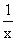；以及在包含 0 的任何区间中的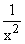。这些本质上是不可积的，因为它们的积分代表的面积是无限的。

还有其他一些情况，积分性质失败，因为被积函数变化太大。

**这的一个极端例子是在任何有理数上为 1，在其他地方为 0 的函数。**

因此，选择用于表示黎曼和中的单个切片的面积将取决于我们在该区间中选择评估被积函数的有理数 x 还是非有理数 x。

**对于这个函数**，无论间隔多么小，**你可以得到一个黎曼和为 0 或 b - a。**

在这种情况下，可以使用更聪明的面积定义来定义它。（你可以争论，实质上，非有理点比有理点多得多，你可以忽略后者，积分将为 0。）

如果我们考虑在区间[-a, b]中由定义的曲线下的面积，其中 a 和 b 为正数，该区域在 0 和 b 之间有无限正部分，在-a 和 0 之间有无限负部分。可以定义这里的面积，使得这些部分相互抵消，并且可以给出净面积的含义。（如果去掉任何小的 d 间隔[-d, d]，剩下的面积是有限的，并且可以计算。然后可以将这个面积的极限值作为 d 趋于 0。结果称为积分的**主部分**，可以这样定义，对于像这样的函数，其无限面积可能有相反的符号，并且可以互相抵消。)

## 20.5 特殊黎曼和

从现在开始，为了方便起见，我们将考虑所有条带宽度相同的黎曼和，d。

**具有固定宽度的一般黎曼和**则由 d 乘以每个条带中选择的 f 值的总和组成。

我们定义以下四个特别感兴趣的选择。

如果我们总是在每个条带中评估 f 的**最左边的参数**，则称总和的值为**L(d)**。

如果我们总是在每个条带中评估 f 的**最右边的参数**，则称总和的值为**R(d)**。

如果我们在每个条带中评估 f 的**最大值**的参数，则称总和为**M(d)**。

如果我们在每个条带中评估 f 的**最小值**的参数，则称总和为**m(d)**。

我们可以得出以下观察。我们假设 f 是有界的，使得 m(d)和 M(d)都是有限的。**那么一个条带的最右边参数是下一个条带的最左边参数。**

**因此，L(d)和 R(d)之间的唯一区别在于 R(d)从最后一个条带中得到了 d * f(b)的贡献，而 L(d)缺少，而 L(d)得到了 R(d)缺少的 d * f(a)的贡献。**

条带端点之间的论证在左侧对 L 间隔有贡献，而在右侧对 R 间隔有相同的贡献。

因此我们有

**R(d) = L(d) + (f(b) - f(a) * d**

这意味着当 d 趋近于 0 时，R(d)和 L(d)会合并在一起。

**其次，M(d)大于或等于真实面积，并且大于或等于通过细分宽度为 d 的条带获得的任何其他黎曼和。同样，m(d)小于或等于真实面积，或者小于或等于通过细分获得的任何其他黎曼和。**

**最后，请注意，如果 f 在 a 和 b 之间是递增的，则 M(d) = R(d)且 m(d) = L(d)，这意味着真实面积和通过细分获得的任何黎曼和都被夹在 d 趋于 0 时逐渐接近的边界之间。**

这意味着通过细分获得的所有黎曼和都必须趋近于相同的值，并且函数 f 是可积的。

如果 f 在 a 和 b 之间不是递增的，但我们可以将该区间分解为在每个部分内 f 是递增或递减的部分，并且 f 在 a 和 b 之间具有有界的总变差，则 f 将通过将结果分别应用于所有部分，并将得到的边界相加而被积。

在接下来的小程序中，您可以输入任何标准函数和限制，然后查看用左手规则和右手规则计算不同切片数的面积。

**练习：**

**20.1 计算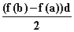函数在区间-1 到 2 中的积分。如果您将此值加到该函数在此区间上的左手规则积分结果中（从下面的小程序中获取），您将得到什么？尝试不同的 d 值。**

**20.2 使用电子表格计算此被积函数的左手规则和右手规则，对于 d = .01 和 d = .02 和 d = .005。**

<applet code="NumericalIntegration" codebase="../applets/" archive="numericalIntegration.jar,mk_lib.jar,parser_math.jar,jcbwt363.jar" width="760" height="450"></applet>

## 20.6 在复平面中积分曲线

到目前为止考虑的定积分代表 xy 平面上的面积。**然而，我们将其定义为通过将 x 区间划分为小的子区间（例如宽度为 d），并将每个子区间的面积的估计值的总和，即 f(x')d，取积分。**

现在假设 C 是复平面中的一条曲线，让 f 是变量 z 的函数，其中 z = x + iy。我们可以通过将曲线分成小段，并对所有段求和 f(z')(z[i] - z[i - 1])，其中 z'是第 i 个间隔的点，其端点为 z[i]和 z[i - 1]，来定义对该曲线的积分 f(z)。

这个沿着曲线的积分将不再代表面积，因为 f 和 z 之间的差异都不再是实数。但是**我们可以将复数相乘，因此这个定义是完全合理的。**

这样的实体在复平面中被称为**轮廓积分**。虽然这个积分不再具有面积的解释，但它仍然具有这样的特性，即如果路径 C 是有限的，函数 f 在其上是有界的且连续的，那么它是良好定义的。我们将其表示如下

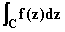

这种类型的积分是非常有价值的数学工具，我们很快就会看到。

不要被在复平面中积分和处理具有复值的函数的奇异性所吓倒。几乎你能够说的关于普通积分的一切都适用于这些积分。

**练习：**

**20.3 将函数 sin z 沿虚轴积分，从 0 到 i，利用你对正弦函数积分的了解。**

**20.4 在电子表格上以数值方式做同样的事情，写成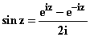，其中 z = x + iy，x = 0（因此 z = iy），y 从 0 到 1。**

## 20.7 在欧几里得空间中的曲线积分

我们将把将曲线分成小片段并将每个片段的端点之间的差乘以某个函数进行求和的思想扩展到**任何欧几里德空间中的曲线 C 上的积分。**

如果 f 是一个标量场，也就是说，一个定义在我们空间中的点的函数，我们可以对路径上的分割点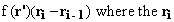求和，再次**r'**是第 i 个子间隔中的点。这可以定义，但这里**r**的差异将是一个向量，并且**总和将是一个向量场。**

当我们在这里用一个向量场**w**(**r**)代替 f 时，得到的概念要更有用，并且**对曲线 C 上由端点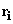定义的间隔求和。结果就是一个数字而不是一个向量。**

**它的定义方式与确定积分中的面积完全相同。它的标准表示法是**

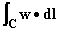

有两个重要的例子，其中这种积分发生。

首先，假设我们沿着 C 积分一个**单位切向量**d**l**。

对于足够小的间隔，这个单位切向量基本上将是一个指向的单位向量。结果就是对曲线 C 上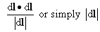的积分。由于这只是对曲线的每个子间隔的长度|d**l**|进行求和，其在整个曲线上的总和将是 C 的长度。

曲线 C 的长度因此由给出

**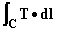**

**其中 T 是曲线方向的单位向量。**

其次，在物理学中，力 F 在沿路径 C 推动物体时所做的**功由形式的积分给出**

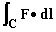

正如我们已经注意到的，我们通过将曲线分割成越来越小的片段，计算每个片段内指定的点积，并在各个片段上求和来定义这样的积分。

到目前为止，我们已经概括了面积的概念或者说我们对它的方法，以定义复平面或欧几里得空间中路径上的积分。

**相同的想法可以应用于二维区域的积分，三维空间中的表面，三维空间中的体积，或者高维度中的任何东西。**

在每种情况下，您都可以**将您感兴趣的区域分解为直径趋于零的片段，并在这些片段上对积分因子乘以片段大小的度量进行求和。**

在三维空间中对表面进行积分时，必须考虑到表面像曲线一样具有方向，因此我们必须相应地进行定义，就像我们刚刚对曲线所做的那样。

您可以在此处输入任何标准向量场和任何参数化曲线，并查看下面的 applet 中展开的积分结果。

**练习 20.5 使用 applet 在默认螺旋路径上积分向量场 xi + yj+ 2zk，并且沿着直线积分，两者都是从 z = 0 到 z = 4 其他变量端点为 0。结果如何比较？**

<applet code="LineIntegrals" codebase="../applets/" archive="lineIntegrals.jar,go.jar,goText.jar,mk_lib.jar,parser_math.jar,jcbwt363.jar" width="760" height="450"></applet>

## 20.8 面积积分

我们对面积的最初概念是通过对线的积分来定义的。我们将线段分成小间隔，并用它们来将由 f 定义的曲线下的面积分成条带。

然而，**没有任何阻止我们将整个区域分成小片段并将它们相加。**

因此，如果我们有一个区域 A，我们可以**在上面放置一系列微小的正方形**，并计算**有多少个正方形在它内部**，以及**有多少个在它的边界上**，并从这些数字（以及正方形的大小）估算其面积。

我们可以类似地估计由**f(x, y)**定义的表面下的**体积**，方法是**将每个正方形的面积乘以其中一点的 f 的值；**同样，我们可以定义黎曼和，并考虑当**每个片段的最大面积趋近于零时，所有黎曼和都趋近于一个特定值时，积分被定义。**

这种类型的积分称为面积积分，我们可以表示为

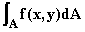

如果 f 在有界闭区域上连续，那么这样的积分将始终是明确定义的。

## 20.9 表面积分

在三维空间中，我们可以对足够好的表面进行积分，方法是将其分成小片段，并且与在平面上的区域完全相同。

飞机毕竟只是三维空间中表面的一个特别简单和直接的例子。

我们考虑的表面在小距离上**看起来大部分像平面**，因此**每个微小表面元素都将具有本质上是平面的小片面积 dS**。

然而，每个小表面元素 dS 都有一个法线方向**n**，再次考虑**向量 dS，即其面积 dS 乘以（外部）法线向量 n**是合适的。

**您可以将所有这些乘以被积函数的小向量相加，并为这些定义黎曼和以获得表面积分。**

上面最后一句指的是将向量 d**S**（记住 d**S**是|dS|乘以表面外法线**n**）与**被积函数**相乘；有三种明显的方法可以做到这一点。

如果被积函数是一个函数 f(x, y, z)，我们可以相乘，和将会是一个向量。这是可以的，但这是最不常见的做法。

标准做法是有**一个被积向量 v(x, y)**，并将其与 d**S**进行**点乘**，并**对这些片段的点乘求和**。这是最常见的表面积分形式。

我们用以下符号表示这样的积分

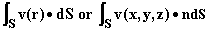

这种积分在物理应用中特别有用。

特别是当向量**v**是电流密度时，**v****n**被定义为**流经法线为 n、表面积为 dS 的表面的 v 电流密度的数量，每单位时间**。

上面的积分告诉我们单位时间内有多少东西流经表面 S。

电流密度被定义为质量和电荷，但这种表面积分在讨论电场和磁场时也很重要。

**高斯定律**，例如在静电学中规定，区域 R 内的总电荷是电场垂直于表面的分量在该区域表面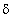R 上的积分的常数倍

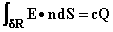

（引力场和区域内质量量之间存在类似关系；对于磁场，磁荷（单极子）的明显缺失意味着可比方程的右侧对于磁场为 0。）

这种积分通常被称为**通量积分**。

<applet code="FluxIntegrals" codebase="../applets/" archive="fluxIntegrals.jar,go.jar,goText.jar,mk_lib.jar,parser_math.jar,jcbwt363.jar" width="760" height="450"></applet>

## 20.10 体积积分

将路径、线、区域或表面分割成小片的想法同样适用于体积。

因此，我们通过相同的方法定义体积积分，希望这次不需要重复了。（这里还是：**将体积分割成更小的片段，比如立方体，并让片段的直径趋于零，对每个片段的贡献求和。**）

体积在三维中是数字而不是向量，因此定义非常直接。

当被积函数为 1 时，积分变为体积本身。

对具有**任意**作为被积函数的密度进行的体积积分是 V 中的总量**任意**。这样的积分经常遇到。

特别地，电荷或质量密度的体积积分给出了该体积内的电荷或质量。

你也会遇到矩。对体积 V 内材料关于 z 轴的质量密度乘以 r²（其中 r 表示到 z 轴的距离）的积分给出了 V 内材料关于 z 轴的**惯性矩**。

更一般地说，矩是与轴或点的距离的幂乘以适当的密度的积分。惯性矩是关于一个轴的“矩”。

体积积分通常表示为

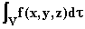

在定义了所有这些实体之后，我们现在转向问题：**我们如何评估它们？**

基本答案是：**我们使用微积分基本定理**，我们现在将描述，要么**直接给出一个答案**，要么**将问题的积分减少到我们执行一个或一系列反导数的情况。**

显然，这里的定义可以扩展到三维以外的维度。

在每种情况下，我们都可以通过相同的论证证明**连续函数在有界闭区域上的积分始终存在**。
