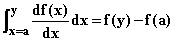
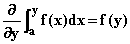
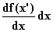
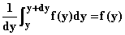
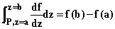
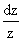
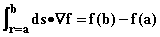
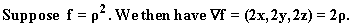
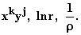

# 第二十一章：一维微积分的基本定理

## 介绍

对函数进行积分和对其进行微分是逆运算；因此曲线下的面积是其作为上端点的积分的反导数。我们探讨了此主张的证明及其对一维积分的影响。

## 话题

21.1  普通积分的基本定理

21.2  在复平面上的路径积分的基本定理

21.3  欧几里得空间中路径积分的基本定理

## 21.1 普通积分的基本定理

对于实函数在实线段上的普通积分，微积分基本定理是明确积分是反导数的陈述。这意味着微分消除了积分，反之亦然，尽其所能。

这有两种表现形式：如果对函数 f 进行微分，然后进行积分，您将获得积分区间端点之间的函数差

此公式意味着**我们可以使用在求定积分中找到反导数的所有方法。**

第二个应用较少但仍有用：如果您对函数 f 进行积分，然后对其上端点（如上所示的 y）进行微分，则会再次获得 f

**这些性质对于我们在上一章中介绍的另外两种一维积分基本上以相同的方式成立。**

这些陈述的类似物对于定义的每一种积分都成立。我们将依次讨论这些。

我们首先证明了这些陈述在普通积分的情况下的情况。

为了证明上述第一个主张，我们观察到如果我们将从 a 到 y 的区间分成微小子区间，**则如果在每个子区间中它是真的，则所得结果成立。**

在任何区间内，中值定理告诉我们，**其端点之间的 f 的差异是它们之间的分离乘以 f 在某个中间点的导数。**

因此，从 x 到 x + d 的区间上的实际差异，**f（x + d） - f（x）可以被认为是某个黎曼和的来自该子区间的贡献，对于区间内的某个点 x'。**

由于积分的存在意味着所有黎曼和都收敛于它，通过在每个子区间上应用中值定理获得的特定子集在最大 ds 趋于零时也必须如此，我们发现**导数的积分是每个无穷小子区间端点之间 f 的变化。**

**这些变化的总和是整个区间 f 的变化，这是我们的积分。**

第二个主张可以重写为如下声明

当 dy 趋于零时。

**由于积分代表了矩形的面积，其中的边界为 dy 和 f(y)，当 dy 趋于零时，这个结果在 f 在参数 y 处连续时成立。**

在这种情况下，对于足够接近 y 的参数的值 f 是任意接近 f(y) 的，并且足够窄的矩形的面积将任意接近于 f(y)dy。

重申一遍，这些陈述的含义是 **我们找到的所有反导数方法都可以应用于确定曲线下的面积，更一般地，用于计算定积分。**

## 21.2 复平面中路径积分的基本定理

用于定义复平面中路径上积分的面积的泛化遵守了与普通实积分相同的基本定理。

我们可以将路径分解成小的片段，每个片段上的积分值将对于足够小的 dz 和 f 在 z 处连续的 f(z + dz) - f(z) 进行近似。我们不会重复上述给出的论点，但注意其结果

**再次强调，这意味着** 第十九章 **中讨论的所有方法在复平面中的运作方式完全相同。**

**特别感兴趣的是** 当 b = a 时路径闭合的情况；

我们期望积分为 0。这在 f 是一个明确定义的函数时是成立的。

当 f 具有对数因子时，情况并非总是如此，因为这些不是真正的函数，可以在同一点上取不同的值。

一般来说，**在一个闭合路径上，如果 f 在路径内部没有奇点，那么 f 的积分将为 0，但如果路径内有奇点，则一般情况下不为 0，这些奇点会产生对数因子。**

像多项式、exp(x)、正弦和余弦的多项式指数和多项式等函数都是始终定义良好的，并且它们的积分总是明确地遵循上述方程。具有对数因子的函数在某种意义上遵循它，但其中的 f(b) 和 f(a) 的值可能取决于路径。

关于对数的与此相关的奇异性的最简单示例在于 **被积函数 z^(-1).**

假设我们在绕原点的半径为 r 的圆形路径上积分此函数。那么我们有 z = rexp(i)，因此在固定 r 时，我们有 dz = irexp(i)d。因此  变成了 id。而它在围绕半径为 r 的圆上的积分是 2i。

这相当于说，用这个被积函数从 a 积到 b，**我们得到一个实部加上 2i 的任何整数倍，这取决于路径 P 绕原点旋转的次数。**

**如果函数 f 在路径 P 所围区域内不是奇异的，则沿 P 的 f 的积分将为 0。**

**如果 f 可以在某个参数 z[0]周围的幂级数中展开，其中包括正负项，则除了负一次幂之外的所有幂都是其他幂的导数，它们的积分是路径无关的。**

负一次幂给出了如上所述的问题。在该点周围的幂级数展开中，负一次幂的系数称为函数在该点的**残留**。**该函数在该点周围的积分是其残留的 2i 倍。**

总而言之，在复合积分的情况下，基本微积分定理完全适用，但是某些函数的积分具有相同的端点但具有不同的值。

这是因为积分得到的实体实际上不是真正的函数，而是多值的。

一个有趣的问题是，**可以从被积函数中检测到这种奇怪的现象吗？**

答案是可以的；**如果被积函数在两个路径之间是奇异的，则积分的值将不同，并且将由两个路径之间残留的和的 2i 倍差异。**

**这个事实给了你一个宝贵的工具，用于评估超越所有可用反微分的积分。**

第二种形式的基本定理，即对于其上限端点的复积分的导数与普通实积分完全相同。在我看来，在这种情况下很少使用。

**练习：**

**21.1 在复平面上评估 z ^(-1) dz 的积分，围绕原点进行圆形路径。**

**21.2 对其进行积分，该路径在逆时针方向绕原点旋转两次。**

**21.3 对其进行积分，该路径形成围绕点 z = 2 的半径为 1 的圆。**

**21.4 在半径为 1 的圆上围绕原点进行积分。在以 z = 1.5 为中心的半径为 2 的圆上进行积分。**

## 21.3 欧几里得空间路径上的积分的基本定理

我们在 P 中取一条路径，它可以被分成许多小段，每一段在小距离上都类似于一条直线，并选择在其上下文可微的标量场 f。

我们通过与先前情况相同的方法来证明这种情况下的基本定理。我们首先考虑被积路径的一个非常小的部分，对于可微曲线来说，它看起来像一条直线。

线段端点之间的 f 的变化构成了构成 C 的微小部分的方向导数，该方向导数乘以线段的长度 ds。

如果该线段具有单位切向量 T，则此变化由(Tf)ds 给出，并且我们有

f(r + Tds) - f(r) = ds(Tf).

如果我们将此语句总结到整个路径 P 上，我们得到

这意味着沿路径的梯度分量的积分将给出 f 的变化或 P 前后端点处的值之间的差异。

这是多维线或路径积分的基本定理的形式。

在第二十三章中，我们将展示如何将路径积分转换为普通积分，可以对其应用寻找反导数的工具。

此处的基本定理给出了在被积函数乘以 ds 的形式为(Tf)ds 时，**评估定积分的更简单方法**，这也可以写作(dsf)T。

注意，这意味着这样的积分不依赖于你使用的路径，而仅依赖于端点。

要有效地使用此结果，您必须了解什么样的矢量场可以识别为标量场的梯度。

这样做的一种方法是找到各种标量场的梯度，这样你将会熟悉它们。

在下一章中，我们将找到一个测试，您可以使用该测试确定您的积分是否具有适合使用此定理的形式。

不仅如此，我们还将找到一种公式，用于将沿一条路径的积分与沿另一条路径的积分相关联，当被积函数的形式不是梯度与 ds 点乘的形式时。

**记住，您可能能够将您的积分的一部分识别为梯度，从而留下一个相对容易需要简化为普通积分的部分。**

**练习：**

21.5  查找从(0, 0, 0)到(1, 2, 3)的路径上的积分，该路径从原点沿 x 轴上升到 x = 1，然后平行于 y 轴到 y =2，然后沿 z 轴平行到 z = 3。

（提示：忽略路径，使用基本定理。）

21.6 评估以下场的梯度：
