# 第二十二章：高维空间中的基本定理;可加度量，斯托克斯定理和散度定理

## 介绍

我们寻找（并找到了）与表面和体积积分的基本定理类似的模拟物。为此，我们检查具有与我们的积分相同可加性属性的构造，因为任何将积分与其他事物相关联的定理必须将其与具有相同可加性属性的其他事物相关联。凭借这一事实的线索，我们找到了我们所寻找的结果，即斯托克斯定理和散度定理，这是这个学科中最强大的工具。

## 主题

22.1  一般评论

22.2  表面上的度量和斯托克斯定理

22.3  体积上的度量和散度定理

## 22.1 一般评论

二维和三维中的基本定理是所有领域中最重要和最有影响力的结果之一。它们提供了一些关键，允许将控制电磁现象的定律表示为微分方程，这是我们理解物理结构的来源，也是无线电及其后续发展的基础。

代替简单地陈述这些基本定理，我们首先探讨一个问题：它们可以采用什么自然形式？

我们所定义的积分：在实数线上，在复平面上，在几维空间的路径上，或在曲面或体积上都具有重要的性质，即它们是有限可加的。**这意味着，如果你在两个不重叠的片上定义任何一个积分，它们的值就是在任一片上的值的总和。**

显然，区间内的曲线下的面积遵循这个属性；实际上，这是我们定义的这个概念的所有泛化的基础。

在每个泛化中都要记住，我们采用了一个合适的“片”的定义：（依次是在复平面中的曲线上的区间，或在多个维度中的路径上，或在平面上的小区域上或在三维空间中的曲面上或在体积的要素上。）

然后将其大小的适当“度量”乘以定义在其上的一些函数 f；并**定义这个产品在一个大片上的值为其在该片的分割（“黎曼和”）上的值的总和，其值是在更小的片上的。**

然后我们将片段的最大直径逼近零的极限。在每种情况下，我们都可以声明对于连续函数 f，得到的和收敛到一个我们称为积分的极限值。

现在我们提出一个问题，**是否存在其他自然实体，像这些一样具有相同的“可加性”属性，即在几个部分的“总和”上的值等于其在每个部分上的值的总和。**

我们这样做是因为我们想要将适当的积分与其他事物联系起来，而任何可能与某种积分相等的其他事物一般来说，至少必须具有这个属性。

这个问题的最简单答案决定了每个上下文中基本定理的结构。

首先，我们解决了这个问题的一个维度积分，在那里我们已经看到了答案。

我们问，除了由函数 **f** 定义的曲线下的面积之外，还有哪种构造在实线段的区间上定义时具有这种可加性质？

有一个简单而自然的答案：如果我们在实线段上划分一个区间 **[a, b]**，一个自然的可加实体是 **F(b) - F(a)**，即区间端点处函数 **F** 的差，或者等价地，**a** 和 **b** 之间 **F** 的变化是可加的。

显然，两个完全不相交区间上 **F** 的变化之和是两者之和；更有趣的是，两个相邻区间上 **F** 的变化是每个变化的总和。我们有

（**F(b) - F(c)**）+（**F(c) - F(a)**）= **F(b) - F(a)**

这句话的意思是来自中间点 **c** 的贡献，它是一个区间的前端和另一个区间的后端，互相抵消了，我们只有来自结果大区间两端的贡献。

这个答案并不令人兴奋，其一维泛化到复平面中的路径或欧几里得空间中的路径同样直截了当。

在复平面上的路径 C 上，**F**（此时 **F** 是一个实值或复值函数）在 C 的端点处的差是有限可加的。

如果我们将一条路径分成两个子路径，或者将一条路径连接到另一条路径的末端，那么结果子路径的末端值之差总和等于整个路径上的差异，而不需要任何修改。

再次，假设给定一个在多维空间中定义的标量场 **F**，并给定其中的一个路径 **C**，则对于 **C** 上的 **F** 的变化，相同的可加性质成立。

实际上，在这些上下文中，在 第二十一章 中我们在发展微积分基本定理时使用了这种可加性。

那么，唯一有趣的问题就是，当我们考虑平面上的一个区域，或者一个表面上的区域，或者一个体积上的区域时，与路径上的差异类似的东西可以找到什么呢？我们特别关注的是涉及到给定区域的边界的实体，这就是对于路径上的区间来说 **F(b) - F(a)** 代表的东西。

## 22.2 表面上的测度和斯托克斯定理

现在假设我们在平面上有两个相邻但不重叠的区域，比如矩形。我们问：我们能在每个矩形的边界上定义什么实体，使其像曲线上的 **F** 的差异那样具有可加性？

我们需要的是来自两个矩形的公共边界的贡献互相抵消。

有一种简单的方法可以实现这一点：我们可以沿着矩形的外部边界周围，按照某个标准方向积分。

我们总是选择逆时针方向作为正方向。

如果我们这样做**我们将在一个相邻矩形之间的内部边界上进行积分**，并在另一个矩形上**向下**进行积分，**这将不会有任何贡献**，**我们将得到可加性。**

要考虑的下一个问题是，**我们应该在矩形的边界上积分什么类型的实体**（或其他区域）？

我们原则上可以以这种方式积分标量或矢量场；我们在上一章中看到，矢量场的线积分是普通积分到路径积分的最自然推广

一个区域的自然可加性边界定义实体是**围绕其边界的路径切线向量与某个向量 v 的点积的线积分**

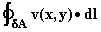

**这个实体将在任何定义了它的向量 v 上是可加的**，**在平面上**，或者说**在任何局部平面的表面上**，甚至**在由局部平面组成的任何表面上**。

我们用一个带有圆圈的积分符号表示这种类型的积分，意味着我们正在**沿着分段局部平面区域 A 的边界进行积分。**

现在我们要问**当 A 是具有轴平行边的矩形时，这个积分是什么？**（顺便说一句，我们总是可以旋转我们的坐标，使得任何矩形在旋转后边将是轴平行的。）

我们假设我们在三维空间中工作。

然后我们的积分由围绕 A 的垂直和水平段组成，如此处所示。

我们选择我们的矩形的角落为 (x, y) 和 (x + dx, y + dy) 对于微小的 dx 和 dy。

然后沿着右侧向上和左侧向下的积分**vdl** 将会有贡献

(vy - vy)dy

而从右到左沿其顶部和从左到右沿其底部的积分贡献

(vx - vx)dy

观察到对于微分，我们可以将 A(q + dq) - A(q) 重写为 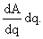 在这里应用这个公式并将上述两个贡献相加，我们发现我们围绕无限小矩形的积分是

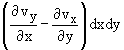

在我们这里的坐标系中，z 方向是矩形平面的法线方向，您会观察到这里的内容是 v 的旋度分量与矩形的面积元素相乘

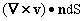

**现在我们有了我们的基本定理。** 对于平面上的面积积分，它被称为**格林定理。** 对于一般足够分段光滑的表面，它被称为**斯托克斯定理**

这个结果适用于表面上的任何可以被分解成小矩形的区域 A，通过等式两边的可加性。

实际上，您可以（我们忽略了一些）稍微费点劲推导出三角形以及矩形的相同无穷小结果。因此，这个结论也适用于**任何可以合理分解成微小且不重叠的矩形和三角形的区域。**

您会发现 v 的旋度在定理中自然地出现了。事实上，这个定理的性质是我们对旋度感兴趣的主要原因。

这个定理有一些直接的后果。

首先，**如果 v 的旋度在一个表面上为 0，那么沿着它的线积分从一个点到另一个点将与路径无关，只要路径保持在表面内。**

其次，如果您可以计算从一点到另一点沿着一个路径的线（或路径）积分，您可以通过在其边界为两条路径的任何表面上积分其旋度来推断其沿另一条路径的积分。

## 22.3 体积上的测度和散度定理

假设我们在三维中有一个体积 V，它具有分段局部平面边界。 （这意味着其边界可以被分解成在小距离处看起来平面的有限数量的部分。我们已经定义了一个函数 f 在其上的可加积分（并且可以对任意维度中的“超”体积上的函数执行相同操作）。）

**我们能定义一个在边界上可加的体积积分吗？**

答案是肯定的。

V 的表面在边界局部平面的任意点都可以用**"外法线"方向**来表征。如果我们在这个表面上对矢量**v**的**外法线分量**进行积分，并连接相邻的体积，那么**一个的外法线**将会**另一个的内法线**，它们相遇的地方的边界的贡献将会抵消。

**这意味着连续矢量场 v 的外法线在边界上的积分， V 的体积上将在体积上可加。** 我们写成

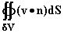

并称之为**通过 V 表面的外部"通量"。**

现在我们可以讨论上一节中针对面积所考虑的相同问题：**如果我们让 V 成为一个无穷小的轴平行矩形体积，边长为 dx、dy 和 dz，在(x, y, z)处有下角，那么这个积分是多少？**

矩形体积 V 有六个外表面，它们构成了它的前面和后面，分别沿着三个轴方向。外法线在正面朝正方向，背面朝负方向。

正如在二维情况下一样，垂直于 x 方向的两个面的贡献成为了 v 在 x + dx 处与 x 处的差值，沿着这些面对 y 和 z 变量的积分。

这个贡献，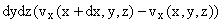可以重写为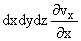。

以完全相同的方式，沿着 y 和 z 方向法线的面的贡献可以分别写为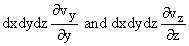，它们相加得到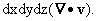

我们发现，对于所示的小体积 V，我们有

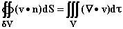

同样地，对于倾斜的平行六面体区域或棱柱，我们可以获得相同的结果，并且我们可以使用可加性来推导出对于任何具有分段局部平坦边界和在其上定义的任何分段连续向量场的任何体积的相同结果。

这个结果再次极为重要。它被称为**散度定理**，也被称为**高斯定理**。

更或多少明显的是，通过合适的定义，任何更高维度中都有一个类似的定理。它再次代表了微积分基本定理的高维版本：右侧的散度导数可以被积分，产生积分的极限点处的差异，将右侧的三维积分转换为左侧 V 边界上的二维积分。

**练习：**

**22.1 考虑由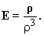定义的向量场 E

计算其通过以原点为中心、半径为 R 的球面的通量的积分。同时计算其散度。（我们之前已经做过这个题目了。）你能解释这个吗？**

**22.2 在以点(0, 0, 2)为中心、半径为 1 的圆周围的 E 的通量积分是多少？**
