# 第二十四章：将曲面积分降维为多重积分和雅可比行列式

## 介绍

表面积分在表示重要物理概念方面具有重要意义，例如物质或电荷的流动，以及电场或磁场的通量。我们还希望能够计算它们，并在这里展示如何进行计算。

## 主题

24.1  概念讨论和主要结果

24.2  对平面上区域的积分的影响：雅可比

24.3  对更高维度的推广

24.4  体积和表面积分作为单个普通积分

## 24.1 概念讨论和主要结果

给定曲面 S 和向量场 **w**，我们已经定义了一个积分，通常称为通过 S 的 **w** 的通量。

我们通过将 S 划分为微小的局部平面片，并将每片的面积乘以与之垂直的 **w** 分量的积之和来定义它。

这正是在实数线段上定义的普通一维积分的精确类比，只是将该区间替换为我们的曲面 S。我们已将其表示为

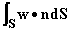

**那么这样一个积分的价值是多少呢？**

当曲面被参数化定义时，我们可以直接回答这个问题。

假设我们的曲面由两个参数 s 和 t 定义，以便对于给定范围内的每对值 (s, t)，我们有值 x(s, t)，y(s, t) 和 z(s, t)，表示相应点 S 上的坐标。这形成了一个我们表示为 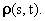 的向量

现在假设我们对给定的 s 和 t 值进行微小变化，将 s 更改为 s + ds，将 t 更改为 t + dt。

这些变化分别导致 x、y 和 z 的变化，对于 x 的变化分别为 x(s + ds, t) - x(s, t) 和 x(s, t + dt) - x(s, t)，也可以写成 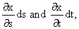，y 和 z 的变化表达式类似。

简而言之，s 和 t 的变化会导致位置向量  的变化，我们可以用向量 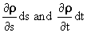 表示它们。

来自值范围 s 到 s + ds 和 t 到 t + dt 的积分对我们积分的贡献是 **由这两个向量形成的平行四边形作为基底的平行体的体积，其高度由 w 在这两个向量上的分量给出**。

在图中，A 和 B 分别表示 。

正如我们在第三章看到的那样，这个体积是行列式的绝对值，其列是三个向量的分量  和 **w**；这个行列式也可以根据下式写成

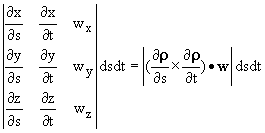

**这就是我们所寻找的答案。**

这里的曲面积分可以写成这里显式被积函数在适当 s 和 t 的范围内的二重积分。

在普通积分的情况下，我们将正号赋予 x 轴以上的区域，将负号赋予 x 轴以下的区域。在这里，我们也类似地将符号与体积的部分相关联，以便我们通常使用的被积函数是**实际行列式**，而不是表示无符号体积的绝对值（上面给出的），它表示无符号体积。

你会注意到这里表达式的符号在交换 s 和 t 时是相反的，这表示在任意曲面片上没有预定义的答案：**哪一端是上？**

无论你在什么样的情境下操作，**我希望**你知道这个问题的答案，并且可以安排这里 s 和 t 的顺序以符合那个答案。

这里是曲面积分如何简化为一对普通积分的方式

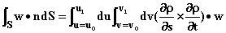

直到适当的符号。

**例子：**

假设我们有由 x = Rsin s cos t，y = Rsin s sin t，z = Rcos s 定义的曲面，对于 0 < s < ，且 0 < t < 2，固定参数 R。

这个曲面是以原点为中心的半径为 R 的球面。

假设**w**是 R^(-2)**u[R]**，它是与这个曲面垂直的，是来自原点的单位电荷的电场。

我们发现这里关于 s 的偏导数形成向量(Rcos s cos t, R cos s sin t, -Rsin s)，而关于 t 的偏导数形成(-Rsin s sin t, R sin s cos t, 0)。我们可以通过注意到这些偏导数彼此和**w**，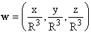，是法线的事实来评估行列式，因此行列式是这些向量的大小的乘积，这些向量是 R，Rsin s 和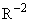。

**我们的积分变成了 sin s ds dt 的积分，积分变成了 4。注意这个结果与 R 无关。**

我们也知道，顺便一提，**w**的散度除了在原点外都为 0。这告诉我们，根据散度定理，如果我们通过将封闭球体外的任何区域的表面添加到其上，并减去不包括原点的任何区域的表面积，我们将不会改变这个答案。

**这意味着如果我们像这样对包围含有原点的区域 V 的任何曲面（足够光滑以使我们的定义有意义）进行 w[b]的积分，我们将得到相同的答案。**

**它进一步暗示，如果我们对来自任何电荷分布的 w 的总和进行积分，我们将从 V 内的每个电荷（符号和电荷量的数量）得到一个贡献 4，而没有其他的。**

这个陈述被称为**高斯定理。** 习惯上用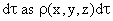来表示体积小元素中的电荷量。 高斯定理可以写成以下形式

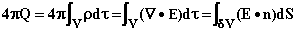

**习题 24.1** **将在垂直圆柱体外壁上从 z = 0 到 1 的垂直部分上的 w[n]的积分，其中 w = (x², xy, z²)，表达为一对普通积分，即多重积分。**

## 24.2 平面上的区域积分的含义：雅可比行列式

在 xy 平面上对面积 A 进行的积分是面积积分的一个特殊且易于可视化的情况。

在上一节的结果中，我们可以添加这样的条件，即 z(s, t) = c 在我们的曲面上始终成立，这样我们就得到了一个面积积分。

在这种情况下，每个面积元素的法线方向**始终**是**k**方向。因此，我们只关心**w**的 z 或**k**分量，因此可以将注意力集中在标量场 w[z]上，其中 w[z] = f(s, t)。

在这种情况下，被积函数乘以面积元素，变为 f(s, t)dA，如果我们取 s = x，t = y，那么面积元素 dA 由 dxdy 给出，于是变为 f(x, y)dxdy。

然而，前一节的结果包含一个重要的含义**当 s 和 t 不是 x 和 y 时。** 它总体上告诉你如何将面积积分或以面积元素 dxdy 表示的积分写成以元素 dsdt 的积分，如果你给定了**任意两个参数**s 和 t，可以在给定的区域 A 内写出 x = x(s, t)和 y = y(s, t)。

简而言之，它告诉你如果你**在具有面积元素 dxdy 的面积积分中改变变量，要得到以元素 dsdt 的积分，该怎么做。**

**这告诉你什么？**

这里的行列式中 w[z]的“余子式”是二乘二行列式，是关于 s 和 t 的 x 和 y 的偏导数的 z 分量。

我们得到：**表达式 f(x, y)dxdy 可以写成 f(x(s, t),y(s, t))dsdt J 的形式，其中 J 被称为从变量 x, y 到 s, t 的变换的雅可比行列式，J 由 x 和 y 关于 s 和 t 的偏导数的行列式的绝对值给出。**

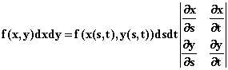

当然，我们不需要引入曲面积分的概念来推导这个结果。 **当在 s 和 t 中进行无穷小变化 ds 和 dt 时，得到的 xy 平面上的面积是平行四边形的面积，其边长是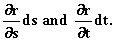**

那个平行四边形的面积是 Jdsdt，这就是以坐标 s 和 t 表示的适当面积元素 dA。

这个非常重要的结果是链式法则的二维类比，它告诉我们一维积分中 dx 和 ds 之间的关系，

请记住**这里定义的雅可比行列式始终为正。**

**练习：**

**24.2 从 dxdy 到 dsdt 的雅可比行列式，与从相反方向进行的雅可比行列式之间有什么关系？**

**24.3 通过检查上述矩阵与转置矩阵（交换行和列）之间的矩阵乘积来解释这一点。**

**24.4 假设 x = uv 和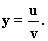找到这个变换在每个方向上的雅可比行列式。**

## 24.3 对更高维度的泛化

上面讨论的一切同样适用于任意欧几里得维度的积分。

因此，你会遇到**三维体积积分**，对于这些，体积元素 dV 可以根据变量 s、t 和 u 的表达式 dV = dxdydz = Jdsdtdu 来表示，其中 J，**雅可比行列式，是变量 x、y 和 z 对于 s、t 和 u 的偏导数的行列式的绝对值。**

还有在“相空间”上的积分，其中每个粒子有 3 个位置和 3 个动量变量，空间和时间的积分，以及对许多粒子的位置的积分。

在更高维度中，体积的类比被称为**超体积**，表面的类比被称为**超表面**。它是整个空间维度少一维的区域。

一个平坦的超表面（称为**超平面**）有一个法线方向，它**垂直于其中所有点之间的差异。**

再次，我们可以通过在无穷小平坦表面上局部定义对向量**w**的法向分量的积分，如上所做的那样。

再次发现，所定义的积分变为**w**和表面上坐标对于定义表面的参数的偏导数的行列式的积分，就像上面发生的那样。

再次**坐标系的变化导致超体积元素的变化，可以像以前一样通过雅可比行列式描述。唯一的区别是相关行列式具有更高的维度。**

**练习 24.5**

**找到从柱坐标到球坐标的雅可比行列式，即找到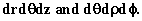之间的关系。**

## 24.4 体积和表面积分作为单个普通积分

有时可以将体积和表面积分作为普通积分进行，而不必费心讨论前几节中讨论的一般方法。

当你的被积函数和被积区域具有足够的对称性，以至于你可以通过观察来做除了一个积分之外的所有积分，这种情况就会发生在我们的形式主义导致的多重积分中。

**为什么要费心做这些事情？**

有两个原因，但都不是很令人信服，但在这里它们是。

首先，使用适用于对任何合理形状和任何合���被积函数进行积分的一般方法来解决问题，其中大部分问题你可以通过直观解决，就像用大炮打蚊子，或者让哲学家教幼儿园一样。

其次，在传统的微积分学习中，你在学习表面积和体积以及多重积分之前很久就学习了单一积分，因此你有机会在不了解这些概念的情况下找到这些问题的答案。

最简单的例子是找到 x 轴（y = 0）、两条线 x = a、x = b 和函数 y = f(x) 定义的曲线之间区域的面积。

你可以将其写成带有被积函数 1 的面积积分，但这样做后，你可以立即将其变为二重积分，并对 y 进行积分，得到该面积的标准公式

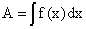

假设**你将曲线 y = f(x) 绕 x 轴旋转**，并询问**由此操作生成的区域的体积**在 x 上具有相同的限制。

现在你可以争辩说，在 x 和 x + dx 之间的这个区域的小切片中的体积是半径为 f(x) 的圆的面积乘以 dx。因此，你可以将其写成一个带有被积函数为该面积的单一积分

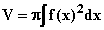

它的表面积呢？

再次，我们可以将我们的曲面切割成 x 和 x + dx 之间的部分。任何一个切片中的表面积将是 ds 乘以半径为 f(x) 的圆的周长。

在这里你必须要小心，因为相对于 x 轴，切割的曲面通常是倾斜的，这里的因子 ds 不是 dx，而是**我们切片中由 y = f(x) 定义的曲线的长度。**

我们知道

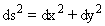

所以

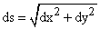

或

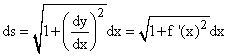

这给出了

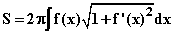

作为**由绕 x 轴旋转的曲线 y = f(x) 生成的曲面的表面积。**

可以为由绕 y 轴旋转的由 y = f(x) 定义的曲线获得的区域生成类似但不同的公式。

**练习 24.6 找到由曲线 y = f(x) 绕 y 轴从 (a, f(a)) 到 (b, f(b)) 定义的区域的体积和表面积的单一积分表达式。**

你也可以在其他坐标系中做类似的事情，例如通过直观地积分球坐标的一个或多个变量。

这种方法的一个标准例子是**球体**。假设我们想确定半径为 R 的**球体的体积和表面积**。

注意，球体是由绕 x 轴旋转的曲线 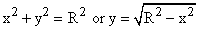。体积或表面积的积分限为 x = -R 和 x = R，被积函数为

**对于体积**

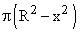

**对于表面**

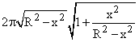

或者

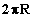

这些可以与标准结果相结合。有趣的是，**在切片厚度为 d 的球体中，只要它的两侧有球体的部分存在，切片的表面积 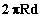 与其位置无关。**

像上面那样的公式可以用于圆锥体、楔形体和各种其他形状。
