# 第二十六章：微分方程的数值解

## 简介

你可以使用辛普森法则等技术来解决更一般的一阶微分方程的数值解。我们来探讨一下��

## 主题

26.1  微分方程简介

26.2  左手法则与外推法

26.3  梯形法则的泛化

26.4  辛普森法则的泛化；龙格-库塔 2^(th) 阶法则

26.5  评论

## 26.1 微分方程简介

**微分方程**是涉及导数的方程。**方程的阶数**是方程中出现的最高阶导数。

这里有一些例子

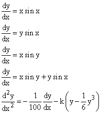

这前四个是**一阶**微分方程，最后一个是**二阶**方程。

前两个被称为线性微分方程，因为它们在变量 y 中是**线性**的，第一个有一个右侧与 y 无关的**“非齐次项”**，第二个是**齐次线性方程**，因为所有项在 y 中都是线性的。

这前三个是**“可分离的”**微分方程，因为它们可以重写为 dx f(x) = dy g(y)，其中 f 和 g 适当。

如果你只知道一个函数的导数，那么你没有足够的信息来完全确定它。因此，你可以寻找**微分方程的解**，或者**一般解**（通常每个方程阶数中都有一个常数），或者**在一些额外条件下的解**。

你可以通过积分找到任何**可分离的一阶**微分方程的一般解，（有时也称为**“求积法”**）。你只需对方程的两边进行积分 dx f(x) = dy g(y)。因此，如果无法精确积分，你可以直接将前一章的数值技术应用于每个方程，并对其进行数值求解。

我们在这里要讨论的问题是：

假设我们有一个**不可分离的一阶微分方程**，因此我们无法直接将其解决为求积。我们能否将以前用于积分的数值技术应用于解决这些方程的任务？

答案是肯定的，我们将在下面展示如何。确实有一个我们接下来会讨论的复杂性，但可以克服。

这个事实的含义是，任何行为可以由一阶微分方程或甚至一组相关的一阶方程建模的系统，都可以通过现代计算机迅速数值解决到任何所需的精度。这使得这些系统的实时控制成为可能，并在工程领域具有巨大价值。

## 26.2 左手法则与外推法

我们寻求形式为**一阶微分方程**的解

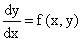

我们假设**我们知道 y(a)** 并希望找到 a 和 b 之间的参数 x 的 y，特别是**想要找到 y(b)。**

我们考虑以下例子

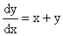

在 a = 0，b = 1 或 2 以及 y(0) = 1 的情况下，用来说明所讨论的方法。

**我们希望将区间 [a, b] 分成长度为 d 的小子区间，对于每个子区间，通过对其中的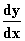 的估计乘以 d 来近似 y 的变化。**

使用普通积分时，我们有很多不同的估计 f 的方法，**左规则、右规则、梯形规则或辛普森规则，以及其他方法，** 这些方法是基于在子区间内使用 f 在各个参数处的值。

这里的复杂性在于我们除了在点 a 处不知道 y 的值外，在任何地方都不知道 y 的值，或者更一般地说，我们只能根据在以前的子区间上的计算来期望在子区间的左侧有 y 的近似值。实际上，我们对该子区间的处理的目的是将我们对其左端点上 y 的估计扩展到对其右端点上 y 的估计。

由于这个事实，我们必须使用一些程序来估计子区间中的 y，以便应用左手法则之外的任何以前的技术。

这个复杂性不影响**左手法则**；所以我们首先问，**我们如何应用那个规则？** 然后：**使用左手法则是否可能得到准确的数值解？** 欧拉和其他人发现的左手法则，包括对区间 x 到 x + d 的 y 变化进行估计。

**y(x + d) - y(x) = f(x, y(x))*d**

并且依次将其应用于 a 和 b 之间的每个子区间，以计算每个 j 下的 y(a + j*d) 并最终计算出 y(b)。它涉及在 f(x, y) 中使用前一个子区间左端点处获得的 x 和 y 的值来计算每个区间内的 y 的变化。

这种方法的优点是在电子表格上实现非常容易。它的缺点是不太准确。它在每个子区间的端点之间是不对称的，因此，**如果你将 d 减小一半，那么主导误差项也会减小一半。** 结果，要将准确性提高 1000 倍，你必须将 d 减小 1000 倍，而这并不是解决这类微分方程的有效方法。

下面的指令实现了当此处的最后一行被复制或向下填充 N - 1 行时，用于 f(x, y) 的此规则。这些是 A、B、C 和 D 列，以及 1-9 行。

要切换到不同的微分方程，你只需要适当地更改 D9 条目并将结果复制下来。

| A | B | C | D | 1=row number |
| --- | --- | --- | --- | --- |
| 左手法则 |   |   | f(x,y)=x+y | 2 |
| 输入 a | 0 |   |   | 3 |
| 输入 b | 1 |   |   | 4 |
| 输入 N | 64 |   |   | 5 |
| 输入 y(a) | 1 |   |   | 6 |
| d | =(B4-B3)/B5 | � |   | 7 |
| 区间索引 | X | Y | f(x,y) | 8 |
| 0 | =B3 | =B6 | =B9+C9 | 9 |
| =A9+1 | =B9+$B$7 | =C9+(B10-B9)*D9 | =B10+C10 | 10 |

这里间隔索引无关紧要，仅用于方便检查您的计算是否有足够的行。 （您可以省略它。）

**我们可以利用外推法来提高这里的性能，** 就像我们在第七章中用于数值微分以及在上一章中用于数值积分一样。

假设我们用子间隔数 N 来表征我们对区间[a, b]的划分。 让我们将应用左手规则的结果称为 L(N)。 要计算 L(N/2)，只需复制整个内容到其他位置，通过将 B10 中的条目乘以 2 来更改第二项，然后将该条目复制下来。 答案将在一半的步骤后出现。

然后我们可以定义一个外推的左手规则，L2，当 N 被 2N 替换时其准确性应该提高 4 倍，通过

L2 = 2L(2N) - L(N)

那么这条规则的行为应该与梯形法则的行为相差不远。 而且我们可以通过外推这个规则来做得更好，形成 L[3]：

L3 = (4*L2 - L2)/3

这应该使得误差在加倍间隔的情况下减少 8 倍，然后我们可以再次外推，形成 L[4]，依此类推，根据规则

**Lj = ((2^(j-1))* Lj-1 - Lj-1)/(2^(j - 1)-1)**

令人惊讶的是，通过这种方式可以达到相当高的准确性。 L(32)不是很准确，而 L(1)，L(2)，L(4)，...，L(16)更差，但它们允许计算 L ，后者要好得多。

**练习 26.1 设置一个电子表格来计算这些值，对于 f(x, y) = x + y, a = 0, b = 1，其中 y(a) = 1，并计算 y 在 x = 1 处的值的 L 。**

对于这个问题，得到的 y(2)的结果如下。比例误差在第二个表格中描述

| N | L | L[2] | L[3] | L[4] | L[5] | L[6] | L[7] | L[8] |
| --- | --- | --- | --- | --- | --- | --- | --- | --- |
| 1 | 3 |   |   |   |   |   |   |   |
| 2 | 5 | 7 |   | 精确答案 | = | 11.7781122 |   |
| 4 | 7.125 | 9.25 | 10 |   |   |   |   |   |
| 8 | 8.921 | 10.71686 | 11.20581 | 11.37807 |   |   |   |   |
| 16 | 10.17 | 11.41207 | 11.64381 | 11.70638 | 11.728268 |   |   |   |
| 32 | 10.92 | 11.66817 | 11.75353 | 11.76921 | 11.773395 | 11.77485027 |   |   |
| 64 | 11.33 | 11.74777 | 11.77431 | 11.77727 | 11.777811 | 11.77795396 | 11.77800322 |   |
| 128 | 11.55 | 11.77013 | 11.77758 | 11.77805 | 11.778098 | 11.7781071 | 11.77810953 | 11.77811037 |

令人非常惊讶的是，即使回到一个间隔的近似值也会改善最终答案，因为它允许进行一次额外的外推。

| N\L 索引 | 1 | 2 | 3 | 4 | 5 | 6 | 7 | 8 |
| --- | --- | --- | --- | --- | --- | --- | --- | --- |
| 1 | -0.7453 |   |   |   |   |   |   |   |
| 2 | -0.5755 | -0.405677 | -1 | � | � | � | � |   |
| 4 | -0.3951 | -0.214645 | -0.15097 | � | � | � | � |   |
| 8 | -0.2426 | -0.090104 | -0.04859 | -0.03396 | � | � | � |   |
| 16 | -0.1368 | -0.031078 | -0.0114 | -0.00609 | -0.00423 | � | � |   |
| 32 | -0.0731 | -0.009335 | -0.00209 | -0.00076 | -0.0004 | -0.000277 | � |   |
| 64 | -0.0378 | -0.002576 | -0.00032 | -7.1E-05 | -2.6E-05 | -1.34E-05 | -9.25E-06 |   |
| 128 | -0.0193 | -0.000678 | -4.5E-05 | -5.6E-06 | -1.2E-06 | -4.33E-07 | -2.27E-07 | -1.56E-07 |
|   | 左手规则 y' = y + z 的比例误差，y(0) = 1，找到 y(2) |   |   |

**由这些结果可以看出，使用最简单的数值方法并对其进行极端外推，实际上可以得到准确的结果。**

注意这里所有的外推都是使用左手规则在 x = 2 处得到的**最终答案**。当中间的 x 值变得可用时，你可以通过在中间 x 值上应用外推来改善所有的计算，从而获得稍微更好的结果。

因此，第一次外推可以应用于在两个区间后更新 y，第二次在每组四个区间后更新，等等。这减少了 y 中的误差叠加的影响，在这里只有轻微的帮助。

显然，你越把 d 减小，就越好，也就是说，你把 N 变得越大，效果就越好。

但是，在这里，使用更小的 N 值进行外推比将 N 加倍改进答案要有效得多。

<applet code="FirstOrderODE" codebase="../applets/" archive="firstOrderODE.jar,mk_lib.jar,parser_math.jar,jcbwt363.jar" width="760" height="450"></applet>

## 26.3 梯形法则的泛化

使用梯形法则来数值逼近积分，比使用左手法则要好得多，如果你能找到一种方法，在你只有左端点处 y 的估计时，在区间的右端点处计算 f(x, y)。

显然，首先近似这样做是使用在左端点定义的 y 的线性近似来近似区间的右端点的 y。得到的规则是

该规则由以下方法近似区间端点处 y 值的差异，即**d 的一半乘以左端点处 f 的导数和在左端点定义的对右端点处导数的线性近似的和。**当 f 不依赖于 y 时，我们得到通常的梯形法则。

另一种观察区间从 x 到 x + d 的方法是通过定义左手规则的“迭代”，如下所示

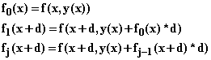

在这些条件下，这里的计算规则是

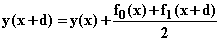

左手规则不适用，因为 y 在区间上发生了变化。这里应用的对 y 的线性近似只不过是因为**y 的导数发生了变化**，这是一个二阶导数的影响。

因此，它造成的误差是与区间大小的平方成正比的，并且与梯形法固有的误差相当。因此，我们预计当 N 加倍时，该规则的结果会提高 4 倍的准确性。

再次强调，设置一个电子表格来计算这个规则对于任何 N 的预测并不复杂，你可以像以前一样进行外推。

它的优点在于，你可以从因子 4 的外推开始，因为在加倍点数时，准确性提高了 4 倍，这一点内在于其结构之中。

该规则不再具有与梯形法相同的权重结构，因为当你在给定的中间点从左边计算 f(x, y) 时，你使用的是在上一个点处的线性近似，而当你在其右侧的区间中计算时，你使用的是在前一个区间中从规则本身计算出的 y 的值。这就是生活。

这是第 9 和第 10 行中的条目，可以替代上面的条目来产生此计算，当红色条目被复制时。表中 D 和 E 列中的红色条目是给出微分方程 y' = x + y 的。它们必须被更改，并且结果被复制，以便切换到不同的微分方程。

| B | C | D | E |   |
| --- | --- | --- | --- | --- |
| X | y=y(x-d)+(f0+f1)*d/2 | f0=x+y(x) | f1=x+d+y(x)+d*f0 | 8 |
| =B3 | =B6 | =B9+C9 | =B10+C9+(B10-B9)*D9 | 9 |
| =B9+$B$7 | =C9+(D9+E9)*(B10-B9)/2 | =B10+C10 | =B12+C10+(B12-B10)*D10 | 10 |

**练习 26.2 比较使用上述规则和使用左手规则得到的结果，对同一问题进行比较。**

使用这种梯形法得到的结果如下所示，具有不同级别的外推：

| N\L# | L[1] | L[2] | L[3] | L[4] | L[5] | L[6] | L[7] | L[8] |
| --- | --- | --- | --- | --- | --- | --- | --- | --- |
| 1 | 5 |   |   |   |   |   |   |   |
| 2 | 9.5 | 11 |   |   |   |   |   |   |
| 4 | 10.9458 | 11.42773 | 11.48883929 |   |   |   |   |   |
| 8 | 11.52449 | 11.71739 | 11.75877194 | 11.77676745 |   |   |   |   |
| 16 | 11.70817 | 11.76939 | 11.77681781 | 11.77802087 | 11.7780613 |   |   |   |
| 32 | 11.75976 | 11.77696 | 11.77804039 | 11.77812189 | 11.77812515 | 11.77812617 |   |   |
| 64 | 11.77341 | 11.77796 | 11.77810835 | 11.77811289 | 11.77811259 | 11.7781124 | 11.77811229 |   |
| 128 | 11.77692 | 11.77809 | 11.77811199 | 11.77811223 | 11.77811221 | 11.7781122 | 11.7781122 | 11.7781122 |

这些计算对于这个问题的准确度显示在下表中：

| N\L# | 1 | 2 | 3 | 4 | 5 | 6 | 7 | 8 |
| --- | --- | --- | --- | --- | --- | --- | --- | --- |
| 1 | -0.57548 | � |   |   |   |   |   |   |
| 2 | -0.19342 | -0.06606 |   |   |   |   |   |   |
| 4 | -0.07067 | -0.02975 | -0.02456 | � | � |   |   |   |
| 8 | -0.02153 | -0.00516 | -0.00164 | -0.00011 | � |   |   |   |
| 16 | -0.00594 | -0.00074 | -0.00011 | -7.8E-06 | -4E-06 |   |   |   |
| 32 | -0.00156 | -9.8E-05 | -6.1E-06 | 8.23E-07 | 1.1E-06 | 1.19E-06 | � | � |
| 64 | -0.0004 | -1.3E-05 | -3.3E-07 | 5.84E-08 | 3.4E-08 | 1.68E-08 | 7.6E-09 | � |
| 128 | -0.0001 | -1.6E-06 | -1.8E-08 | 2.51E-09 | 7.1E-10 | 1.84E-10 | 5.3E-11 | 2.4E-11 |
| ����������� (f0 + f1)/2 规则的比例误差 y' = y + z, y(0) = 1，寻找 y(2) |   |   |

您会注意到，这里没有外推的估计比上一个方法的第一次迭代更好一点，对于 N = 128，好了 6 倍。然而，在外推后，结果比上一个表格中更准确了成千上万倍。请参阅一阶常微分方程 Applet

## 26.4 辛普森规则的泛化；龙格-库塔 2 阶规则

通过提供一个估计区间内 y 变化的规则，其精度与辛普森规则相当，您甚至可以做得更好。

为此，我们估计区间起点、中点和终点处的 f，并给予这些估计相对权重 1 4 1，就像辛普森规则一样。只需要对中点和右端点的 f 的估计精确到“二阶”，使其误差为立方或更小。

有很多方法可以做到这一点。f 的左手值根本没有问题，是 f(x, y(x))。龙格-库塔二阶规则涉及使用

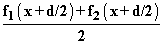

在区间中间对被积函数进行近似，以及

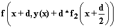

在右端进行近似，使用

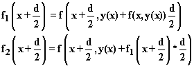

因此，给定的符号，该方法提供以下规则

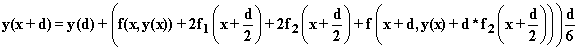

同样，这个规则可以在电子表格上很容易地实现。现在您需要为 x、y 和此规则中出现的四个 f 项中的每个列都需要一个或两个条目，并且为每个列复制。它也可以被外推。

**练习 26.3 使用旧的初始条件，y(0) = 1，在 x = 1 时计算相同方程的解，y' = y + x。对于 N = 32，它比以前的方法好多少？**

这个规则的显著之处在于误差是四阶的，就像辛普森规则一样。因此，如果我们将区间数加倍，那么对于大的 N 值，误差将减小 16 倍。辛普森规则具有这样的对称性，这使得成立。令人惊讶的是，这里的估计没有立方误差项，但它们确实没有。

有了 B11 中的 x 和 C11 中的 y，这里是对于方程中的 D、E、F 和 G 的 f 的相关条目，用于拷贝以计算方程 y' = y + x

| f = x + y(x) | f[1] = f + (1 + f)d / 2 | f + (1 + f[1])d / 2 | f + (1 + f[2])d |
| --- | --- | --- | --- |
| =B11+C11 | =D11+(1+D11)*(B12-B11)/2 | =D11+(1+E11)*(B12-B11)/2 | =D11+(1+F11)*(B12-B11) |

这里是在 x = 2 时这种方法的结果。外推假设误差的主导项在减半区间后减小了 16 倍。

| N\L# | 1 | 2 | 3 | 4 | 5 | 6 | 7 |
| --- | --- | --- | --- | --- | --- | --- | --- |
| 1 | 11 | � |   |   | 精确答案 | = | 11.7781122 |
| 2 | 11.670139 | 11.71481481 | � |   |   |   |   |
| 4 | 11.767941 | 11.77446077 | 11.77638483 |   |   |   |   |
| 8 | 11.777331 | 11.77795654 | 11.77806931 | 11.77809605 |   |   |   |
| 16 | 11.778058 | 11.7781065 | 11.77811134 | 11.77811201 | 11.77811213 |   |   |
| 32 | 11.778109 | 11.77811201 | 11.77811218 | 11.7781122 | 11.7781122 | 11.7781122 |   |
| 64 | 11.778112 | 11.77811219 | 11.7781122 | 11.7781122 | 11.7781122 | 11.7781122 | 11.7781122 |
|   | Runge-Kutta 规则 y' = y + x, y(0) = 1, 对于 y(2) 的值与外推 |   |   |

这里显示了比例误差

| N\L# | 1 | 2 | 3 | 4 | 5 | 6 | 7 |
| --- | --- | --- | --- | --- | --- | --- | --- |
| 1 | -0.06606425 |   |   |   |   |   |   |
| 2 | -0.00916728 | -0.00537 |   |   |   |   |   |
| 4 | -0.0008636 | -0.00031 | -0.00015 |   |   |   |   |
| 8 | -6.6365E-05 | -1.3E-05 | -3.6E-06 | -1.4E-06 |   |   |   |
| 16 | -4.6011E-06 | -4.8E-07 | -7.3E-08 | -1.6E-08 | -5.5E-09 |   |   |
| 32 | -3.0291E-07 | -1.6E-08 | -1.3E-09 | -1.6E-10 | -3.2E-11 | -1.1E-11 |   |
| 64 | -1.9431E-08 | -5.3E-10 | -2.2E-11 | -1.4E-12 | -1.4E-13 | -1.3E-14 | 8.3E-15 |
|   | Runge-Kutta 规则 y' = y + x, y(0) = 1, 对于 y(2) 的外推的比例误差 |

可以看到，对于这个评估规则，相同数量的评估点（Runge-Kutta 的 N 相当于梯形规则的 2N）在这个例子中可能产生大约一千倍的准确性，尽管梯形法的最佳外推比这里的最佳未外推 Runge-Kutta 公式好一千倍。查看一阶常微分方程 Applet

## 26.5 Comments

这些方法提出了以下问题：

**它们何时会失败？

它们能被改进吗？

是否有更好的技术可用？**

显然，这些方法显然不能直接应用于**无限区间**，因此如果遇到这种情况，你必须对其进行处理，比如改变自变量，使其成为一个有限区间问题，然后再考虑使用其中一种方法。

对于有限问题，它们也可能失败，有两种一般情况；**如果 f 的高阶导数变大，**你可能会在尝试使用它们时遇到困难。

例如 **sin(100000x)** 和 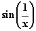 对于接近 0 的 x 值。这些对于这样的技术确实是个问题。

在前一种情况下，尽管 f 是有界的，但使用较小的 N 值将无法给出 f 的合理图像，在后一种情况下，无论 N 值如何，都不会在足够接近 0 处给出合理的图像。

还有另一种情况可能会遇到问题，那就是，尽管 f 表现良好，但你寻找的解在你关心的区间某一点上变为无穷大。

这并不是你可能期望的那么糟糕或奇怪的问题。但如果你尝试天真地应用它们，它们确实会破坏这些方法。

首先，这实际上只意味着 y 的倒数，函数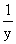，在 y 变为无穷大时经过零点。为零并不比它为其他任何值更令人惊讶，**所以这种情况在非线性微分方程中很容易发生。**

其次，最重要的是，**如果您知道 y'，您也知道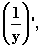**，并且可以像对 y 一样轻松地对应用这些方法。如果我们定义：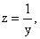，我们发现，对于 y' = f(x, y)

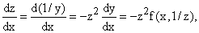

我们可以应用讨论过的规则来解决给定 z(a)而不是 y(b)的 z(b)。

实际上，当 y 大于 1 时，z 的导数将小于 y 的导数，因此您可以期望在近似 z 的变化方面比 y 更容易。当 y 爆炸并趋向无穷大时，z 在 0 附近静静地漫步，其行为可以很容易地通过我们的方法跟踪。

因此，在解决可能发生这种情况的方程时，谨慎的方法是同时为 y 和 z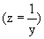设置您喜欢的方法，并且**当 y 的数量小于 1 且 z 的数量最多为 1 时使用 y 方法，当 z 的数量最多为 1 时使用 z 方法。**

在我们的例子中，我们有 y' = x + y，z 的方程变为 z' = -z²x - z，这与原方程一样容易处理。

在我们的计算中，我们使用了 y'方程，尽管整个区间内 y 大于 1。通过使用 z 方程，我们可能会做得更好。

当然，在我们的例子中，原方程中 y 是线性的，而非齐次项是 x 的线性，因此这个问题不会出现。

**练习 26.4 尝试您喜欢的方法解决微分方程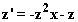，其中 z(0) = 1，并比较您获得的 z(1)的倒数值，即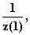与您之前为 y 获得的值。**

数值方法有很多传统知识，这个领域被称为数值分析。

这曾经是一个非常枯燥的领域，因为学习一种您根本无法使用的方法是乏味的，就像在没有厨房可以烹饪的情况下尝试阅读食谱一样。

现在您可以轻松地玩弄这些方法，并且它们对实时控制有戏剧性的应用，因此这个领域现在实际上很有趣。

您会注意到，在每种情况下，仅使用更大的间隔进行外推能够提高这里的估计精度，每种方法的因素大约为十万到一百万。

我们使用的外推方法是改进解决方案的最佳方法吗？

答案是否定的。

这些外推的方法有一个很大的优势，就是易于执行，但以加倍 N 的代价获得了额外的精确度。

实际上，如果你运用得当，通过将 N 增加 2 倍，并选择最佳的权重，为点选择最佳权重，并在每个区间使用相应准确的规则来近似 f，你可以获得额外的精确度。

如果你想象 y 写成 x 的幂级数，理论上每个新点都可以用来消除一个更高幂次的贡献，这样，使用 N 个点可能会产生一个仅由 y 的 N 次及更高导数产生误差的规则。

因此，比我们在这里所达到的要更高的准确度是可能的。但另一方面，我们在这里所做的工作所需的努力相对较少。
