# 第二十七章：积分操作

## 介绍

为了让自己对处理积分有些信心，值得尝试做一些积分。我们回顾了各种方法，并给出了一些积分列表供你自行测试。

## 主题

27.1 基本标准技术

27.2 一些特殊技巧

27.3 练习示例

## 27.1 基本标准技术

我们在第一章中定义的标准函数包括多项式、有理函数、三角函数及其有理函数、指数函数和这些函数的多项式、指数函数和多项式以及三角函数的乘积，等等。

上述提到的函数类别都可以通过标准技术进行积分，还有一些其他函数也可以。

我们首先回顾标准技术，这些技术在第十九章中已经简要描述。

首先，你应该认识到，你可以通过反向使用乘积法则来对积分变量的任意幂进行积分，除非该幂为-1。因此，我们有

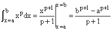

这意味着你可以对任何多项式以及任何单独的幂进行积分，甚至是分数幂或负幂。结果是另一个幂，除非被积函数是幂是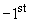，它的积分是自然对数，ln x，因此它积分为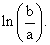

你应该迅速认识到可积函数还包括常见函数的导数。这些函数包括正弦和余弦、指数函数等，以及其他一些函数，如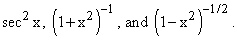

接下来，你应该准备好认识到可以通过积分变量的变换将函数转化为多项式或幂或其他函数的这些变换。例如，如果你遇到

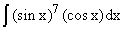

你应该自问：处理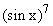 的简单方法是将其转化为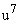。然后，剩余的被积函数是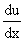，所以这个积分变为

.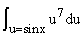

同样，你应该认识到

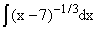

就像

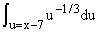

处理类似于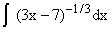 的积分，你应该认识到可以通过换元来处理它。为了避免混淆，最简单的方法是在这里设置 u = 3x - 7，这告诉我们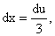，所以积分可以写为

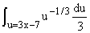

类似地，你应该准备好意识到需要一系列连续简单的替换，就像在积分中一样

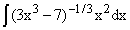

这变成了

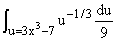

在这些操作中，你明智地在应用替换 u = u(x) 之前完整地写出它，并努力不要忘记在从 dx 到 du 的过渡中应用链式法则。

有了这些方法，您可以积分任何多项式或幂或任何通过简单替换可转换为多项式的积分变换。

分部积分使您能够扩展您可以完成的积分范围，包括多项式乘以指数或对数或正弦和余弦等。

它将一个被积函数转换为一个新的函数，其中部分被积分，其余被微分。因此，给定 x 的多项式乘以 ln x，您可以微分后者并积分前者，结果将是一个可积的幂。

通过指数或适当的三角函数，乘以多项式，您可以对多项式进行微分并对其余部分进行积分，反复进行此操作，直到多项式变为常数。

甚至可以通过两次分部积分的方式积分像 e^x sin x 这样的函数。

以下是细节：

首先设定 u = e^x，dv = sin x，这给出了通过分部积分的新被积函数 -vdu，它是 e^x cos x。

另一次分部积分同样给我们带来了新的被积函数 -e^x sin x，最终我们得到了一个原始积分的方程

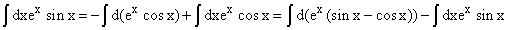

同样的技巧可以用来积分一个指数与正弦或余弦以及 x 的多项式的乘积。

例如考虑 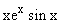。如果我们选择 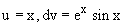，我们会得到 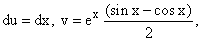（正如刚才所示），积分就变成了一个可以完成的积分。

您可以积分 x 的任何多项式，正如我们所看到的那样。您还可以通过将其转换为不同参数的正弦和余弦的 **和**，使用它们的复数指数形式的表达式，积分任何正弦和余弦的多项式。

例如考虑 (sin x)²。我们可以写成

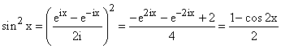

对于任意数量的正弦和余弦的任意乘积，可以做类似的简化。这样的任何乘积都可以写成它们参数的和与差的正弦和余弦的 **和**，以这种方式。

这意味着您可以通过应用迄今为止描述的方法来积分 x 的幂、积分或其他函数。

我们已经看到，我们可以积分 x 的任意幂，不管是否可积分。

偏分式的方法提供了一种将任意关于 x 的有理函数，换句话说，任意两个多项式的比值，写成多项式加上（x - r[j]）的倒数之和的方法，其中分母多项式能够被分解为线性因子，而 r[j]是该多项式的根。

例如，假设我们的有理函数是 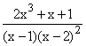。

此函数具有以下明显的特性：

1\. 当 x 非常大时，它的行为类似于 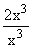，这是 2。

2\. 当 x 非常接近 1 时，它的行为类似于 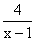。

3\. 当 x 非常接近 2 时，它的行为类似于 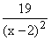。

4\. 当 x 为 0 时，其值为 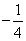。

**一般而言，这样的函数可以写成一个多项式加上在每个根处的最奇异项的可微函数之和。每个后一项在 x 趋于无穷大时必须趋于零。**

这里意味着我们的函数可以写成

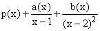

我们上面的性质告诉我们立即 p(x) = 2, a(x) = 4, b(x) = 19 + b(x - 2)，以及 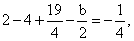，这意味着 b = 6，并且我们可以将我们的有理函数写成

2 + 4(x-1)^(-1) + 19(x-2)^(-2) + 6(x-2)^(-1)

一般来说，您可以通过将主导奇异项从分母中提取出来，并在该处评估其余表达式，从而在每个奇异点处读取该主导奇异项的系数。这里的每一项都可以轻松地积分。

如果奇异点处的奇异项的次数大于 1，如上例中的 x = 2，您可以通过以下三种方式之一找到非主导项的系数，无论哪种方式您觉得更容易或更合适。

1\. 你可以将主导奇异因子提取出来，并计算其余部分关于奇异点的泰勒级数。相关项是那些与主导奇异项相乘仍然奇异的项。

2\. 您可以从原始表达式中读取的系数减去主导奇异项；差异将在相同点具有较弱的奇异性，您可以再次通过直接检查读取其领先项的系数，如有必要，重复该过程。

3\. 您可以评估有理函数在任意数量的新点上，以确定未知系数。这是确定上述 b 的方法，评估在 0 处。

多项式项是那些当 x 趋于无穷大时不会趋于零的项。领先的项可以通过直接检查找到。其他项可以通过多项式除法或使用上述第三种方法评估多项式系数来确定。

如果分母有具有复根的项，这些项可以与实根一样处理。

将可积函数的范围扩展到正弦和余弦的有理函数，使用代换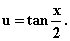。通过这种替换，我们得到

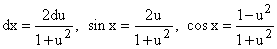

所以任何正弦和余弦的有理函数都变成了 u 的有理函数，因此可以通过部分分式积分。

还有一类标准可积函数。这些函数在其中有一个二次函数的平方根。二次函数可以通过完成平方形式(x - a)² + b²或(x - a)² - b²或 b² - (x - a)²减少，这可以通过变量的变化转换为 u² + 1, u² - 1 和 1 - u²，这可以通过涉及 tan x、sec x 和 sin x 的代换来处理。

完成平方包括重写二次函数

ax² + bx + c

如

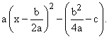

## 27.2 一些特殊技巧

有些函数一般情况下是不可积的，但是对于某些特定端点之间的积分可以进行求值。

这些通常是可以重写的积分，可以通过添加已知积分，使用对称性，或者通过其他一些技巧，作为复平面中封闭路径上的积分重新编写。

这样的积分可以通过使用残差定理来计算，残差定理规定了沿简单闭合路径 C 逆时针围绕函数 f(z)的积分是 2i 乘以 C 内的 f 的残差之和。

具有孤立奇点的函数的残留是其奇点处的倒数第一次幂的系数。

因此例如，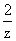在 z = 0 处的残留为 2。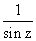在的偶数倍处的残留为 1，而在的奇数倍处的残留为-1。

我们知道函数是 arctangent 的导数，因此我们实际上可以在任何范围内对其进行积分。特别是由于我们有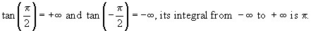

这是另一种推断这一事实的方法。我们可以使用部分分式将其写为

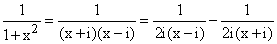

因此，这个函数在上半平面的 i 处有一个奇点，在下半平面的-i 处有一个奇点，其残留分别为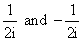。如果我们沿着实轴从-R 到 R 再绕一个上半平面的半圆从 R 回到-R，对于 R > 1，这将围绕 i 的奇点。

因此积分的值将为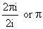，根据残差定理。

在大半圆上，被积函数的行为将类似于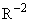，而由于该半圆的长度仅为R，所以围绕它的积分将随着 R 的增加而像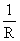一样趋于零。

这告诉我们，实轴上从-R 到 R 的积分值将随着 R 的增加而趋于。

这给我们一个我们知道的积分。

然而，相同的技术也适用于更复杂的被积函数，并且允许我们再次从-R 到 R 做许多积分，当 R 趋于无穷时。

我们给出两个例子。

其中一个是所谓的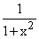的傅立叶变换

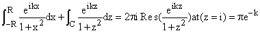

其中 C 是上半平面中半径为 R 的半圆，同样，随着 R 的增加，C 上的积分也趋于零。

现在我们使用这种方法来求和一个级数。cot x 函数在 x = 0 处奇异，并且具有周期性，周期为，因此它在的每个倍数处都是奇异的。它在每个这些奇异点处的残余为 1。

此外，如果你远离实轴，它会迅速接近 i 或-i，因为它是

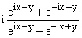

分子和分母中的第二项将在上半平面中占主导地位，使被积函数接近于-i，而第一项将在下半平面中占主导地位，使其在那里随着|y|的增加接近于 i。

这意味着对于半径为 R（R 为半整数倍的以避免在实轴附近出现问题）的大圆上的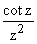积分将随着 R 趋于无穷而趋于零，就像前一种情况一样。

这进一步意味着该函数的残余之和必须在这个圆内趋于零。但对于每个正整数或负整数 j，该函数在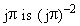处的残余。

在 z = 0 处，这个被积函数的残余可以计算为 z cot z 在 z = 0 处的二阶导数的一半。（我们将这里的奇异项因子化，然后将被积函数的其余部分展开为泰勒级数，以获得 z^(-1)系数。）

由于 sin z 按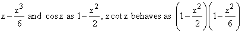增长���可以写成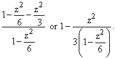

因此，在 z = 0 处的残余因此为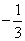，我们得出结论

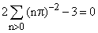

或

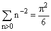

你实际上可以在电子表格上对这个求和的前 128（或 1024）项进行求和，并通过比较不同幂次的求和来外推。如果首先形成 S2 = S(2^k)-S(2^(k-1))，那么 S3 = (4S2-S2)/3，然后 S4 = (8S3-S3)/7，等等。你可以通过数值方法得到这个答案的极高精度，并验证这个结论。

## 27.3 实例练习

现在我们为您列出了一些积分，请仔细查看它们，并尝试确定如何攻击每一个。一旦你对如何做它们有了想法，你就应该做一些相应的练习。只有做了十几个积分，并陷入了所有标准陷阱，然后你才会知道要避免什么。

这里有一些提示，直到你自己犯了这些错误才可能有所帮助。

最常见的错误是在变量改变时忘记了一个小因子，以及将 dx 与某些 du 关联起来。

在复制一行到下一行时丢失一个小因子也很常见，以及漏掉一个符号。

忘记你正在进行积分，并写出一个常见函数的导数而不是你需要通过观察来进行积分的积分，这种情况也很常见。

在更改变量时没有调整积分限是另一个常见的错误。

忽视被积函数的奇点，并没有注意到你已经积分过一个奇点，这种情况较少见，只是因为你很少遇到这个问题。

在没有任何 f' 因子存在的情况下，粗心地集成 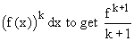。

**练习：描述您将如何评估以下每个积分。然后做五个。**

1.   

2.   

3.   

4.   

5.   

6.   

7.   

8.   

9.   

10. 

11. 

12. 

13. 

14. 

15. 

16. 

17. 

18. 
