# 第二十八章：电场和磁场介绍

## 引言

我们简要概述了电场和磁场的历史和基本事实，描述了密度、局部守恒、δ函数和静电势的概念。

## 主题

28.1  电学和磁学：历史回顾和基本事实

28.2  密度和守恒定律

28.3  点粒子和δ函数

28.4  静电学和电势

## 28.1 电学和磁学：历史回顾和基本事实

电学和磁学力的系统研究始于十八世纪末。通过用一种物质擦拭另一种物质产生带电物体。观察到了两种电荷，相同电荷相互排斥，而异种电荷相互吸引。

本杰明·富兰克林用带电芦苇球进行了实验，这促使普里斯特利和卡文迪许试图证明电力是一种与重力力量完全相反的力。库仑通过他的实验证明了两个不同电荷之间的力确实是它们距离的平方的倒数，且沿着连接它们的线。吸引力的形式与质量之间的引力完全相同。

在某个阶段，有人提出了通过电场概念描述电力的想法。这被定义为给定电荷分布时小虚构带电物体所经历的单位电荷力。

球的表面积与其半径的平方成正比，而点电荷的电场与相同量的半径的平方成反比。因此，对球面周围电场的法向分量的积分与球的半径无关，只测量其中心电荷的强度。

我们称矢量**W**的法向分量在任意表面上的积分为“**W**通过该表面的通量”。上述说明可以表述为：通过包含中心电荷的球面的电场通量仅与电荷量成正比，并且是该电荷量的常数倍。

高斯通过发现的散度定理将这个声明推广到包含电荷的任何区域的表面。该定理暗示了通过空间任何区域的边界的电场通量是适当常数乘以该区域的电荷量。

在 19 世纪末，伏打发明了电池，人们可以实际产生电流。厄斯特德和安培在约 1820 年发现，电流会产生力，使磁化的指针朝向**围绕导线的圆周切线方向**排列。特别是，安培发现，长直导线上的磁力对这样的指针产生的电流流量成正比，与指针距离导线的距离成反比。

一个圆的周长与其半径成比例，刚刚描述的磁场与半径成反比。因此，沿着围绕导线的任意圆周的磁场分量在路径方向上的积分与其半径无关。它是一个适当的常数乘以通过导线的任何这样圆周的电流“通量”或流量。

**我们定义矢量场 W 在路径方向上围绕封闭路径的分量的积分**为**W 围绕该路径的*环流*。** 安培定律可以表述为：**磁场围绕导线的环流是通过它的电流通量的一个常数倍。**

法拉第得到这样一个想法，即如果电流通量导致磁场环流，那么应该有某种互惠性：磁通量应该能够导致电流环流。1831 年，在寻找这种效应之后，他发现了他著名的感应定律：**通过表面 S 的变化磁通量会在其边界上产生电场环流。** 这意味着它在 S 的边界路径周围产生“电势差”，这意味着绕着它的导线中的带电粒子将在绕着导线移动时受到作用。这将使电流在表面周围的导线中流动，而该电流是通过（任何）被导线限定的表面的磁通量的**导数**的常数倍。

通过增加和减少一根导线中的电流量，你可以使其磁力振荡，这将导致另一根导线中的电流来回流动。

世纪中叶，斯托克斯发现了他的数学定理，将矢量场**W**在表面 S 上的环流与**W**在 S 的边界周围的环流相关联。

麦克斯韦利用这一事实证明，电磁学方程的一致性要求在存在变化的电场时修改安培定律。

通过这一修改，他指出（大约在 1862 年）即使在没有物质的情况下，电场和磁场也可以显示出波动行为，并且他断言光现象正是由这种波构成的。他的说法预测了光速，这只是最近才被测量的，而且与该测量完全一致。

他于 1874 年发表了描述电磁场行为的著名微分方程。麦克斯韦的发现之所以与众不同，是因为完全是理论性的。他利用了斯托克斯定理的数学含义，而不是实验来发现他的"位移电流"，其存在使他能够将光与电磁学联系起来。

麦克斯韦发现背后的思想是：根据斯托克斯定理，矢量场**W**的旋度通量通过一个表面是其在表面边界周围的环流。根据这个定理，**任何矢量场的旋度通量通过具有相同边界的任意两个表面必须相同**。

法拉第的发现使人们能够通过将磁铁靠近导线移动或（等效地）将导线靠近磁铁（如戴维斯和基德尔于 1854 年获得专利的治疗设备中）产生振荡的电流。

从一个导线中的电流变化中感应出另一个导线中的电流，假设第一个导线中的变化电流产生了变化的磁场，根据法拉第定律，这个磁场产生了第二个导线中的电流。

现在假设第二根导线中有一个间隙。电流将流过它，直到间隙两侧的电荷积累，并且这个电流将产生自己的磁场。如果两根导线中的电流被制成振荡，即随时间正弦函数地来回流动，尽管有间隙，电流将大部分时间流动，如果正弦波的频率足够大，那么在任何时候间隙处的电荷积累将很少，并且在导线中电流流动时的"阻抗"也很小。

根据安培定律（应用于非稳态电流情况），在这种情况下，导线周围将有振荡的"磁环流"，来自导线中电流的振荡流动。**但是，如果我们取一个穿过导线的表面，并将其变形使其通过间隙而不是导线，那么它将没有电流通过！然后，根据安培定律，同一路径上将没有磁环流，与先前的说法相矛盾。**

围绕具有间隙的导线的圆圈可以通过穿过导线的表面填满，或者通过扭曲该表面保持其边界不变，使其只穿过间隙。旋度通量的积分对于这两个表面必须是相同的。因此，在间隙中必须有某种东西，像电流一样，对磁场的旋度通量有贡献。

**麦克斯韦得出结论，在这种情况下，电流通量不可能是磁场旋度通量！安培定律描述了稳态电流流动充分，但在电流流动是时间相关时必须进行修改！**

在给定边界的情况下，通过线圈或间隙使我们的表面通过时，电流通量将不同。磁场的旋度通量在两者中必须相同。如果磁场的旋度通量是通过线圈的电流通量，则在间隙中必须是其他东西，而该其他东西的通量必须相同。

我们在间隙中唯一知道的是它包含由其表面上的电荷振荡引起的变化的电场。麦克斯韦假设一致性要求在安培定律中有一个额外的时间相关项，与这个电场的时间导数的通量成比例。

这个术语，他称之为“位移电流”，在结果方程中产生了显著的对称性。当写成微分方程时，高斯定律、安培定律与麦克斯韦的修改以及法拉第定律表明，在没有物质存在时，电场和磁场遵循“波动方程”，并暗示着可以存在电场和磁场的波动，这些波动以有限的速度传播。

麦克斯韦断言光是这种波动形式暗示着可以从电磁现象中推导出特定的有限光速。他方程的对称性不仅包括在普通空间中的旋转，还包括将空间与时间混合的变换，称为洛伦兹变换。

1888 年，赫兹在实验室里实际上创造了电磁波并检测到了它们。他连接了一根线圈和一个小间隙，通过线圈通电直到电容器上的电场产生火花；产生的电流振荡产生了可在另一个类似电路上观察到的波。

马尔康尼从中得到这样的观念，即这种波可以通过导致远处的导线流动来用于通信。在 19 世纪 90 年代，他建立了设备，以便将信号传输到不断扩大的距离，并且到了 1901 年，能够将电报信号传输到大西洋的对岸，这些信号可以被接收并用于无线通信。

这些主题涉及的物理定律数量不多，可以用几行话来陈述。我们现在将考虑它们在向量微积分概念中的数学含义。

## 28.2 密度与守恒定律

我们经常通过描述质量或电荷的分布来描述其中任何一个在包含点 P 的小体积 dV 中的量。因此，**质量密度**有时被表示为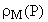，用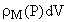表示包含在该体积中的质量，而**电荷密度**的定义与之完全相同，其中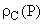表示电荷密度，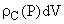表示体积 dV 中的电荷量。

如果质量或电荷恰好以速度**v**(P)移动，我们根据**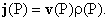**定义电流**j**(P)。这个电流通过任何表面 S 的通量代表单位时间内通过该表面流动的电荷或质量的量。

通过表面 S 的质量或电荷单位时间流量是，具有适当电流矢量

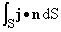

这个事实使我们能够通过方程描述这些量的局部守恒。这个**守恒**意味着**在给定体积中电荷或物质的数量变化的唯一方式是通过体积边界的流动。**如果流入流量是向内的，它将增加，如果净流量是向外的，它将减少。这告诉我们**密度在任何体积 V 上的积分的导数将是其表面上电流的外流通量的负值，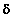V**

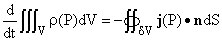

回想一下，散度定理告诉我们，对于任何矢量场**W**(P)，我们有

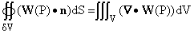

将这个定理应用于守恒方程中的矢量场**j**，并选择 V 为固定体积，使得时间导数仅影响被积函数，并利用导数和积分的线性性质将导数移到积分内部，我们得到

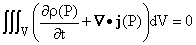

并且这个关系对所有体积 V 都成立。

**在物理学中，我们从这个陈述中得出结论，即在定义的任何地方，被积函数都为零**，这给我们带来了**守恒定律的微分形式**

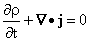

这个方程的内容当然与原始定律的内容完全相同：体积中质量或电荷的变化量是流入 V 的量减去流出 V 的量。

## 28.3 点粒子和δ函数

库仑定律告诉我们关于点电荷的电场。这引出了一个问题：位于点 P 处的点电荷的电荷密度是多少？

这个问题可以用对体积的积分来回答：如果你在不包含 P 的体积上对这个密度进行积分，你会得到 0。如果体积包含 P，你会得到位于那里的电荷量。

这基本上意味着密度除了在点 P 处为 0 之外都为 0。但是在该点的贡献必须足够大，以便对积分产生显著的贡献。

这对于有界函数或者根据我们对积分的定义的任何函数都是不可能的。

然而，我们实际上并不知道点粒子是什么样的，也没有办法在实验上区分点粒子和半径在 10^(-100)厘米数量级的具有扩展形状的粒子。

我们对密度进行的积分以获得体积 V 中的总质量或电荷是一个体积积分，当用普通一维积分表示时，需要三个一维积分。

与点粒子的密度类似的现象在一维中发生，称为“delta 函数”。点粒子的密度实际上可以描述为变量 x、y 和 z 的 delta 函数的乘积。因此，我们将讨论一维情况。

在进一步讨论之前，我们先回答一个问题：为什么我们关心这些问题？为什么现在？

答案在这里：库仑定律描述了伴随点粒子的电场。我们可以利用这一事实来确定由电荷密度  表征的任何电荷分布产生的电场。我们只需将每个产生该电荷密度的带电粒子对电场的贡献相加即可。

我们很快会看到，通过这样做，我们实际上正在解一个带有非齐次项的线性微分方程 。

我们在这里犯了一个错误，用于解决这个方程的方法可以描述如下：我们首先找到了对于任意点 P（这里是库仑定律与 P 无关）的 delta 函数非齐次项的解。然后我们利用这个解（通过积分），找到了一般非齐次项的解。

我们找到的解遵守带有适当零边界条件的微分方程。通常称为给定微分方程和边界条件的**格林函数**，因为格林发明了这种方法。（顺便说一句，格林是一个面包师，对数学和科学有浓厚兴趣。他是自学科学和数学的。）找到它可以通过积分解决具有任意非齐次项的相同方程。

这里是另一种看待相同想法的方式：您想找到给定物理系统对任意外部刺激的响应，其对刺激的总和的响应等于对每个刺激的响应的总和。为此，您找到每个可能点的单点刺激的响应。然后，通过（求和）将该刺激与响应函数的乘积积分，您可以找到对任意刺激的响应。

这种非常强大的方法用于解决一般非齐次**线性**微分方程，通过首先解决带有 delta 函数非齐次性的方程，这意味着我们想要使用 delta 函数。

我们想在这里使用它们来将库仑定律推广到确定任意电荷分布的电场。

一维 delta 函数可以描述为阶跃函数的导数，因此我们首先定义阶跃函数。

通常使用两种标准阶跃函数。

第一个函数，表示为 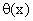，对于负的 x 值为 0，对于正的 x 值为 1。我们不太在乎它在 x = 0 处的值是多少，但它可能是 0、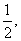 或 1。

第二个函数，通常写作 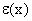，对于正的 x 值为 1，对于负的 x 值为 -1，在 0 处为 0。

这些函数之间存在关系 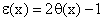，除了在 x = 0 处可能有所不同。

显然，按照定义，这两个函数在 x = 0 处都没有导数。

但是，这两个函数与到处都有导数的简单函数之间的差异很小。实际上，没有真正的方法来区分这两者之间的区别。

因此，我们可以在假装使用这些其他函数的导数时使用 delta 函数。

数学家们最初对 delta 函数非常怀疑。然而，他们现在接受它作为所谓的“分布”，而不是函数。

一个在实际上与  几乎无法区分的函数是 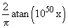。正切函数在负值很大时接近 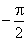，在正值很大时接近 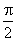。其参数中的因子 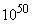 加速了其行为，使其基本上成为一个阶跃函数。其从 -1 到 1 的导数是完全定义良好的，基本上是 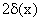。

第二个函数，除了一个常数外，被称为误差函数。它的导数是 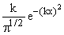，对于非常大的 k 具有近似的性质 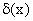。这个函数和正切函数的导数对于极小的参数都很大，否则几乎为零。

以指数和误差函数定义的函数在远离零点时要比在靠近零点时变化小得多，这比正切函数要好一点。

Delta 函数的好处是**除了 0 之外的参数都为零**，**在包含 0 的区间上的积分为 1**，这些性质与这些函数在不可观测参数处几乎相同。

作为一个函数，delta 函数在参数 0 处没有太多意义，除非对其进行积分；它的积分是一个阶跃函数，这是完全定义良好的。

当你在积分之外看到一个 delta 函数时，你可以将其视为上述两个函数之一，不必为此失眠。

点粒子的密度可以描述为三个变量 x、y 和 z 中的 delta 函数的乘积。它可以写成 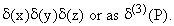

## 28.4 静电学和电势

正如我们现在已经多次注意到的那样，库仑定律规定，相同的电荷相互排斥，而不同的电荷则以反比例平方力的方式相互吸引。当吸引时，这种力与重力非常相似，但作用于带电粒子之间，与它们的质量成比例，而不是它们的质量。以下陈述都涉及静电场：由不随时间变化的电荷密度产生的场；而不是由变化的电荷密度产生的电场。

现在这里是这个定律的一些数学含义：

1\. 我们可以用以下公式��示 P 点处带电粒子的电场。 (这就是库仑定律。)

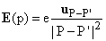

2\. 该场的散度为 0，除非 P - P' = 0。 (通过微分。)

3\. 围绕 P'的球体上的该场的通量为 4e。 (通过积分。)

4\. 包含 P'的任意体积的边界上的该场的通量为 4e，而在任何其他体积上为 0。 (根据散度定理。)

5\. 一组电荷的场是每个电荷的场的总和。 (物理事实。)

6\. 包含点电荷的任何体积上的点电荷密度的积分为 e，如果该体积不包含电荷，则为 0。 (密度的定义。)

7\. 一组电荷的密度是它们密度的总和。

8\. 对于 P'处的点电荷，**E**在 V 的边界周围的通量为 4倍于其电荷密度在 V 上的积分。 (通过 4、5、6、7。)

9\. 对于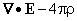在 V 上的积分为 0。 (通过散度定理。)

10\. **E**的旋度为 0，除了在 P = P'处的点电荷。 (**E**指向外部，并且仅依赖于外部方向的距离=通过微分。)

11\. 点电荷的电场**E**沿任意封闭路径的环流为 0。 (通过斯托克斯定理和 10。)

12\. 对于任何电荷排列都成立。

13\. 对于任何电荷分布，**E**(P)可以写为-V，其中 V(P)是“电势函数”。 (将 V 定义为从某一点到 P 的-**E**的线积分。这由 11 唯一定义。)

14\. V(P)满足方程

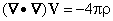

15\. P'处点电荷的电势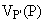为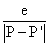，并且它满足方程

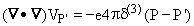

(检查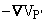是否是 P'处点电荷的电场。)

16\. 在自由空间中（忽略其中的任何物质）由电荷密度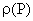确定的电势由以下公式给出

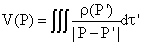（通过使用 15 进行积分。）

17\. 导体是一种电荷可以自由移动的材料。在静态情况下，导体上的电势必须是恒定的。

18\. 平面导体的作用类似镜子，因此受平面导体限制的电荷密度  的电势为

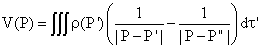

点 P' 在平面中的反射点为 P"。

<applet code="StaticElectricFields2D" codebase="../applets/" archive="staticElectricFields2D.jar,mk_lib.jar,parser_math.jar,jcbwt363.jar" width="760" height="450"></applet>

**练习：**

**28.1 逐条审视上述每个陈述。仔细证明它以满足自己。向某些受害者解释它。**

**28.2 假设你有一个电荷分布 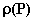 并且它在两侧被直角平面导体所限制。它会产生什么电势函数？（提示：尝试用两个镜子。）**

**28.3 假设你的分布被三个垂直平面的导体所限制。你会发现什么电势函数？**

**总结：**

**固定电荷分布的静电场  符合以下方程**

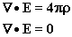

**它可以写成一个标量场的梯度，-V，称为电势，因此它符合以下方程**

**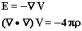**

**点 P 处的点电荷在 P' 处的电势为**

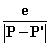

<applet code="StaticElectricFields3D" codebase="../applets/" archive="staticElectricFields3D.jar,go.jar,goText.jar,mk_lib.jar,parser_math.jar,jcbwt363.jar" width="760" height="450"></applet>
