# 第二十九章：磁场、磁感应和电动力学

## 引言

我们简要概述了在没有物质的情况下磁性、磁感应和电动力学的基本定律、波动方程、标量和矢量势以及不变性质。

## 主题

29.1  安培定律及其后果

29.2  法拉第定律及其后果

29.3  麦克斯韦一致方程

29.4  波动方程

29.5  电势

29.6  不变性质

## 29.1 安培定律及其后果

根据安培定律，电流通过直导线的通量会在导线周围的圆路径上产生磁场**B**的“循环”。

用符号表示，我们得到

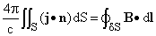

如果我们将这个陈述推广到任何表面，并与斯托克斯定理应用于向量**B**相结合

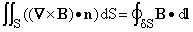

我们得到

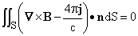

对于任何表面 S。

物理学家得出结论，即被积函数在任何地方都必须几乎为 0，并声称下面的微分定律在**稳恒电流磁场**的任何地方都成立。

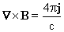

我们已经看到，当没有稳定电流时，仍然会有电荷守恒，正如我们所看到的，它遵循方程

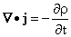

将上述方程两边求散度，我们看到当，即电荷密度，是时间依赖时，它是不可能成立的。我们得到

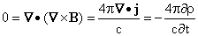

如果这是真的，就意味着电荷密度永远不会改变。

<applet code="StationaryMagneticFields2D" codebase="../applets/" archive="stationaryMagneticFields2D.jar,mk_lib.jar,parser_math.jar,jcbwt363.jar" width="760" height="450"></applet>

## 29.2 法拉第定律及其后果

法拉第发现，就像电流通量引起了磁场环流一样，磁通量也引起了电流环流，但效果与磁通量的导数成正比，而不是与其时间导数成正比。

因此，他找到了以下积分关系（称为法拉第电磁感应定律）

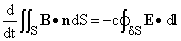

用言语表述：通过表面的磁场通量的导数与其边界周围的电动势成比例（即绕其周围的电场的循环积分）。

这种效应的一个结果是你可以以这样的方式旋转磁铁，使电流在导线中流动，甚至更多，在一卷导线中流动。这是实现电力发电的手段。

应该注意到，在这些发现的时候，向量微积分的符号和概念实际上并不存在，对我们来说似乎是显而易见的结论，鉴于斯托克斯定理和矢量的旋度的概念，在大部分 19 世纪都非常晦涩难懂。

如果我们将斯托克斯定理应用于这里的电场**E**，我们可以用电场**E**的旋度的通量的负 c 乘以右侧代替。如果我们固定一个表面 S，导数可以带入积分内部，我们得到了对于任意固定表面 S

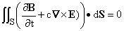

如果我们作出这样的物理假设，即当它在任何方向的分量上被积分时为 0 时，某个量总是 0，那么我们就得到了微分方程

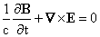

而这可以被认为只是法拉第定律的一个重新表述。

这个定律并不直接暗示没有磁性电荷，它们像正电荷一样为磁场提供“源”，而负电荷则为电场提供“汇”。电荷密度与电场的散度成正比。

如果我们对上述最后一个方程的左侧进行散度运算，我们会发现磁场**B**的时间导数的散度必须为 0。这意味着，如果**B**有散度，那么在任何时间都必须完全相同；除非这个方程中出现了磁场电流密度。至今尚未发现磁场源，因此据我们所知，我们有

法拉第还引入了“力线”的概念。电场表示对一个小“测试”电荷的力。他建议将无穷小的场线连接起来，形成他给出这个名称的路径。

对于磁场，点处磁场的方向表示了一个指南针放置在该点时的指向，或者如果将铁屑放置在该点时，铁屑排列的方向。

他发现磁场线没有源头或汇流，而是形成闭合环路。另一方面，电场线起源于正电荷的位置，这些正电荷是其“源”，并在负电荷处结束，称为“汇”。

换句话说，他发现这些或任何其他矢量场的源代表着场的散度为正的地方，而汇则是场的散度为负的地方。

如果你对静电场的行为有一些了解，这给了我们也许是发展直观概念的最佳方式，即一个矢量场的散度是什么。想象一下你的场代表一个电场；它的散度对应于产生这样一个场的电荷密度。

## 29.3 麦克斯韦的一致方程

正如我们已经注意到的，安培定律在存在时间相关电流时必须进行修改，因为否则我们将会有

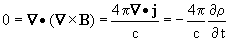

当（例如交流）电流通过具有间隙的电路时发生的情况，麦克斯韦意识到，如果电路中存在这样的东西，那么一致性要求在间隙中有某种东西对**B**的旋度有贡献。

但是这个间隙在第一近似中是空的空间；唯一存在于其中的是由电荷密度产生的电场**E**。

请回忆在静电学中我们有关系式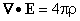。

我们可以看到，一种一致的改变安培定律以考虑可变电流的方法是在其左边加上一个项，得到

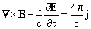

**练习 29.1 对这里的两边进行散度运算，以验证此方程是否与电荷守恒一致。**

我们可以将电场和磁场满足的所有微分方程整理成以下列表。尽管这些方程远比 1874 年他发表的那些简单，它们被称为“麦克斯韦方程”。那时的方程与现在的差不多，但变量有 20 个，方程也有 20 个。

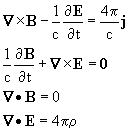

当前这些方程的形式是由赫维赛德得到的，他引入了矢量符号、散度和旋度。

从 1831 年法拉第法到 1874 年麦克斯韦方程之间，在这一领域取得进展缓慢的原因之一是人们很难描述多维现象，并且很难理解他们所写的方程，没有矢量符号的帮助。

我们在这里忽略了物质对电场和磁场的影响，除了提供电流和电荷。

实际上，物质由带有正负符号的电荷粒子和磁偶极（如小磁铁）组成，这些受到电场和磁场的影响。

电场使导体中的电荷移动，并极化非导体。通过吸引一种符号的电荷并排斥另一种电荷，它们使非导体表现得像它们充满了电偶极。

因此，非导体通过极化产生的场影响内部场的效果，物理学家通过定义两种电场**D**和**E**以及两种磁场**B**和**H**来描述这些现象，其中一种是由实际电荷分布产生的场，另一种是包括物质中极化效应的场。你将在物理课程中学习这些内容。

## 29.4 波动方程

现在我们考虑麦克斯韦方程告诉我们关于电场和磁场在空间中的行为，其中没有电荷或电流。 在这些情况下，方程变为

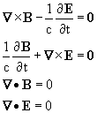

如果我们对第一个方程取时间导数并对第二个方程取旋度，我们会得到

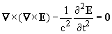

我们可以利用矢量恒等式  和麦克斯韦方程 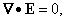 将此方程变为

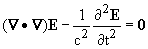

或者

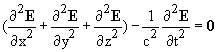

**练习 29.2 对相同的方程进行相同的操作，对第一个方程取旋度，对第二个方程取时间导数，以在没有电荷或物质的情况下得到以下结果**

.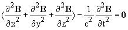

这个方程，空间中的 B 和 E 都遵守，在空间中称为波动方程。它是一个偏微分方程，看起来相当可怕，但很容易找到解决方案。如果你选择空间中的任意方向，并称其为 x 方向，那么任何关于变量 x - ct 的矢量函数（以及关于 x + ct 的任何函数）都将遵守它。

**练习 29.3 通过微分和链式法则验证此断言。**

这些形式的解以速度 c 在空间中向前或向后的 x 方向“移动”。它们被称为平面波，因为它们在垂直于 x 方向的平面上是恒定的。麦克斯韦想到了光可能由这样的波组成。在他的方程中出现的常数 c 可以从电磁实验中测量出来，在麦克斯韦提出这个概念时，光速已经被测量出来，并且在实验误差范围内它们是相同的。

## 29.5 势

没有旋度的矢量场可以写成势函数的梯度。因此，我们可以将静电场描述为这样的梯度。

当我们这样做时，我们发现可以将在空间中的电荷分布产生的势解释为积分，乘以在积分点处由单位电荷产生的势。

**像 B 一样具有消失散度的矢量场，可以以类似的方式写成矢量势的旋度。**

我们定义**矢量势 A**，使得 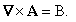

使用这个定义，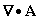 可以是任何东西而不改变任何东西。

在静态电流的情况下，即没有时间依赖性时，我们设定 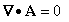 并推导出以下方程

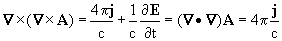

我们可以在整个空间内解决这个方程，边界条件是**A**在无穷远处趋于**0**，就像我们解决 V 一样。结果，与上一章节中 V 的结果完全相同。

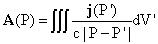

在时变情况下，我们通过以下方式定义矢量势**A**：

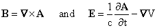

这些定义并不能完全确定**A**和 V。

给定任意标量场 f，我们可以将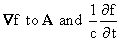加到 V 上，**B**和**E**都不会改变。这种变化被称为“规范变换”，而**B**和**E**的这些表达式被称为“规范不变”，因为它们不受规范变换的影响。

**练习 29.4 找出由麦克斯韦方程（包括源和 j）隐含的 A 和 V 满足的方程。**

## 29.6 不变性质

麦克斯韦方程具有这样的性质，它们在空间旋转和一种可以被视为在闵可夫斯基空间中旋转的特殊变换下保持不变。这被称为洛伦兹变换。

在 19 世纪末，物理学家逐渐意识到这种不变性意味着对于运动坐标系的变换形式与力学中通常使用的形式不同。

众所周知，声音是空气或其他介质的运动组成。在真空中是没有声音的。物理学家长期以来一直在思考是否存在类似于光的介质。

他们假设了一种“以太”，它是光的介质，就像空气中的粒子形成声音的介质一样。如果存在这样的介质，了解我们相对于它的运动程度将是很有趣的。

米歇尔逊和后来的米歇尔逊和莫雷在 19 世纪 80 年代尝试通过测量不同方向上的光速来测量我们相对于“以太”的速度。他们发现，即使光源相对于观察者运动，光速在所有方向上都是相同的。

爱因斯坦在 1905 年解释了这一观察结果，基于这样的断言：自然法则，包括具有相同光速的麦克斯韦方程，无论你是否在运动，对你来说都是相同的。

费兹杰拉德和洛伦兹已经展示了如何修改普通力学方程以使它们具有与麦克斯韦方程相同的不变性质。

我们还没有讨论与电场和磁场相关的能量，也没有考虑它们对物质的影响。

即使没有这样的讨论，从麦克斯韦方程的结构中，可以很清楚地看出，电子绕着原子稳定轨道运动，就像行星绕太阳运动的概念与之不一致。

如果它们这样做了，作为带电粒子，它们会产生电磁波，这些波将带走能量。如果能量守恒，轨道就无法稳定，除非电子具有独立于时间的电荷密度。

用允许电子具有时间独立电荷分布的表述取代经典力学是 20 世纪早期物理学的主要胜利之一。

要理解这些事情，最好学一些物理学。
